# ResStock Change: OpenStudio-HPXML 1.11 and Option-Based BuildResidentialHPXML Arguments

# 0. Change Metadata

```yaml
change_id:            oshpxml-1-11-and-options-args
title:                OpenStudio-HPXML 1.11 subtree bump and migration to option-based BuildResidentialHPXML arguments
change_type:          baseline_methodology   # also carries a dependency_bump (OS-HPXML 1.10 -> 1.11)
status:               draft

implementer:          Scott Horowitz, Joe Robertson, Lixi Liu   # per changelog_dev.rst assignees
document_author:      Andrew Parker
reviewer:             TBD
sme_reviewer:         TBD
os_hpxml_lead_review: not_required   # this change pulls OS-HPXML changes INTO ResStock; it makes no change to OS-HPXML intended to go upstream

target_release:       TBD
target_sdr_cycle:     TBD
feature_doc:          none
issues:               TBD

pull_requests:
  resstock:             1406, 1460, 1466, 1503, 1516
  resstock_estimation:  none
  openstudio_hpxml:     1879, 1928, 1939, 2028
  buildstockbatch:      none
  buildstock_query:     none
  sightglass:           none

comparison:
  delta_convention:   "New - Baseline"
  baseline_run:
    run_id:           TBD  # Kestrel run id for the 2025 Release 1 production run not yet obtained
    results_path:     s3://oedi-data-lake/nrel-pds-building-stock/end-use-load-profiles-for-us-building-stock/2025/resstock_amy2018_release_1/metadata_and_annual_results/national/full/parquet/upgrade0.parquet
    resstock_commit:  dfb702d505b9826ce4f0061073464c42ce9bbc5a  # tag 2025_Release_1
    os_hpxml_version: v1.10.0-dev @ 4f317ce6034e2ac5df4eb40924f6bc35e5295721 (OpenStudio 3.9.0, HPXML 4.0)
  new_run:
    run_id:           new_sampling_test_0_amy2018_2
    results_path:     C:/Scratch/ResStock/efforts/new_sampling/new_sampling_test_0_amy2018_2_output/metadata_and_annual_results_aggregates/national/full/parquet/upgrade0_agg.parquet
    s3_path:          s3://resstock-core/new_sampling/new_sampling_test_0_amy2018_2/
    kestrel_log:      /projects/enduse/logs/new_sampling/new_sampling_test_0_amy2018_2.log
    resstock_commit:  aaade6fea6672b798ffcbdb233d0e50921c958ab  # branch sampling_regions, detached
    os_hpxml_version: v1.11.0-dev @ 1b1ba1b5ac1a02a1ff583db4bf3e31feed92c698 (OpenStudio 3.10, HPXML 4.2)
    buildstockbatch:  59bf7bf311f9f2726c3ff56ce683e30b203d2e77
    apptainer_image:  OpenStudio-3.10.0.c7f13ad-Apptainer.sif
  sample_size:        550000 requested (n_datapoints); 549999 new / 549971 baseline rows in results
  buildstock_csv_reused: no   # re-sampled; sampler=residential_quota; see confound note below
  sampling_seed:      TBD
  weather_source:     AMY2018 - /kfs2/shared-projects/buildstock/weather/BuildStock_2018_FIPS.zip
  geography_scope:    national
  other_changes_between_runs: >
    1,594 commits separate the baseline (tag 2025_Release_1 @ dfb702d505) from the new run
    (sampling_regions @ aaade6fea6), so this is not a single-change comparison. Two things it is NOT
    confounded by, both verified rather than assumed:
      (a) Sampling methodology. Although the new run's commit contains the in-progress new sampler,
          that sampler was not used - the Kestrel log records sampler=residential_quota, the same
          quota sampler as the baseline. The move from the quota sampler to the new sampler will be
          covered by a separate change document.
      (b) The sampled stock itself. Weighted marginal distributions were compared across the 154
          in.* characteristics shared by the two runs; the median total variation distance is
          0.0000162 and 139 of 154 are at or below 0.001. Every characteristic above 0.01 is
          explained by an option rename or output-format change belonging to this change, not by a
          different sample. See 4.2.
    What remains confounded is code: any of the other 1,594 commits could affect outputs. The
    samples are still different dwelling units - the quota sampler was re-run rather than the
    baseline buildstock.csv being reused - so building_id does not refer to the same unit on both
    sides and per-building comparison is not possible. See 4.1 and 5.3.
  # Code-citation provenance: the code inspected for this document was read from a local clone whose
  # HEAD (595b4d0608) is 22 commits ahead of the run commit. Every file cited in 2.3, 3.2, 3.3 and
  # 3.5 was verified byte-identical between aaade6fea6 and 595b4d0608, and all three local OS-HPXML
  # subtree patches noted in 3.5 are present in the run commit. The citations therefore describe the
  # code that actually ran.
```

---

# 1. Summary

## 1.1 What Changed and Why

ResStock's housing characteristics were re-specified against OpenStudio-HPXML's new option catalogue
rather than against ~600 detailed measure arguments, and the OS-HPXML subtree was advanced from
v1.10.0-dev to v1.11.0-dev (OpenStudio 3.9→3.10, HPXML 4.0→4.2). The intent was simplification and
alignment: `options_lookup.tsv` shrinks dramatically, and ResStock stops overriding OS-HPXML defaults
it had been restating. The consequence is that a number of values ResStock used to set explicitly are
now inherited from OS-HPXML, and several of those defaults differ from what ResStock had been
specifying. National site energy falls 2.47% (3,453.6 → 3,368.2 TWh); nineteen fuel/end-use pairs move
by more than 1%, with the largest being ceiling fans (+299%), the clothes washer/dryer pair (+180% /
−45%), and furnace blower energy (+24%).

## 1.2 Scope

**In scope:** The OS-HPXML subtree bump from `v1.10.0-dev` to `v1.11.0-dev`; migration of
`options_lookup.tsv` from detailed measure arguments to OS-HPXML option names (PR #1460); the
associated re-specification of appliance, water heater, window, shading, duct, ceiling fan and
HVAC options (PRs #1466, #1503, #1516); and the RESNET HERS Addendum 82 HVAC modelling updates that
arrive with OS-HPXML 1.10/1.11 (PR #1406). Attribution of every stock-level end-use delta above 1% to
a specific code change.

**Out of scope:**
- Isolating this change from the concurrent sampling-regions work in the same branch. The sampling changes will be isolated to a second change document with a different set of runs.
- Upgrade (non-baseline) impacts at national scale. Only the baseline was compared via national runs;
  upgrade impacts were checked through the ResStock CI upgrade suite — see §4.8 for what that covers.
- Timeseries and peak impacts. Follow-up: TBD.

## 1.3 Expected Impact

| # | Quantity | Segment | Expected direction | Expected magnitude | Reasoning |
|---|---|---|---|---|---|
| H1 | Ceiling fan energy | National | increase | ~3–4× | ResStock drops its `ceiling_fan_quantity=1` override; OS-HPXML defaults the count to bedrooms+1 |
| H2 | Clothes dryer energy | National, all fuels | decrease | large (>25%) | New washer options have higher IMEF and smaller drums, so remaining moisture content falls; dryer CEF also rises |
| H3 | Clothes washer energy | National | increase | large (>100%) | New EnergyGuide label inputs shift attribution from water heating to appliance electricity |
| H4 | Water heating, fossil fuels | National | decrease | few % | EF→UEF re-specification lowers derived tank UA for fossil storage |
| H5 | Water heating, electricity | National | increase | few % | The same EF→UEF switch raises derived tank UA for electric storage — opposite sign to H4 |
| H6 | Heating fan/pump energy | National | increase | ~20–35% | Blower motor type now keys off compressor staging; single-stage AC forces PSC (0.5 W/cfm) over BPM (0.375 W/cfm) |
| H7 | Space heating, fossil fuels | National | decrease | few % | Duct leakage rebalanced to 50/50, attached units default to well-shielded, and higher blower power lands as supply-air heat. *Post-hoc note: §4.6.4 shows the duct term dominates and the blower term does not contribute; recorded here as originally written* |
| H8 | Cooling | National | decrease | few % | Interior shading moves from fixed coefficients to physical curtain descriptions, cutting summer solar gain |
| H9 | Lighting, refrigeration, plug loads, TV, range/oven | National | **no change** | <0.5% | No code path in this change touches these end uses — negative control |
| H10 | Total dwelling units and weighted floor area | National | **no change** | <0.1% | Stock definition is unchanged; a change here would indicate an accidental sampling problem|

---

# 2. Methodology

## 2.1 Existing Methodology

Prior to this change, ResStock configured OpenStudio-HPXML through the `BuildResidentialHPXML`
measure using roughly 600 detailed property arguments. `options_lookup.tsv` carried the full
specification for each option: a ceiling fan row set `ceiling_fan_present`, `ceiling_fan_efficiency`,
`ceiling_fan_quantity` and `ceiling_fan_cooling_setpoint_temp_offset` individually; a water heater row
set type, fuel, tank volume, efficiency metric, efficiency value, recovery efficiency and jacket
R-value individually. Where ResStock had an opinion that differed from OS-HPXML's default, it simply
stated the value, and where it did not, it passed `auto` and inherited the default.

The practical limitations of that approach were that (a) the lookup file was very large and hard to
review, (b) ResStock frequently restated values that duplicated — or silently diverged from —
OS-HPXML defaults, and (c) each new OS-HPXML input had to be plumbed through ResStock explicitly.

**Source:** `resources/options_lookup.tsv` at `origin/2025_Release_1_branch`; ResStock Technical
Reference Guide (section reference TBD — the Guide does not currently document the argument-passing
mechanism at this level of detail, which is recorded as a gap in §3.9).

## 2.2 Related Assumptions Not Changing

The stock definition is unchanged by this work: no housing characteristic distribution was
re-estimated, and the set of characteristics and their dependency structure are not modified by PRs
#1406/#1460/#1466/#1503/#1516. Weather source (AMY2018) and geographic scope (national) are held
fixed across the comparison. Occupancy and schedule generation are unchanged apart from the EV
driving-hours input noted in §3.5. Solar thermal collector specifications are unchanged, but the backup tank behind them
was re-specified. PV, pool and spa pump modelling, and the lighting, refrigeration and plug-load
end uses are not touched by this change and serve as negative controls in §4.5.

The sampler is also held fixed: both runs used `residential_quota`. The new run's commit contains
the in-progress replacement sampler, but it was not used, and §4.2 confirms the stock is
distributionally identical across all 154 shared characteristics for both runs.

## 2.3 New Methodology

`options_lookup.tsv` rows now name an OS-HPXML option rather than enumerating measure arguments. For
example, `Ceiling Fan / Standard Efficiency` went from seven arguments to a single
`ceiling_fans=NumBedrooms+1 Fans, 45.0 W`, and `Water Heater Efficiency / Natural Gas Standard` from
eight arguments to `dhw_water_heater=Natural Gas, Tank, UEF 0.60`. The option catalogue lives in
`resources/hpxml-measures/BuildResidentialHPXML/resources/options/*.tsv`, one file per parameter.
Anything a ResStock option does not state is now defaulted by OS-HPXML rather than by ResStock.

Seven code changes account for eighteen of the nineteen end-use deltas above 1%. The
nineteenth, the electric pool heater, is not a code change at all — §4.6.11 resolves it as sampling
composition within a 0.71% subpopulation. Each of the seven is given below with its mechanism and
code location:

1. **Ceiling fan count.** ResStock's `ceiling_fan_quantity=1` override is gone; OS-HPXML defaults the
   count to `nbeds + 1` per ANSI/RESNET/ICC 301 (`defaults.rb:6511-6513`). Per-fan wattage is
   effectively unchanged (old `auto` label from 70.4 cfm/W ≈ 42.6 W; new option 45.0 W).
2. **Appliance EnergyGuide inputs.** Washer, dryer and dishwasher moved to the OS-HPXML catalogue,
   changing IMEF, drum capacity, label usage, label gas rate and annual gas cost together. OS-HPXML
   back-solves the appliance's own electricity from the label, and the new label shifts far more of
   the rated consumption to the appliance and less to water heating
   (`hotwater_appliances.rb:820`). The dryer is not rated independently — it is sized from the
   moisture the washer leaves behind (`hotwater_appliances.rb:702`), so the washer change drives the
   dryer result.
3. **Blower motor type.** OS-HPXML now infers blower motor type from compressor staging rather than
   rated efficiency, and a furnace inherits its attached air conditioner's staging
   (`defaults.rb:2133-2166`). Addendum 82 makes `CompressorType` mandatory, and the baseline stock is
   overwhelmingly single-stage, so a high-AFUE furnace with a single-stage AC changes from a BPM motor
   (0.375 W/cfm) to a PSC motor (0.5 W/cfm). The blower does ~33% more work at the same airflow,
   heating the air more. The extra fan work displaces furnace output roughly one-for-one,
   which makes part of the fossil heating reduction a transfer from the gas meter 
   to the electric meter rather than an independent efficiency gain. The same coupling runs the
   other way in summer, where the additional blower heat is a load the air conditioner must remove.
4. **Water heater EF → UEF.** Storage water heaters were re-specified from Energy Factor to Uniform
   Energy Factor at similar numeric values. OS-HPXML disaggregates the rating into tank losses and
   burner efficiency using the conditions of whichever test procedure produced it — EF assumes 135 °F
   and 64.3 gal/day, UEF assumes 125 °F and a First-Hour-Rating usage bin
   (`waterheater.rb:1804-1860`). The electric and fossil branches use different UA forms, so the two
   move in opposite directions.
5. **Interior shading.** `Interior Shading.tsv` moved from a fixed coefficient pair (summer 0.70,
   winter 0.85) to a physical description (Light Curtains), from which OS-HPXML derives
   `0.84 − 0.42 × SHGC` for both seasons per ANSI/RESNET/ICC 301-2022 (`defaults.rb:5124-5140`).
6. **Duct leakage split and site shielding.** ResStock now passes a single total duct leakage value and
   OS-HPXML applies its 50/50 supply/return default, because the `Supply Leakage Fraction` column of
   the OS-HPXML option catalogue is blank for every percent-based row
   (`BuildResidentialHPXML/measure.rb:2798-2801`, `BuildResidentialHPXML/resources/options/hvac_ducts.tsv`);
   previously ResStock passed 67/33. **Total leakage is unchanged — only the split moved.** This is
   the single largest driver of the national result: an exactly equal split zeroes OS-HPXML's
   duct-leakage-imbalance infiltration term outright (`airflow.rb:1514-1556`), removing outdoor air
   that the baseline drew into the conditioned space whenever the air handler ran. Traced end to end
   in §4.6.4. ResStock also stopped passing `site_shielding_of_home=normal`, 
   so attached and apartment units now default to
   well-shielded, ACCA MJ8 Shielding Class 5 (`defaults.rb:794-802`).
7. **Addendum 82 HVAC.** SEER2/HSPF2 are modelled natively rather than converted back to SEER/HSPF;
   `HeatingCapacityRetention` is replaced by `HeatingCapacityFraction17F` with default 17 °F
   capacities refit to NEEP; defrost supplemental energy updated and an EMS defrost bug fixed.

## 2.4 Data Sources and Lineage

N/A — no housing characteristic distribution was re-estimated and no external data source was added
or refreshed by this change. The option values now used come from the OpenStudio-HPXML option
catalogue, which is a code artifact of the dependency rather than a ResStock data source; its
provenance is the RESNET/ANSI 301 standard and the OS-HPXML PRs listed in §0. The one TSV whose
*content* changed (`Interior Shading.tsv`) was re-pointed to an equivalent physical description, not
re-derived from data.

## 2.5 Remaining Limitations

- Several values that ResStock previously asserted are now inherited from OS-HPXML. That is the point
  of the change, but it means future OS-HPXML default changes will move ResStock results without a
  corresponding ResStock commit. There is currently no regression test that would catch such a
  move.
- The ceiling fan count is now a default rather than a ResStock decision. It is defensible against
  ANSI/RESNET/ICC 301, but ResStock has not independently validated bedrooms+1 against field data.
- The blower motor type inference means a 92.5%-AFUE furnace is assumed to have the *less* efficient
  motor whenever it sits beside a single-stage air conditioner. This has not been checked against
  field data on furnace blower motor populations.
- The **duct supply/return split** is now 50/50 rather than the 67/33 ResStock used to assert, and
  that single input change is the largest component of the −2.47% national result (§4.6.4). It was
  inherited rather than chosen: the OS-HPXML option catalogue leaves the supply fraction blank for
  every percent-based option. Because an exactly equal split disables OS-HPXML's leakage-imbalance
  infiltration term outright rather than reducing it, this is a discontinuity, not a small
  reassumption. Whether 50/50 is ResStock's intended national assumption is an open decision (F15).
- Blower power rises ~33% for the affected systems and that work does enter the supply air, but
  §4.6.4 shows it is **not** the main driver of the gas heating reduction.
- Upgrade savings were checked through the ResStock CI upgrade suite — all 34 SDR upgrades on a
  41-building sample — and found to move minimally (§4.8). That is a functional check, not a national
  statistical one; water heater and HVAC upgrades remain the families most exposed, because this
  change moved the baseline of exactly the equipment they replace.
- The interior shading change reduces winter solar gain by roughly 31% as well as summer gain by 16%;
  the winter penalty is real and works against the heating reduction. Whether "Light Curtains" is the
  right national assumption has not been validated.

---

# 3. Change Surface

## 3.0 Change Surface Checklist

| § | Component | Repo | Changed? | What changed | PR / file | Backward-compatible? |
|---|---|---|---|---|---|---|
| 3.1 | Housing characteristics / TSVs | resstock-estimation, resstock | Yes | `Interior Shading.tsv` re-pointed to physical descriptions; option *names* changed in several TSVs to match the new catalogue | #1466 / `project_national/housing_characteristics/` | No — option names changed |
| 3.1 | Characteristic dependency structure | resstock | No | No `Dependency=` columns added, removed or reordered by this change | — | Yes |
| 3.2 | `options_lookup.tsv` | resstock | Yes | Rewritten from ~600 detailed arguments to OS-HPXML option names | #1460, #1466, #1503, #1516 / `resources/options_lookup.tsv` | No — argument names removed |
| 3.3 | ResStockArguments | resstock | Yes | New option-name arguments; EV mileage/home-fraction substitution into option names | #1460 / `measures/ResStockArguments/measure.rb` | No |
| 3.3 | BuildExistingModel / ApplyUpgrade | resstock | No | Exercised end-to-end by the CI upgrade suite, which runs all 34 SDR upgrades on both sides — see §4.8 | — | Yes |
| 3.3 | Reporting measures / output columns | resstock | Yes | `energyPlusOutputRequests` → `modelOutputRequests` | #1406 | TBD — see §3.7 |
| 3.4 | Project YAML — baseline | resstock | Yes | SDR yaml cleanup, unused options/anchors removed; YAML re-expressed against the new option catalogue | #1503 | No — the new YAML will not run with the pre-change ResStock code |
| 3.4 | Project YAML — upgrades / applicability | resstock | Yes | Only `upgrade0` was compared in the paired national runs; the 34 SDR upgrades and their applicability are exercised by the CI upgrade suite, which the implementers report shows minimal movement — see §4.8 | #1503 | TBD |
| 3.5 | OpenStudio-HPXML | OpenStudio-HPXML | Yes | Subtree bump `4f317ce6034e2` → `1b1ba1b5ac`; v1.10.0-dev → v1.11.0-dev | #1879, #1928, #1939, #2028 | No |
| 3.5 | HPXML schema | hpxml | Yes | HPXML 4.0 → 4.2 | — | No |
| 3.6 | Batch simulation / workflow generator | buildstockbatch | Yes | Requires an updated Apptainer image (OpenStudio 3.10); no buildstockbatch schema or workflow-generator change identified | — | No — runs must move to the 3.10 image |
| 3.7 | OEDI dataset / data dictionary / enum dictionary | — | Yes | Option enumeration values renamed | — | No |
| 3.7 | Querying | buildstock-query | No | No code change required, confirmed by the implementer | — | Yes |
| 3.7 | SightGlass | SightGlass, SightGlassDataProcessing | No | No code change required, confirmed by the implementer | — | Yes |
| 3.9 | Technical Reference Guide | resstock | Yes | Options/arguments tables regenerated by script | #1493, #1466, #1460 | — |
| 3.9 | Upgrade Measure Report | — | NA | No upgrade measure added or modified by this change | — | — |

## 3.1 Housing Characteristics and Distributions

**TSVs changed:** `Interior Shading.tsv` is the one whose sampled content changed meaningfully: from
a single option `Summer = 0.7, Winter = 0.85` at probability 1 to a single option `Light Curtains` at
probability 1. Several other TSVs had option *names* changed to match the new catalogue without a
change in the underlying probability structure. A complete enumeration of renamed options across all
TSVs was not produced by this analysis; it would come from a diff of
`project_national/housing_characteristics/` over `dfb702d505..aaade6fea6`.

**Dependency changes:** None introduced by this change.

| Characteristic | Option added / renamed / removed | Old name | New name | Downstream consumers affected |
|---|---|---|---|---|
| Interior Shading | renamed / re-specified | `Summer = 0.7, Winter = 0.85` | `Light Curtains` | OEDI enum dictionary, buildstock-query, SightGlass |
| Ceiling Fan | option set reduced | `Premium Efficiency, 0.5F Offset`; `Standard Efficiency, 0.5F Offset` | removed | OEDI enum dictionary |
| Clothes Washer | option set reduced | `EnergyStar, Cold Only`, `CEE Advanced Tier`, `EnergyStar More Efficient`, `EnergyStar Most Efficient` | removed | OEDI enum dictionary |
| Dishwasher | option set replaced | `144/199/220/255/270/290/318 Rated kWh` | `Standard`, `EnergyStar` | OEDI enum dictionary, buildstock-query |
| Water Heater Efficiency | efficiency metric changed | EF-based option labels | UEF-based option labels | OEDI enum dictionary |

**Validation performed:** The ResStock CI integrity checks passed on the run commit, confirmed by the
implementers. Those checks cover two of the three items this row asks for:

- **`options_lookup.tsv` coverage** — `integrity_check_options_lookup_tsv` resolves every
  (parameter, option) pair to a measure and its arguments, so every TSV option has a lookup row and
  every lookup row is reachable.
- **Dependency completeness** — `integrity_check` walks every dependency combination and confirms an
  option resolves for each, failing with an explicit pointer when a dependency file is missing or has
  options absent from `options_lookup.tsv`.

**Source:** `test/integrity_checks.rb`; `resources/buildstock.rb:142`; CI result confirmed by the
implementers.

## 3.2 Options and options_lookup

`resources/options_lookup.tsv` was rewritten. Representative rows, baseline → new:

- `Ceiling Fan / Standard Efficiency`: seven arguments (`ceiling_fan_present=true`,
  `ceiling_fan_efficiency=70.4`, `ceiling_fan_quantity=1`, …) → `ceiling_fans=NumBedrooms+1 Fans, 45.0 W`
- `Clothes Washer / Standard`: ten arguments (IMEF 0.95, 387 rated kWh, 3.5 ft³, 7.54 cyc/wk, …) →
  `appliance_clothes_washer=Standard, 2008-2017, 100% Usage`
- `Clothes Dryer / Electric`: six arguments (CEF 2.70, vented flow rate auto, …) →
  `appliance_clothes_dryer=Electricity, Standard, 100% Usage` (CEF 3.73)
- `Water Heater Efficiency / Natural Gas Standard`: eight arguments (EF 0.59, RE 0.76, …) →
  `dhw_water_heater=Natural Gas, Tank, UEF 0.60`
- `Windows / Double, Clear, Metal, Air, Exterior Clear Storm`: combined U 0.55 / SHGC 0.51 →
  base window plus `enclosure_window_storm=Clear`, with the assembly computed by OS-HPXML
- `Duct Leakage and Insulation / 10% Leakage to Outside, R-6`: `ducts_supply_leakage_to_outside_value=0.067`
  and `ducts_return_leakage_to_outside_value=0.033` → `hvac_ducts=10% Leakage, R-6` with the split
  defaulted 50/50. Same total, different split, and the largest single energy consequence in this
  change (§4.6.4)
- `HVAC Heating Efficiency / ASHP, SEER 13, 7.7 HSPF` → `ASHP, SEER2 12.4, 6.6 HSPF2`

Every TSV option has a corresponding `options_lookup.tsv` row and vice versa. Confirmed by the
implementers via the ResStock CI integrity checks (see §3.1).

## 3.3 Workflow Measures and Arguments

`ResStockArguments` gained the option-name arguments (`ceiling_fans`, `appliance_clothes_washer`,
`dhw_water_heater`, `hvac_ducts`, `enclosure_window*`, `electric_vehicle`, `misc_pool`, …) and lost
the detailed property arguments they replace. Two post-processing behaviours are worth recording
because they are easy to miss:

- `measure.rb:922` substitutes the sampled annual mileage into the `electric_vehicle` option *name*
  (`gsub('11000 miles/yr', …)`), and `measure.rb:925` does the same for the charger's at-home
  fraction. These keep the sampled distributions intact despite the option-name change.
- Much of ResStock's model configuration moved into the `ResStockArgumentsPostHPXML` measure
  (PR #1460).

Reporting measures switched from `energyPlusOutputRequests` to `modelOutputRequests` (PR #1406). A
complete list of added, renamed or removed output columns was **not** produced by this analysis.

## 3.4 Project Files and Upgrade Definitions

PR #1503 removed unused options and anchors from the SDR yaml and removed unused HVAC options from
`options_lookup.tsv`. The baseline project YAML changed, and because it is written against the new
option catalogue rather than the detailed measure arguments, the new YAML is not backward compatible
with the pre-change ResStock code. This is a one-way migration: the
YAML and the code version must move together.

Upgrade definitions and applicability logic were not evaluated at national scale — only `upgrade0`
was compared in the paired runs. They are exercised on every change by the CI upgrade suite, which
runs all 34 SDR upgrades on a 41-building sample and diffs annual results; the implementers report
minimal movement there (§4.8).

## 3.5 OpenStudio-HPXML

**OS-HPXML PR / version:** Subtree advanced from `4f317ce6034e2` (v1.10.0-dev, OpenStudio 3.9,
HPXML 4.0) to `1b1ba1b5ac1a02a1ff583db4bf3e31feed92c698` (v1.11.0-dev, OpenStudio 3.10, HPXML 4.2).
Upstream PRs #1879, #1928, #1939, #2028. Note that the vendored copy is not pristine v1.11.0-dev:
three local commits modify files under `resources/hpxml-measures` after the subtree pull
(`082ff484d0` pandas fix, `46ef3914a6` behaviour fix, `cdeaad9e6a` temporary fix in
`calc_deep_ground_temperatures`).

**Schema change required:** Yes — HPXML 4.0 → 4.2.

**Default value changes.** These are the substance of the change, because ResStock now inherits them:

| Default | Baseline behaviour | New behaviour | Code |
|---|---|---|---|
| Ceiling fan count | ResStock set 1 explicitly | `nbeds + 1` | `defaults.rb:6511-6513` |
| Blower motor type | ECM if AFUE > 0.9 / SEER > 13.5 / HSPF > 8.75, else PSC | PSC if compressor is single-stage, else BPM; furnace inherits its AC's staging | `defaults.rb:2133-2166` |
| Blower W/cfm | 0.375 (ECM) / 0.5 (PSC) | 0.375 (BPM) / 0.5 (PSC) — values unchanged, selection changed | `defaults.rb:2183-2186` |
| Duct supply/return split | ResStock passed 67/33 explicitly | 50/50, from the `nil` default — the catalogue's `Supply Leakage Fraction` column is blank for every percent option. Equal split zeroes the leakage-imbalance infiltration term (§4.6.4) | `measure.rb:2798-2801`; `resources/options/hvac_ducts.tsv`; `airflow.rb:1514-1556` |
| Site shielding | ResStock passed `normal` for all units | SFA and apartment default to well-shielded (MJ8 Class 5) | `defaults.rb:794-802` |
| Interior shading factors | ResStock passed summer 0.70 / winter 0.85 | `0.84 − 0.42 × SHGC`, both seasons, for Light Curtains | `defaults.rb:5124-5140` |
| Water heater UA basis | EF test conditions (135 °F, 64.3 gal/day) | UEF test conditions (125 °F, FHR usage bin) | `waterheater.rb:1804-1860` |
| Electric WH UA formula (EF branch) | `q_load(1/EF − 1)/(24(t − t_env))` | stratified form matching the UEF branch | `waterheater.rb:1849-1856` |
| HPWH tank volume | ResStock set 50/66/80 gal explicitly | defaulted by OS-HPXML | `defaults.rb` (HPWH logic, commit `6d7be50e2b`) |
| EV driving hours | ResStock passed `ev_average_mph=22` | derived from OS-HPXML defaults (11,000 mi/yr, 9.6 hr/wk ⇒ ~22 mph), rounded to 0.1 hr/wk twice | `defaults.rb:4003-4015`, `BuildResidentialScheduleFile/resources/schedules.rb:615` |
| Furnace/space-heater rated airflow | 350 cfm/ton (`get_heat_cfm_per_ton`) | 400 cfm/ton (`RatedCFMPerTon`, Addendum 82) — applies to stoves/wall/floor furnaces/fireplaces | `hvac.rb:11` |

## 3.6 Batch Simulation (buildstockbatch)

**A container update is required.** The OpenStudio 3.9 → 3.10 move means this change cannot run on
the container used for the baseline. The implementer confirms a new Apptainer image was built and is
available on Kestrel:

| Item | Baseline | New |
|---|---|---|
| OpenStudio | 3.9.0 | 3.10.0 |
| Apptainer image | 3.9-era image (not recorded here) | `OpenStudio-3.10.0.c7f13ad-Apptainer.sif` (os_sha `c7f13ad`) |

This is a hard runtime constraint rather than a soft preference: the ResStock code at this change
requires OpenStudio 3.10.0 — `Version.OS_Version = '3.10.0'` in `version.rb`, enforced by
`Version.check_openstudio_version` (`version.rb:13-21`), which raises `fail "OpenStudio version
3.10.0 is required..."` and is called from both `BuildResidentialHPXML/measure.rb:832` and
`HPXMLtoOpenStudio/measure.rb:117`.

**Source:** Kestrel run log (§0); `resources/hpxml-measures/HPXMLtoOpenStudio/resources/version.rb`.

## 3.7 Downstream Data and Publication

| Change | Column / enumeration | Old | New | Data dictionary updated? | buildstock-query impact | SightGlass impact |
|---|---|---|---|---|---|---|
| Enumeration renamed | `in.interior_shading` | `Summer = 0.7, Winter = 0.85` | `Light Curtains` | Planned | Breaks filters on the old value | None |
| Enumeration replaced | `in.dishwasher` | `144…318 Rated kWh` (7 values) | `Standard`, `EnergyStar` | Planned | Breaks filters on the old values | None |
| Enumeration reduced | `in.clothes_washer` | 7 values incl. `CEE Advanced Tier` | `Standard`, `EnergyStar`, `None` | Planned | Breaks filters on removed values | None |
| Enumeration re-labelled | `in.water_heater_efficiency` | EF-based labels | UEF-based labels | Planned | Breaks filters on the old labels | None |
| Enumeration re-labelled | `in.hvac_heating_efficiency` | `SEER x, y HSPF` | `SEER2 x, y HSPF2` | Planned | Breaks filters on the old labels | None |

Every downstream break listed above is an option enumeration rename introduced by this change. The
implementer confirms the enumeration dictionary and data dictionary will be updated before the next
dataset release.

No code changes were required in buildstock-query, SightGlass or SightGlassDataProcessing (confirmed
by the implementer). The residual impact on those consumers is limited to saved queries and dashboards
that filter on the renamed enumeration values, which the crosswalk above addresses.

**Source:** parquet schemas of the two files named in §0.

## 3.8 Backward Compatibility and Migration

**Backward compatible:** No.

| Break | Who is affected | Migration step |
|---|---|---|
| Option enumeration values renamed or removed (interior shading, dishwasher, clothes washer, water heater, HVAC efficiency) | Anyone filtering published metadata on those values; saved queries; dashboards | Update the enumeration dictionary and republish; provide an old→new value crosswalk |
| `options_lookup.tsv` argument names removed | Anyone maintaining a ResStock fork or custom upgrade that sets detailed arguments | Re-express custom options against the OS-HPXML option catalogue |
| Baseline project YAML is not backward compatible with the pre-change ResStock code (§3.4) | Anyone running the new YAML against an older ResStock checkout, or pinning a YAML across the upgrade | Move the YAML and the ResStock version together; do not mix versions |
| HPXML 4.0 → 4.2 | Tooling that parses ResStock HPXML output | Update to HPXML 4.2 |
| Requires the OpenStudio 3.10 Apptainer image; will not run on the 3.9 container (§3.6) | Anyone rerunning this change or reproducing the comparison | Point the run YAML at `OpenStudio-3.10.0.c7f13ad-Apptainer.sif` on Kestrel |
| Reporting measure output requests changed | Consumers of custom output variables, if any were dropped | TBD — requires the output-column diff from §3.3 |

A complete old→new crosswalk for every renamed option was not produced by this analysis. The
enumeration and data dictionaries will be updated before the next dataset release (§3.7, §3.9), which
is where that crosswalk belongs. Tracked as F7.

## 3.9 Documentation Obligations

| Document | Section(s) | Location / link | Status |
|---|---|---|---|
| Technical Reference Guide | Options/arguments tables (auto-generated); appliance, water heater, window, shading, duct and HVAC assumption sections | `docs/technical_development_guide/` | drafted (PR #1493 regenerates the tables); assumption prose TBD |
| Technical Reference Guide — new gap | A section describing how ResStock passes configuration to OS-HPXML and which values are inherited rather than asserted. This did not exist before and matters more now. | — | not started |
| Upgrade Measure Report | — | — | NA — no upgrade measure added or modified |
| Data dictionary | Enumeration values listed in §3.7 | — | planned before the next dataset release |
| Changelog entry | `changelog_dev.rst` entries for PRs #1406, #1460, #1466, #1503, #1516 | `docs/technical_development_guide/source/changelog/changelog_dev.rst` | merged |

---

# 4. Verification Evidence

**Materiality bands** used throughout this section:

| Band | Relative threshold | Meaning |
|---|---|---|
| Negligible | < 0.5% | Noise / numerical; mention only in aggregate |
| Minor | 0.5%–2% | Worth listing, usually not blocking |
| Notable | 2%–10% | Call out explicitly with likely cause |
| Major | > 10% | Highlight prominently; intentional or a regression |

## 4.1 Test Plan and Run Configuration

**What is being tested:** Stock-level annual energy by fuel and end use for `upgrade0`, comparing the
published 2025 Release 1 national dataset against a national AMY2018 run of the `sampling_regions`
branch, with every delta above 1% traced to a specific code change by reading the ResStock and
OS-HPXML diffs between the two commits.

**Held constant between runs:** Weather source (AMY2018), geographic scope (national), sample size
(~550k, within 0.005%), upgrade (`upgrade0`), and the stock definition itself — weighted dwelling
units differ by +0.005% and weighted floor area by −0.016%.

**Known confounds and handling:** The two runs differ by 1,594 commits, not by this change alone
(§0). Two candidate confounds were tested and ruled out: the sampler is the same (`residential_quota`
per the Kestrel log), and the realized stock is distributionally identical (§4.2, median TVD 1.6×10⁻⁵
across 154 characteristics). What remains is that any of the other 1,594 commits could affect outputs,
and that the quota sampler was re-run rather than the baseline `buildstock.csv` being reused, so
`building_id` is not comparable across runs. This has three consequences, handled as follows:

1. Per-building comparison is impossible, so §4.3 cannot be performed as specified.
2. Stock-level deltas cannot be attributed to this change on statistical grounds alone. Instead each
   delta was attributed **mechanistically** — by locating the responsible code in the diff between
   `dfb702d505` (tag `2025_Release_1`) and `aaade6fea6` (the run commit) and, where possible,
   reproducing the magnitude arithmetically from the changed inputs. Where the arithmetic reproduces the observed delta closely (ceiling fans,
   washer, dryer), the attribution is strong; where it does not, it is labelled as inference.
3. Residual unexplained deltas cannot be attributed to resampling in aggregate, since §4.2 rules that
   out.

| Test | Type | Method | Result |
|---|---|---|---|
| Stock-level annual end-use comparison | simulation | weighted sums of `out.<fuel>.<end_use>.energy_consumption..kwh` over both run parquets (§4.5) | complete |
| Input distribution equivalence | simulation | total variation distance on every shared `in.*` column (§4.2) | pass — median TVD 1.6×10⁻⁵ across 154 characteristics |
| Weather file equivalence between runs | simulation | join both runs on county; compare `weather_file_city`, latitude and longitude | pass — all 3,139 shared counties identical |
| Stock weight / floor area equivalence | simulation | weighted dwelling-unit and floor-area totals | pass — +0.005% units, −0.016% floor area |
| ResStock unit and integration tests on `aaade6fea6` | unit / integration | ResStock CI | pass |
| OS-HPXML test suite at `1b1ba1b5ac` | unit | OpenStudio-HPXML CI | pass |

## 4.2 Sampling and Input Distribution Check

Both runs used the `residential_quota` sampler (Kestrel log, §0), so the sampling methodology is
identical and the question is whether the realized stock matches. Weighted marginal distributions were
compared for the 154 `in.*` characteristics present in both runs, using total variation distance
(TVD = ½·Σ|p_new − p_baseline|, where 0 = identical and 1 = disjoint).

**Distribution of TVD across the 154 shared characteristics:**

| TVD band | Count | Reading |
|---|---|---|
| ≤ 0.001 | 139 | Indistinguishable |
| 0.001 – 0.01 | 8 | Sampling noise |
| > 0.01 | 7 | All explained below |
| **Median** | **0.0000162** | |

**Core stock-defining characteristics** (weighted, dwelling-unit fractions):

| Characteristic | Options baseline / new | TVD |
|---|---|---|
| `in.geometry_building_type_recs` | 5 / 5 | 0.000012 |
| `in.vintage` | 9 / 9 | 0.000013 |
| `in.state` | 51 / 51 | 0.000047 |
| `in.heating_fuel` | 7 / 7 | 0.000247 |
| `in.geometry_floor_area` | 9 / 9 | 0.000205 |
| `in.tenure` | 3 / 3 | 0.000004 |
| `in.occupants` | 11 / 11 | 0.000126 |
| `in.income` | 20 / 20 | 0.000654 |
| `in.hvac_heating_type` | 5 / 5 | 0.000111 |
| `in.hvac_cooling_type` | 5 / 5 | 0.000136 |
| `in.ceiling_fan` | 3 / 3 | 0.000004 |
| `in.clothes_washer` | 3 / 3 | 0.000052 |
| `in.clothes_dryer` | 4 / 4 | 0.000153 |
| `in.windows` | 10 / 10 | 0.000217 |
| `in.insulation_ceiling` | 8 / 8 | 0.000115 |

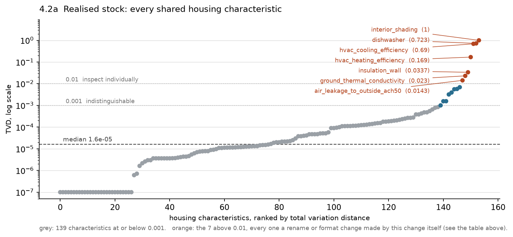

*Every characteristic in the model on one log axis. 139 of 154 sit at or below 0.001 and 27 are
exactly zero; the seven orange points are named individually below and every one is a rename or a
format change made by this change itself. There is no middle group of shifted
distributions — the gap between the noise band and the renames is about two orders of magnitude.*

**Every characteristic with TVD > 0.01**, with cause:

| Characteristic | TVD | Cause |
|---|---|---|
| `in.interior_shading` | 1.000 | Option renamed `Summer = 0.7, Winter = 0.85` → `Light Curtains`. A single option at p=1 on both sides, so a pure rename scores 1.0 by construction |
| `in.dishwasher` | 0.723 | 7 rated-kWh options → `Standard` / `EnergyStar` (§3.1) |
| `in.hvac_cooling_efficiency` | 0.690 | SEER → SEER2 relabel (PR #1516) |
| `in.hvac_heating_efficiency` | 0.169 | HSPF → HSPF2 relabel (PR #1516) |
| `in.insulation_wall` | 0.034 | `CMU, 6-in Hollow, R-11` → `CMU, 6-in, R-11` relabel (PR #1466 CMU R-value update) |
| `in.ground_thermal_conductivity` | 0.023 | String formatting only: `2.0` → `2` |
| `in.air_leakage_to_outside_ach50` | 0.014 | Derived field; value set differs. **Not fully explained** — likely downstream of the shielding/infiltration defaulting change (§3.5), but not demonstrated |

**Characteristics with remapped enumerations.** These are the inputs whose energy change §4.5 and §4.6 attribute to
a modelling change, and are expected to stay unchanged except for the enumeration names.

| Characteristic | TVD | Options baseline / new |
|---|---|---|
| `in.ceiling_fan` | 0.000004 | 3 / 3 |
| `in.clothes_washer` | 0.000052 | 3 / 3 |
| `in.clothes_dryer` | 0.000153 | 4 / 4 |
| `in.bedrooms` | 0.000123 | 5 / 5 |
| `in.hvac_has_ducts` | 0.000012 | 2 / 2 |
| `in.duct_leakage_and_insulation` | 0.000427 | 14 / 14 |
| `in.water_heater_efficiency` | 0.003205 | 21 / 21 |
| `in.misc_pool_heater` | 0.000022 | 5 / 5 |
| `in.electric_vehicle_ownership` | 0.000005 | 2 / 2 |

All nine are inside the noise band with identical option counts. `in.duct_leakage_and_insulation` at
0.000427 matters most, because §4.6.4 rests on comparing leakage strata — that stratification is
comparing the same populations on both sides.

**Source:** the two run parquets named in §0 — the baseline read anonymously from the OEDI S3
bucket, the new run from its Kestrel results directory. Method: weighted `group_by` on every `in.*`
column present in both runs, converted to dwelling-unit fractions using the `weight` column, then
total variation distance between the two fractions. The eight `in.utility_bill_*` columns are
excluded, as stated above; no other filter is applied.

**Weighting:** weighted to national dwelling unit counts via the `weight` column. TVD is computed on
weighted dwelling-unit fractions, so it answers "is the same stock represented".

**Interpretation:** Observation — the realized stock is the same on both sides. Every core
stock-defining characteristic (building type, vintage, state, tenure, income, occupants, floor area,
heating fuel, HVAC type) matches to within 0.0007 TVD with an identical option count, and the median
across all 154 shared characteristics is 1.6×10⁻⁵. No characteristic shows a distribution shift that is
not accounted for by a rename or format change introduced by this change itself. Inference — the
concurrent sampling-regions code in the run commit did not alter what was sampled, consistent with the
Kestrel log showing the quota sampler was used. This materially strengthens §4.5: because
`in.ceiling_fan` (TVD 4×10⁻⁶) and `in.clothes_washer` (TVD 5×10⁻⁵) are distributionally identical, the
ceiling fan and clothes washer energy changes cannot be sampling artifacts and must come from the
modelling change, as §2.3 argues.

One item to carry forward: `in.air_leakage_to_outside_ach50` is the one input whose value set moved
without a confirmed cause.

## 4.3 Individual Model Verification

Not performed. It cannot be performed by matched `building_id` — the quota sampler was re-run,
so ids do not correspond — but §4.2 shows the two stocks are distributionally identical, which makes
matched *cohorts* straightforward to construct on characteristics.

## 4.4 Simulation Success, Warnings, and Runtime

| Metric | Baseline | New | Δ |
|---|---|---|---|
| Simulations requested (`n_datapoints`) | 550,000 | 550,000 | — |
| Completed successfully (rows in results) | 549,971 | 549,999 | +28 |
| Failed | no unexpected failures | no unexpected failures | — |

**Source:** implementer confirmation on both runs; `completed_status` column of the two parquet files
named in §0; Kestrel run log `/projects/enduse/logs/new_sampling/new_sampling_test_0_amy2018_2.log`.

**Failure analysis.** The implementer confirms there were no unexpected simulation failures in
either run. On the new side this is corroborated by the run log: the BEM array (job 16922474, 100
tasks) reports all 100 tasks `COMPLETED`.

**Interpretation:** Observation — both runs completed without unexpected simulation failures.

## 4.5 Stock-Level Output Change

**By fuel** (TWh, weighted to national dwelling unit counts):

| Fuel | Baseline | New | Δ abs | Δ % | Band |
|---|---|---|---|---|---|
| Electricity | 1,641.5 | 1,631.8 | −9.8 | −0.59% | Minor |
| Natural gas | 1,479.1 | 1,414.6 | −64.6 | −4.36% | Notable |
| Fuel oil | 178.8 | 172.9 | −6.0 | −3.34% | Notable |
| Propane | 154.1 | 148.9 | −5.2 | −3.36% | Notable |
| **Total site** | **3,453.6** | **3,368.2** | **−85.5** | **−2.47%** | Notable |

**By end use, aggregated across fuels** (TWh, weighted):

| End use | Fuel | Baseline | New | Δ abs | Δ % | Band |
|---|---|---|---|---|---|---|
| Heating (space) | all | 1,708.8 | 1,647.7 | −61.1 | −3.58% | Notable |
| Heating fans/pumps | electricity | 36.3 | 44.8 | +8.6 | +23.60% | Major |
| Heating HP backup | electricity | 22.2 | 22.4 | +0.3 | +1.18% | Minor |
| Cooling | electricity | 386.0 | 369.3 | −16.7 | −4.34% | Notable |
| Cooling fans/pumps | electricity | 64.4 | 69.4 | +5.0 | +7.74% | Notable |
| Water heating | all | 412.9 | 398.4 | −14.5 | −3.50% | Notable |
| Lighting | all | 117.7 | 117.6 | −0.1 | −0.10% | Negligible |
| Clothes dryer | all | 71.8 | 39.7 | −32.1 | −44.70% | Major |
| Clothes washer | electricity | 3.0 | 8.4 | +5.4 | +179.53% | Major |
| Dishwasher | electricity | 9.1 | 7.9 | −1.1 | −12.56% | Major |
| Ceiling fan | electricity | 6.8 | 27.2 | +20.4 | +299.37% | Major |
| Refrigeration (fridge + freezer) | electricity | 132.4 | 132.6 | +0.3 | +0.22% | Negligible |
| Plug loads + TV | electricity | 335.8 | 336.0 | +0.2 | +0.07% | Negligible |
| Range/oven | all | 76.5 | 76.5 | −0.0 | −0.01% | Negligible |
| Pools and spas | all | 48.1 | 48.2 | +0.1 | +0.16% | Negligible |
| Other (vent, well pump, EV, grill, fireplace) | all | 21.8 | 21.8 | +0.0 | +0.15% | Negligible |
| PV (generation) | electricity | −11.9 | −11.9 | +0.0 | −0.09% | Negligible |

**Fuel-specific detail, every pair above 1%** (TWh, weighted):

| End use | Fuel | Baseline | New | Δ abs | Δ % | Band |
|---|---|---|---|---|---|---|
| ceiling_fan | electricity | 6.814 | 27.213 | +20.399 | +299.37% | Major |
| clothes_washer | electricity | 3.000 | 8.387 | +5.387 | +179.53% | Major |
| heating_fans_pumps | electricity | 36.274 | 44.835 | +8.561 | +23.60% | Major |
| heating_hp_bkup_fa | electricity | 0.598 | 0.693 | +0.095 | +15.91% | Major |
| cooling_fans_pumps | electricity | 64.439 | 69.429 | +4.990 | +7.74% | Notable |
| hot_water | electricity | 134.265 | 138.170 | +3.904 | +2.91% | Notable |
| pool_heater | electricity | 1.709 | 1.732 | +0.023 | +1.33% | Minor |
| heating | propane | 130.139 | 126.435 | −3.704 | −2.85% | Notable |
| heating | fuel_oil | 164.556 | 159.616 | −4.940 | −3.00% | Notable |
| heating | natural_gas | 1,157.991 | 1,116.265 | −41.727 | −3.60% | Notable |
| heating | electricity | 256.161 | 245.420 | −10.742 | −4.19% | Notable |
| cooling | electricity | 386.029 | 369.294 | −16.736 | −4.34% | Notable |
| hot_water | propane | 18.330 | 17.273 | −1.057 | −5.77% | Notable |
| hot_water | natural_gas | 246.004 | 229.727 | −16.276 | −6.62% | Notable |
| hot_water | fuel_oil | 14.283 | 13.243 | −1.040 | −7.28% | Notable |
| dishwasher | electricity | 9.075 | 7.935 | −1.140 | −12.56% | Major |
| clothes_dryer | natural_gas | 14.729 | 8.169 | −6.559 | −44.54% | Major |
| clothes_dryer | electricity | 56.124 | 31.015 | −25.109 | −44.74% | Major |
| clothes_dryer | propane | 0.959 | 0.530 | −0.430 | −44.79% | Major |

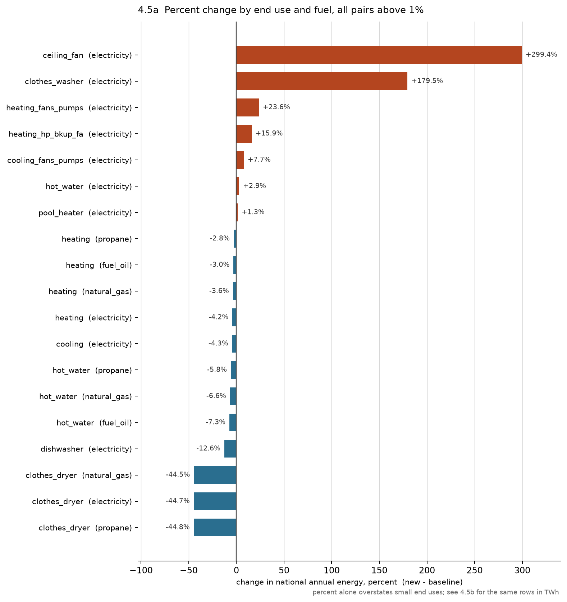

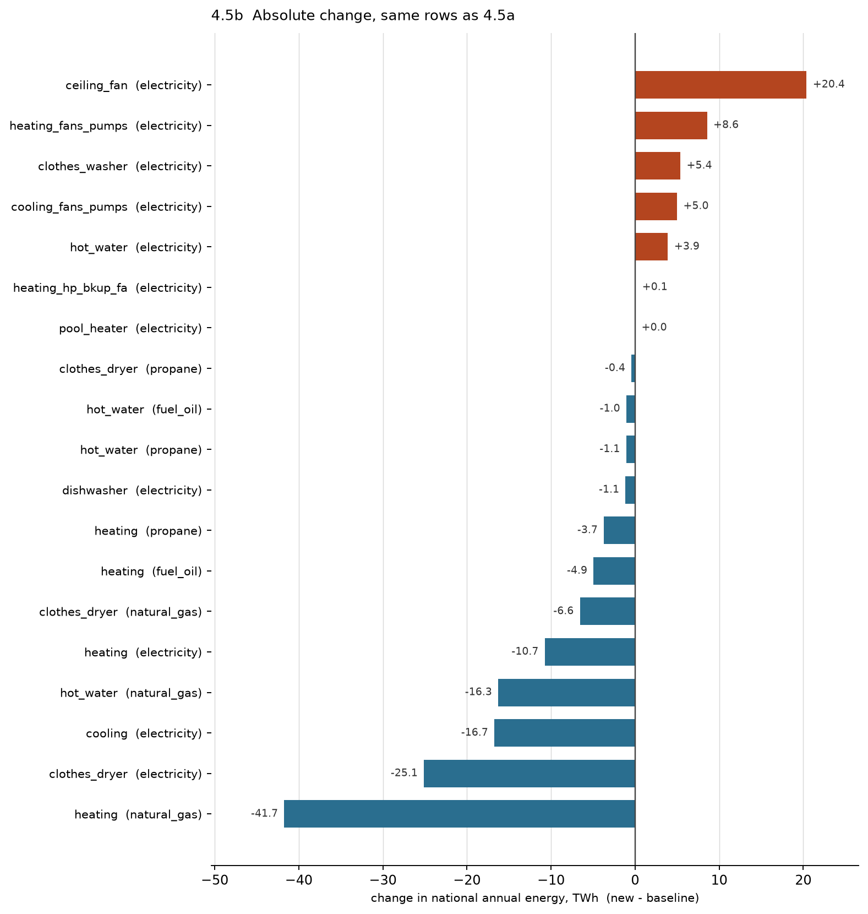

*Figures 4.5a and 4.5b are the same rows on two scales, and must be read together. 4.5a ranks by
percent, which puts ceiling fans and the clothes washer at the top; 4.5b ranks the identical rows by
TWh, and the order almost inverts — natural gas heating is the largest absolute mover at −41.7 TWh
while sitting mid-table on percent, and the pool heater's +1.33% is +0.02 TWh, invisible at national
scale. Percent alone would misdirect a reviewer to the small end uses.*

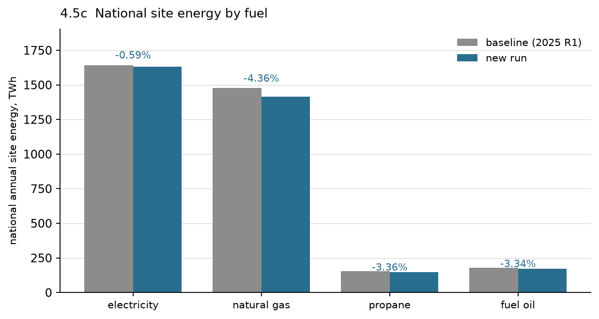

*The reduction is a fossil-fuel result: natural gas −4.36%, fuel oil −3.34%, propane −3.36%, against
electricity −0.59%. Electricity is nearly flat not because little changed on it but because large
increases (ceiling fans, blower power, clothes washer) and large decreases (clothes dryer, cooling,
electric heating) very nearly cancel — see 4.5b.*

**Source:** the two run parquets named in §0. Method: weighted sums of
`out.<fuel>.<end_use>.energy_consumption..kwh` using the `weight` column. The by-fuel table uses each
run's own `out.<fuel>.total` columns, which are **gross** — PV generation is excluded rather than
netted, and appears as its own end use row; the `.net` columns would run about 11.9 TWh lower on
electricity. Two checks were applied: the end use grouping partitions all 46 site-fuel output columns
with none ungrouped or double-counted, and the grouped sum reconciles against `out.site_energy.total`
to within 0.0002%.

**Weighting:** weighted to national dwelling unit counts using the `weight` column. Weighted stock
totals are 139,639,657 (baseline) and 139,646,766 (new) dwelling units, a difference of +0.005%.

**Interpretation:** Observation — total site energy falls 2.47%, and the reduction is concentrated in
fossil fuels (natural gas −4.36%) while electricity is nearly flat (−0.59%). The largest absolute
mover is natural gas heating at −41.7 TWh, roughly half the total site reduction, on a percentage
(−3.60%) that sits mid-table; the largest *relative* movers are small end uses. Inference — the
pattern is consistent with the mechanisms in §2.3: fossil reductions from the water heater UEF change
and the duct/shielding/blower-heat effects on heating, offset on the electricity side by ceiling
fans, blower power and the clothes washer, which is why the electricity total barely moves despite
several Major relative changes within it. Note the offsetting structure explicitly — reporting only
total site energy would hide a +20 TWh ceiling fan increase and a −32 TWh dryer decrease that very
nearly cancel.

## 4.6 Segment Breakdowns

**Performed.** The question this section answers is not "how big is each delta" — §4.5 covers that —
but **"is each delta confined to the population the mechanism says it should act on, and absent
everywhere else?"** Each test below states a prediction and names a control group *before* the
result, so a mechanism can fail as well as pass.

**Data and method.** Both runs are read at dwelling-unit level from the parquets named in §0 and all
statistics are weighted by the `weight` column. Segment means are weighted per-dwelling means within
the segment; segment shares are weighted dwelling-unit fractions. Two enumerations renamed by this
change are remapped before comparison so like is compared with like: `in.dishwasher`
(`290 Rated kWh`→`EnergyStar`, `318 Rated kWh`→`Standard`) and the HPWH
`in.water_heater_efficiency` option.

Segment shares agree between the two runs to within about 0.05 pp everywhere the segment is not
tiny, consistent with §4.2.

### 4.6.1 Negative control panel — did anything leak?

Every shared end use, ranked by the size of its national change. If the change is well isolated, end
uses touched by no mechanism in §2.3 should sit inside sampling noise.

46 fuel-and-end-use output columns are shared by the two runs. Three (fossil heat pump backup) carry
no baseline energy and have no percentage, leaving 43 testable rows.

| Band | Count | Examples |
|---|---|---|
| Negligible, <0.5% | **22 of 43** | interior/exterior/garage lighting, plug loads, television, refrigerator, freezer, range oven (all three fuels), well pump, pool pump, spa heat and pump, mechanical ventilation, PV, fireplace, grill |
| Minor, 0.5–2% | 3 | heating HP backup (+0.77%), electric pool heater (+1.33%, resolved in §4.6.11), solar-thermal DHW (+0.97%) |
| Notable, 2–10% | 10 | every one attributable to a mechanism named in §2.3 |
| Major, >10% | 8 | every one attributable to a mechanism named in §2.3 |

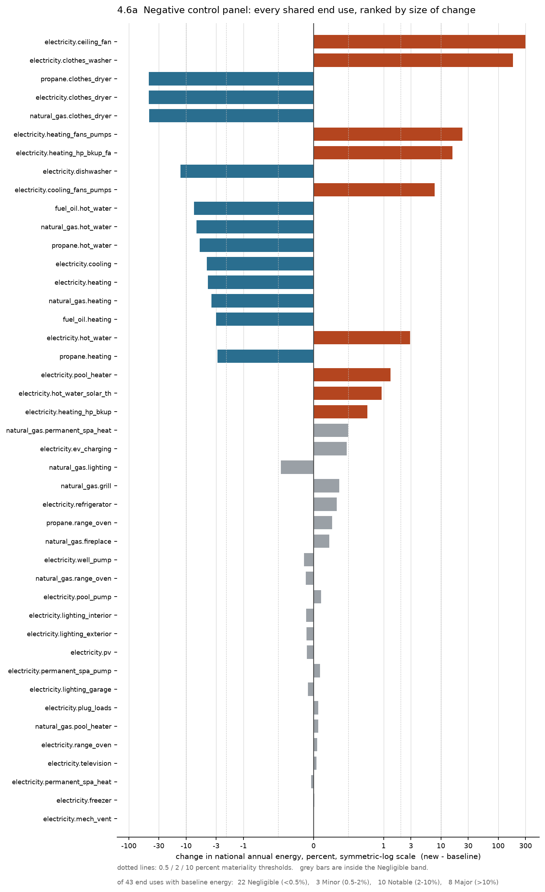

**Verdict: pass.** Nothing moved that had no reason to. Plug loads (+0.07%), interior lighting
(−0.10%) and refrigerator (+0.33%) are the cleanest controls — large, ubiquitous end uses driven by
schedules and floor area that no mechanism in §2.3 touches, and all three sit inside noise.

### 4.6.2 Ceiling fans — H1

*Prediction:* if ResStock's explicit fan-count override was removed and OS-HPXML's `nbeds + 1`
default took over, baseline means should be roughly **flat** across bedroom count and new means
should **rise with bedrooms**. *Control:* dwellings whose `in.ceiling_fan` is `None` or
`Standard Efficiency, No usage` must show exactly zero.

| in.bedrooms | old kWh/dwelling | new kWh/dwelling | new/old |
|---|---|---|---|
| 1 | 45.5 | 95.5 | 2.10× |
| 2 | 47.0 | 148.9 | 3.17× |
| 3 | 49.9 | 210.4 | 4.22× |
| 4 | 51.2 | 271.4 | 5.30× |
| 5 | 50.6 | 323.6 | 6.40× |

The baseline varies by 12% across the whole bedroom range — the signature of a fixed count. The new
run rises 3.4× from 1 to 5 bedrooms, closely tracking `(nbeds+1)` (2→6 fans is a 3.0× span).

By option: `None` **0.00 → 0.00**, `Standard Efficiency, No usage` **0.00 → 0.00**, and the entire
+299.35% sits in `Standard Efficiency`. 36.7% of the stock is an exact zero.

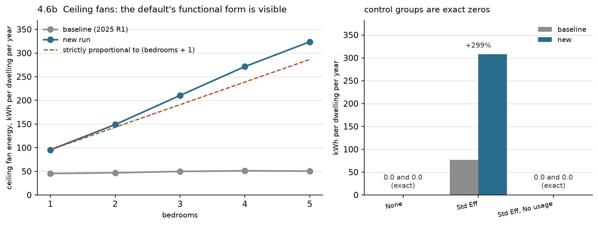

**Verdict: confirmed, with the mechanism's functional form visible in the data.** The left panel is
confirms the hypothesis: a flat baseline is what a fixed count produces, a rising new line is what
`nbeds + 1` produces, and the new line tracks strict proportionality to `nbeds + 1` closely enough
that no other explanation is needed. The mild convexity above it is floor area, which grows with
bedroom count and lengthens fan run hours.

### 4.6.3 Blower W/cfm — H6

*Prediction:* fan energy rises only where a blower exists. *Control:* `in.hvac_has_ducts = No`.

| in.hvac_has_ducts | share | htg fans %Δ | clg fans %Δ | NG heating %Δ |
|---|---|---|---|---|
| No | 23.0% | **+1.77%** | −7.08% | −1.53% |
| Yes | 77.0% | **+24.73%** | +7.77% | −3.93% |

Restricting to gas-heated homes and splitting on system type sharpens it, since boilers have no
blower:

| Heating type (gas-heated homes) | share | NG heating %Δ | htg fans %Δ |
|---|---|---|---|
| Ducted Heating | 83.4% | −4.04% | +18.44% |
| Non-Ducted Heating (boilers) | 16.6% | −1.07% | +2.59% |

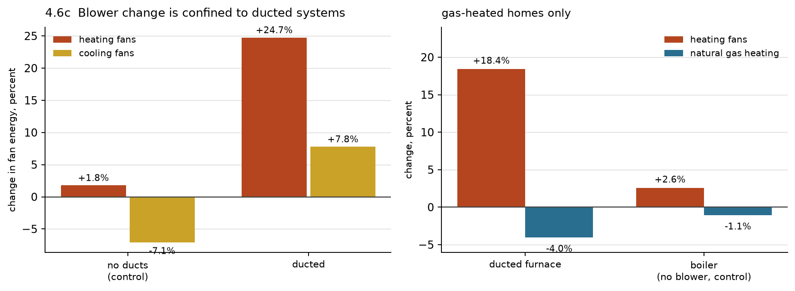

**Verdict: confirmed.** The fan increase is confined to ducted systems. The ductless −1.07% is a
useful envelope-only benchmark: whatever moved gas heating in homes with no blower and no ducts.

### 4.6.4 Duct leakage — root cause of the fossil heating drop

This is the largest single component of the −2.47% national result, and the mechanism is now
identified in code. It is **not** blower waste heat.

**The input change.** ResStock's baseline `options_lookup.tsv` set supply and return duct leakage as
two independent arguments, splitting the named total **67/33** between them:

```
Duct Leakage and Insulation | 20% Leakage to Outside, Uninsulated
  ducts_supply_leakage_to_outside_value = 0.133
  ducts_return_leakage_to_outside_value = 0.067      (total 0.200)
```

The new `options_lookup.tsv` points at the OS-HPXML option catalogue instead — `hvac_ducts=20%
Leakage, Uninsulated`. That catalogue row carries a **blank** `Supply Leakage Fraction` column, as do
all 32 percent-based and `CFM25 per 100ft2` rows; only the four `Detailed Example` rows populate it.
`BuildResidentialHPXML` then applies its default:

```ruby
supply_leakage_fraction = args[:hvac_ducts_supply_leakage_fraction]
supply_leakage_fraction = 0.5 if supply_leakage_fraction.nil?
supply_leakage_value = (leakage_value * supply_leakage_fraction).round(3)
return_leakage_value = (leakage_value * (1.0 - supply_leakage_fraction)).round(3)
```

So supply becomes 0.100 and return 0.100. **Total leakage to outside is unchanged. Only the split
moved, from 67/33 to 50/50.**

**Why that is not a small change.** In OS-HPXML's duct EMS subroutine, duct leakage drives an
infiltration term through the *imbalance* between the two sides, implementing ANSI/RESNET/ICC
301-2022 Addendum C Table 4.2.2(1c):

```ruby
if leakage_supply == leakage_return
  duct_subroutine.addLine('  Set FracOutsideToCond = 0.0')
  ...                                    # all six transfer fractions set to zero
elsif leakage_supply > leakage_return    # conditioned space is depressurised
  if duct_location_is_vented
    duct_subroutine.addLine('  Set FracOutsideToCond = 1.0')
...
duct_subroutine.addLine('  Set lk_imbal_vfr = @ABS(f_sup - f_ret) * AH_VFR')
```

Setting the split to 50/50 makes `leakage_supply == leakage_return` exactly, so `lk_imbal_vfr` is
zero **and** every transfer fraction is zeroed. The duct-leakage-imbalance-induced infiltration term
is switched off entirely.

| | supply | return | imbalance | outdoor air drawn into conditioned space |
|---|---|---|---|---|
| Baseline, 20% leakage | 0.133 | 0.067 | 0.067 × `AH_VFR` | yes, `FracOutsideToCond` = 1.0 for vented duct zones |
| New, 20% leakage | 0.100 | 0.100 | **0** | **none** |

Baseline imbalance is ⅓ of total leakage; the new run's is zero at every leakage level. That predicts
an effect proportional to total leakage and exactly zero when leakage is zero.

**The OS-HPXML code did not change.** The duct block of `airflow.rb` is byte-identical between the
baseline and new subtree commits (verified over lines 1400–1570 / 1406–1576, a pure 6-line offset).
The entire effect comes from ResStock's inputs.

**Evidence line 1 — dose-response.** Collapsing leakage across insulation levels, within gas-heated
ducted homes with ducts in unconditioned space:

| Leakage to outside | share | gas kWh/dwelling old → new | gas %Δ | fan %Δ |
|---|---|---|---|---|
| 10% | 17.1% | 18,519 → 17,873 | −3.49% | +19.97% |
| 20% | 30.8% | 19,818 → 18,850 | −4.89% | +20.16% |
| 30% | 17.7% | 21,469 → 19,631 | **−8.56%** | +17.32% |
| 0% (ducts inside envelope) | 34.4% | 15,363 → 15,326 | **−0.24%** | +17.24% |

Monotonic in leakage, while blower power is flat within a 3 pp band across all four groups.

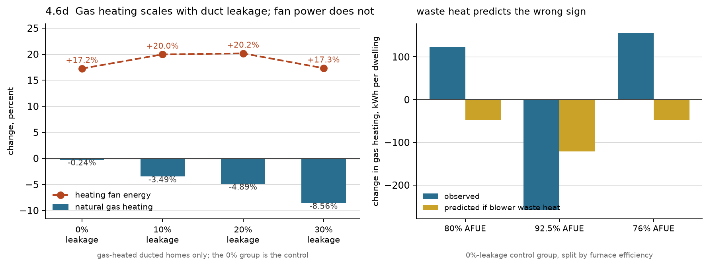

Unfortunately the 0%-leakage group is not an equal-population control. In
ResStock the `0% Leakage to Outside` option is assigned to the dwellings whose ducts are in
conditioned space — the cross-tab is 100%/0% for Heated Basement and Living Space, and every
unconditioned duct location carries the same 26/47/27 leakage mix. So that row tests "ducts inside
the envelope", where imbalance losses are recovered anyway, not "ducts outside with no leakage".
Both readings predict no change, so the row still supports the mechanism — but it cannot be described
as an otherwise-identical control.

**Evidence line 2 — cooling moves in the same direction, by the same amount.** This is the decisive
test, because it separates an *airflow* mechanism from a *heat-balance* one. The imbalance term is
fuel-agnostic and load-agnostic: removing it removes parasitic outdoor air whenever the air handler
runs, so it must reduce heating **and** cooling, both scaling with leakage. Blower waste heat predicts
the opposite sign on cooling — more fan heat means more cooling load.

| Leakage | gas heating %Δ | cooling %Δ |
|---|---|---|
| 10% | −3.49% | −1.50% |
| 20% | −4.89% | −4.33% |
| 30% | −8.56% | **−8.71%** |

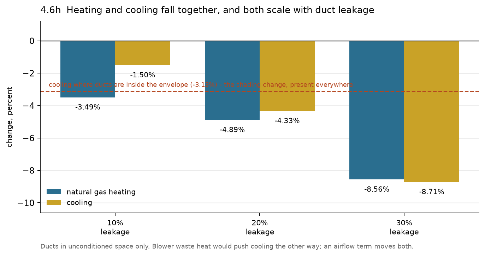

At 30% leakage the two agree to 0.15 pp. Cooling in dwellings whose ducts are inside the envelope
falls 3.13%, which is the interior shading change acting on everyone; the leakage-scaling component
on top of that is the duct term. **Blower waste heat cannot produce this pattern.**

**Evidence line 3 — magnitude.** At 30% leakage the removed imbalance airflow is
⅓ × 0.30 × `AH_VFR` = 0.10 × `AH_VFR`, roughly 120 cfm of outdoor air for a 1,200 cfm air handler
whenever it runs. The observed change is −1,838 kWh/dwelling of gas, or about 5.0 MMBtu delivered at
80% AFUE, which at 1.08 Btu/(hr·cfm·°F) implies roughly 1,500 fan-on hours at a 25 °F mean
indoor–outdoor difference. That is an ordinary heating season for a furnace-weighted population, so
the mechanism is the right size, not merely the right shape.

**Verdict: root cause identified.** The fossil heating reduction is driven by the duct supply/return
split moving from 67/33 to 50/50, which zeroes OS-HPXML's duct-leakage-imbalance infiltration term.
What remains is a decision, not an investigation — see §4.6.13.

### 4.6.5 Water heater EF → UEF — H4

*Prediction:* the tank-UA back-solve moves **storage** tanks, up for electric and down for fossil;
**tankless** has no tank UA and should move far less.

| Option | old kWh/dwelling | new | %Δ |
|---|---|---|---|
| Natural Gas Standard (storage) | 4,124.7 | 3,855.5 | −6.53% |
| Natural Gas Premium (storage) | 3,372.4 | 3,088.8 | −8.41% |
| **Natural Gas Tankless** | 2,656.6 | 2,619.3 | **−1.40%** |
| Propane Standard (storage) | 4,111.7 | 3,826.7 | −6.93% |
| **Propane Tankless** | 2,566.2 | 2,473.5 | **−3.62%** |
| Fuel Oil Standard (storage) | 4,010.0 | 3,684.0 | −8.13% |
| Electric Standard (storage) | 2,030.3 | 2,078.1 | +2.36% |
| Electric Premium (storage) | 1,911.3 | 1,999.7 | +4.63% |

Fossil tankless moves a quarter to a half as much as fossil storage of the same fuel. Electric moves
up, fossil down, as the differing UA forms predict.

The electric side is confounded by the clothes washer's hot water draw, so it needs a second cut.
Holding the water heater fixed at `Electric Standard` and splitting by washer option:

| Washer option | elec DHW %Δ |
|---|---|
| **None** (no washer draw at all) | **+2.43%** |
| Standard | +0.61% |
| EnergyStar | +5.09% |

The no-washer row is the clean water-heater-only number: **+2.43%**. The other two are that effect
plus the washer's changed hot water draw, moving in opposite directions by washer type.

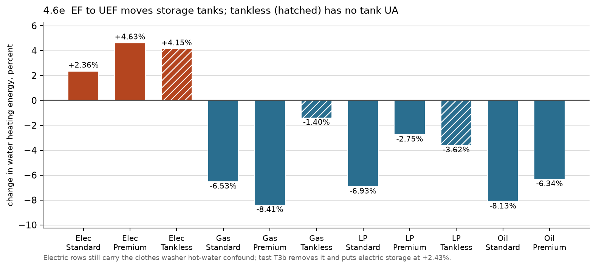

**Verdict: confirmed, and the electric increase is now separated into its two causes.** In the figure
the hatched tankless bars are consistently shorter than the solid storage bars of the same fuel,
which is the tank-UA mechanism's signature.

### 4.6.6 Clothes washer label, and the dryer coupling — H2

*Prediction:* the washer change is confined to washer owners; the dryer change tracks the **washer**
option (through remaining moisture content), not the dryer option or its fuel.

| in.clothes_washer | washer %Δ | elec dryer %Δ |
|---|---|---|
| None | **0.00** (exact) | **0.00** (exact) |
| Standard | +212.39% | −51.57% |
| EnergyStar | +122.24% | −26.08% |

| in.clothes_dryer | dryer %Δ (its own fuel) |
|---|---|
| Electric | −44.73% |
| Gas | −44.58% |
| Propane | −44.67% |
| None | 0.00 (exact) |

Segmented by dryer option the change is flat at −44.6% across all three fuels; segmented by *washer*
option it splits 2:1. The dryer change is driven entirely by the washer input.

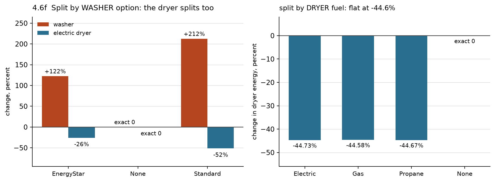

**Verdict: confirmed, including the direction of the cross-appliance coupling.** The two panels are
the test: split by washer option the dryer splits 2:1, split by dryer fuel it is flat. A change in
the dryer model would produce the opposite pattern.

Dishwasher (T6c) additionally makes the enumeration rename visible in the data: shares match exactly
across the rename (30.29%→30.29%, 41.99%→41.96%), and the national −12.56% is almost entirely in the
former `318 Rated kWh` bucket (91.4 → 70.4 kWh/dw, −23.0%), while the former `290 Rated kWh` bucket
moved +2.5%.

### 4.6.7 Shielding — H7

*Prediction:* attached and multifamily dwellings move more than detached. *Control:* Mobile Home,
which the default excludes.

| Building type | elec htg %Δ | NG htg %Δ | cooling %Δ |
|---|---|---|---|
| Single-Family Detached | −4.37% | −3.56% | −4.19% |
| Single-Family Attached | −5.96% | −5.32% | −6.98% |
| Multi-Family 2–4 | −4.61% | −3.62% | −6.05% |
| Multi-Family 5+ | −4.31% | −5.43% | −7.07% |
| **Mobile Home** | **−1.21%** | **+1.20%** | **+0.71%** |

**Verdict: directionally confirmed, not cleanly isolated.** Attached and multifamily do move more
than detached, most clearly in cooling (−6.0 to −7.1% against −4.2%). But detached homes also move
several percent, so shielding is layered on top of stock-wide envelope effects rather than separable
from them here. Mobile homes are near-null on all three despite taking the largest blower increase of
any building type (+34.4% heating fans) — consistent with the shielding default excluding them, and a
second independent sign that the blower change is not what drives fossil heating.

### 4.6.8 Interior shading — H8

*Prediction:* a multiplicative change on solar gain should show as a broadly uniform *percentage*
cooling reduction across climate zones rather than one concentrated in cooling-dominated zones.

Across the four zones holding 69% of the stock: 2A −3.95%, 3A −4.68%, 4A −4.76%, 5A −5.65%. Gas
heating over the same zones: −6.67%, −4.98%, −3.65%, −3.47%.

**Verdict: consistent with the mechanism but not a sharp test.** The cooling reduction is broadly
uniform as predicted, but the winter penalty §2.3 predicts is not separable from the concurrent
envelope changes pushing heating down. Small zones (7B, 8AK, 7AK) are dominated by sample noise —
8AK holds 286 models — and should not be read.

### 4.6.9 EV charging

*Prediction:* exactly zero for non-owners; a small change for owners from the temperature-dependent
multiplier only.

| in.electric_vehicle_ownership | share | EV charging %Δ |
|---|---|---|
| No | 98.95% | **0.00** (exact) |
| Yes | 1.05% | +0.58% |

**Verdict: confirmed.** Matches the end-to-end trace in §2.3: annual mileage and home-charging
fraction are identical between versions, leaving only the temperature-weighted multiplier.

### 4.6.10 Composition control — is any of this just a different draw?

§4.2 showed the two runs sampled the same stock. This is the stronger form of that test, applied to
outputs: **direct standardisation.** Each end use is cut into cells on the characteristics that drive
it, the new run's within-cell means are applied to the baseline run's cell weights, and the result is
the delta that would have been observed had both runs drawn identical stocks. The residual — `raw −
ctrl` — is what is attributable to *which buildings were drawn* rather than to modelling.

| End use | raw %Δ | composition-controlled %Δ | composition (pp) |
|---|---|---|---|
| ceiling_fan | +299.35 | +299.09 | 0.26 |
| clothes_washer | +179.51 | +179.57 | −0.06 |
| clothes_dryer | −44.74 | −44.74 | 0.00 |
| heating_fans_pumps | +23.59 | +23.59 | 0.01 |
| dishwasher | −12.56 | −12.57 | 0.01 |
| cooling_fans_pumps | +7.74 | +7.74 | −0.01 |
| natural_gas.hot_water | −6.62 | −6.57 | −0.05 |
| cooling | −4.34 | −4.33 | −0.01 |
| electricity.heating | −4.20 | −4.15 | −0.05 |
| natural_gas.heating | −3.61 | −3.70 | 0.09 |
| electricity.hot_water | +2.90 | +2.86 | 0.04 |
| **pool_heater** | **+1.33** | **0.00** | **1.33** |
| ev_charging | +0.47 | +0.59 | −0.12 |
| refrigerator | +0.33 | +0.33 | −0.00 |
| lighting_interior | −0.10 | −0.09 | −0.02 |
| plug_loads | +0.07 | +0.07 | −0.00 |
| **site_energy.total** | **−2.48** | **−2.47** | **−0.01** |

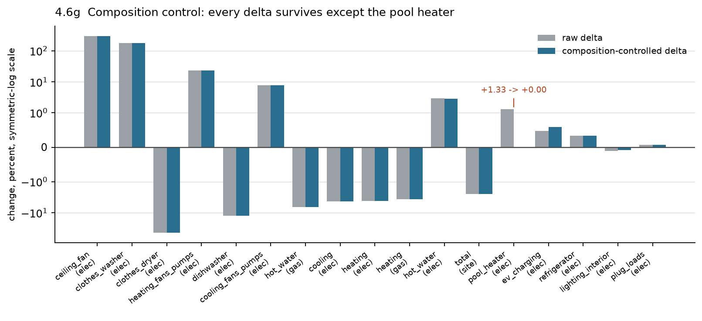

Cell coverage is 98.4–100% of baseline dwelling weight in every row. In the figure the grey and blue
bars are indistinguishable everywhere except the pool heater, whose controlled bar vanishes.

**Verdict: every reported delta except the pool heater survives composition control essentially
unchanged. The national −2.47% site energy result is a modelling result, not a sampling artifact.**

### 4.6.11 U1 — the electric pool heater is resolved

The one unexplained result in §4.10 is closed by this section, on two independent lines.

**Direct standardisation.** Within electric-pool-heater homes, stratifying on floor area and
occupants — the two inputs the OS-HPXML pool heater formula reads — and reweighting the new run to
the baseline mix takes the change from +0.99% to **+0.00%** (2,030.8 → 2,030.9 kWh/dwelling, 65
cells, 99.8% coverage).

**Ratio test.** Pool heater and pool pump are driven by the same floor-area and occupancy bracket but
have separate energy formulas. If either formula had changed, their ratio would move. Within electric
pool heater homes:

```
heater new/old = 1.013718357        pump new/old = 1.013719056
heater-to-pump energy ratio:  old 0.915838618   new 0.915837988
```

Identical to seven significant figures, and the two move by the same factor in every bedroom stratum
(+4.07/+4.07, −2.26/−2.26, +2.76/+2.76, −0.99/−0.99, +5.99/+5.99).

**Conclusion:** neither formula changed. Electric pool heaters are present in 0.71% of dwellings
(3,892 models), so the national mean is set by a small subsample and moves with which buildings were
drawn. §4.10 U1 is reclassified from **unexplained** to **explained — sampling composition within a
small subpopulation**.

### 4.6.13 What this section did not resolve

- **Shielding is not separated from the other envelope mechanisms** (§4.6.7). Confirming H7 in
  isolation needs a model-level comparison, not a segment cut. Tracked under F2.
- **The winter solar penalty from interior shading is not measurable here** (§4.6.8), because
  concurrent envelope changes push heating the other way.
- **Mobile homes move opposite to every other building type on gas heating** (+1.20%) and cooling
  (+0.71%). Consistent with the shielding exclusion, but not positively explained. Tracked as F16.
- **The duct leakage and duct location dimensions cannot be separated in ResStock's data.** §4.6.4
  shows `0% Leakage to Outside` and conditioned duct locations are the same population. Testing
  leakage independently of duct location would need a synthetic run, not a segment cut.

**Source:** the two run parquets named in §0, weighted by the `weight` column throughout. Every
table and figure in this section derives from those two files alone; no number or figure was
assembled by hand. Code citations in §4.6.4 were read at the run commit `aaade6fea6` and verified
against the baseline tag.

## 4.7 Timeseries and Peak Impacts

TBD — required, not N/A. This change can shift load shape and should not be signed off without a
timeseries comparison. Specific reasons: blower power rose 23.6% and blower runtime tracks heating
and cooling operation; ceiling fan energy quadrupled and ceiling fans run on a cooling-season
schedule; water heater tank UA changed in opposite directions for electric and fossil, which alters
standby-loss timing; and the EV driving-hours change reshapes when vehicles charge.

**What would produce it:** the timeseries outputs of both runs, compared on seasonal peak magnitude
and timing plus an average daily profile for winter and summer.

## 4.8 Upgrade Impacts

**Verified as minimal by the implementers, using the ResStock CI upgrade suite** rather than a
paired national upgrade run. The national comparison in §4.5 covers `upgrade0` only; a full-scale
upgrade comparison was not run, on time and simulation-allocation grounds.

**What the CI check is.** `.github/workflows/config.yml` runs `project_national/sdr_upgrades_amy2018.yml`
through `buildstock_local` on every change, executing all **34 SDR upgrades** against a **41-building
precomputed sample** (`project_national/resources/sdr_minimal_buildstock.csv`). Annual results are
diffed against the committed baselines in `test/base_results/upgrades/sdr_annual` by `test/compare.py`,
which emits per-upgrade comparison plots grouped by building type. The implementers reviewed that
output and report no material movement in upgrade savings.

**What that establishes.** Every upgrade in the SDR set was actually simulated on both sides of the
change, so the upgrades still apply, still run to completion, and still produce savings of the
expected sign and rough magnitude. Applicability logic keying on option names — the specific risk
from PR #1516 restating HVAC option names and PR #1503 removing unused HVAC options — is exercised
here, since a rename that broke applicability would show as a changed applicable count in the CI
results.

**What it does not establish.** 41 buildings is a functional check, not a national statistical
sample. Savings shifts of a few percent, or shifts concentrated in a segment the 41 buildings do not
represent, are below what this instrument resolves. The families where that residual matters most
are those where this change moved the baseline of exactly the equipment an upgrade replaces, because
the upgraded case is pinned by the upgrade definition while the baseline moved underneath it:

| Upgrade family | Why exposed | Baseline movement observed (§4.5) |
|---|---|---|
| Water heater | Baseline storage water heaters re-specified EF to UEF, changing derived tank UA in opposite directions by fuel | Gas -6.62%, propane -5.77%, fuel oil -7.28%, electricity +2.91% |
| HVAC equipment | Baseline HVAC options restated in SEER2/HSPF2, and baseline blower power rose via the motor-type default | Heating fans +23.60%; fossil heating -2.85% to -3.60% |
| Envelope | Baseline air sealing and shading assumptions moved | Cooling -4.34%; heating as above |
| Appliance, if any target washer/dryer/dishwasher | Baseline appliance energy moved by a large factor | Dryer -44.70%, washer +179.53%, dishwasher -12.56% |

**Why the assumption is reasonable beyond the CI evidence.** Most mechanisms in §2.3 act on the
dwelling unit rather than on the upgrade: shielding, duct leakage split, interior shading and blower
motor type apply to baseline and upgraded models alike. For an upgrade that does not touch the
affected equipment, both endpoints move together and the effect on savings is second-order.

**Residual risk**, stated plainly: national savings for water heater and HVAC upgrades could move by
a few percent without the CI suite resolving it, and the direction is not predictable from this
document because the baseline moved in opposite directions by fuel. National applicable-count shifts
from the option renames are likewise unquantified at stock scale.

**What would close the gap**, if it is revisited: a paired upgrade run at national sample size
reporting, per upgrade, applicable dwelling unit counts and the savings distribution rather than only
the mean. A targeted run of one water heater upgrade and one HVAC upgrade would test the two most
exposed families at a fraction of the cost.

**Source:** implementer confirmation of the CI upgrade comparison; CI definition at
`.github/workflows/config.yml`; baseline movements from §4.5.

## 4.9 External Validation

Two independent references were compared, using the comparison dashboards that the
`baseline_validation` tool in `resstockpostproc` generated for this change: **RECS 2020** (the EIA
Residential Energy Consumption Survey — occupied units, end-use disaggregation, 95% confidence
intervals from replicate weights) and **EIA 2018** (EIA-861 electricity sales and EIA-176 natural gas
deliveries to the residential sector — all units, by state). In those dashboards the baseline run is
labelled "ResStock 2025" and the new run "option_based_resstock"; this section uses the document's
own names. Every unfiltered panel — national, and grouped by state, census division, building type,
vintage, Building America climate zone and heating fuel, 985 plots in all — was read and compared.
The per-state filtered panels repeat the grouped data and were not used.

**Scope.** Annual quantities only. The dashboards' monthly panels were excluded: the new run's
monthly bars are built from 33,310 models, against 549,971 for the baseline and 549,986 for the new
run's own annual bars (the dashboards' "Number of Models" hover text), so they reflect a partial
timeseries load rather than the run — January electricity reads 10.8 TWh against a 179.3 TWh
baseline. Seasonal shape therefore remains unvalidated and is carried under F10. Utility load
research data was not part of the dashboards provided.

Error is `e = (ResStock − reference) / reference`, in percent of the reference. "Closer" means
`|e_new| < |e_baseline|`. A movement of less than 0.5 points of the reference is reported as
unchanged.

### 4.9.1 National totals

| Validation source | Metric | Observed (external) | Baseline | New | e_base | e_new | Closer or further? |
|---|---|---|---|---|---|---|---|
| EIA 2018 | Dwelling units | 133.9 M | 139.6 M | 139.6 M | +4.3% | +4.3% | unchanged |
| EIA 2018 | Electricity sales | 1,469.1 TWh | 1,641.5 | 1,630.9 | +11.7% | +11.0% | closer |
| EIA 2018 | Natural gas deliveries | 1,523.4 TWh | 1,479.1 | 1,416.0 | −2.9% | −7.1% | **further** |
| EIA 2018 | Share of units using gas | 52.1% | 60.5% | 60.5% | +16.1% | +16.2% | unchanged |
| RECS 2020 | Occupied dwelling units | 123.5 M | 122.7 M | 122.7 M | −0.7% | −0.7% | unchanged |
| RECS 2020 | Electricity | 1,305.2 TWh | 1,571.0 | 1,560.1 | +20.4% | +19.5% | closer |
| RECS 2020 | Natural gas | 1,242.8 TWh | 1,429.0 | 1,368.6 | +15.0% | +10.1% | closer |
| RECS 2020 | Fuel oil | 116.0 TWh | 168.3 | 164.0 | +45.2% | +41.4% | closer |
| RECS 2020 | Propane | 114.7 TWh | 144.2 | 137.7 | +25.7% | +20.0% | closer |

**Source:** national ("U.S. Total") panels of the two dashboards named under **Sources** at the end
of this section; total annual consumption, all dwelling units for EIA, all occupied dwelling units
for RECS. Weighting is the dashboards': ResStock by `weight`, RECS by its survey weights.

**Interpretation.** Observation — stock counts do not move against either reference, consistent
with §4.2. Electricity moves 0.7–0.8 points closer to both. Natural gas is the one quantity on which
the two references disagree with each other: EIA-176 residential deliveries (1,523 TWh, all units)
sit 280 TWh above RECS 2020 (1,243 TWh, occupied units, survey-based), and both ResStock runs sit
between them. The change's −4.3% on gas is therefore 4.9 points *closer* to RECS and 4.1 points
*further* from EIA at the same time. Fuel oil and propane, which only RECS covers, move 3.7 and 5.7
points closer while remaining 41% and 20% over. Inference — neither reference adjudicates F15. Both
say ResStock over-predicts fossil heating before and after; the question §4.6.4 leaves open is which
duct split ResStock means, and a 4-point movement inside a 15–30-point disagreement between the two
references does not settle it.

### 4.9.2 End uses against RECS 2020

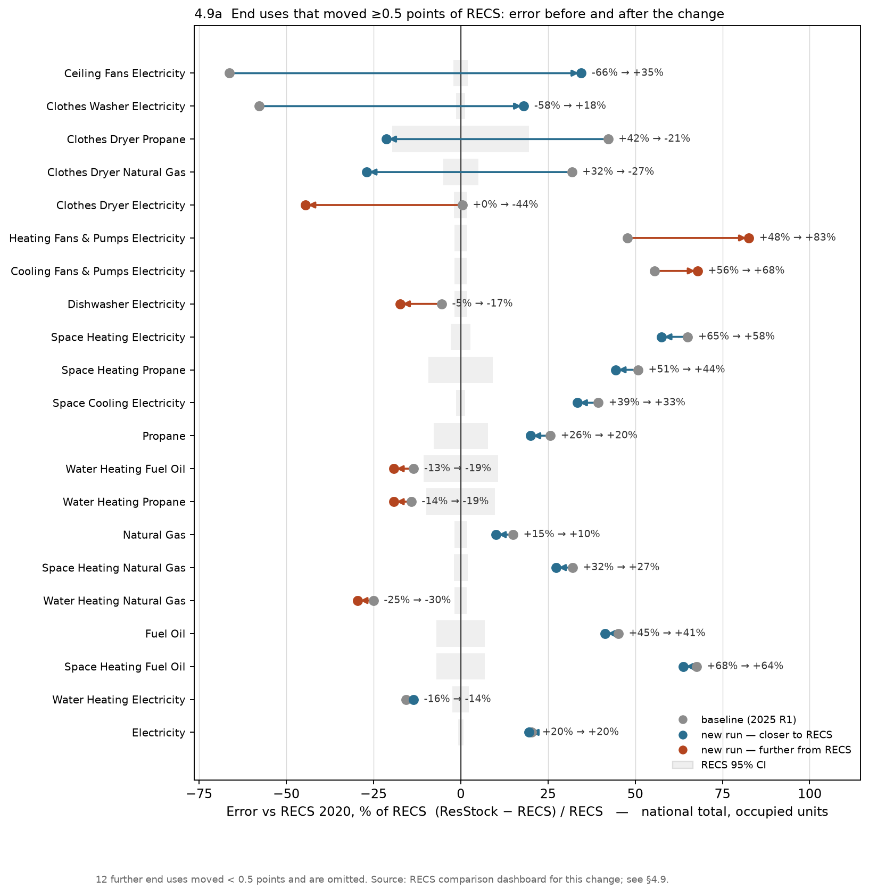

*Each arrow runs from the baseline error (grey) to the new error; blue where the new run is nearer
RECS, orange where it is further. The grey band is the RECS 95% confidence interval. Rows are
ordered by how far they moved. The 12 end uses that moved less than 0.5 points are omitted from the
figure and listed after the table.*

| End use | RECS 2020 (TWh) | ±95% CI | Baseline | New | e_base | e_new | Δ\|e\| (pp) | Verdict |
|---|---|---|---|---|---|---|---|---|
| Ceiling fans | 20.2 | ±2.1% | 6.8 | 27.2 | −66.3% | +34.5% | −31.8 | overshoots, net closer |
| Clothes washer | 7.1 | ±1.3% | 3.0 | 8.4 | −57.8% | +18.1% | −39.7 | overshoots, net closer |
| Clothes dryer, propane | 0.7 | ±19.6% | 1.0 | 0.5 | +42.2% | −21.3% | −20.9 | overshoots, net closer |
| Clothes dryer, natural gas | 11.2 | ±5.0% | 14.7 | 8.2 | +31.9% | −26.9% | −4.9 | overshoots, net closer |
| Clothes dryer, electricity | 55.9 | ±1.9% | 56.1 | 31.0 | **+0.5%** | −44.5% | +44.0 | **overshoots, net further** |
| Heating fans & pumps | 23.5 | ±1.8% | 34.7 | 42.9 | +47.8% | +82.6% | +34.8 | **further** |
| Cooling fans & pumps | 38.0 | ±1.8% | 59.1 | 63.7 | +55.6% | +67.9% | +12.3 | **further** |
| Dishwasher | 9.6 | ±1.8% | 9.1 | 7.9 | −5.5% | −17.4% | +11.9 | **further** |
| Space heating, electricity | 161.1 | ±2.8% | 265.9 | 253.8 | +65.1% | +57.6% | −7.5 | closer |
| Space heating, propane | 80.3 | ±9.2% | 121.1 | 116.0 | +50.8% | +44.5% | −6.3 | closer |
| Space cooling | 253.8 | ±1.3% | 353.9 | 338.5 | +39.4% | +33.4% | −6.0 | closer |
| Water heating, fuel oil | 15.7 | ±10.7% | 13.6 | 12.7 | −13.5% | −19.1% | +5.7 | **further** |
| Water heating, propane | 20.3 | ±9.8% | 17.5 | 16.4 | −14.2% | −19.1% | +4.9 | **further** |
| Space heating, natural gas | 846.0 | ±2.0% | 1,116.9 | 1,077.3 | +32.0% | +27.3% | −4.7 | closer |
| Water heating, natural gas | 316.9 | ±1.8% | 237.6 | 223.4 | −25.0% | −29.5% | +4.5 | **further** |
| Space heating, fuel oil | 92.4 | ±6.9% | 154.8 | 151.3 | +67.5% | +63.8% | −3.7 | closer |
| Water heating, electricity | 156.2 | ±2.3% | 131.6 | 135.0 | −15.7% | −13.6% | −2.2 | closer |

Unchanged (moved < 0.5 points of RECS, baseline error in parentheses): lighting (+45%),
refrigerator (−28%), freezer (+87%), cooking electricity (+49%), cooking gas (+38%), cooking propane
(+37%), plug loads (+12%), television (+16%), pool pumps (−6%), pool heater electricity (−76%), pool
heater gas (−47%), EV charging (−4%). Of the 33 end uses, the baseline was inside the RECS 95%
confidence interval on three (electric clothes dryer, EV charging, pool pumps); the new run is inside
on two — it left on the dryer.

**Source:** RECS dashboard, national panels, total annual consumption, all occupied dwelling units,
one panel per end use; the CI is the dashboard's error bar on the RECS bar (replicate weights,
log-normal method). Δ|e| = |e_new| − |e_base|, so negative is closer. Fuel totals (electricity,
natural gas, fuel oil, propane) appear in §4.9.1 and are omitted here.

**Interpretation.** The 21 end uses that moved fall into six groups, which map one-to-one onto the
mechanisms in §2.3 and the segment tests in §4.6.

1. **Heating and cooling loads moved closer, on every fuel.** Space heating by 4–8 points on gas,
   electricity, propane and fuel oil; cooling by 6. All remain 27–64% above RECS. This is the duct
   split (§4.6.4) and interior shading (H8) applied to an over-prediction: a downward shift on an
   over-predicted quantity reads as improvement. §4.9.3 shows what the same shift does where the
   errors have both signs.

2. **Fan energy moved further, sharply.** Heating fans and pumps go from +48% to +83% over RECS,
   cooling fans and pumps from +56% to +68%. The blower W/cfm change (H6, §4.6.3) raised fan energy
   where ResStock already exceeded RECS by half. By heating fuel, electrically heated homes read
   45 kWh per unit in RECS, 159 in the baseline and 235 in the new run (+305% → +500%); gas-heated
   homes read 277 / 362 / 427. RECS end-use fan estimates are modelled by EIA rather than metered, so
   the level carries more uncertainty than the ±1.8% interval expresses; the direction is not in
   doubt. Feeds F5.

3. **The electric clothes dryer is the largest deterioration in the run.** It was the only energy
   end use the baseline placed inside the RECS 95% interval (+0.5%, CI ±1.9%); the new run is −44.5%.
   The shift is uniform — −33% to −52% in every census division, −30% to −48% in every building type,
   and identical across dryer fuels (§4.6.6). Gas and propane dryers, which the baseline over-predicted
   by 32% and 42%, now under-predict by 27% and 21%. The clothes washer, driven by the same input,
   goes from −58% to +18%; the dishwasher from −5% to −17%. Inference — the H2/H3 mechanism is
   confirmed at the code level (§2.3, §4.6.6), but the external evidence says the baseline dryer
   energy was right and the new one is not. The washer overshoot and the dryer undershoot are the two
   ends of one input: the EnergyGuide-label-derived remaining moisture content of 0.377 is likely too
   low for the stock, or the dryer usage model does not scale with it the way the label implies. The
   gas and propane dryers, which now sit 21–27% under after sitting 32–42% over, suggest the answer
   lies between the two values. Raised as F18.

4. **Ceiling fans: the national number improves, the geography does not.** −66% becomes +35%, a
   net improvement of 32 points. But Figure 4.9d shows where the new energy landed. RECS per-unit
   ceiling fan energy spans 56 kWh (New England) to 320 kWh (West South Central), a 5.7× range that
   follows cooling climate. The baseline was flat at 36–71 kWh everywhere — the fixed fan count. The
   new run is 149–287 kWh, a 1.9× range: within ±15% of RECS in the three hottest divisions (West
   South Central −10%, East South Central −10%, South Atlantic +15%), 40–70% over in the central
   divisions, and 140–180% over in the Pacific, Middle Atlantic and New England. Inference — the
   bedrooms+1 count (H1, §4.6.2) sets how many fans exist, and RECS says the resulting national energy
   is of the right order; what it does not set is how much they run, and RECS shows run hours vary
   with climate roughly three times more than the model does. F4 is therefore two decisions, not one:
   the count, and what drives the hours.

5. **Water heating splits by fuel, as H4/H5 predicted, and only the electric side helps.** Electric
   water heating moves from −16% to −14%; gas from −25% to −30%, propane −14% to −19%, fuel oil −13%
   to −19%. ResStock under-predicts fossil water heating against RECS in every segment (84 of 88
   categories move further), so the lower UEF-derived tank UA moves the wrong way against this
   reference.

6. **The 12 unchanged end uses are the negative control.** Lighting, refrigerators, freezers,
   cooking on three fuels, plug loads, television, pool pumps and heaters, and EV charging moved by
   0.4 points or less — the same set as H9 and §4.6.1, now confirmed against an external reference
   rather than against the baseline. Their baseline errors are large (freezer +87%, lighting +45%,
   cooking +38–49%, refrigerator −28%) and are untouched by this change.

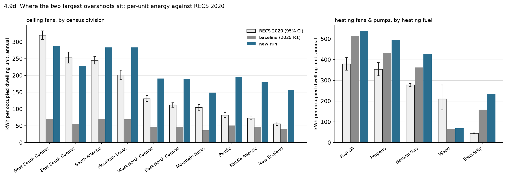

*Left: ceiling fans. RECS falls 5.7× from the Gulf states to New England; the baseline is flat; the
new run is high everywhere and about right only in the South. Right: heating fans and pumps by
heating fuel. The new run exceeds RECS on every fuel, most on electrically heated homes.*

**Source:** RECS dashboard, "Average Annual Consumption per Occupied Dwelling Unit" panels grouped
by census division (ceiling fans) and by heating fuel (heating fans and pumps); the "None" and
"Other Fuel" heating-fuel categories are omitted from the right panel.

### 4.9.3 States against EIA 2018

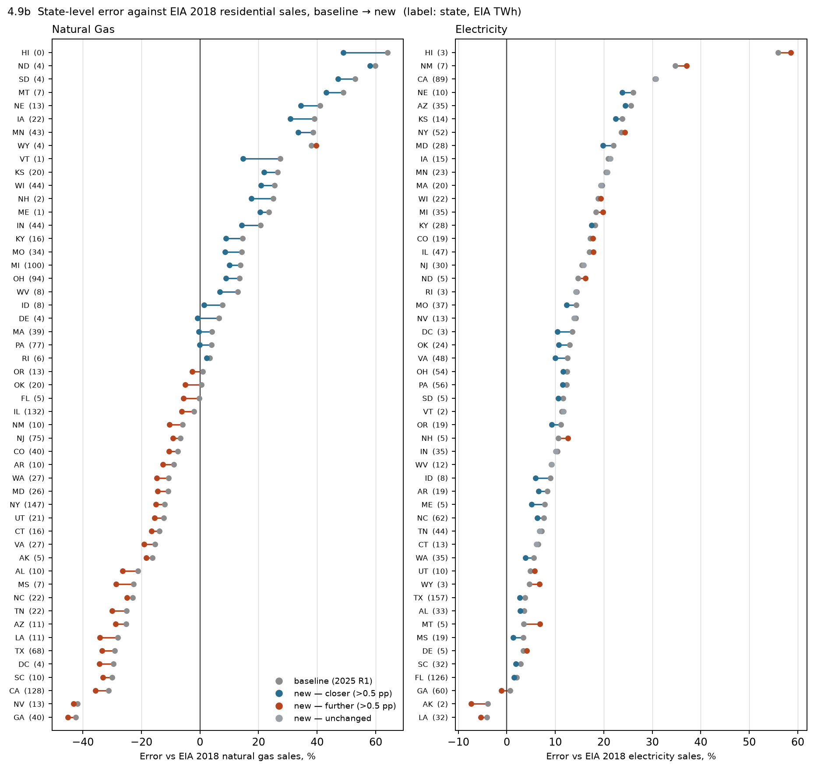

*Each row is a state, sorted by baseline error, labelled with its EIA 2018 sales in TWh. Grey is the
baseline; the coloured dot is the new run — blue closer, orange further, light grey unchanged.*

| Fuel | States closer | States further | Unchanged | EIA sales in closer states | in further states | Sales-weighted mean \|e\| |
|---|---|---|---|---|---|---|
| Natural gas | 23 | 28 | 0 | 594 TWh | 929 TWh | 17.1% → 17.4% |
| Electricity | 23 | 16 | 12 | 858 TWh | 312 TWh | 11.9% → 11.4% |

The ten largest gas states:

| State | EIA 2018 TWh | e_base | e_new | Δ\|e\| |
|---|---|---|---|---|
| NY | 146.9 | −12.1% | −15.0% | +2.9 |
| IL | 132.4 | −2.0% | −6.2% | +4.2 |
| CA | 128.4 | −31.2% | −35.7% | +4.5 |
| MI | 100.4 | +13.8% | +10.1% | −3.8 |
| OH | 94.0 | +13.5% | +8.8% | −4.7 |
| PA | 76.9 | +4.0% | −0.2% | −3.8 |
| NJ | 75.4 | −6.7% | −9.2% | +2.5 |
| TX | 68.3 | −29.1% | −33.4% | +4.3 |
| IN | 44.1 | +20.7% | +14.2% | −6.6 |
| WI | 44.0 | +25.5% | +20.8% | −4.6 |

**Source:** EIA dashboard, "by State" grouped panels, total annual consumption, all dwelling units;
50 states plus the District of Columbia. The sales-weighted mean is Σ(|e| × EIA TWh) / Σ(EIA TWh).

**Interpretation.** Observation — the gas change is a nearly uniform downward shift: 44 of 51
states move between −2 and −8 points of EIA (median −4.5). The baseline errors it lands on have
both signs and a strong regional pattern — over-prediction in the upper Midwest and northern Plains
(ND +60%, SD +53%, MT +49%, NE +41%, IA +39%, MN +39%), under-prediction across the South and the
West Coast (GA −42%, NV −42%, CA −31%, SC −30%, TX −29%). A uniform shift moves the first group
closer and the second further, and the three largest gas states (NY, IL, CA, 408 TWh between them)
all move further. The sales-weighted mean error is unchanged at 17%. Electricity: 49 of 51 states
were over-predicted in the baseline, so the small downward shift (median −0.6 points) reads as
23 closer, 16 further and 12 unchanged, with the weighted mean improving half a point. Inference —
the regional gas pattern predates this change and is not something a national duct-split or blower
assumption can move in one direction; the change neither creates nor resolves it. It is also the
reason the national gas number in §4.9.1 is a poor summary: −2.9% nationally was the net of +60%
and −42% state errors.

### 4.9.4 Segments against RECS 2020

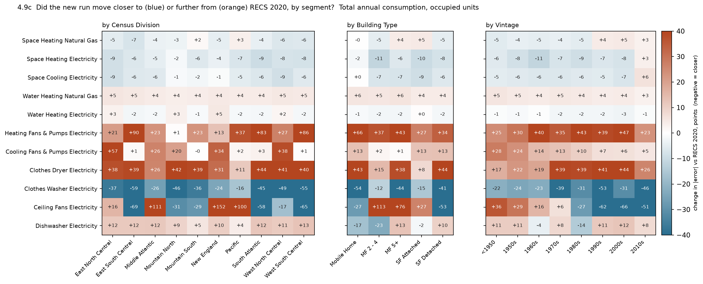

*Each cell is Δ|e| in points of RECS for that end use in that segment: blue closer, orange further.
A row of one colour is a change that acted the same way everywhere.*

| End use | Categories | Closer | Further | Unchanged | RECS-weighted mean \|e\|, base → new |
|---|---|---|---|---|---|
| Space heating, natural gas | 87 | 60 | 22 | 5 | 35.3% → 31.6% |
| Space heating, electricity | 88 | 69 | 12 | 7 | 70.4% → 63.2% |
| Space cooling | 89 | 75 | 9 | 5 | 41.5% → 35.7% |
| Water heating, natural gas | 88 | 2 | 84 | 2 | 25.1% → 29.5% |
| Water heating, electricity | 89 | 60 | 26 | 3 | 17.6% → 16.2% |
| Heating fans & pumps | 88 | 5 | 83 | 0 | 49.3% → 83.1% |
| Cooling fans & pumps | 88 | 9 | 74 | 5 | 57.8% → 69.6% |
| Clothes dryer, electricity | 89 | 4 | 85 | 0 | 8.7% → 44.5% |
| Clothes washer | 89 | 87 | 2 | 0 | 57.8% → 20.0% |
| Ceiling fans | 89 | 54 | 34 | 1 | 66.4% → 40.0% |
| Dishwasher | 89 | 10 | 78 | 1 | 11.2% → 18.2% |

**Source:** RECS dashboard, every grouped panel (by state, census division, building type, vintage,
Building America climate zone and heating fuel), total annual consumption, all occupied dwelling
units. "Categories" is the union of those groupings, so a state and a census division each count
once; categories with zero RECS energy are excluded. The mean weights each category by its RECS TWh.

**Interpretation.** Observation — in every row but two, the movement has the same sign in every
segment: heating, cooling, electric water heating and the washer closer everywhere; fossil water
heating, both fan categories, the electric dryer and the dishwasher further everywhere. The
exceptions are ceiling fans (regional, item 4 above) and the dishwasher by building type (mobile
homes and 2–4-unit buildings closer, the other three further). Inference — movement that is uniform
across geography, vintage and building type is the signature of an assumption or physics change, not
a compositional one. That corroborates §4.6.10's composition control from an independent direction:
if the deltas were a different draw of buildings, they would not move every segment the same way.

### 4.9.5 What this section changes

Closer to the references: heating on all fuels and cooling (RECS), total gas (RECS), total
electricity (both), electric water heating, the clothes washer and ceiling fans in net national
terms. Further: heating and cooling fan energy, the electric clothes dryer, the dishwasher, fossil
water heating, and total gas against EIA. Unchanged: stock counts, gas penetration, and the twelve
end uses this change does not touch.

Two of the "further" results are new information for the verdict. The electric dryer left the only
RECS confidence interval the baseline was inside (F18). And the ceiling fan result, which §4.6.2
confirmed as the intended mechanism, is shown by RECS to have the right national magnitude and the
wrong regional shape, which sharpens F4 from "is bedrooms+1 intended" to "what should govern fan
count *and* hours". Neither reference bears on F15 beyond confirming that fossil heating is
over-predicted before and after.

**Sources.** The two static dashboards generated by `resstockpostproc/baseline_validation` for this
change: `https://pages.github.nrel.gov/lliu2/htmls/public/resstock_baseline/option_based_refactor/comparison_dashboard_recs_static.html`
and `.../comparison_dashboard_eia_static.html`, read on 2026-09-03. Each dashboard is an index of
Plotly HTML panels; the 985 panels with no state or building-type filter (24 EIA, 961 RECS) were
downloaded and the three series read from each panel's embedded data — reference, "ResStock 2025"
(baseline) and "option_based_resstock" (new). The dashboards' own totals were used throughout;
nothing in this section is recomputed from the run parquets, and the baseline electricity total
(1,641.5 TWh) matches §4.5 to the tenth of a TWh, which ties the two sources together. Error,
"closer", Δ|e| and the sales-weighted mean are defined above; the RECS confidence intervals are the
dashboard's error bars. Every comparison is weighted: ResStock by `weight`, RECS by its survey
weights, EIA as published.

## 4.10 Unexpected Results

Each finding below gives the observation, whether it was expected, the explanation, the
evidence that supports it, and its status. Sub-sections rather than a wide table, so the
full text is readable without horizontal scrolling.

### U1 — Electric pool heater rose 1.33% (+23 GWh)

**Expected?** no  |  **Status:** **explained** — Minor band, 0.0007% of national site energy

**Explanation.** **Sampling composition within a small subpopulation.** Electric pool heaters are present in 0.71% of dwellings (3,892 models). Stratifying on floor area and occupants — the two inputs the pool heater formula reads — and reweighting the new run to the baseline mix takes the change to **+0.00%**. Independently, the heater-to-pump energy ratio is unchanged to 7 significant figures, so neither formula moved.

**Evidence.** §4.6.11; `defaults.rb:7538-7553` identical in both versions; `Misc Pool Heater.tsv` identical

### U2 — Clothes washer energy rose 179.5% while clothes dryer energy fell 44.7%

**Expected?** partly  |  **Status:** accepted

**Explanation.** Both follow from one input change. The new EnergyGuide label attributes 115.9 kWh/yr to the washer appliance versus 50.2 kWh/yr before, and the residual — which is the washer's hot water draw — falls ~22%. The dryer is sized from the washer's remaining moisture content, which falls from 0.606 to 0.377.

**Evidence.** §2.3 mechanism 2; `hotwater_appliances.rb:820` and `:702`; arithmetic reproduces −51.6% for the Standard×Standard pair against −44.7% observed across the option mix. **§4.9.2 item 3:** the baseline electric dryer was inside the RECS 2020 95% interval (+0.5%); the new run is −44.5%, uniformly across every segment. Mechanism confirmed, value now in question — F18

### U3 — Natural gas heating fell 3.60% while heating fan electricity rose 23.6%

**Expected?** no  |  **Status:** **resolved** — attribution corrected; the remaining question is a value decision, §4.6.13

**Explanation.** **Two separate events, not one, and the cause of the heating half is now identified.** The blower W/cfm increase does raise fan power, and that work does enter the supply air. But the fossil heating drop is caused by the duct supply/return split moving 67/33 → 50/50, which makes supply and return leakage exactly equal and thereby zeroes OS-HPXML's duct-leakage-imbalance infiltration term. Three independent lines confirm it: a monotonic dose-response in leakage with fan power held flat; **cooling falling by the same amount** (−8.71% vs −8.56% at 30% leakage), which a waste-heat mechanism cannot produce because waste heat raises cooling; and a magnitude check that lands within an ordinary heating season. The `8.56 TWh → 10.1 TWh at 0.85 AFUE` figure was an arithmetic upper bound, not a measured coupling.

**Evidence.** §4.6.4; `options_lookup.tsv` vs baseline; `hvac_ducts.tsv` (blank supply fraction); `measure.rb:2798-2801`; `airflow.rb:1514-1556` (byte-identical between versions)

### U4 — Electric water heating rose 2.91% while fossil water heating fell 5.8–7.3%

**Expected?** no  |  **Status:** accepted

**Explanation.** The EF→UEF switch changes the test-procedure basis for the tank UA back-solve, and the electric and fossil branches use different UA forms. Electric tank UA rises ~14% (2.20 → 2.51 Btu/hr-°F); gas tank UA falls ~21% (7.9 → 6.2).

**Evidence.** §2.3 mechanism 4; `waterheater.rb:1804-1860`

### U5 — Ceiling fan energy rose 299% — the largest relative change in the run

**Expected?** yes (H1)  |  **Status:** accepted — but see §5.3 follow-up; a 20 TWh national swing should be a deliberate decision, not an inherited default

**Explanation.** ResStock's explicit count override was removed; OS-HPXML defaults to bedrooms+1, ~3.9 fans at national mean bedrooms.

**Evidence.** §2.3 mechanism 1; `defaults.rb:6511-6513`. **§4.9.2 item 4:** against RECS 2020 the national total improves from −66% to +35%, but the regional shape is wrong — within ±15% in the Gulf states, +140–180% in New England, the Middle Atlantic and the Pacific

Note on completeness: this table lists results that were surprising **given the code diff**. §4.2 and
§4.6 have since been performed, and §4.6's negative control panel covers all 45 shared end uses, so
the segment and input-distribution gaps are closed. §4.3 (individual model verification) and §4.7
(timeseries) were not performed, so unexpected results in individual models or in load shape have
still not been looked for. An empty finding in an analysis not run is not a null result.

---

# 5. Verdict and Sign-Off

## 5.1 Hypothesis Reconciliation

Reconciliation is weakened by the §1.3 authoring note — the hypotheses were written with the results
already available.

| # | Hypothesis | Expected | Observed | Match? | Note |
|---|---|---|---|---|---|
| H1 | Ceiling fan energy increases ~3–4× | increase, 3–4× | +299.37% (≈4.0×) | yes | Arithmetic from bedrooms+1 at national mean bedrooms reproduces the magnitude |
| H2 | Clothes dryer energy decreases >25% | decrease, large | −44.70% all fuels | yes | Component arithmetic gives −51.6% for Standard×Standard; the mix lands at −44.7% |
| H3 | Clothes washer energy increases >100% | increase, large | +179.53% | yes | Label back-solve gives 3.12× per cycle before the cycle-count adjustment |
| H4 | Fossil water heating decreases a few % | decrease, few % | −5.77% to −7.28% | yes | At the upper end of "few %" |
| H5 | Electric water heating increases a few % | increase, few % | +2.91% | yes | Opposite sign to H4 as predicted, confirming the branch-specific UA mechanism |
| H6 | Heating fan/pump energy increases ~20–35% | increase, 20–35% | +23.60% | yes | **Mechanism confirmed by §4.6.3:** +24.73% where ducts are present against +1.77% where they are not, and +18.44% in gas ducted homes against +2.59% in gas boiler homes |
| H7 | Fossil space heating decreases a few % | decrease, few % | −2.85% to −3.60% | yes, magnitude — **no, mechanism** | The hypothesis named three causes and got the ranking wrong. §4.6.4 identifies the duct supply/return split as the dominant driver and shows blower waste heat contributes nothing detectable. Shielding is real but not separable from the other envelope mechanisms at segment level. Right answer, partly wrong reasoning — recorded rather than retrofitted |
| H8 | Cooling decreases a few % | decrease, few % | −4.34% | yes | Winter penalty from the same change not separately quantified |
| H9 | Lighting, refrigeration, plug loads, TV, range/oven do not change | no change, <0.5% | −0.10%, +0.22%, +0.07%, −0.01% | yes | **The most informative row in the table.** These end uses have no code path in this change and did not move. Combined with §4.2, which shows the input stock is unchanged, this bounds the effect of the other 1,594 commits on unaffected end uses |
| H10 | Stock totals do not change | no change, <0.1% | +0.005% units, −0.016% floor area | yes | Confirms the comparison is not driven by a stock-definition difference |

## 5.2 Acceptance Criteria

- [x] Every section is filled or explicitly marked `N/A` with a reason
- [x] Every number in §4 traces to a named artifact
- [x] Confounds between the two runs are stated in §0 and addressed in §4.1 and §4.2
- [ ] Individual model verification includes negative controls, and they did not change (§4.3) — **not performed**
- [x] No unexplained simulation failures (§4.4) — confirmed by the implementer for both runs
- [x] An end-use-level comparison is present, not only fuel or total (§4.5)
- [x] Every §1.3 hypothesis is reconciled (§5.1) — with the post-hoc caveat above
- [x] No unexplained Notable or Major result remains (§4.10) — U1 resolved by §4.6.11
- [x] Backward compatibility is assessed, and breaks have migration steps (§3.8) — including the
      baseline YAML, which is not backward compatible with the pre-change code
- [ ] Upgrade impacts quantified (§4.8) — **partially met: checked, not quantified at scale.** The
      CI upgrade suite shows minimal movement across all 34 SDR upgrades on a 41-building sample,
      but no national paired upgrade run was done
- [x] Documentation obligations are identified and tracked to completion (§3.9)

## 5.3 Verdict

**Verdict:** `REVIEW NEEDED`

**Deciding reason:** The stock-level result is coherent and every material delta is now traced to a
specific code change with the mechanism identified. §4.2 rules out resampling as an explanation, and
§4.6 confirms it at the output level: composition control leaves every reported delta essentially
unchanged, and the national −2.47% site energy result is a modelling result, not a sampling artifact.
§4.6 also closed the last unexplained result (U1) and passed a 45-end-use negative control panel.

What holds the verdict at `REVIEW NEEDED` is two substantive findings and one remaining gap.

The finding: **§4.6.4 re-attributes the largest single component of this change, and traces it to a
specific input.** The fossil heating reduction is not blower waste heat, as §4.10 U3 originally read
it. It is the duct supply/return split moving from ResStock's asserted 67/33 to OS-HPXML's 50/50
default — which, because the split is then exactly equal, disables the duct-leakage-imbalance
infiltration term rather than merely reducing it. Confirmed by a monotonic dose-response in leakage
with fan power flat, by cooling falling in step with heating (−8.71% against −8.56% at 30% leakage,
a pattern waste heat cannot produce), and by a magnitude check. The OS-HPXML code is byte-identical
between versions; the change is entirely in ResStock's inputs.

That converts F15 from an investigation into a decision, and it is why the verdict is not `PASS`.
A −42 TWh gas heating result now rests on an assumption ResStock did not choose — it fell out of
migrating to option names, because the catalogue's percent rows carry no supply fraction. Restoring
67/33 is a one-column data edit. Someone has to decide which value ResStock means (§4.6.13).

The second finding: **§4.9 shows that two of the confirmed mechanisms move ResStock away from RECS 2020.** The electric clothes dryer was the only energy end use the baseline placed inside the RECS 95% interval (+0.5%); the new run is −44.5%, uniformly in every census division, building type and vintage (F18). Heating fan energy goes from +48% to +83% over RECS (F5). Both mechanisms were confirmed in §4.6 as doing what the code says; the external reference says the values the code now produces are further from measurement than the ones it replaced. On the other side of the ledger, heating and cooling on every fuel move 4–8 points closer to RECS, total gas moves closer to RECS and further from EIA-176 at the same time (the two references disagree by 280 TWh), and ceiling fans reach the right national magnitude with the wrong regional shape, which sharpens F4. The twelve untouched end uses did not move against RECS either, closing the negative control externally.

The gap: no individual model verification with negative controls (§4.3, F2), and 1,594 commits still
separate the two runs. Upgrade impacts were checked through the CI upgrade suite rather than a paired
national run (§4.8), which confirms the upgrades still apply and still save but does not resolve
savings shifts of a few percent at stock scale.

Nothing observed suggests a regression, and the evidence base is materially stronger than when this
document was drafted.

**Follow-ups:**

| # | Item | Owner | Issue | Blocking? |
|---|---|---|---|---|
| F2 | Individual model verification with negative controls, using matched cohorts rather than matched `building_id` (§4.3) | TBD | TBD | yes |
| F4 | Decide explicitly whether ceiling fan count = bedrooms+1 is ResStock's intended national assumption, rather than inheriting it. 20 TWh national swing. **§4.9.2 item 4 adds a second decision:** RECS 2020 puts the new national total at the right order (+35%) but the new run is 140–180% over in New England, the Middle Atlantic and the Pacific and about right only in the Gulf states — the count is now plausible, the hours do not vary with climate | TBD | TBD | yes |
| F5 | Confirm the BPM→PSC blower inference against field data on furnace blower motor populations. **§4.9.2 item 2:** heating fan energy was already +48% over RECS 2020 and is now +83%; +305% → +500% in electrically heated homes. RECS fan estimates are modelled, not metered, but the direction is unambiguous | TBD | TBD | no |
| F8 | External validation via `baseline_validation` (§4.9). **Done for annual RECS 2020 and EIA 2018.** Not done: monthly (the new run's timeseries in the dashboards covers 33,310 of 549,986 models — a full timeseries load is needed first, then F10) and LRD | Done (annual) | — | no — monthly and LRD carried under F10 |
| F9 | National-scale upgrade applicability and savings comparison (§4.8). Minimal impact was verified by the implementers via the ResStock CI upgrade suite (34 upgrades, 41 buildings); a paired national run was not done on time and simulation-allocation grounds. Listed so the coverage limit is visible | Decision taken | — | no |
| F10 | Timeseries and peak comparison (§4.7) | TBD | TBD | no |
| F12 | Add a Technical Reference Guide section on which values ResStock inherits from OS-HPXML defaults rather than asserting (§3.9) | TBD | TBD | no |
| F14 | Explain `in.air_leakage_to_outside_ach50` (§4.2) — the one input whose value set moved without a confirmed cause | TBD | TBD | no |
| F15 | (§4.6.4): the OS-HPXML option catalogue leaves `Supply Leakage Fraction` blank, so ResStock's explicit 67/33 split became OS-HPXML's 50/50 default, which zeroes the duct-leakage-imbalance infiltration term. What remains is a **decision, not an investigation**: confirm whether 50/50 is ResStock's intended national assumption, or restore 67/33 by populating that column in `hvac_ducts.tsv` (a data change, not a code change — the `Detailed Example` rows already use it). −42 TWh of gas heating turns on this | TBD | TBD | **yes** |
| F16 | Explain why mobile homes move opposite to every other building type — gas heating +1.20% and cooling +0.71% — despite taking the largest blower increase of any type (+34.4%) (§4.6.7) | TBD | TBD | no |
| F18 | (§4.9.2 item 3): the electric clothes dryer left the RECS 2020 95% interval — baseline +0.5%, new −44.5%, uniform across every segment; gas and propane dryers swung from +32/+42% over to −27/−21% under. The washer-to-dryer coupling (§4.6.6) is doing what the code says, so this is a **value decision** on the label-derived remaining moisture content (0.606 → 0.377) and the dryer usage it implies, not an investigation. −32 TWh nationally turns on it | TBD | TBD | **yes** |

## 5.4 Review Record

| Review | Reviewer | Role | Date | Outcome | Comments / link |
|---|---|---|---|---|---|
| Approach | TBD | ResStock software lead | | | |
| OS-HPXML | NA | OS-HPXML software lead | | NA | **Not required.** This change consumes OS-HPXML upstream — a subtree bump and the defaults that come with it (§3.5). It makes no change to OS-HPXML intended to go upstream, which is the condition that triggers this review. See F13 |
| SME | TBD | subject matter expert | | | Suggested focus: ceiling fan count and blower motor type assumptions |
| Results | TBD | BuildStock Leadership | | | |
| Peer review | NA | external, if publishing | | | Not publishing |

---

# Appendix

**Data provenance.** Every number and figure in §4 derives from exactly two files:

| Run | Location | Access |
|---|---|---|
| Baseline (2025 Release 1) | `s3://oedi-data-lake/nrel-pds-building-stock/end-use-load-profiles-for-us-building-stock/2025/resstock_amy2018_release_1/metadata_and_annual_results/national/full/parquet/upgrade0.parquet` | public OEDI bucket, anonymous read (`storage_options={'skip_signature': 'true'}`) |
| New run | `metadata_and_annual_results_aggregates/national/full/parquet/upgrade0_agg.parquet` within the run output named in §0 | produced on Kestrel; read from a local copy of the run output (path under **Runs and logs** below) |

Both are dwelling-unit level. **All statistics in this document are weighted to national dwelling
unit counts by the `weight` column** unless a table says otherwise, and the sign convention is
`Δ = New − Baseline` throughout, per §0. Only columns present in both runs are compared; where this
change renamed an option enumeration, the rename is crosswalked before comparison so like is compared
with like, and where the new run carries an `in.as_simulated_` geography prefix, it is mapped back to
the baseline column name.

The three derived quantities used repeatedly:

| Quantity | Definition |
|---|---|
| Weighted per-dwelling mean | `Σ(value × weight) / Σ(weight)`, within the segment |
| Total variation distance (§4.2) | `½ · Σ \|p_new − p_baseline\|` over an option's weighted dwelling-unit fractions; 0 identical, 1 disjoint |
| Composition-controlled delta (§4.6.10) | direct standardisation: the new run's within-cell means applied to the baseline run's cell weights, so the residual against the raw delta is what is attributable to which buildings were drawn |

**Figures.** The sixteen PNGs under `images/` were generated programmatically from the two parquets (§4.2, §4.5, §4.6) and from the comparison dashboards below (§4.9)
, not drawn by hand. The analysis scripts that produce them, and their captured console output,
are retained with the working files for this change rather than committed alongside this document;
the tables here can be reproduced from the definitions above without them.

**Runs and logs**

- Kestrel run log (new run): `/projects/enduse/logs/new_sampling/new_sampling_test_0_amy2018_2.log`
- Kestrel worktree: `/kfs2/projects/enduse/repos/resstock_aparker_sampling_regions_new_sampling_test_0_amy2018_2`
- Kestrel YML: `/kfs2/projects/enduse/ymls/new_sampling/new_sampling_test_0_amy2018_2.yml` (sampler `residential_quota`, `n_datapoints=550000`, `n_jobs=100`, no upgrades)
- New run S3: `s3://resstock-core/new_sampling/new_sampling_test_0_amy2018_2/`
- External validation dashboards (§4.9), generated by `resstockpostproc/baseline_validation`: `https://pages.github.nrel.gov/lliu2/htmls/public/resstock_baseline/option_based_refactor/comparison_dashboard_recs_static.html` and `.../comparison_dashboard_eia_static.html`. Series labels there: "ResStock 2025" = baseline, "option_based_resstock" = new run. The 985 unfiltered Plotly panels they index were read directly; the new run's monthly panels are built from 33,310 models and were not used
- Baseline results: `s3://oedi-data-lake/nrel-pds-building-stock/end-use-load-profiles-for-us-building-stock/2025/resstock_amy2018_release_1/metadata_and_annual_results/national/full/parquet/upgrade0.parquet`
- New results: `C:/Scratch/ResStock/efforts/new_sampling/new_sampling_test_0_amy2018_2_output/metadata_and_annual_results_aggregates/national/full/parquet/upgrade0_agg.parquet`
- Exploratory notebook and analysis scripts: retained in the working folder for this change,
  alongside the source of this document. Not required to reproduce any number here — see
  **Data provenance** above.

**Commits**

- Baseline ResStock: `dfb702d505b9826ce4f0061073464c42ce9bbc5a`, tag `2025_Release_1`
- New ResStock: `aaade6fea6672b798ffcbdb233d0e50921c958ab`, branch `sampling_regions` (detached), per the Kestrel run log
- buildstockbatch: `59bf7bf311f9f2726c3ff56ce683e30b203d2e77`
- Code citations in this document were read at local commit `595b4d0608`, which is 22 commits ahead of the run commit; every cited file was verified byte-identical between the two
- Baseline OS-HPXML subtree split: `4f317ce6034e2ac5df4eb40924f6bc35e5295721`
- New OS-HPXML subtree split: `1b1ba1b5ac1a02a1ff583db4bf3e31feed92c698`
- Local patches on the vendored subtree after the pull: `082ff484d0`, `46ef3914a6`, `cdeaad9e6a`

**Reproducing §4.5**

The by-fuel and by-end-use tables are weighted sums of every column matching
`out.<fuel>.<end_use>.energy_consumption..kwh` multiplied by `weight`, computed over the two parquet
files above and restricted to the 53 energy columns present in both. Materiality bands are applied to
the relative delta using the thresholds at the head of §4.
