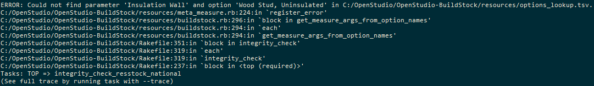

Options Lookup
##############

The ``options_lookup.tsv`` file, found in the ``resources`` folder, specifies mappings from sampled options into measure arguments. For example, if the distribution of cooling system types in ``HVAC System Cooling.tsv`` has ``Option=AC, SEER 13`` and ``Option=AC, SEER 15``, but you want to include a ``Option=AC, SEER 17`` option, you would add that option as a column in ``HVAC System Cooling.tsv`` and then create a corresponding row in ``options_lookup.tsv``. Updates to this file will allow you to avoid hitting the following types of integrity check errors:

 - :ref:`Could not find parameter and option <could-not-find-parameter-and-option>`
 - :ref:`Required argument not provided <required-argument-not-provided>`

Once you have updated your ``options_lookup.tsv`` file and all integrity checks are passing, you can move on to :doc:`updating_projects`.

.. _could-not-find-parameter-and-option:

Could not find parameter and option
===================================

You do not have a row in ``options_lookup.tsv`` for a particular option that is sampled.

An example of this error is given below:

.. image:: ../images/advanced_tutorial/could_not_find_parameter_and_option.png

.. _required-argument-not-provided:

Required argument not provided
==============================

For the particular option that is sampled, your corresponding measure is missing an argument value assignment.

An example of this error is given below:

