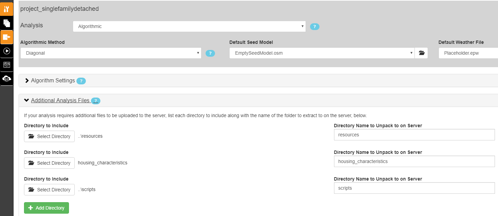
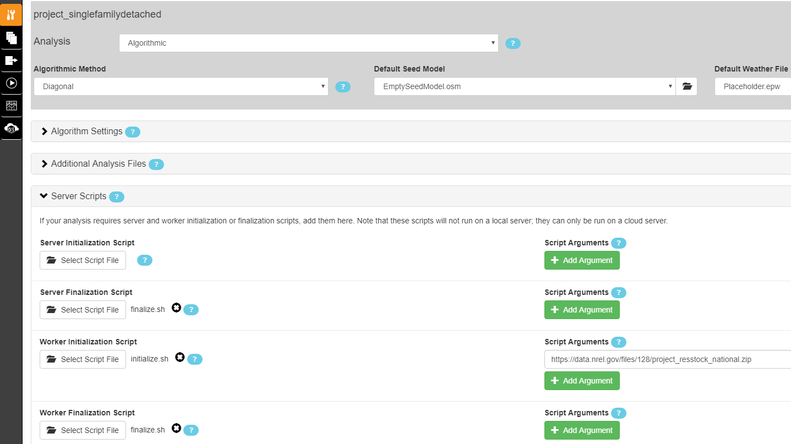
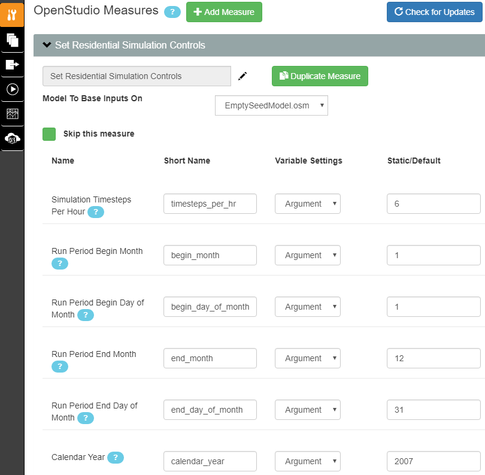
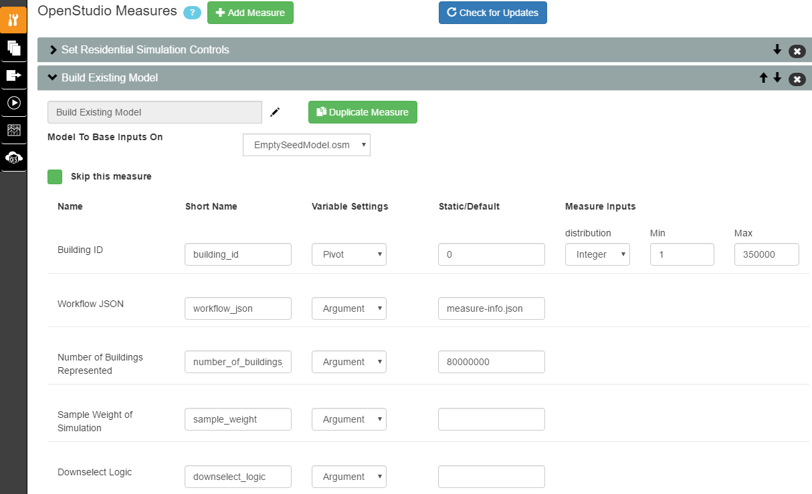
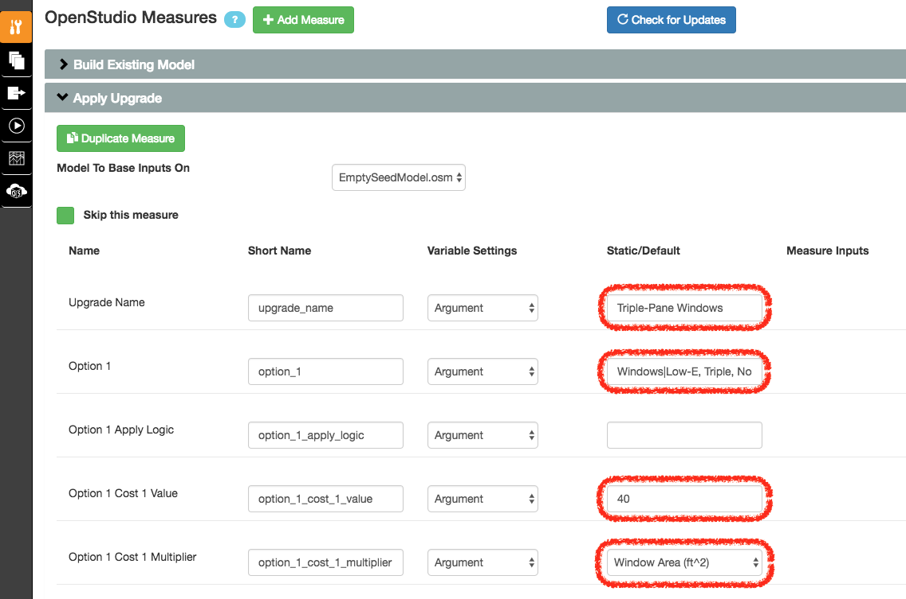
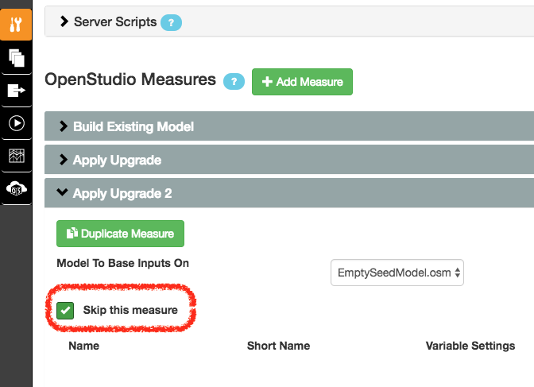
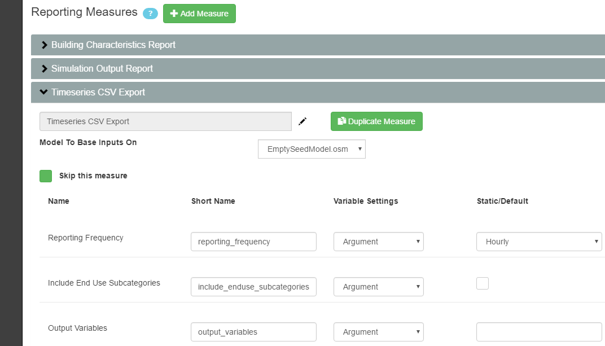

Set Up the Analysis Project
===========================

At the top level of the ResStock repository you just downloaded, you will see two analysis project folders:

 - project_singlefamilydetached
 - project_multifamily_beta
 - project_testing

Open PAT, select "Open Existing Project", and choose the ``project_singlefamilydetached`` directory. You may be asked if you want "mongod" to accept incoming connections. Select "Allow".

You will leave dropdown options for **Algorithmic Method**, **Default Seed Model**, and **Default Weather File** alone. Additionally, you will leave the settings in **Algorithm Settings**, **Additional Analysis Files**, and **Server Scripts** alone for most analyses.

.. note::
   
   The number of simulations per upgrade scenario is set in :ref:`build-existing-model`.

.. _additional-analysis-files:

Additional Analysis Files
-------------------------

Ensure that you have the following directories included to be uploaded to the server:

  
Server Scripts
------------------

Although you will leave these settings alone for most analyses, you do have the ability to change arguments for initialization and finalization scripts that are run on the remote server. In the case you do NOT want to run savings calculations for upgrades or include additional outputs, see :ref:`server-finalization-script`. In the case you want to change the set of epw weather files used for your project, see :ref:`worker-initialization-script`.

.. _server-initialization-script:

Server Initialization Script
^^^^^^^^^^^^^^^^^^^^^^^^^^^^

Ignore this for now.

.. _server-finalization-script:

Server Finalization Script
^^^^^^^^^^^^^^^^^^^^^^^^^^^^

After all datapoints have been simulated, this script calls a method for calculating the incremental cost and savings for upgrades. You can specify one or more reference scenarios for the cost and energy subtraction by entering ``"reference", "upgrade"`` (each enclosed in double quotation marks and separated by a comma) pair(s) (one argument for each pair) in the **Script Arguments** section (see image above). 

    ``upgrade`` indicates the upgrade scenario for calculating savings, and should exactly match the "Upgrade Name" string for one of the upgrade measures (see :ref:`tutorial-apply-upgrade`). 
    
    ``reference`` indicates the upgrade scenario to be used as the reference. Enter "BASE" to use the "as is" existing housing stock baseline as the reference (typical for envelope upgrades; see example above). Enter an "Upgrade Name" string for one of the upgrade measures to use an upgrade scenario as the reference savings and costs to be subtracted from the ``upgrade`` scenario to calculate incremental savings and costs (typical for equipment upgrades where there exists a minimum efficiency standard).
 
An example of this latter situation is when an old SEER 8 AC is replaced at wear out, and a user wishes to calculate the incremental savings and cost of upgrading it to SEER 18 compared to a SEER 14 AC (U.S. federal minimum efficiency in southern states).

Entering no pairs will default to calculating savings for all upgrades relative to the baseline building. Note that if you specify one scenario in this way, then you must explicitly define all scenario pairs, even cases where the reference is the baseline (using "BASE", "upgrade").

Savings are calculated as follows:

    .. image:: https://latex.codecogs.com/svg.latex?\Delta&space;Energy&space;=&space;Energy_{upgrade}&space;-&space;Energy_{reference} 
    \
    
    .. image:: https://latex.codecogs.com/svg.latex?\Delta&space;InitialCost&space;=&space;InitialCost_{upgrade}&space;-&space;InitialCost_{reference} 
    \
    
    etc.
    

By default this script also attaches additional outputs to the `results.csv <run_project.html#download-results>`_ file, including:

 - reportable domain (according to RECS 2009)
 - source energy (using conversion factors from BSR/ASHRAE Standard 105-2013)
 - eGRID subregion (see the entire `eGRID subregion map`_)
 - utility bill calculations (for now using simple average flat rates for each state)
 - simple payback
 - net present value
 - savings-to-investment ratio

A new csv file, ``results_savings.csv``, containing upgrade savings and additional outputs is produced. You can retrieve this file by downloading the **Seed Zip File** from the OpenStudio Cloud Management Console analysis page:

.. image:: ../images/tutorial/seed_zip_file.png

.. _eGRID subregion map: https://github.com/NREL/OpenStudio-BuildStock/wiki/eGRID-Subregion-Map

.. _worker-initialization-script:

Worker Initialization Script
^^^^^^^^^^^^^^^^^^^^^^^^^^^^
   
Something you might want to change is the set of weather files used with your project. To update the argument for the path to the zip file containing epw weather files, open the Server Scripts box on the Measures Selection tab.

Look for the **Script Arguments** box corresponding to the **Worker Initialization Script**. By default, this argument value points to the set of weather files corresponding to the specific project (i.e., set of ``housing_characteristics``) you are working with. For example, the ``project_singlefamilydetached`` project folder will by default use the set of weather files with national geographic coverage. In the illustration above, the argument value path points to a zipped file stored in the `epwweatherfiles bucket`_ on Amazon S3. You should have read-only access to objects in this bucket.

You can control what set of weather files are unpacked and accessible on the remote server by changing the argument value for this initialization script. If you wish to change this argument value to point to a different file in the S3 bucket, replace the path's basename with the path of the new file. If the desired file does not exist in the S3 bucket, you will need to zip up a set of weather files and upload it to some location of your choice (e.g., your own S3 bucket). Be sure to change the entire argument value path to point to this chosen file location.

To zip and upload new weather files:

 - First ensure that the weather files you will be using do not already exist in the S3 bucket. If they do, just point to the appropriate zip that already contains your desired weather files.
 - If they do not, on your local computer highlight all the new epw weather files and compress them into a single zip file. (Your zip should contain only files with either the ".epw" or ".ddy" extension.)
 - Upload your newly zipped file that contains the weather files to your new location.
 - Go back to your project and update the argument value to the path of the newly uploaded file.

.. _epwweatherfiles bucket: https://s3.console.aws.amazon.com/s3/buckets/epwweatherfiles/?region=us-east-1&tab=overview

.. note::

   Changing this path from the default will most likely require additional changes to your project. Any weather file names in your ``housing_characteristics`` folder's tsv files will need to be updated to reflect those in the S3 bucket file. Any simulation on the remote server that points to an invalid weather file path will fail.
 
.. _worker-finalization-script:
 
Worker Finalization Script
^^^^^^^^^^^^^^^^^^^^^^^^^^^^

Ignore this for now.
 
OpenStudio Measures
-------------------

Continuing on the Measures Selection tab, scroll down to the **OpenStudio Measures** section. This section is where you will define the parameters of the analysis including the baseline case and any upgrade scenarios.

.. _simulation-controls:

Simulation Controls
^^^^^^^^^^^^^^^^^^^

Using this measure you can set the simulation timesteps per hour, the run period begin month/day and end month/day, and the calendar year (for start day of week). By default the simulations use a 10-min timestep (i.e., the number of timesteps per hour is 6), start on January 1, end on December 31, and run with a calendar year of 2007 (start day of week is Monday). If you are running simulations using AMY weather files, the value entered for calendar year will not be used; it will be overridden by the actual year found in the AMY weather file.

.. _build-existing-model:

Build Existing Model
^^^^^^^^^^^^^^^^^^^^

This measure creates the baseline scenario. It incrementally applies OpenStudio measures (located in the ``resources`` directory, which should be at the same level as your project directory) to create residential building models. Set the following inputs:

**Building ID -- Max**
  This sets the number of simulations to run in the baseline and each upgrade case. For this tutorial I am going to set this to 1000. Most analyses will require more, but we're going to keep the total number small for simulation time and cost.

**Number of Buildings Represented**
  The total number of buildings this sampling is meant to represent. This sets the weighting factors. For the U.S. single-family detached housing stock, this is 80 million homes. 
  
**Sample Weight of Simulation**
  The number of buildings each simulation represents. Total number of buildings / Number of simulations. This argument is optional (it is only needed for running simulations on NREL HPC), so you can leave it blank.
  
**Downselect Logic**
  Logic that specifies the subset of the building stock to be considered in the analysis. Specify one or more ``parameter|option`` as found in the ``resources/options_lookup.tsv``. (This uses the same syntax as the :ref:`tutorial-apply-upgrade` measure.) For example, if you wanted to only simulate California homes you could enter ``Location Region|CR11`` in this field (CR refers to "Custom Region", which is based on RECS 2009 reportable domains aggregated into groups with similar climates; see the entire `custom region map`_). Datapoints that are excluded from the downselect logic will result in "completed invalid workflow".

**Measures to Ignore**
  **INTENDED FOR ADVANCED USERS/WORKFLOW DEVELOPERS ONLY.** Measures to exclude from the OpenStudio Workflow specified by listing one or more measure directories separated by '|'. Core ResStock measures cannot be ignored (the Build Existing Model measure will fail).

.. _custom region map: https://github.com/NREL/OpenStudio-BuildStock/wiki/Custom-Region-(CR)-Map

.. note::
   
   **Manual Sampling**: To run the sampling script yourself, from the command line execute, e.g. ``ruby resources/run_sampling.rb -p project_singlefamilydetached -n 10000 -o buildstock.csv``, and a file ``buildstock.csv`` will be created in the ``resources`` directory. 
   
   If a custom ``buildstock.csv`` file is located in a project's ``housing_characteristics`` directory when you run the PAT project, it will automatically be used to generate simulations. If it’s not found, the ``run_sampling.rb`` script will be run automatically on OpenStudio-Server to create one. You’ll also want to make sure that the number of buildings in the sampling csv file matches the max value for the Building ID argument in the Build Existing Model, as that tells OpenStudio how many datapoints to run. (For each datapoint, the measure will then look up its building description from the sampling csv.) 
   
   You can use this manual sampling process to downselect which simulations you want to run. For example, you can use the command above to generate a ``buildstock.csv`` for the entire U.S. and then open up this file in Excel and delete all of the rows that you don't want to simulate (e.g., all rows that aren't in New York). Keep in mind that if you do this, you will need to re-enumerate the "Building" column as "1" through the number of rows.
  
.. _tutorial-apply-upgrade:

Apply Upgrade
^^^^^^^^^^^^^

Each "Apply Upgrade" measure defines an upgrade scenario. An upgrade scenario is a collection of options exercised with some logic and costs applied. In the simplest case, we apply the new option to all houses. The available upgrade options are in ``resources/options_lookup.tsv`` in your git repository. 

For this example, we will upgrade all windows by applying the ``Windows|Low-E, Triple, Non-metal, Air, L-Gain`` option to all houses across the country. We do this by entering that in the **Option 1** box on the Apply Upgrade measure. Also, we'll give the upgrade scenario a name: "Triple-Pane Windows" and a cost of $40/ft\ :superscript:`2` of window area by entering the number in **Option 1 Cost Value** and selecting "Window Area (ft^2)" for **Option 1 Cost Multiplier**. 

Like the **downselect logic**, excluded datapoints (i.e., datapoints for which the upgrade does not apply) will result in "completed invalid workflow". For a full explanation of how to set up the options and logic surrounding them, see :doc:`../upgrade_scenario_config`.

Measures can be skipped in an analysis without losing their configuration. For this tutorial we will skip the second measure of applying wall insulation. To do so, select the **Apply Upgrade 2** measure, open it, and check the box **Skip this measure**.

Reporting Measures
------------------

Scroll down to the bottom on the Measures Selection tab, and you will see the **Reporting Measures** section. This section is where you can request timeseries data and utility bills for the analysis. In general, reporting measures process data after the simulation has finished and produced results. As a note, make sure that the **Timeseries CSV Export** and **Utility Bill Calculations** measures are placed before the **Server Directory Cleanup** measure.

.. _building-characteristics-report:

Building Charactertistics Report
^^^^^^^^^^^^^^^^^^^^^^^^^^^^^^^^

Leave this alone.

.. _simulation-output-report:

Simulation Output Report
^^^^^^^^^^^^^^^^^^^^^^^^

Leave this alone.

.. _timeseries-csv-export:

Timeseries CSV Export
^^^^^^^^^^^^^^^^^^^^^

If you do not need the timeseries data for your simulations, you can skip this measure to save disk space. Otherwise, one csv file per datapoint will be written containing end use timeseries data for their model. After `downloading all datapoints <run_project.html#download>`_ to your project's localResults folder, each datapoint's ``enduse_timeseries.csv`` file will be contained in a zipped ``data_point.zip`` file along with all other simulation input and output files.
  

End uses include:

  * total site energy [MBtu]
  * net site energy [MBtu]
  * total site [electric/gas/oil/propane] [kWh/therm/MBtu/MBtu]
  * net site [electric] [kWh]
  * heating [electric/gas/oil/propane] [kWh/therm/MBtu/MBtu]
  * cooling [kWh]
  * central system heating [electric/gas/oil/propane] [kWh/therm/MBtu/MBtu]
  * central system cooling [electric] [kWh]
  * interior lighting [kWh]
  * exterior lighting [kWh]
  * interior equipment [electric/gas/oil/propane] [kWh/therm/MBtu/MBtu]
  * fans heating [kWh]
  * fans cooling [kWh]
  * pumps heating [kWh]
  * pumps cooling [kWh]
  * central system pumps heating [electric] [kWh]
  * central system pumps cooling [electric] [kWh]
  * water heating [electric/gas/oil/propane] [kWh/therm/MBtu/MBtu]
  * pv [kWh]

**Reporting Frequency**
  The timeseries data will be reported at hourly intervals unless otherwise specified. Alternative reporting frequencies include:

  * Timestep
  * Daily
  * Monthly
  * Runperiod
  
  Setting the reporting frequency to 'Timestep' will give you interval output equal to the zone timestep set by the :ref:`simulation-controls` measure. Thus, this measure will produce 10-min interval output when you select 'Timestep' and leave the :ref:`simulation-controls` measure at its default settings.

**Include End Use Subcategories**
  Select this to include end use subcategories. The default is to not include end use subcategories. End use subcategories include:
  
  * refrigerator [kWh]
  * clothes washer [kWh]
  * clothes dryer [electric/gas/propane] [kWh/therm/MBtu]
  * cooking range [electric/gas/propane] [kWh/therm/MBtu]
  * dishwasher [kWh]
  * plug loads [kWh]
  * house fan [kWh]
  * range fan [kWh]
  * bath fan [kWh]
  * ceiling fan [kWh]
  * extra refrigerator [kWh]
  * freezer [kWh]
  * pool heater [electric/gas] [kWh/therm]
  * pool pump [kWh]
  * hot tub heater [electric/gas] [kWh/therm]
  * hot tub pump [kWh]
  * gas grill [therm]
  * gas lighting [therm]
  * gas fireplace [therm]
  * well pump [kWh]
  * garage lighting [kWh]
  * exterior holiday lighting [kWh]
  
**Output Variables**
  If you choose to report any output variables (e.g., "Zone Air Temperature" or "Site Outdoor Air Humidity Ratio"), enter a comma-separated list of output variable names. A list of available output variables can be viewed in EnergyPlus's ``.rdd`` file.

.. _utility-bill-calculations:

Utility Bill Calculations
^^^^^^^^^^^^^^^^^^^^^^^^^

This measure is currently under construction. Do not include it in your PAT analysis.
