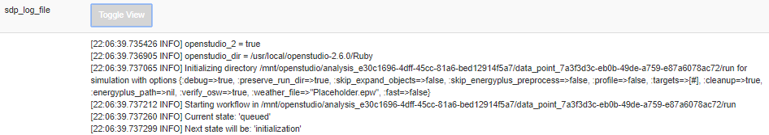

Debugging
#########

Simulations may not always run successfully (even if the integrity checks pass). Reasons may include bad weather files, invalid measure arguments, untested measure combinations, etc. The Openstudio-server GUI will indicate unsuccessful datapoints by showing "datapoint failure" under the "Status Message" column when you click on the homepage's "View Analysis" button.

To investigate the issues behind failed datapoints, click "View" for any datapoint failure rows. Scroll down and select the "sdp_log_file" button:

Search the log's text for the error. Diagnose the problem and fix it. Depending on where the issue originates, you may need to address problems upstream in the OpenStudio-BEopt's ``measures`` directory. If that's the case, you'll probably want to start this entire development process over beginning with :doc:`rake_tasks`. Bummer.