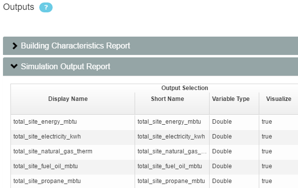

Updating Projects
#################

Once you have successfully run the rake tests described in :doc:`rake_tasks`, you are ready to update your PAT project(s) and run ResStock analyses.

Because copying residential files from the `OpenStudio-BEopt <https://github.com/NREL/OpenStudio-BEopt>`_ may have resulted in discrepancies between top-level measures and project-level measures, you will need to:

 - :ref:`Check for Updates <check-for-updates>`
 - :ref:`Refresh Outputs <refresh-outputs>`

Once these two items have been completed, you are ready to start an AWS server and run your project. (See :doc:`../tutorial/run_project` for more information.) Datapoint failures may be dealt with using instructions found in :doc:`debugging`.

.. _check-for-updates:

Check for Updates
=================

You want project-level measures to be up-to-date with top-level measures (measures found in ``<project_name>/measures`` vs. those found in the top-level ``measures`` folder). To ensure this, click the blue "Check for Updates" button on the Measures Selection tab:

.. image:: ../images/advanced_tutorial/check_for_updates_button.png

Then select any icons that appear in the Update column, as in the following example:

.. image:: ../images/advanced_tutorial/check_for_updates_dialogue.png

Click "Update Project" after each icon click. Click "OK" when done.

.. _refresh-outputs:

Refresh Outputs
===============

If you made changes to either the `Building Characteristics Report <https://github.com/NREL/OpenStudio-BuildStock/tree/master/measures/BuildingCharacteristicsReport>`_ or `Simulation Output Report <https://github.com/NREL/OpenStudio-BuildStock/tree/master/measures/SimulationOutputReport>`_ measures, you will need to make updates on the Outputs tab. To do this remove the measure(s) from the project and re-add them, while making sure they occupy the original position in the workflow order. Then navigate to the Outputs tab, select the measure(s) you've re-added, and then choose the outputs to include. Click "OK" when done. These outputs will be included in the summary results csv file.

