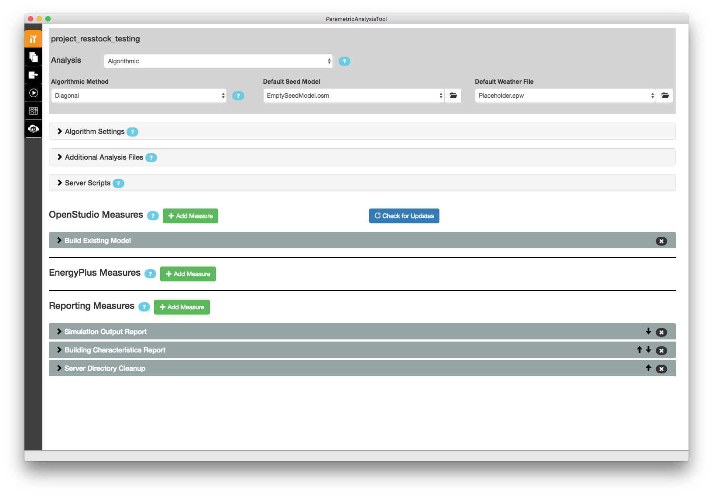
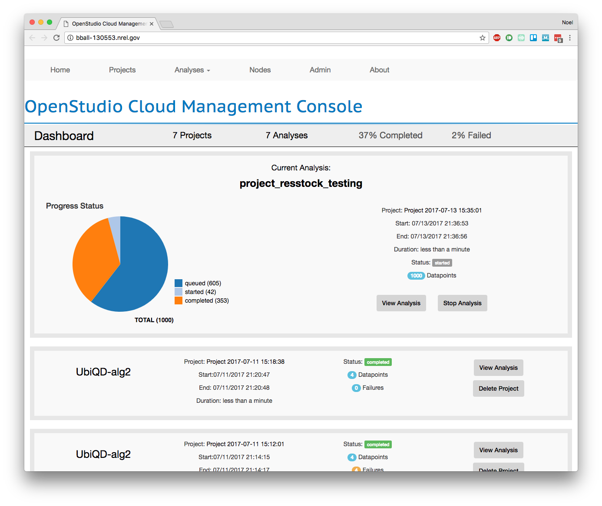

Getting Started
###############

Install OpenStudio and PAT
==========================

Download OpenStudio version 2.2 or greater from the `OpenStudio website <https://www.openstudio.net/downloads>`_.
Do a default install including Parametric Analysis Tool (PAT). 

Run an analysis on the cloud
============================

Open PAT and open one of the analysis project folders:

 - project_resstock_dsgrid
 - project_resstock_national
 - project_resstock_pnw
 - project_resstock_testing

You will see that several measures have been placed into your workflow. 

Switch to the Run tab. 

.. image:: images/pat_run_screen.png

Add your AWS credentials and click the button to start the cluster. 
When the cluster is ready, click run workflow. 
While it is running you can get more information by opening the OpenStudio Server console by clicking "View Server".

