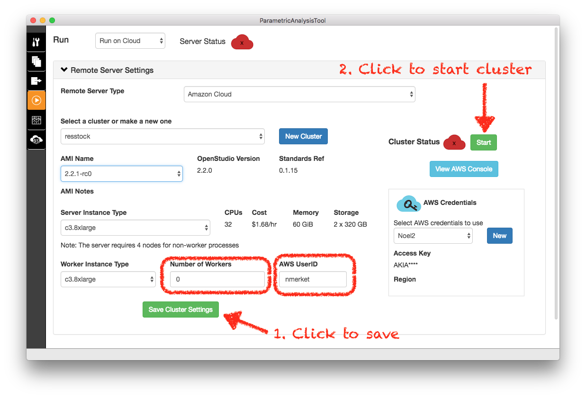
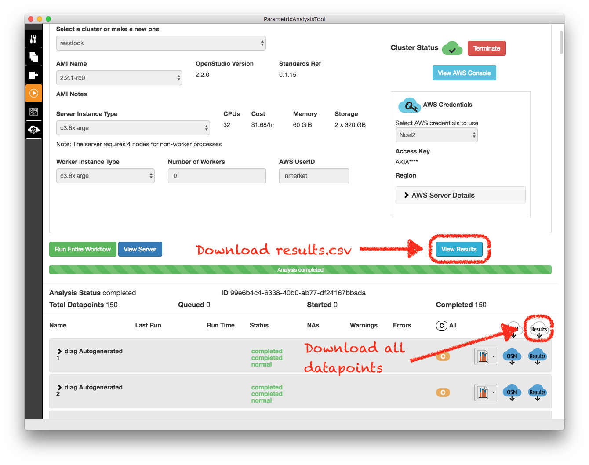
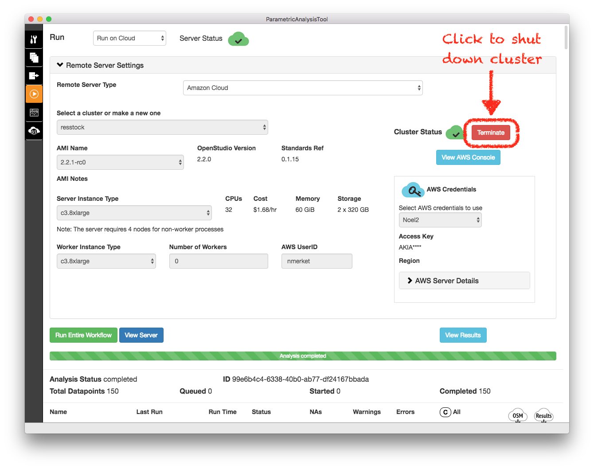

Run the Project on Amazon Web Services
======================================

Switch to the Run tab. The selection will initially be on "Run Locally" with an error message stating that you cannot run algorithmic analyses locally. Select "Run on Cloud" and change **Remote Server Type** to "Amazon Cloud" to set up your run environment.

AWS Credentials
---------------

First, you will need some AWS credentials to allow PAT to start compute instances in the cloud. Go to https://aws.amazon.com and click the button to create an AWS Account and `add a payment method`_ for billing. You will also need to `create access keys`_ for your AWS account. When you have your AWS Access and Secret keys, click on the **New** button in the **AWS Credentials** box in PAT and enter your keys. Also, make sure to enter *your* **AWS UserID** on the main run screen. 

.. _add a payment method: http://docs.aws.amazon.com/awsaccountbilling/latest/aboutv2/edit-payment-method.html
.. _create access keys: http://docs.aws.amazon.com/general/latest/gr/managing-aws-access-keys.html

Cluster Settings and Starting the Cluster
-----------------------------------------

Ensure that your project's AMI selection matches "2.7.0" (this should also be the version of OpenStudio/PAT that you are using). We will leave most of the rest of the settings at their defaults, but because we're doing a small analysis here, we're going to set the number of worker nodes to zero. For guidance on cluster settings for your analysis including instance selection and worker nodes see :doc:`../aws_cluster_config`.

Click **Save Cluster Settings** and the **Start** button next to the **Cluster Status** label. Wait for the cluster to start. The cloud icon will turn green when it is ready. It can take up to 10 minutes.

Run Analysis and Monitor Status
-------------------------------

When the cluster is running, start the analysis by clicking the **Run Entire Workflow** button below the server settings. You will see a status bar and messages. Once it says "Analysis Started" you can click the **View Server** button to see the status of your analysis on the OpenStudio Server.

.. image:: ../images/tutorial/os_server_status.png

Leave the PAT application open while your analysis runs. It could take a while.

Download results
----------------

Eventually PAT will show in the status bar "Analysis completed". And the OpenStudio Server console will show the same.  

.. image:: ../images/tutorial/os_server_complete.png

Clicking the **View Results** button in PAT will open the results.csv file for your analysis. It contains a row for every sampled building including all options selected for that building and annual energy simulation results. Often this is the only results you will need. That file is saved in your project in ``localResults/results.csv``. 

Sometime you will need *all* the simulation results including timeseries results if you requested them. Clicking the **Results (cloud, down arrow)** button will pull down all of the simulation results from the server and save them to your project. Each result data point will be stored in a ``localResults/[GUID]`` folder in your project. 

.. warning::
   
   Downloading all simulation results can be a lot of data. Make sure you're on a good connection and have enough room on your local machine. Be prepared for the download to take a while. 

.. _download:
   
.. note::

   From the PAT interface, only 150 datapoints are downloading right now. For downloading all datapoints, run the ``scripts/download_datapoints.rb`` script. The script requires that the ``localResults/results.csv`` be downloaded first. Supply all required arguments to the script, including project directory, server DNS, and analysis ID. A usage example is given as follows:
   ``$ ruby scripts/download_datapoints.rb -p project_resstock_national``
   ``-s http://ec2-107-23-165-146.compute-1.amazonaws.com -a 706c3b4a-9685-4924-bb13-c6bec77aa397``

Shutting Down the OpenStudio Server Cluster
-------------------------------------------

Once you have retrieved all the data you need from your analysis, it is a good idea to shut down the OpenStudio Server Cluster to stop incurring AWS costs. The most straightforward way to do that is to click the **Terminate** button on the Run tab of PAT.

The PAT interface will indicate that the cluster has been shut down after a moment. Just to be sure, it's best to open the AWS cloud console either by clicking the **View AWS Console** button in PAT or visiting https://console.aws.amazon.com. Select "Services" > "EC2". Select "N. Virginia" in the region menu (upper right). You should see a terminated instance of OpenStudio-Server and potentially some workers if you chose to use workers above. 

.. image:: ../images/tutorial/aws_console_terminated.png

If it has been long enough the list will be empty. If for some reason the instances are still running, you can terminate them by right-clicking and selecting "Terminate". If PAT has been closed or crashed, this is how you will have to shut down the cluster. 
