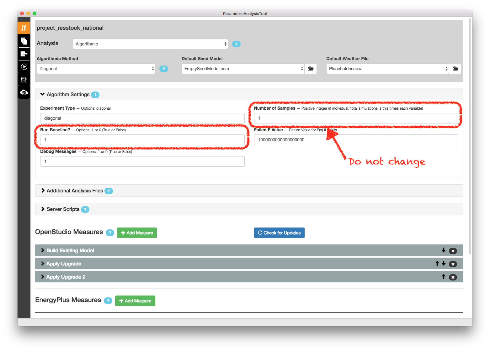

Set Up the Analysis Project
===========================

Open PAT and open one of the analysis project folders:

 - project_resstock_dsgrid
 - project_resstock_national
 - project_resstock_pnw
 - project_resstock_testing

For this example we'll use the project_resstock_national analysis. Select "Open Existing Project" and choose the project_resstock_national directory in the repository you just downloaded. You may be asked if you want "mongod" to accept incoming connections. Select "Allow".

Algorithm Settings
------------------

Open the Algorithm Settings box on the measure selection tab and modify the settings as described for your use case.

**Run Baseline**
  Enter ``1`` here to run the existing stock and the upgrades. Enter ``0`` to run only upgrades.

**Number of Samples**
  *Do not change this value.* Leave it as ``1``. The number of simulations per upgrade scenario is set in :ref:`build-existing-model`.
  
.. todo::
    
   Describe how to pass user defined weather files by changing the script argument to the **Worker Initialization Script** under **Server Settings**.

OpenStudio Measures
-------------------

Continuing on the measure selection tab, scroll down to the **OpenStudio Measures** section. This section is where you will define the parameters of the analysis including the baseline case and any upgrade scenarios.

.. _build-existing-model:

Build Existing Model
^^^^^^^^^^^^^^^^^^^^

This measure creates the baseline scenario. Set the following inputs:

.. image:: ../images/tutorial/build_existing_model.png

**Building ID -- Max**
  This sets the number of simulations to run in the baseline and each upgrade case. For this tutorial I am going to set this to 1000. Most analyses will require more, but we're going to keep the total number small for simulation time and cost.

**Number of Buildings Represented**
  The total number of buildings this sampling is meant to represent. This sets the weighting factors. For the U.S. single-family detached housing stock, this is 80 million homes. 

.. _tutorial-apply-upgrade:

Apply Upgrade
^^^^^^^^^^^^^

Each "Apply Upgrade" measure defines an upgrade scenario. An upgrade scenario is a collection of options exercised with some logic and costs applied. In the simplest case, we apply the new option to all houses. The available upgrade options are in ``resources/options_lookup.tsv`` in your git repository. 

For this example, we will upgrade all windows by applying the ``Windows|Low-E, Triple, Non-metal, Air, L-Gain`` option to all houses across the country. We do this by entering that in the **Option 1** box on the Apply Upgrade measure. Also, we'll give the upgrade scenario a name: "Triple-Pane Windows" and a cost of $40/ft\ :superscript:`2` of window area by entering the number in **Option 1 Cost Value** and selecting "Window Area (ft^2)" for **Option 1 Cost Multiplier**. 

.. image:: ../images/tutorial/apply_upgrade_windows.png

For a full explanation of how to set up the options and logic surrounding them, see :doc:`../upgrade_scenario_config`.

Measures can be skipped in an analysis without losing their configuration. For this tutorial we will skip the second measure of applying wall insulation. To do so, select the **Apply Upgrade 2** measure, open it, and check the box **Skip this measure**.

.. image:: ../images/tutorial/skip_measure.png

Reporting Measures
------------------

Leave the reporting measures be for the most part. If you do not need the timeseries csv files for your simulations, you can skip the **Timeseries CSV Export** measure to save disk space.
