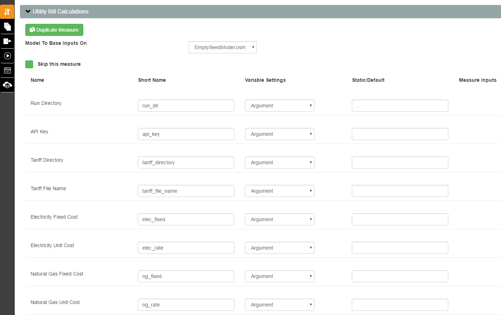

Set Up the Analysis Project
===========================

Open PAT and open one of the analysis project folders:

 - project_resstock_dsgrid
 - project_resstock_national
 - project_resstock_pnw
 - project_resstock_testing

For this example we'll use the project_resstock_national analysis. Select "Open Existing Project" and choose the project_resstock_national directory in the repository you just downloaded. You may be asked if you want "mongod" to accept incoming connections. Select "Allow".

You will leave the settings in **Algorithm Settings**, **Additional Analysis Files**, and **Server Scripts** alone for most analyses. 

.. note::
   
   The **Algorithm Settings > Number of Samples** input is not where the number of simulations is set.
   The number of simulations per upgrade scenario is set in :ref:`build-existing-model`.
  
Server Scripts
------------------

Although you will leave these settings alone for most analyses, you do have the ability to change arguments for initialization and finalization scripts that are run on the remote server. In the case you want to change the set of epw weather files used for your project, see :ref:`worker-initialization-script`.

Server Initialization Script
^^^^^^^^^^^^^^^^^^^^^^^^^^^^

Ignore this for now.

Server Finalization Script
^^^^^^^^^^^^^^^^^^^^^^^^^^^^

Ignore this for now.

.. _worker-initialization-script:

Worker Initialization Script
^^^^^^^^^^^^^^^^^^^^^^^^^^^^
   
Something you might want to change is the set of weather files used with your project. To update the argument for the path to the zip file containing epw weather files, open the Server Scripts box on the measure selection tab.

.. image:: ../images/tutorial/server_scripts_open.png

Look for the **Script Arguments** box corresponding to the **Worker Initialization Script**. By default, this argument value points to the set of weather files corresponding to the specific project (i.e., set of ``housing_characteristics``) you are working with. For example, the ``project_resstock_national`` project folder will by default use the set of weather files with national geographic coverage. The path that is set as the argument value points to a zipped file stored in the (publicly accessible) `epwweatherfiles bucket`_ on Amazon S3.
    
By changing the argument value for this initialization script, you can control what set of weather files are unpacked and accessible on the remote server. If you wish to change this argument value to point to a different file in the S3 bucket, replace the path's basename with the path of the new file. If the desired file does not already exist in the S3 bucket, you will need to zip up a set of weather files and upload it to the S3 bucket.

To zip and upload new weather files to the S3 bucket:
 - First ensure that the weather files you will be using do not already exist in the S3 bucket. If they do, just point to the appropriate zip that already contains your desired weather files.
 - If they do not, on your local computer highlight all the new epw weather files and zip them. Name the file something that pertains to the project you are working with.
 - At the `epwweatherfiles bucket`_ dashboard, click **Upload** and then **Add files**, and select your newly zipped file that contains the weather files.
 - Click **Next** and then under **Manage public permission** select "Grant public read access to this object(s)".
 - Click **Next**, then **Next**, and then **Upload**, and wait for the zip file to upload to the S3 bucket.
 - Go back to your project and update the argument value to the path of the newly uploaded item in the S3 bucket.

.. _epwweatherfiles bucket: https://s3.console.aws.amazon.com/s3/buckets/epwweatherfiles/?region=us-east-1&tab=overview

.. note::

   Changing this path from the default will most likely require additional changes to your project. Any weather file names in your ``housing_characteristics`` folder's tsv files will need to be updated to reflect those in the S3 bucket file. Any simulation on the remote server that points to an invalid weather file path will fail.
 
Worker Finalization Script
^^^^^^^^^^^^^^^^^^^^^^^^^^^^

Ignore this for now.
 
OpenStudio Measures
-------------------

Continuing on the measure selection tab, scroll down to the **OpenStudio Measures** section. This section is where you will define the parameters of the analysis including the baseline case and any upgrade scenarios.

.. _build-existing-model:

Build Existing Model
^^^^^^^^^^^^^^^^^^^^

This measure creates the baseline scenario. Set the following inputs:

.. image:: ../images/tutorial/build_existing_model.png

**Building ID -- Max**
  This sets the number of simulations to run in the baseline and each upgrade case. For this tutorial I am going to set this to 1000. Most analyses will require more, but we're going to keep the total number small for simulation time and cost.

**Number of Buildings Represented**
  The total number of buildings this sampling is meant to represent. This sets the weighting factors. For the U.S. single-family detached housing stock, this is 80 million homes. 

.. _tutorial-apply-upgrade:

Apply Upgrade
^^^^^^^^^^^^^

Each "Apply Upgrade" measure defines an upgrade scenario. An upgrade scenario is a collection of options exercised with some logic and costs applied. In the simplest case, we apply the new option to all houses. The available upgrade options are in ``resources/options_lookup.tsv`` in your git repository. 

For this example, we will upgrade all windows by applying the ``Windows|Low-E, Triple, Non-metal, Air, L-Gain`` option to all houses across the country. We do this by entering that in the **Option 1** box on the Apply Upgrade measure. Also, we'll give the upgrade scenario a name: "Triple-Pane Windows" and a cost of $40/ft\ :superscript:`2` of window area by entering the number in **Option 1 Cost Value** and selecting "Window Area (ft^2)" for **Option 1 Cost Multiplier**. 

.. image:: ../images/tutorial/apply_upgrade_windows.png

For a full explanation of how to set up the options and logic surrounding them, see :doc:`../upgrade_scenario_config`.

Measures can be skipped in an analysis without losing their configuration. For this tutorial we will skip the second measure of applying wall insulation. To do so, select the **Apply Upgrade 2** measure, open it, and check the box **Skip this measure**.

.. image:: ../images/tutorial/skip_measure.png

Reporting Measures
------------------

Scroll down to the bottom on the measures selection tab, and you will see the **Reporting Measures** section. This section is where you can request timeseries data and utility bills for the analysis. In general, reporting measures process data after the simulation has finished and produced results. As a note, make sure that the **Timeseries CSV Export** and **Utility Bill Calculations** measures are placed before the **Server Directory Cleanup** measure.

.. _timeseries-csv-export:

Timeseries CSV Export
^^^^^^^^^^^^^^^^^^^^^

If you do not need the timeseries data for your simulations, you can skip this measure to save disk space. Otherwise, one csv file per datapoint will be written containing timeseries enduse data relevant to their model. After `downloading all datapoints <run_project.html#download>`_ to your project's localResults folder, each datapoint's ``enduse_timeseries.csv`` file will be contained in a zipped ``data_point.zip`` along with all other simulation input and output files.
  
.. image:: ../images/tutorial/timeseries_csv_export.png

**Reporting Frequency**
  The timeseries data will be reported at hourly intervals unless otherwise specified. Other options include Detailed, Timestep, Daily, Monthly, and RunPeriod.

**Include Output Variables**
  For now, ignore this argument.

.. _utility-bill-calculations:

Utility Bill Calculations
^^^^^^^^^^^^^^^^^^^^^^^^^

This measure calculates sets of utility bills for each datapoint included in the analysis. Utility bills can be calculated based on rates (stored in json format) from OpenEI's `Utility Rate Database`_ (URDB), state-average rates, or user-specified rates. When calculating bills based on rates from the URDB, this measure will first find the tariff whose EIAID and Label are nearest the latitude/longitude of the datapoint's weather file. Simply leaving all arguments set to their default values will cause utility bills to be calculated based on rates from the URDB.

.. _Utility Rate Database: https://openei.org/wiki/Utility_Rate_Database

**Run Directory**
  *Do not change this value.* Leave it as ``..``.

**API Key**
  Supply a URDB api key if you will be downloading rate structures that are not already contained in the **Tariff Directory**. If you do not already have an api key, you can `sign up for an api key`_.
  
.. _sign up for an api key: https://openei.org/services/api/signup

**Tariff Directory**
  The repository comes packaged with a set of residential tariff files. Each file in the set represents the residential rate structure for a given ``<EIAID>_<Label>`` pair. To draw from this set of rates, set this value to `../../lib/resources/tariffs`.

**Tariff File Name**
  To calculate utility bills based on a user-supplied rate structure, specify the path to your json file here.

**Electricity Fixed Cost**
  User-specified annual fixed cost of electricity.

**Electricity Unit Cost**
  User-specified price per kilowatt-hour for electricity.

**Natural Gas Fixed Cost**
  User-specified annual fixed cost of natural gas.

**Natural Gas Unit Cost**
  User-specified price per therm for natural gas.

**Fuel Oil Unit Cost**
  User-specified price per gallon for fuel oil.

**Propane Unit Cost**
  User-specified price per gallon for propane.

**Average Residential Rates**
  By default, utility bills will be calculated based on rate structures found in **Tariff Directory**. Choose this option to calculate utility bills based on state-average residential rates instead.

Now switch to the Outputs tab. Select "Utility Bill Calculations" from the dropdown and click on **Add Measure**. Click on **Select Outputs**, then on **Select All**, then on **+ Add Output**, and finally on **OK**. This will ensure that the calculated utility bills are registered to the results.csv file.