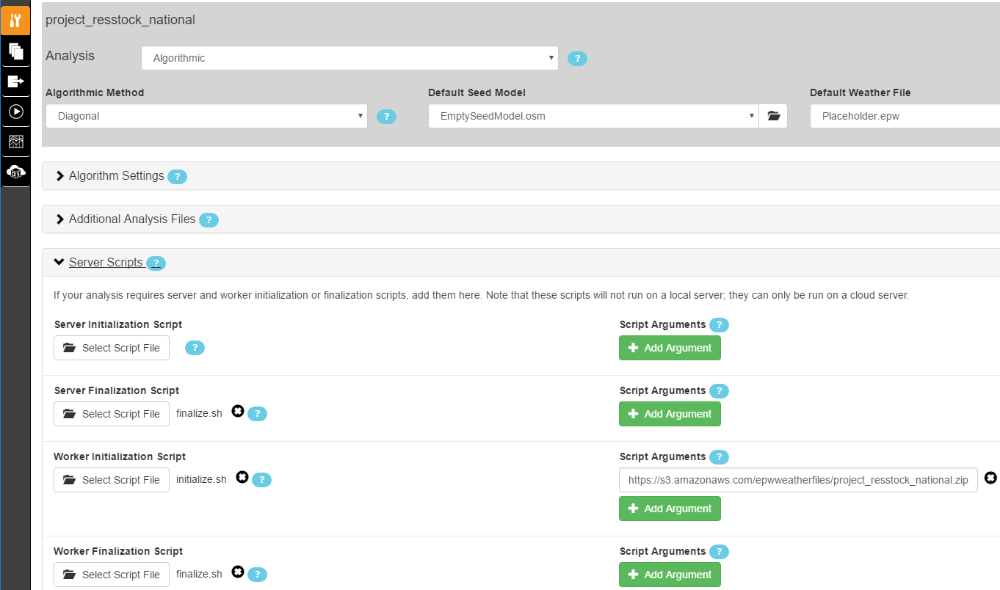
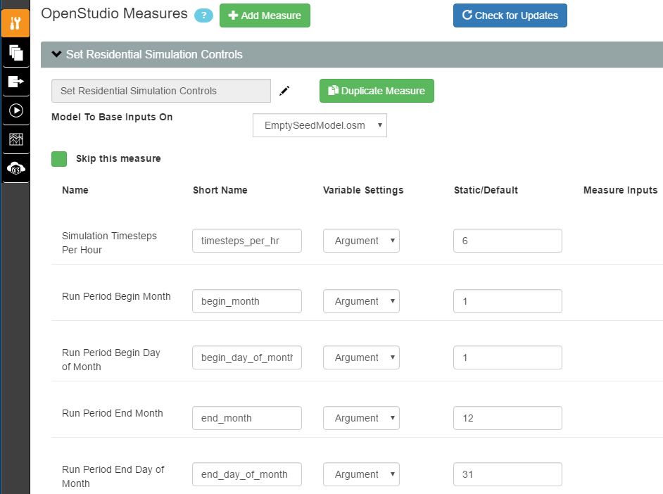
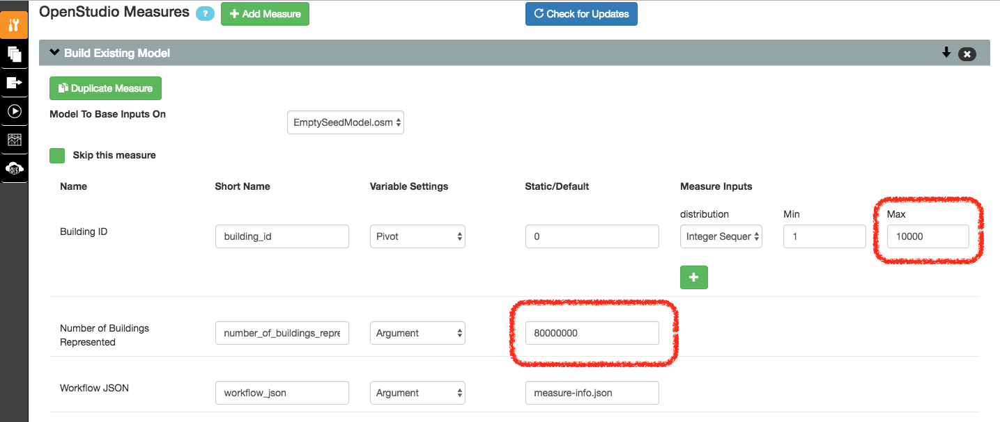
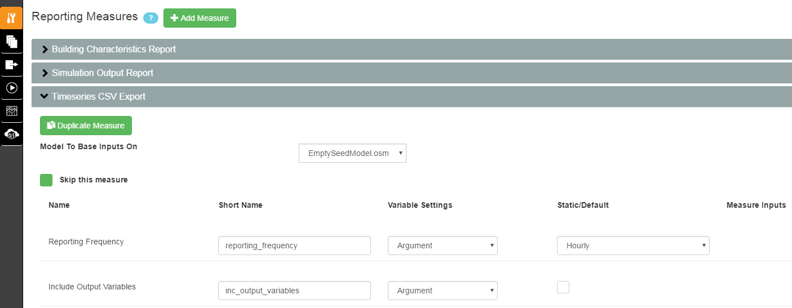

Set Up the Analysis Project
===========================

Open PAT and open one of the analysis project folders:

 - project_resstock_national
 - project_resstock_pnw

For this example we'll use the project_resstock_national analysis. Select "Open Existing Project" and choose the project_resstock_national directory in the repository you just downloaded. You may be asked if you want "mongod" to accept incoming connections. Select "Allow".

You will leave dropdown options for **Algorithmic Method**, **Default Seed Model**, and **Default Weather File** alone. Additionally, you will leave the settings in **Algorithm Settings**, **Additional Analysis Files**, and **Server Scripts** alone for most analyses. 

.. note::
   
   The number of simulations per upgrade scenario is set in :ref:`build-existing-model`.
  
Server Scripts
------------------

Although you will leave these settings alone for most analyses, you do have the ability to change arguments for initialization and finalization scripts that are run on the remote server. In the case you want to change the set of epw weather files used for your project, see :ref:`worker-initialization-script`.

.. _server-initialization-script:

Server Initialization Script
^^^^^^^^^^^^^^^^^^^^^^^^^^^^

Ignore this for now.

.. _server-finalization-script:

Server Finalization Script
^^^^^^^^^^^^^^^^^^^^^^^^^^^^

Ignore this for now.

.. _worker-initialization-script:

Worker Initialization Script
^^^^^^^^^^^^^^^^^^^^^^^^^^^^
   
Something you might want to change is the set of weather files used with your project. To update the argument for the path to the zip file containing epw weather files, open the Server Scripts box on the Measures Selection tab.

Look for the **Script Arguments** box corresponding to the **Worker Initialization Script**. By default, this argument value points to the set of weather files corresponding to the specific project (i.e., set of ``housing_characteristics``) you are working with. For example, the ``project_resstock_national`` project folder will by default use the set of weather files with national geographic coverage. In the illustration above, the argument value path points to a zipped file stored in the `epwweatherfiles bucket`_ on Amazon S3. You should have read-only access to objects in this bucket.

You can control what set of weather files are unpacked and accessible on the remote server by changing the argument value for this initialization script. If you wish to change this argument value to point to a different file in the S3 bucket, replace the path's basename with the path of the new file. If the desired file does not exist in the S3 bucket, you will need to zip up a set of weather files and upload it to some location of your choice (e.g., your own S3 bucket). Be sure to change the entire argument value path to point to this chosen file location.

To zip and upload new weather files:
 - First ensure that the weather files you will be using do not already exist in the S3 bucket. If they do, just point to the appropriate zip that already contains your desired weather files.
 - If they do not, on your local computer highlight all the new epw weather files and compress them into a single zip file. (Your zip should contain only files with either the ".epw" or ".ddy" extension.)
 - Upload your newly zipped file that contains the weather files to your new location.
 - Go back to your project and update the argument value to the path of the newly uploaded file.

.. _epwweatherfiles bucket: https://s3.console.aws.amazon.com/s3/buckets/epwweatherfiles/?region=us-east-1&tab=overview

.. note::

   Changing this path from the default will most likely require additional changes to your project. Any weather file names in your ``housing_characteristics`` folder's tsv files will need to be updated to reflect those in the S3 bucket file. Any simulation on the remote server that points to an invalid weather file path will fail.
 
.. _worker-finalization-script:
 
Worker Finalization Script
^^^^^^^^^^^^^^^^^^^^^^^^^^^^

Ignore this for now.
 
OpenStudio Measures
-------------------

Continuing on the Measures Selection tab, scroll down to the **OpenStudio Measures** section. This section is where you will define the parameters of the analysis including the baseline case and any upgrade scenarios.

.. _simulation-controls:

Simulation Controls
^^^^^^^^^^^^^^^^^^^

Using this measure you can set the simulation timesteps per hour, as well as the run period begin month/day and end month/day. By default the simulations use a 10-min timestep (i.e., the number of timesteps per hour is 6), start on January 1, and end on December 31.

.. _build-existing-model:

Build Existing Model
^^^^^^^^^^^^^^^^^^^^

This measure creates the baseline scenario. It incrementally applies OpenStudio measures (located in the ``resources`` directory, which should be at the same level as your project directory) to create residential building models. Set the following inputs:

**Building ID -- Max**
  This sets the number of simulations to run in the baseline and each upgrade case. For this tutorial I am going to set this to 1000. Most analyses will require more, but we're going to keep the total number small for simulation time and cost.

**Number of Buildings Represented**
  The total number of buildings this sampling is meant to represent. This sets the weighting factors. For the U.S. single-family detached housing stock, this is 80 million homes. 
  
**Sample Weight of Simulation**
  The number of buildings each simulation represents. Total number of buildings / Number of simulations. This argument is optional (it is only needed for running simulations on NREL HPC), so you can leave it blank.
  
**Downselect Logic**
  Logic that specifies the subset of the building stock to be considered in the analysis. Specify one or more ``parameter|option`` as found in the ``resources/options_lookup.tsv``. (This uses the same syntax as the :ref:`tutorial-apply-upgrade` measure.) For example, if you wanted to only simulate California homes you could enter ``Location Region|CR11`` in this field (CR refers to "Custom Region", which is based on RECS 2009 reportable domains aggregated into groups with similar climates; see the entire `custom region map`_).

.. _custom region map: https://github.com/NREL/OpenStudio-BuildStock/wiki/Custom-Region-(CR)-Map
  
.. _tutorial-apply-upgrade:

Apply Upgrade
^^^^^^^^^^^^^

Each "Apply Upgrade" measure defines an upgrade scenario. An upgrade scenario is a collection of options exercised with some logic and costs applied. In the simplest case, we apply the new option to all houses. The available upgrade options are in ``resources/options_lookup.tsv`` in your git repository. 

For this example, we will upgrade all windows by applying the ``Windows|Low-E, Triple, Non-metal, Air, L-Gain`` option to all houses across the country. We do this by entering that in the **Option 1** box on the Apply Upgrade measure. Also, we'll give the upgrade scenario a name: "Triple-Pane Windows" and a cost of $40/ft\ :superscript:`2` of window area by entering the number in **Option 1 Cost Value** and selecting "Window Area (ft^2)" for **Option 1 Cost Multiplier**. 

.. image:: ../images/tutorial/apply_upgrade_windows.png

For a full explanation of how to set up the options and logic surrounding them, see :doc:`../upgrade_scenario_config`.

Measures can be skipped in an analysis without losing their configuration. For this tutorial we will skip the second measure of applying wall insulation. To do so, select the **Apply Upgrade 2** measure, open it, and check the box **Skip this measure**.

.. image:: ../images/tutorial/skip_measure.png

Reporting Measures
------------------

Scroll down to the bottom on the Measures Selection tab, and you will see the **Reporting Measures** section. This section is where you can request timeseries data and utility bills for the analysis. In general, reporting measures process data after the simulation has finished and produced results. As a note, make sure that the **Timeseries CSV Export** and **Utility Bill Calculations** measures are placed before the **Server Directory Cleanup** measure.

.. _building-characteristics-report:

Building Charactertistics Report
^^^^^^^^^^^^^^^^^^^^^^^^^^^^^^^^

Leave this alone.

.. _simulation-output-report:

Simulation Output Report
^^^^^^^^^^^^^^^^^^^^^^^^

Leave this alone.

.. _timeseries-csv-export:

Timeseries CSV Export
^^^^^^^^^^^^^^^^^^^^^

If you do not need the timeseries data for your simulations, you can skip this measure to save disk space. Otherwise, one csv file per datapoint will be written containing timeseries enduse data for their model. After `downloading all datapoints <run_project.html#download>`_ to your project's localResults folder, each datapoint's ``enduse_timeseries.csv`` file will be contained in a zipped ``data_point.zip`` file along with all other simulation input and output files.
  

**Reporting Frequency**
  The timeseries data will be reported at hourly intervals unless otherwise specified. Other options include:

  * Detailed
  * Timestep
  * Daily
  * Monthly
  * RunPeriod
  
  Setting the reporting frequency to "Timestep" will give you interval output equal to the timestep set by the "Simulation Controls" measure. Thus by default, this measure will produce 10-min interval output.

**Include End Use Subcategories**
  Select this to include end use subcategories. The default is to not include end use subcategories. End use subcategories include:

  * residential misc plug loads:InteriorEquipment:Electricity  [kwh]
  * residential refrigerator:InteriorEquipment:Electricity  [kwh]
  * residential clothes washer:InteriorEquipment:Electricity  [kwh]
  * residential clothes dryer electric:InteriorEquipment:Electricity  [kwh]
  * residential mech vent fan:InteriorEquipment:Electricity  [kwh]
  * residential dishwasher:InteriorEquipment:Electricity  [kwh]
  * residential range electric:InteriorEquipment:Electricity  [kwh]
  * residential clothes dryer gas:InteriorEquipment:Gas  [kbtu]
  * residential range gas:InteriorEquipment:Gas  [kbtu]

**Include Output Variables**
  Select this to include output variables. The default is to not include output variables.
  
**Output Variables**
  If you choose to include output variables, the default output variables reported will be Zone Mean Air Temperature, Zone Mean Air Humidity Ratio, and Fan Runtime Fraction.

.. _utility-bill-calculations:

Utility Bill Calculations
^^^^^^^^^^^^^^^^^^^^^^^^^

This measure is currently under construction. Do not include it in your PAT analysis.