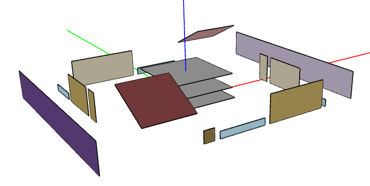
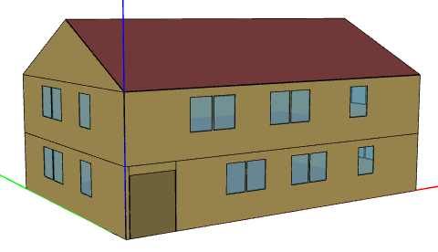

Introduction
============

OpenStudio-HPXML allows running residential EnergyPlus simulations using an `HPXML file <https://hpxml.nrel.gov/>`_ for the building description.
It is intended to be used by user interfaces or other automated software workflows that automatically produce the HPXML file.
A `Schematron <http://schematron.com/>`_ document for the EnergyPlus use case is used to validate that the appropriate HPXML inputs are provided to run EnergyPlus.

Capabilities
------------

OpenStudio-HPXML capabilities include:

- Modeling individual dwelling units or whole multifamily buildings; see :ref:`hpxml_building` for more information
- Modeling a wide range of building technologies
- HVAC design load calculations and equipment autosizing
- Occupancy schedules (smooth or stochastic)
- Utility bill calculations (flat, tiered, time-of-use, real-time pricing, etc.)
- Emissions calculations (CO2e, etc.)
- Annual and timeseries outputs (energy, loads, temperatures, etc.)
- Optional HPXML inputs with transparent defaults
- Schematron and XSD Schema input validation

Accuracy vs Speed
-----------------

The EnergyPlus simulation engine is like a Swiss army knife.
There are often multiple models available for the same building technology with varying trade-offs between accuracy and speed.
This workflow standardizes the use of EnergyPlus (e.g., the choice of models appropriate for residential buildings) to provide a fast and easy to use solution.

The workflow is continuously being evaluated for ways to reduce runtime without significant impact on accuracy.
End-to-end simulations typically run in 3-10 seconds, depending on complexity, computer platform and speed, etc.

There are additional ways that software developers using this workflow can reduce runtime:

- Run on Linux/Mac platform, which is significantly faster than Windows.
- Run on computing environments with 1) fast CPUs, 2) sufficient memory, and 3) enough processors to allow all simulations to run in parallel.
- Limit requests for timeseries output (e.g., ``--hourly``, ``--daily``, ``--timestep`` arguments) and limit the number of output variables requested.
- Avoid using the ``--add-component-loads`` argument if heating/cooling component loads are not of interest.
- Use the ``--skip-validation`` argument if the HPXML input file has already been validated against the Schema & Schematron documents.

.. _openstudio_measures:

OpenStudio Measures
-------------------

You can read about OpenStudio measures `here <http://nrel.github.io/OpenStudio-user-documentation/getting_started/about_measures/>`_.
The OpenStudio measures used by the workflow are:

#. ``BuildResidentialHPXML``: A measure that generates an HPXML file from a set of building description inputs (including, e.g., simplified geometry inputs).
#. ``BuildResidentialScheduleFile``: A measure that generates a CSV of detailed schedules (e.g., stochastic occupancy) for use in the simulation.
#. ``HPXMLtoOpenStudio``: A measure that translates an HPXML file to an OpenStudio model.
#. ``ReportSimulationOutput``: A reporting measure that generates a variety of simulation-based annual/timeseries outputs in CSV/JSON/MessagePack format.
#. ``ReportUtilityBills``: A reporting measure that generates utility bill outputs in CSV/JSON/MessagePack format.

Geometry
--------

HPXML files currently do not include detailed 3D geometry (e.g., surface vertices or positions of surfaces relative to each other).
Rather, surfaces are defined by area and orientation.
However, HPXML can still handle the most important aspect of geometry -- shading of solar radiation.
Geometry inputs that affect solar shading include :ref:`window_overhangs` and :ref:`neighbor_buildings`.

For example, the image below shows the result of translating a single-family detached HPXML file to an OpenStudio model.

Surfaces are shown with the correct area/orientation for heat transfer calculations (but are spread out such that they do not shade one another).
Shading surfaces, shown in purple, represent neighboring buildings that substantially shade the windows facing left/right.

.. note::

  It is not possible to automatically construct a 3D closed-form geometry from HPXML inputs since the shape of the building (rectangular, L-shaped, etc.) is unknown.
  Support for 3D geometry may be added to OpenStudio-HPXML in the future.

For illustrative purposes, a 3D representation of the above home (excluding neighboring buildings) is shown below.

License
-------

This project is available under a BSD-3-like license, which is a free, open-source, and permissive license. For more information, check out the `license file <https://github.com/NREL/OpenStudio-HPXML/blob/master/LICENSE.md>`_.
