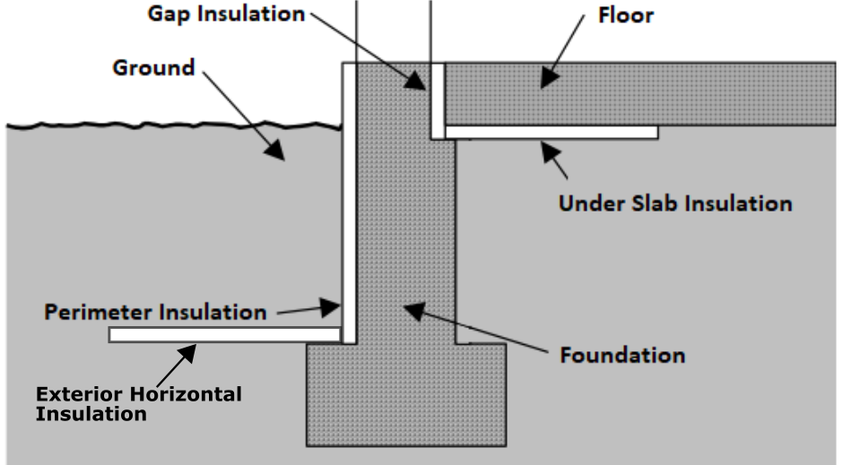

.. _workflow_inputs:

Workflow Inputs
===============

OpenStudio-HPXML requires a building description in an `HPXML file <https://hpxml.nrel.gov/>`_ format.
HPXML is an open data standard for collecting and transferring home energy data. 
Using HPXML files reduces the complexity and effort for software developers to leverage the EnergyPlus simulation engine.

Using HPXML
-----------

HPXML is an flexible and extensible format, where nearly all elements in the schema are optional and custom elements can be included.
Because of this, a stricter set of requirements for the HPXML file have been developed for purposes of running EnergyPlus simulations.

HPXML files submitted to OpenStudio-HPXML undergo a two step validation process:

1. Validation against the HPXML Schema

  The HPXML XSD Schema can be found at ``HPXMLtoOpenStudio/resources/hpxml_schema/HPXML.xsd``.
  XSD Schemas are used to validate what elements/attributes/enumerations are available, data types for elements/attributes, the number/order of children elements, etc.

2. Validation using `Schematron <http://schematron.com/>`_

  The Schematron document for the EnergyPlus use case can be found at ``HPXMLtoOpenStudio/resources/hpxml_schematron/EPvalidator.xml``.
  Schematron is a rule-based validation language, expressed in XML using XPath expressions, for validating the presence or absence of inputs in XML files. 
  As opposed to an XSD Schema, a Schematron document validates constraints and requirements based on conditionals and other logical statements.
  For example, if an element is specified with a particular value, the applicable enumerations of another element may change.

OpenStudio-HPXML **automatically validates** the HPXML file against both the XSD and Schematron documents and reports any validation errors, but software developers may find it beneficial to also integrate validation into their software.

Input Defaults
**************

A large number of elements in the HPXML file are optional and can be defaulted.
Default values, equations, and logic are described throughout this documentation.

For example, suppose a HPXML file has a refrigerator defined as follows:

.. code-block:: XML

  <Refrigerator>
    <SystemIdentifier id='Refrigerator1'/>
  </Refrigerator>

Default values would be used for the refrigerator energy use, location, and schedule:

.. code-block:: XML

  <Refrigerator>
    <SystemIdentifier id='Refrigerator1'/>
    <Location dataSource='software'>conditioned space</Location>
    <RatedAnnualkWh dataSource='software'>691.0</RatedAnnualkWh>
    <PrimaryIndicator dataSource='software'>true</PrimaryIndicator>
    <extension>
      <UsageMultiplier dataSource='software'>1.0</UsageMultiplier>
      <WeekdayScheduleFractions dataSource='software'>0.040, 0.039, 0.038, 0.037, 0.036, 0.036, 0.038, 0.040, 0.041, 0.041, 0.040, 0.040, 0.042, 0.042, 0.042, 0.041, 0.044, 0.048, 0.050, 0.048, 0.047, 0.046, 0.044, 0.041</WeekdayScheduleFractions>
      <WeekendScheduleFractions dataSource='software'>0.040, 0.039, 0.038, 0.037, 0.036, 0.036, 0.038, 0.040, 0.041, 0.041, 0.040, 0.040, 0.042, 0.042, 0.042, 0.041, 0.044, 0.048, 0.050, 0.048, 0.047, 0.046, 0.044, 0.041</WeekendScheduleFractions>
      <MonthlyScheduleMultipliers dataSource='software'>0.837, 0.835, 1.084, 1.084, 1.084, 1.096, 1.096, 1.096, 1.096, 0.931, 0.925, 0.837</MonthlyScheduleMultipliers>
    </extension>
  </Refrigerator>

These defaults will be reflected in the EnergyPlus simulation results.

.. note::

  The OpenStudio-HPXML workflow generally treats missing *elements* differently than missing *values*.
  For example, if there is no ``Refrigerator`` element defined, the simulation will proceed without refrigerator energy use.
  On the other hand, if there is a ``Refrigerator`` element but with no values defined (i.e., no ``Location`` or ``RatedAnnualkWh``), it is assumed that a refrigerator exists but its properties are unknown, so they will be defaulted in the model.

See :ref:`hpxml_defaults` for information on how default values can be inspected.

HPXML Software Info
-------------------

High-level simulation inputs are entered in ``/HPXML/SoftwareInfo``.

.. _hpxml_simulation_control:

HPXML Simulation Control
************************

EnergyPlus simulation controls are entered in ``/HPXML/SoftwareInfo/extension/SimulationControl``.

  ====================================  ========  =======  ================  ========  ===========================  =====================================
  Element                               Type      Units    Constraints       Required  Default                      Description
  ====================================  ========  =======  ================  ========  ===========================  =====================================
  ``Timestep``                          integer   minutes  Divisor of 60     No        60 (1 hour)                  Timestep
  ``BeginMonth``                        integer            >= 1, <= 12 [#]_  No        1 (January)                  Run period start date
  ``BeginDayOfMonth``                   integer            >= 1, <= 31       No        1                            Run period start date
  ``EndMonth``                          integer            >= 1, <= 12       No        12 (December)                Run period end date
  ``EndDayOfMonth``                     integer            >= 1, <= 31       No        31                           Run period end date
  ``CalendarYear``                      integer            > 1600 [#]_       No        2007 (for TMY weather) [#]_  Calendar year (for start day of week)
  ``AdvancedResearchFeatures``          element                              No        <none>                       Features used for advanced research modeling
  ====================================  ========  =======  ================  ========  ===========================  =====================================

  .. [#] BeginMonth/BeginDayOfMonth date must occur before EndMonth/EndDayOfMonth date (e.g., a run period from 10/1 to 3/31 is invalid).
  .. [#] If a leap year is specified (e.g., 2008), the EPW weather file must contain 8784 hours.
  .. [#] CalendarYear only applies to TMY (Typical Meteorological Year) weather. For AMY (Actual Meteorological Year) weather, the AMY year will be used regardless of what is specified.

To enable advanced research features, additional information is entered in ``/HPXML/SoftwareInfo/extension/SimulationControl/AdvancedResearchFeatures``.

These features may require shorter timesteps, allow more sophisticated simulation control, and/or impact simulation runtime.

  ======================================  ========  =======  ================  ========  ========  ========================================================
  Element                                 Type      Units    Constraints       Required  Default   Notes
  ======================================  ========  =======  ================  ========  ========  ========================================================
  ``TemperatureCapacitanceMultiplier``    double             > 0               No        7.0 [#]_  Multiplier on air heat capacitance [#]_
  ``DefrostModelType``                    string             See [#]_          No        standard  Defrost model type for air source heat pumps [#]_
  ``OnOffThermostatDeadbandTemperature``  double    F        > 0 [#]_          No                  Temperature difference between cut-in and cut-out temperature for HVAC operation [#]_
  ``HeatPumpBackupCapacityIncrement``     double    Btu/hr   > 0 [#]_          No                  Capacity increment of multi-stage heat pump backup systems [#]_
  ======================================  ========  =======  ================  ========  ========  ========================================================

  .. [#] The default value of 7 is an average value found in the literature when calibrating timeseries EnergyPlus indoor temperatures to field data.
  .. [#] TemperatureCapacitanceMultiplier affects the transient calculation of indoor air temperatures.
         Values greater than 1.0 have the effect of smoothing or damping the rate of change in the indoor air temperature from timestep to timestep.
         This heat capacitance effect is modeled on top of any other individual mass inputs (e.g., furniture mass, partition wall mass, interior drywall, etc.) in the HPXML.
  .. [#] DefrostModelType choices are "standard" and "advanced".
  .. [#] Use "standard" for default E+ defrost setting.
         Use "advanced" for an improved model that better accounts for load and energy use during defrost; using "advanced" may impact simulation runtime.
  .. [#] OnOffThermostatDeadbandTemperature is currently only allowed with a 1 minute timestep.
         Currently only supports homes with at most one cooling system (including heat pumps) serving 100% of the cooling load and at most one heating system (including heat pumps) serving 100% of the heating load (i.e., FractionHeatLoadServed and FractionCoolLoadServed are 1.0).
         Applies to single speed and two speed AC/ASHP only.
  .. [#] An on/off thermostat deadband temperature is applied to both heating and cooling.
         Typical values are between 2-4 F, with actual values being specific to the thermostat installed.
         Note that thermostat deadbands are two sided.
         As an example, if you had a heating setpoint of 71 F and a 2 F deadband, the heating equipment will turn on when the space temperature hits 70 F and off when it hits 72 F.
         When this feature is enabled, the model will also explicitly model cycling, such that it will take several minutes for the HVAC to reach full capacity for single and two speed AC/ASHP systems, and time-based realistic staging (stay at low speed for 5 minutes before transitioning to the higher stage, and stay at high speed until cut-out deadband temperature is reached) for two speed AC/ASHP systems.
         This feature should only be used if detailed power profiles and loads are required.
         Common use cases for this feature are when modeling advanced controls, such as a Home Energy Management System, or if performing co-simulation with a grid model. 
  .. [#] HeatPumpBackupCapacityIncrement is currently only allowed with a 1 minute timestep.
  .. [#] HeatPumpBackupCapacityIncrement allows modeling multi-stage electric heat pump backup with time-based staging.
         If not provided, the heat pump backup is modeled with a single stage.

HPXML Emissions Scenarios
*************************

One or more emissions scenarios can be entered as an ``/HPXML/SoftwareInfo/extension/EmissionsScenarios/EmissionsScenario``.
If not entered, emissions will not be calculated.

  ================================  ========  =====  ===========  ========  ========  ========================================================
  Element                           Type      Units  Constraints  Required  Default   Notes
  ================================  ========  =====  ===========  ========  ========  ========================================================
  ``Name``                          string                        Yes                 Name of the scenario (which shows up in the output file)
  ``EmissionsType``                 string           See [#]_     Yes                 Type of emissions (e.g., CO2e)
  ``EmissionsFactor``               element                       See [#]_            Emissions factor(s) for a given fuel type; multiple are allowed
  ================================  ========  =====  ===========  ========  ========  ========================================================

  .. [#] EmissionsType can be anything. But if certain values are provided (e.g., "CO2e"), then some emissions factors can be defaulted as described further below.
  .. [#] EmissionsFactor is required for electricity and optional for all non-electric fuel types.

See :ref:`annual_outputs` and :ref:`timeseries_outputs` for descriptions of how the calculated emissions appear in the output files.

Electricity Emissions
~~~~~~~~~~~~~~~~~~~~~

For each scenario, electricity emissions factors must be entered as an ``/HPXML/SoftwareInfo/extension/EmissionsScenarios/EmissionsScenario/EmissionsFactor``.

  =================================  ================  =====  ===========  ========  ========  ============================================================
  Element                            Type              Units  Constraints  Required  Default   Notes
  =================================  ================  =====  ===========  ========  ========  ============================================================
  ``FuelType``                       string                   electricity  Yes                 Emissions factor fuel type
  ``Units``                          string                   See [#]_     Yes                 Emissions factor units
  ``Value`` or ``ScheduleFilePath``  double or string         See [#]_     Yes                 Emissions factor annual value or schedule file with hourly values
  =================================  ================  =====  ===========  ========  ========  ============================================================

  .. [#] Units choices are "lb/MWh" and "kg/MWh".
  .. [#] ScheduleFilePath must point to a CSV file with 8760 numeric hourly values.
         Sources of electricity emissions data include `NREL's Cambium database <https://www.nrel.gov/analysis/cambium.html>`_ and `EPA's eGRID <https://www.epa.gov/egrid>`_.

If an electricity schedule file is used, additional information can be entered in the ``/HPXML/SoftwareInfo/extension/EmissionsScenarios/EmissionsScenario/EmissionsFactor``.

  =================================  ================  =====  ===========  ========  ========  ==============================================
  Element                            Type              Units  Constraints  Required  Default   Notes
  =================================  ================  =====  ===========  ========  ========  ==============================================
  ``NumberofHeaderRows``             integer           #      >= 0         No        0         Number of header rows in the schedule file
  ``ColumnNumber``                   integer           #      >= 1         No        1         Column number of the data in the schedule file
  =================================  ================  =====  ===========  ========  ========  ==============================================

Fuel Emissions
~~~~~~~~~~~~~~

For each scenario, fuel emissions factors can be optionally entered as an ``/HPXML/SoftwareInfo/extension/EmissionsScenarios/EmissionsScenario/EmissionsFactor``.

  ================================  ========  =====  ===========  ========  ========  =============================
  Element                           Type      Units  Constraints  Required  Default   Notes
  ================================  ========  =====  ===========  ========  ========  =============================
  ``FuelType``                      string           See [#]_     Yes                 Emissions factor fuel type
  ``Units``                         string           See [#]_     Yes                 Emissions factor units
  ``Value``                         double                        Yes                 Emissions factor annual value
  ================================  ========  =====  ===========  ========  ========  =============================

  .. [#] FuelType choices are "natural gas", "propane", "fuel oil", "coal", "wood", and "wood pellets".
  .. [#] Units choices are "lb/MBtu" and "kg/MBtu" (million Btu).

Default Values
~~~~~~~~~~~~~~

If EmissionsType is "CO2e", "NOx" or "SO2" and a given fuel's emissions factor is not entered, they will be defaulted as follows.

  ============  ==============  =============  =============
  Fuel Type     CO2e [lb/MBtu]  NOx [lb/MBtu]  SO2 [lb/MBtu]
  ============  ==============  =============  =============
  natural gas   147.3           0.0922         0.0006
  propane       177.8           0.1421         0.0002
  fuel oil      195.9           0.1300         0.0015
  coal          --              --             --
  wood          --              --             --
  wood pellets  --              --             --
  ============  ==============  =============  =============

Default values in lb/MBtu (million Btu) are from ANSI/RESNET/ICC 301-2022 Addendum B and include both combustion and pre-combustion (e.g., methane leakage for natural gas) emissions.

If no default value is available, a warning will be issued.

.. _hpxml_utility_bill_scenarios:

HPXML Utility Bill Scenarios
****************************

One or more utility bill scenarios can be entered as an ``/HPXML/SoftwareInfo/extension/UtilityBillScenarios/UtilityBillScenario``.
If not entered, utility bills will not be calculated.

  ================================  ========  =====  ===========  ========  ========  ========================================================
  Element                           Type      Units  Constraints  Required  Default   Notes
  ================================  ========  =====  ===========  ========  ========  ========================================================
  ``Name``                          string                        Yes                 Name of the scenario (which shows up in the output file)
  ``UtilityRate``                   element                       No                  Utility rate(s) for a given fuel type; multiple are allowed
  ``PVCompensation``                element                       No                  PV compensation information
  ================================  ========  =====  ===========  ========  ========  ========================================================

See :ref:`bill_outputs` for a description of how the calculated utility bills appear in the output files.

.. _electricity_rates:

Electricity Rates
~~~~~~~~~~~~~~~~~

For each scenario, electricity rates can be optionally entered as an ``/HPXML/SoftwareInfo/extension/UtilityBillScenarios/UtilityBillScenario/UtilityRate``.
Electricity rates can be entered using Simple inputs or Detailed inputs.

**Simple**

For simple utility rate structures, inputs can be entered using a fixed charge and a marginal rate.

  ================================  ========  =======  ===========  ========  ========  ====================
  Element                           Type      Units    Constraints  Required  Default   Notes
  ================================  ========  =======  ===========  ========  ========  ====================
  ``FuelType``                      string             electricity  Yes                 Fuel type
  ``FixedCharge``                   double    $/month               No        12.0      Monthly fixed charge [#]_
  ``MarginalRate``                  double    $/kWh                 No        See [#]_  Marginal flat rate
  ================================  ========  =======  ===========  ========  ========  ====================

  .. [#] If running :ref:`bldg_type_whole_mf_buildings`, the fixed charge will apply to every dwelling unit in the building.
  .. [#] If MarginalRate not provided, defaults to state, regional, or national average based on 2022 EIA SEDS data that can be found at ``ReportUtilityBills/resources/simple_rates/pr_all_update.csv``.

**Detailed**

For detailed utility rate structures, inputs can be entered using a tariff JSON file.

  ================================  ========  =======  ===========  ========  ========  =============================
  Element                           Type      Units    Constraints  Required  Default   Notes
  ================================  ========  =======  ===========  ========  ========  =============================
  ``FuelType``                      string             electricity  Yes                 Fuel type
  ``TariffFilePath``                string                          Yes                 Path to tariff JSON file [#]_
  ================================  ========  =======  ===========  ========  ========  =============================

  .. [#] TariffFilePath must point to a JSON file with utility rate structure information.
         Tariff files can describe flat, tiered, time-of-use, tiered time-of-use, or real-time pricing rates.
         Sources of tariff files include `OpenEI's U.S. Utility Rate Database (URDB) <https://openei.org/wiki/Utility_Rate_Database>`_;
         a large set of residential OpenEI URDB rates for U.S. utilities are included at ``ReportUtilityBills/resources/detailed_rates/openei_rates.zip``.
         Additional sample tariff files can be found in ``ReportUtilityBills/resources/detailed_rates``.
         Tariff files are formatted based on `OpenEI API version 7 <https://openei.org/services/doc/rest/util_rates/?version=7#response-fields>`_.

Fuel Rates
~~~~~~~~~~

For each scenario, fuel rates can be optionally entered as an ``/HPXML/SoftwareInfo/extension/UtilityBillScenarios/UtilityBillScenario/UtilityRate``.

  ================================  ========  ========  ===========  ========  ========  ====================
  Element                           Type      Units     Constraints  Required  Default   Notes
  ================================  ========  ========  ===========  ========  ========  ====================
  ``FuelType``                      string              See [#]_     Yes                 Fuel type
  ``FixedCharge``                   double    $/month                No        See [#]_  Monthly fixed charge
  ``MarginalRate``                  double    See [#]_               No        See [#]_  Marginal flat rate
  ================================  ========  ========  ===========  ========  ========  ====================

  .. [#] FuelType choices are "natural gas", "propane", "fuel oil", "coal", "wood", and "wood pellets".
  .. [#] FixedCharge defaults to $12/month for natural gas and $0/month for other fuels.
  .. [#] MarginalRate units are $/therm for natural gas, $/gallon for propane and fuel oil, and $/kBtu for other fuels.
  .. [#] If MarginalRate not provided, defaults to state, regional, or national average based on 2022 EIA SEDS data that can be found at ``ReportUtilityBills/resources/simple_rates/pr_all_update.csv`` (except for coal, which is based on 2007 EIA SEDS data as EIA assumes there is zero residential sector coal consumption in the United States for 2008 forward and  does not estimate a price).

PV Compensation
~~~~~~~~~~~~~~~

For each scenario, PV compensation information can be optionally entered in ``/HPXML/SoftwareInfo/extension/UtilityBillScenarios/UtilityBillScenario/PVCompensation``.

  =============================================================  ========  =======  ===========  ========  ==============  ==============================
  Element                                                        Type      Units    Constraints  Required  Default         Notes
  =============================================================  ========  =======  ===========  ========  ==============  ==============================
  ``CompensationType[NetMetering | FeedInTariff]``               element                         No        NetMetering     PV compensation type
  ``MonthlyGridConnectionFee[Units="$/kW" or Units="$"]/Value``  double                          No        0               PV monthly grid connection fee
  =============================================================  ========  =======  ===========  ========  ==============  ==============================

**Net-Metering**

If the PV compensation type is net-metering, additional information can be entered in ``/HPXML/SoftwareInfo/extension/UtilityBillScenarios/UtilityBillScenario/PVCompensation/CompensationType/NetMetering``.

  ================================  ========  =======  ===========  ========  ==============  =============================================================
  Element                           Type      Units    Constraints  Required  Default         Notes
  ================================  ========  =======  ===========  ========  ==============  =============================================================
  ``AnnualExcessSellbackRateType``  string             See [#]_     No        User-Specified  Net metering annual excess sellback rate type [#]_
  ``AnnualExcessSellbackRate``      double    $/kWh                 No [#]_   0.03            User-specified net metering annual excess sellback rate [#]_
  ================================  ========  =======  ===========  ========  ==============  =============================================================
  
  .. [#] AnnualExcessSellbackRateType choices are "User-Specified" and "Retail Electricity Cost".
  .. [#] When annual PV production exceeds the annual building electricity consumption, this rate, which is often significantly below the retail rate, determines the value of the excess electricity sold back to the utility.
         This may happen to offset gas consumption, for example.
  .. [#] AnnualExcessSellbackRate is only used when AnnualExcessSellbackRateType="User-Specified".
  .. [#] Since modeled electricity consumption will not change from one year to the next, "indefinite rollover" of annual excess generation credit is best approximated by setting "User-Specified" and entering a rate of zero.

**Feed-in Tariff**

If the PV compensation type is feed-in tariff, additional information can be entered in ``/HPXML/SoftwareInfo/extension/UtilityBillScenarios/UtilityBillScenario/PVCompensation/CompensationType/FeedInTariff``.

  ============================  ========  =======  ===========  ========  ==============  ========================
  Element                       Type      Units    Constraints  Required  Default         Notes
  ============================  ========  =======  ===========  ========  ==============  ========================
  ``FeedInTariffRate``          double    $/kWh                 No        0.12            Feed-in tariff rate [#]_
  ============================  ========  =======  ===========  ========  ==============  ========================

  .. [#] FeedInTariffRate applies to full (not excess) PV production.
         Some utilities/regions may have a feed-in tariff policy where compensation occurs for excess PV production (i.e., PV-generated electricity sent to the grid that is not immediately consumed by the building), rather than full PV production.
         OpenStudio-HPXML is currently unable to calculate utility bills for such a feed-in tariff policy.

HPXML Unavailable Periods
*************************

One or more unavailable periods (e.g., vacancies, power outages) can be entered as an ``/HPXML/SoftwareInfo/extension/UnavailablePeriods/UnavailablePeriod``.
If not entered, the simulation will not include unavailable periods.

  ====================================  ========  =======  =============  ========  ================  ===========
  Element                               Type      Units    Constraints    Required  Default           Description
  ====================================  ========  =======  =============  ========  ================  ===========
  ``ColumnName``                        string                            Yes                         Column name associated with unavailable_periods.csv below
  ``BeginMonth``                        integer            >= 1, <= 12    Yes                         Begin month
  ``BeginDayOfMonth``                   integer            >= 1, <= 31    Yes                         Begin day
  ``BeginHourOfDay``                    integer            >= 0, <= 23    No        0                 Begin hour
  ``EndMonth``                          integer            >= 1, <= 12    Yes                         End month
  ``EndDayOfMonth``                     integer            >= 1, <= 31    Yes                         End day
  ``EndHourOfDay``                      integer            >= 1, <= 24    No        24                End hour
  ``NaturalVentilation``                string             See [#]_       No        regular schedule  Natural ventilation availability
  ====================================  ========  =======  =============  ========  ================  ===========

  .. [#] NaturalVentilation choices are "regular schedule", "always available", or "always unavailable".

See the table below to understand which components are affected by an unavailable period with a given ``ColumnName``.
You can create an additional column in the CSV file to define another unavailable period type.

.. csv-table::
   :file: ../../HPXMLtoOpenStudio/resources/data/unavailable_periods.csv
   :header-rows: 1

.. warning::

  It is not possible to eliminate all HVAC/DHW energy use (e.g. crankcase/defrost energy, water heater parasitics) in EnergyPlus during an unavailable period.

.. _hpxml_building:

HPXML Building
--------------

OpenStudio-HPXML can be used to model either individual residential :ref:`bldg_type_dwelling_units` or :ref:`bldg_type_whole_mf_buildings`.

In either case, each residential dwelling unit is entered as a ``/HPXML/Building``.

  =========================  ======  =======  ===========  ========  =======  ==============================================
  Element                    Type    Units    Constraints  Required  Default  Notes
  =========================  ======  =======  ===========  ========  =======  ==============================================
  ``BuildingID``             id                            Yes                Unique identifier
  =========================  ======  =======  ===========  ========  =======  ==============================================

.. _bldg_type_dwelling_units:

Dwelling Units
**************

OpenStudio-HPXML can model individual residential dwelling units -- either a single-family detached (SFD) building, or a single unit of a single-family attached (SFA) or multifamily (MF) building.
This approach:

- Is required/desired for certain applications (e.g., a Home Energy Score or an Energy Rating Index calculation).
- Improves runtime speed by being able to simulate individual units in parallel (as opposed to simulating the entire building).

For these simulations:

- Surfaces can be defined adjacent to generic SFA/MF spaces (e.g., "other housing unit" or "other multifamily buffer space") with assumed temperature profiles (see :ref:`hpxml_locations`).
- Various building components (e.g., ducts, water heaters, appliances) can be located in these SFA/MF spaces.
- Shared systems (HVAC, water heating, mechanical ventilation, etc.) serving multiple dwelling units can be defined, in which these systems are approximated as individual systems with efficiency adjustments to estimate the energy use attributed to the unit.
- Energy use attributed only to the dwelling unit is calculated.

.. _bldg_type_whole_mf_buildings:

Whole SFA/MF Buildings
**********************

Alternatively, OpenStudio-HPXML can model whole SFA/MF buildings in a single combined simulation.

Modeling a whole SFA/MF building is defined in ``/HPXML/SoftwareInfo/extension``.

  ==================================  ========  =====  ===========  ========  ========  ========================================================
  Element                             Type      Units  Constraints  Required  Default   Notes
  ==================================  ========  =====  ===========  ========  ========  ========================================================
  ``WholeSFAorMFBuildingSimulation``  boolean                       No        false     Whether to run an individual dwelling unit or whole building for SFA/MF [#]_
  ==================================  ========  =====  ===========  ========  ========  ========================================================

  .. [#] When WholeSFAorMFBuildingSimulation is false and the HPXML contains multiple ``Building`` elements, you must tell OpenStudio-HPXML which ``Building`` to run as described in the :ref:`basic_run` usage instructions.

For these simulations:

- An HPXML file with multiple ``Building`` elements is used, where each ``Building`` represents an individual dwelling unit.
- Unit multipliers (using the ``NumberofUnits`` element; see :ref:`building_construction`) can be specified to model *unique* dwelling units, rather than *all* dwelling units, reducing simulation runtime.
- Adjacent SFA/MF common spaces are still modeled using assumed temperature profiles, not as separate thermal zones. (This may change in the future.)
- Shared systems are still modeled as individual systems, not shared systems connected to multiple dwelling unit. (This may change in the future.)
- Energy use for the entire building is calculated; you cannot get energy use for individual dwelling units. (This may change in the future.)

Notes/caveats about this approach:

- Some inputs (e.g., EPW location or ground conductivity) cannot vary across ``Building`` elements.
- :ref:`hpxml_batteries` are not currently supported.
- :ref:`hpxml_utility_bill_scenarios` using *detailed* :ref:`electricity_rates` are not supported.

.. _building_site:

HPXML Building Site
-------------------

Building site information can be entered in ``/HPXML/Building/Site``.

  =======================================  ========  =====  ===============  ========  ========  ===============
  Element                                  Type      Units  Constraints      Required  Default   Description
  =======================================  ========  =====  ===============  ========  ========  ===============
  ``SiteID``                               id                                Yes                 Unique identifier
  ``Address/CityMunicipality``             string                            No        See [#]_  Address city/municipality
  ``Address/StateCode``                    string                            No        See [#]_  Address state/territory
  ``Address/ZipCode``                      string           See [#]_         See [#]_            Address ZIP Code
  ``GeoLocation/Latitude``                 double    deg    >= -90, <= 90    No        See [#]_  Site latitude (negative for southern hemisphere)
  ``GeoLocation/Longitude``                double    deg    >= -180, <= 180  No        See [#]_  Site longitude (negative for western hemisphere)
  ``Elevation``                            double    ft                      No        See [#]_  Site elevation
  ``TimeZone/UTCOffset``                   double           >= -12, <= 14    No        See [#]_  Difference in decimal hours between the home's time zone and UTC
  ``TimeZone/DSTObserved``                 boolean                           No        true      Daylight saving time observed?
  =======================================  ========  =====  ===============  ========  ========  ===============

  .. [#] If CityMunicipality not provided, defaults according to the EPW weather file header.
  .. [#] If StateCode not provided, defaults according to the EPW weather file header.
  .. [#] ZipCode can be defined as the standard 5 number postal code, or it can have the additional 4 number code separated by a hyphen.
  .. [#] Either ZipCode or WeatherStation/extension/EPWFilePath (see :ref:`weather_station`) must be provided.
  .. [#] If Latitude not provided, defaults according to the EPW weather file header.
  .. [#] If Longitude not provided, defaults according to the EPW weather file header.
  .. [#] If Elevation not provided, defaults according to the EPW weather file header.
  .. [#] If UTCOffset not provided, defaults according to the EPW weather file header.

If daylight saving time is observed, additional information can be specified in ``/HPXML/Building/Site/TimeZone/extension``.

  ============================================  ========  =====  ===========================  ========  =============================  ===========
  Element                                       Type      Units  Constraints                  Required  Default                        Description
  ============================================  ========  =====  ===========================  ========  =============================  ===========
  ``DSTBeginMonth`` and ``DSTBeginDayOfMonth``  integer          >= 1, <= 12 and >= 1, <= 31  No        EPW else 3/12 (March 12) [#]_  Start date
  ``DSTEndMonth`` and ``DSTEndDayOfMonth``      integer          >= 1, <= 12 and >= 1, <= 31  No        EPW else 11/5 (November 5)     End date
  ============================================  ========  =====  ===========================  ========  =============================  ===========

  .. [#] Daylight saving dates will be defined according to the EPW weather file header; if not available, fallback default values listed above will be used.

HPXML Building Summary
----------------------

High-level building summary information is entered in ``/HPXML/Building/BuildingDetails/BuildingSummary``. 

HPXML Site
**********

Site information is entered in ``/HPXML/Building/BuildingDetails/BuildingSummary/Site``.

  ================================  ========  ===========  ===========  ========  ========  ============================================================
  Element                           Type      Units        Constraints  Required  Default   Notes
  ================================  ========  ===========  ===========  ========  ========  ============================================================
  ``SiteType``                      string                 See [#]_     No        suburban  Terrain type for infiltration model
  ``ShieldingofHome``               string                 See [#]_     No        See [#]_  Presence of nearby buildings, trees, obstructions for infiltration model
  ``Soil/SoilType``                 string                 See [#]_     No        unknown   Soil type
  ``Soil/MoistureType``             string                 See [#]_     No        mixed     Soil moisture type
  ``Soil/Conductivity``             double    Btu/hr-ft-F  > 0          No        See [#]_  Soil thermal conductivity
  ``Soil/extension/Diffusivity``    double    ft2/hr       > 0          No        See [#]_  Soil thermal diffusivity
  ``extension/Neighbors``           element                             No        <none>    Presence of neighboring buildings for solar shading
  ================================  ========  ===========  ===========  ========  ========  ============================================================

  .. [#] SiteType choices are "rural", "suburban", or "urban".
  .. [#] ShieldingofHome choices are "normal", "exposed", or "well-shielded".
  .. [#] If ShieldingofHome not provided, defaults to "normal" for single-family detached or manufactured home and "well-shielded" for single-family attached or apartment unit.
  .. [#] SoilType choices are "sand", "silt", "clay", "loam", "gravel", or "unknown".
  .. [#] MoistureType choices are "dry", "wet", or "mixed".
  .. [#] If Conductivity not provided, defaults to Diffusivity / 0.0208 if Diffusivity provided, otherwise defaults based on SoilType and MoistureType per Table 1 of `Ground Thermal Diffusivity Calculation by Direct Soil Temperature Measurement <https://www.ncbi.nlm.nih.gov/pmc/articles/PMC4813881>`_ unless otherwise noted:
  
         \- **unknown, dry/wet/mixed**: 1.0000 (based on ANSI/RESNET/ICC 301-2022 Addendum C)

         \- **sand/gravel, dry**: 0.2311

         \- **sand, wet**: 1.3865

         \- **sand, mixed**: 0.8088

         \- **silt/clay, dry**: 0.2889

         \- **silt/clay, wet**: 0.9821

         \- **silt/clay, mixed**: 0.6355

         \- **loam, dry/wet/mixed**: 1.2132

         \- **gravel, wet**: 1.0399

         \- **gravel, mixed**: 0.6355

  .. [#] If Diffusivity not provided, defaults to Conductivity * 0.0208 if Conductivity provided, otherwise defaults based on SoilType and MoistureType per Table 1 of `Ground Thermal Diffusivity Calculation by Direct Soil Temperature Measurement <https://www.ncbi.nlm.nih.gov/pmc/articles/PMC4813881>`_:
  
         \- **unknown, dry/wet/mixed**: 0.0208

         \- **sand/gravel, dry**: 0.0097

         \- **sand, wet**: 0.0322

         \- **sand, mixed**: 0.0210

         \- **silt/clay, dry**: 0.0120

         \- **silt/clay, wet**: 0.0194

         \- **silt/clay, mixed**: 0.0157

         \- **loam, dry/wet/mixed**: 0.0353

         \- **gravel, wet**: 0.0291

         \- **gravel, mixed**: 0.0194

.. note::

  Soil conductivity is used for foundation heat transfer and ground source heat pumps.
  Soil diffusivity is used for ground source heat pumps.

.. _neighbor_buildings:

HPXML Neighbor Buildings
~~~~~~~~~~~~~~~~~~~~~~~~

For each neighboring building defined, additional information is entered in a ``extension/Neighbors/NeighborBuilding``.

  ==============================  =================  ================  ========================  ========  ========  =============================================
  Element                         Type               Units             Constraints               Required  Default   Notes
  ==============================  =================  ================  ========================  ========  ========  =============================================
  ``Azimuth`` or ``Orientation``  integer or string  deg or direction  >= 0, <= 359 or See [#]_  Yes                 Direction of neighbors (clockwise from North)
  ``Distance``                    double             ft                > 0                       Yes                 Distance of neighbor from the dwelling unit
  ``Height``                      double             ft                > 0                       No        See [#]_  Height of neighbor
  ==============================  =================  ================  ========================  ========  ========  =============================================
  
  .. [#] Orientation choices are "northeast", "east", "southeast", "south", "southwest", "west", "northwest", or "north"
         The azimuth/orientation of the neighboring building must match the azimuth/orientation of at least one wall in the home, otherwise an error will be thrown.
  .. [#] If Height not provided, assumed to be same height as the dwelling unit.

.. _building_occupancy:

HPXML Building Occupancy
************************

Building occupancy is entered in ``/HPXML/Building/BuildingDetails/BuildingSummary/BuildingOccupancy``.

  =======================================================  ========  =====  ===========  ========  ========  ========================
  Element                                                  Type      Units  Constraints  Required  Default   Notes
  =======================================================  ========  =====  ===========  ========  ========  ========================
  ``NumberofResidents``                                    double           >= 0         No        See [#]_  Number of occupants
  ``extension/WeekdayScheduleFractions``                   array                         No        See [#]_  24 comma-separated weekday fractions
  ``extension/WeekendScheduleFractions``                   array                         No                  24 comma-separated weekend fractions
  ``extension/MonthlyScheduleMultipliers``                 array                         No        See [#]_  12 comma-separated monthly multipliers
  ``extension/GeneralWaterUseUsageMultiplier``             double           >= 0         No        1.0       Multiplier on general water use internal gains [#]_
  ``extension/GeneralWaterUseWeekdayScheduleFractions``    array                         No        See [#]_  24 comma-separated weekday fractions
  ``extension/GeneralWaterUseWeekendScheduleFractions``    array                         No                  24 comma-separated weekend fractions
  ``extension/GeneralWaterUseMonthlyScheduleMultipliers``  array                         No        See [#]_  12 comma-separated monthly multipliers
  =======================================================  ========  =====  ===========  ========  ========  ========================

  .. [#] If NumberofResidents not provided, an *asset* calculation is performed assuming standard occupancy, in which occupant-driven end uses (e.g., plug loads, appliances, hot water) are calculated based on NumberofBedrooms.
         If NumberofResidents is provided, an *operational* calculation is instead performed, in which *some* occupant-driven end uses, as described throughout the documentation, are adjusted using the following relationship from `RECS 2020 <https://www.eia.gov/consumption/residential/data/2020/>`_:

         \- **manufactured home**: NumberofBedrooms = -1.26 + 1.61 * NumberofResidents

         \- **single-family detached**: NumberofBedrooms = -2.19 + 2.08 * NumberofResidents

         \- **single-family attached**: NumberofBedrooms = -1.98 + 1.89 * NumberofResidents

         \- **apartment unit or multifamily**: NumberofBedrooms = -1.36 + 1.49 * NumberofResidents

  .. [#] If WeekdayScheduleFractions or WeekendScheduleFractions not provided (and :ref:`schedules_detailed` not used), then :ref:`schedules_default` are used.
  .. [#] If MonthlyScheduleMultipliers not provided (and :ref:`schedules_detailed` not used), then :ref:`schedules_default` are used.
  .. [#] Sensible and latent internal gains from general water use (floor mopping, shower evaporation, water films on showers, tubs & sinks surfaces, plant watering, etc.), as defined by `ANSI/RESNET/ICC 301-2019 <https://codes.iccsafe.org/content/RESNET3012019P1>`_.
         If NumberofResidents provided, this will be adjusted using the above equations from RECS.
  .. [#] If GeneralWaterUseWeekdayScheduleFractions or GeneralWaterUseWeekendScheduleFractions not provided (and :ref:`schedules_detailed` not used), then :ref:`schedules_default` are used.
  .. [#] If GeneralWaterUseMonthlyScheduleMultipliers not provided (and :ref:`schedules_detailed` not used), then :ref:`schedules_default` are used.

.. _building_construction:

.. _bldg_constr:

HPXML Building Construction
***************************

Building construction is entered in ``/HPXML/Building/BuildingDetails/BuildingSummary/BuildingConstruction``.

  =======================================  ========  =========  =================================  ========  ========  =======================================================================
  Element                                  Type      Units      Constraints                        Required  Default   Notes
  =======================================  ========  =========  =================================  ========  ========  =======================================================================
  ``YearBuilt``                            integer              > 0                                See [#]_            Year built of the dwelling unit
  ``ResidentialFacilityType``              string               See [#]_                           Yes                 Type of dwelling unit
  ``UnitHeightAboveGrade``                 double    ft                                            No        See [#]_  Height of the unit's lowest conditioned floor above grade [#]_
  ``NumberofUnits``                        integer              >= 1                               No        1         Unit multiplier [#]_
  ``NumberofConditionedFloors``            double               > 0                                Yes                 Number of conditioned floors (including a conditioned basement; excluding a conditioned crawlspace)
  ``NumberofConditionedFloorsAboveGrade``  double               > 0, <= NumberofConditionedFloors  Yes                 Number of conditioned floors above grade (including a walkout basement)
  ``AverageCeilingHeight``                 double    ft         > 0                                No        8.2       Floor to ceiling height within conditioned space
  ``NumberofBedrooms``                     integer              >= 0                               Yes                 Number of bedrooms
  ``NumberofBathrooms``                    integer              > 0                                No        See [#]_  Number of bathrooms
  ``ConditionedFloorArea``                 double    ft2        > 0                                Yes                 Floor area within conditioned space boundary (excluding conditioned crawlspace floor area)
  ``ConditionedBuildingVolume``            double    ft3        > 0                                No        See [#]_  Volume within conditioned space boundary (including a conditioned basement/crawlspace)
  =======================================  ========  =========  =================================  ========  ========  =======================================================================

  .. [#] YearBuilt is required when :ref:`infil_leakiness_description` is the only air leakage type specified.
  .. [#] ResidentialFacilityType choices are "single-family detached", "single-family attached", "apartment unit", or "manufactured home".
  .. [#] If UnitHeightAboveGrade not provided, defaults to 2 ft if all HPXML Floors have ExteriorAdjacentTo with "outside"/"manufactured home underbelly", the maximum foundation wall depth below grade (negative) if there's a conditioned basement, and otherwise 0 ft.
  .. [#] UnitHeightAboveGrade is useful to characterize the height of apartment units above ground level or homes on pier and beam foundations.
         When greater than zero, it is used along with :ref:`air_infiltration` to calculate the wind speed for the infiltration model.
  .. [#] NumberofUnits defines the number of similar dwelling units represented by the HPXML ``Building`` element.
         EnergyPlus simulation results will be multiplied by this value.
         For example, when modeling :ref:`bldg_type_whole_mf_buildings`, this allows modeling *unique* dwelling units, rather than *all* dwelling units, to reduce simulation runtime.
         Note that when NumberofUnits is greater than 1, a few capabilities are not currently supported:
         
         \- :ref:`hpxml_dehumidifier`
         
         \- :ref:`hvac_hp_ground_to_air`
         
         \- On-Off Thermostat Deadband Temperature (see :ref:`hpxml_simulation_control`)
         
         \- Heat Pump Backup Capacity Increment (see :ref:`hpxml_simulation_control`)
         
  .. [#] If NumberofBathrooms not provided, calculated as NumberofBedrooms/2 + 0.5 based on the `2010 BAHSP <https://www1.eere.energy.gov/buildings/publications/pdfs/building_america/house_simulation.pdf>`_.
  .. [#] If ConditionedBuildingVolume not provided, defaults to ConditionedFloorArea * AverageCeilingHeight + ConditionedCrawlspaceVolume.

HPXML Schedules
***************

Schedules for a variety of building features can be defined using:

- :ref:`schedules_simple`
- :ref:`schedules_detailed`
- :ref:`schedules_default`

It is allowed to use simple, detailed, and defaulted values in the same HPXML file.

.. _schedules_simple:

Simple Schedule Inputs
~~~~~~~~~~~~~~~~~~~~~~

Simple schedule inputs are available as weekday/weekend fractions and monthly multipliers for a variety of building characteristics.
For example, see the ``WeekdayScheduleFractions``, ``WeekendScheduleFractions``, and ``MonthlyScheduleMultipliers`` inputs for :ref:`building_occupancy`.

.. _schedules_detailed:

Detailed Schedule Inputs
~~~~~~~~~~~~~~~~~~~~~~~~

Detailed schedule inputs allow schedule values for every hour or timestep of the simulation.
They can be used to reflect real-world or stochastic occupancy.

Detailed schedule inputs are provided via one or more CSV file that should be referenced in the HPXML file as ``/HPXML/Building/BuildingDetails/BuildingSummary/extension/SchedulesFilePath`` elements.
The column names available in the schedule CSV files are:

  ================================  =======  =================================================================================  ===============================
  Column Name                       Units    Description                                                                        Can Be Stochastically Generated [#]_
  ================================  =======  =================================================================================  ===============================
  ``occupants``                     frac     Occupant heat gain schedule.                                                       Yes
  ``lighting_interior``             frac     Interior lighting energy use schedule.                                             Yes
  ``lighting_exterior``             frac     Exterior lighting energy use schedule.                                             No
  ``lighting_garage``               frac     Garage lighting energy use schedule.                                               Yes
  ``lighting_exterior_holiday``     frac     Exterior holiday lighting energy use schedule.                                     No
  ``cooking_range``                 frac     Cooking range & oven energy use schedule.                                          Yes
  ``refrigerator``                  frac     Primary refrigerator energy use schedule.                                          No
  ``extra_refrigerator``            frac     Non-primary refrigerator energy use schedule.                                      No
  ``freezer``                       frac     Freezer energy use schedule.                                                       No
  ``dishwasher``                    frac     Dishwasher energy use schedule.                                                    Yes
  ``clothes_washer``                frac     Clothes washer energy use schedule.                                                Yes
  ``clothes_dryer``                 frac     Clothes dryer energy use schedule.                                                 Yes
  ``ceiling_fan``                   frac     Ceiling fan energy use schedule.                                                   Yes
  ``plug_loads_other``              frac     Other plug load energy use schedule.                                               Yes
  ``plug_loads_tv``                 frac     Television plug load energy use schedule.                                          Yes
  ``plug_loads_vehicle``            frac     Electric vehicle plug load energy use schedule.                                    No
  ``plug_loads_well_pump``          frac     Well pump plug load energy use schedule.                                           No
  ``fuel_loads_grill``              frac     Grill fuel load energy use schedule.                                               No
  ``fuel_loads_lighting``           frac     Lighting fuel load energy use schedule.                                            No
  ``fuel_loads_fireplace``          frac     Fireplace fuel load energy use schedule.                                           No
  ``pool_pump``                     frac     Pool pump energy use schedule.                                                     No
  ``pool_heater``                   frac     Pool heater energy use schedule.                                                   No
  ``permanent_spa_pump``            frac     Permanent spa pump energy use schedule.                                            No
  ``permanent_spa_heater``          frac     Permanent spa heater energy use schedule.                                          No
  ``hot_water_dishwasher``          frac     Dishwasher hot water use schedule.                                                 Yes
  ``hot_water_clothes_washer``      frac     Clothes washer hot water use schedule.                                             Yes
  ``hot_water_fixtures``            frac     Fixtures (sinks, showers, baths) hot water use schedule.                           Yes
  ``hot_water_recirculation_pump``  frac     Hot water recirculation pump schedule.                                             No
  ``general_water_use``             frac     General water use internal gains.                                                  No
  ``heating_setpoint``              F        Thermostat heating setpoint schedule.                                              No
  ``cooling_setpoint``              F        Thermostat cooling setpoint schedule.                                              No
  ``hvac_maximum_power_ratio``      frac     Variable speed system maximum power ratio schedule. [#]_                           No
  ``water_heater_setpoint``         F        Water heater setpoint schedule.                                                    No
  ``water_heater_operating_mode``   0/1      Heat pump water heater operating mode schedule. 0=hybrid/auto, 1=heat pump only.   No
  ``battery``                       -1 to 1  Battery schedule. Positive for charging, negative for discharging.                 No
  ================================  =======  =================================================================================  ===============================

  .. [#] A detailed stochastic occupancy schedule CSV file can also be automatically generated for these columns; see the :ref:`usage_instructions` for the commands.
         The stochastic occupancy schedules are generated using the methodology described in `Stochastic simulation of occupant-driven energy use in a bottom-up residential building stock model <https://www.sciencedirect.com/science/article/pii/S0306261922011540>`_.
         Inputs for the stochastic schedule generator are entered in:

         \- ``/HPXML/Building/BuildingDetails/BuildingSummary/BuildingOccupancy/NumberofResidents``

         \- ``/HPXML/Building/Site/Address/StateCode`` (optional)

         \- ``/HPXML/Building/Site/GeoLocation/Latitude`` (optional)

         \- ``/HPXML/Building/Site/GeoLocation/Longitude`` (optional)

         \- ``/HPXML/Building/Site/TimeZone/UTCOffset`` (optional)

         See :ref:`building_occupancy` and :ref:`building_site` for more information.

  .. [#] This feature is an advanced research capability. This schedule allows modeling shedding controls for variable speed HVAC systems (instead of setpoint changes) to limit the power of HVAC per `AHRI 1380 <https://www.ahrinet.org/search-standards/ahri-1380-i-p-demand-response-through-variable-capacity-hvac-systems-residential-and-small>`_. 
         While any fraction value can be entered, this is primarily intended to reflect the AHRI capabilities, which has two levels of load shed: "General Curtailment" and "Critical Curtailment". 
         A "General Curtailment" signal prevents the equipment from running at more than 70% of max power and "Critical Curtailment" limits it to 40% of max power until comfort constraints are violated (4F off the setpoint).
         During the shedding events, the main heat pump is limited to running below the specified fraction of rated power, and the backup system is locked out.
         When the comfort constraints are violated, both heat pump and backup systems are allowed to run at full load to recover the indoor temperature until reaching setpoint.

Columns with units of `frac` must be normalized to MAX=1; that is, these schedules only define *when* energy is used, not *how much* energy is used.
In other words, the amount of energy or hot water used in each simulation timestep is essentially the schedule value divided by the sum of all schedule values in the column, multiplied by the annual energy or hot water use.
Example schedule CSV files are provided in the ``HPXMLtoOpenStudio/resources/schedule_files`` directory.

The schedule file must have a full year of data even if the simulation is not an entire year.
Frequency of schedule values do not need to match the simulation timestep.
For example, hourly schedules can be used with a 10-minute simulation timestep, or 10-minute schedules can be used with an hourly simulation timestep.

.. warning::

  For simulations with daylight saving enabled (which is the default), EnergyPlus will skip forward an hour in the CSV on the "spring forward" day and repeat an hour on the "fall back" day.

.. _schedules_default:

Default Schedules
~~~~~~~~~~~~~~~~~

If neither simple nor detailed inputs are provided, then schedules are defaulted.
Default schedules are typically smooth, averaged schedules.
These default schedules (and data sources) are described in the table below (e.g., see "occupants" rows for the default occupant heat gain schedule).
They can also be found at ``HPXMLtoOpenStudio/resources/data/default_schedules.csv``.

.. csv-table::
   :file: ../../HPXMLtoOpenStudio/resources/data/default_schedules.csv
   :header-rows: 1

.. _hvac_sizing_control:

HPXML HVAC Sizing Control
*************************

HVAC equipment sizing controls are entered in ``/HPXML/Building/BuildingDetails/BuildingSummary/extension/HVACSizingControl``.
Additional autosizing factor inputs are available at the system level, see :ref:`hvac_heating`, :ref:`hvac_cooling` and :ref:`hvac_heatpump`.

  ===================================  ========  =====  ===========  ========  =========  ============================================
  Element                              Type      Units  Constraints  Required  Default    Description
  ===================================  ========  =====  ===========  ========  =========  ============================================
  ``HeatPumpSizingMethodology``        string           See [#]_     No        HERS       Logic for autosized heat pumps
  ``HeatPumpBackupSizingMethodology``  string           See [#]_     No        emergency  Logic for autosized heat pump backup
  ``AllowIncreasedFixedCapacities``    boolean                       No        false      Logic for fixed capacity HVAC equipment [#]_
  ===================================  ========  =====  ===========  ========  =========  ============================================

  .. [#] HeatPumpSizingMethodology choices are 'ACCA', 'HERS', or 'MaxLoad', and are described as follows:
  
         \- **ACCA**: autosized heat pumps have their nominal capacity sized per ACCA Manual J/S based on cooling design loads, with some oversizing allowances for larger heating design loads.
         
         \- **HERS**: same as **ACCA** except autosized heat pumps have their nominal capacity sized equal to at least the larger of heating and sensible cooling design loads.
         
         \- **MaxLoad**: autosized heat pumps have their nominal capacity sized based on the larger of heating/cooling design loads, while taking into account the heat pump's reduced capacity at the design temperature, such that no backup heating should be necessary.

  .. [#] HeatPumpBackupSizingMethodology choices are 'emergency' or 'supplemental', and are described as follows:

         \- **emergency**: heat pump backup capacity will be autosized to meet the ACCA Manual J heating design load.
         
         \- **supplemental**: heat pump backup capacity will be autosized to meet the remainder of the ACCA Manual J heating design load not met by the heat pump at the heating design temperature.

         Heat pump backup capacity is often sized for emergency heat so that it can meet the entire design load if the heat pump fails.
         Some contractors/homeowners may choose not to do so, perhaps due to insufficient panel/wiring capacity.
         Note: If the minimum temperature for the heat pump's compressor (i.e., ``CompressorLockoutTemperature`` or ``BackupHeatingSwitchoverTemperature``) is above the heating design temperature, the two sizing methodologies will give identical results.
  .. [#] If AllowIncreasedFixedCapacities is true, the larger of user-specified fixed capacity and design load will be used (to reduce potential for unmet loads); otherwise user-specified fixed capacity is used.

Manual J Inputs
~~~~~~~~~~~~~~~

Additional inputs for ACCA Manual J design loads, used for sizing HVAC equipment, can be entered in ``/HPXML/Building/BuildingDetails/BuildingSummary/extension/HVACSizingControl/ManualJInputs``.

  =================================  ========  ======  ===========  ========  ============  ============================================
  Element                            Type      Units   Constraints  Required  Default       Description
  =================================  ========  ======  ===========  ========  ============  ============================================
  ``HeatingDesignTemperature``       double    F                    No        See [#]_      Heating outdoor design temperature
  ``CoolingDesignTemperature``       double    F                    No        See [#]_      Cooling outdoor design temperature
  ``DailyTemperatureRange``          string            See [#]_     No        See [#]_      Class based on average difference between daily high/low outdoor temperatures during the hottest month
  ``HeatingSetpoint``                double    F                    No        70            Conditioned space heating setpoint [#]_
  ``CoolingSetpoint``                double    F                    No        75            Conditioned space cooling setpoint [#]_
  ``HumiditySetpoint``               double    frac    > 0, < 1     No        See [#]_      Conditioned space relative humidity
  ``HumidityDifference``             double    grains               No        See [#]_      Difference between absolute humidity of the outdoor/indoor air during the summer
  ``InternalLoadsSensible``          double    Btu/hr  >= 0         No        See [#]_      Sensible internal loads for cooling design load
  ``InternalLoadsLatent``            double    Btu/hr  >= 0         No        0             Latent internal loads for cooling design load
  ``NumberofOccupants``              double            >= 0         No        See [#]_      Number of occupants for cooling design load
  ``InfiltrationShieldingClass``     integer           >= 1, <= 5   No        See [#]_      Wind shielding class for infiltration design loads
  ``InfiltrationMethod``             string            See [#]_     No        See [#]_      Method to calculate infiltration design loads
  =================================  ========  ======  ===========  ========  ============  ============================================

  .. [#] If HeatingDesignTemperature not provided, the 99% heating design temperature is obtained from the DESIGN CONDITIONS header section inside the EPW weather file.
         If not available in the EPW header, it is calculated from the 8760 hourly temperatures in the EPW.
  .. [#] If CoolingDesignTemperature not provided, the 1% cooling design temperature is obtained from the DESIGN CONDITIONS header section inside the EPW weather file.
         If not available in the EPW header, it is calculated from the 8760 hourly temperatures in the EPW.
  .. [#] DailyTemperatureRange choices are "low", "medium", or "high".
  .. [#] If DailyTemperatureRange not provided, the cooling drybulb temperature range is obtained from the DESIGN CONDITIONS header section inside the EPW weather file.
         If not available in the EPW header, it is calculated from the 8760 hourly temperatures in the EPW.
  .. [#] Any heating setpoint other than 70F is not in compliance with Manual J.
  .. [#] Any cooling setpoint other than 75F is not in compliance with Manual J.
  .. [#] If HumiditySetpoint not provided, defaults to 0.45 in a dry climate, otherwise 0.5.
  .. [#] If HumidityDifference not provided, it is calculated from the other inputs/defaults and the cooling humidity ratio.
         The cooling humidity ratio is calculated from the DESIGN CONDITIONS header section inside the EPW weather file or, if not available, the 8760 hourly temperatures in the EPW.
  .. [#] If InternalLoadsSensible not provided, defaults to the sum of conditioned spaces' InternalLoadsSensible values if provided (see :ref:`zones_spaces`).
         Otherwise defaults to 2400 Btu/hr if there is one refrigerator and no freezer, or 3600 Btu/hr if two refrigerators or a freezer.
         This default represents loads that normally occur during the early evening in mid-summer.
         Additional adjustments or custom internal loads can instead be specified here.
  .. [#] If NumberofOccupants not provided, defaults to the sum of conditioned spaces' NumberofOccupants values if provided (see :ref:`zones_spaces`).
         Otherwise defaults to the the larger of NumberofBedrooms+1 and NumberofResidents (if provided).
         Each occupant produces an additional 230 Btu/hr sensible load and 200 Btu/hr latent load.
  .. [#] If InfiltrationShieldingClass not provided defaults to class 4 with these adjustments:
         +1 if ShieldingofHome="well-shielded", -1 if ShieldingofHome="exposed", +1 if SiteType="urban", -1 if SiteType="rural".
  .. [#] InfiltrationMethod choices are "default infiltration table" or "blower door".
  .. [#] If InfiltrationMethod not provided, defaults based on the current inputs in HPXML.
         If :ref:`infil_leakiness_description` is the only air leakage type specified, defaults to "default infiltration table"; otherwise defaults to "blower door".

.. _shadingcontrol:

HPXML Shading Control
*********************

Shading controls for window and skylight summer/winter shading coefficients are entered in ``/HPXML/Building/BuildingDetails/BuildingSummary/extension/ShadingControl``.
If not provided, summer will be default based on the cooling season defined in the `2010 BAHSP <https://www1.eere.energy.gov/buildings/publications/pdfs/building_america/house_simulation.pdf>`_, using monthly average temperatures.
The remainder of the year is winter.

  ====================================  ========  =======  =============  ========  =======  =====================================
  Element                               Type      Units    Constraints    Required  Default  Description
  ====================================  ========  =======  =============  ========  =======  =====================================
  ``SummerBeginMonth``                  integer            >= 1, <= 12    Yes                Summer shading start date
  ``SummerBeginDayOfMonth``             integer            >= 1, <= 31    Yes                Summer shading start date
  ``SummerEndMonth``                    integer            >= 1, <= 12    Yes                Summer shading end date
  ``SummerEndDayOfMonth``               integer            >= 1, <= 31    Yes                Summer shading end date
  ====================================  ========  =======  =============  ========  =======  =====================================

.. _zones_spaces:

HPXML Zones/Spaces
------------------

Conditioned zones can be provided to produce :ref:`hvac_zone_design_loads` and :ref:`hvac_space_design_loads`.

.. note::

  The specification of conditioned zones does not currently affect the energy simulation as all conditioned space in a dwelling unit is currently modeled as a single EnergyPlus conditioned thermal zone.
  If multiple conditioned zones are specified, the HVAC systems attached to a given zone are assumed to fully condition it for the HVAC design load calculations.

One or more zones can be entered as a ``/HPXML/Building/BuildingDetails/Zones/Zone``.

  =========================  =======  =======  ===========  ========  =======  ==============================================
  Element                    Type     Units    Constraints  Required  Default  Notes
  =========================  =======  =======  ===========  ========  =======  ==============================================
  ``SystemIdentifier``       id                             Yes                Unique identifier
  ``ZoneType``               string            See [#]_     Yes                Type of zone
  ``Spaces/Space``           element                        Yes                One or more spaces within the zone
  =========================  =======  =======  ===========  ========  =======  ==============================================

  .. [#] ZoneType choices are "unconditioned" or "conditioned".

Each space within a conditioned zone can be entered as a ``/HPXML/Building/BuildingDetails/Zones/Zone[ZoneType="conditioned"]/Spaces/Space``.

  =====================================================  =======  =======  ===========  ========  ========  ==============================================
  Element                                                Type     Units    Constraints  Required  Default   Notes
  =====================================================  =======  =======  ===========  ========  ========  ==============================================
  ``SystemIdentifier``                                   id                             Yes                 Unique identifier
  ``FloorArea``                                          double   ft2      > 0          Yes                 Space floor area
  ``extension/ManualJInputs/InternalLoadsSensible``      double   Btu/hr   >= 0         No [#]_   See [#]_  Conditioned space sensible internal loads for cooling design load
  ``extension/ManualJInputs/InternalLoadsLatent``        double   Btu/hr   >= 0         No [#]_   See [#]_  Conditioned space latent internal loads for cooling design load
  ``extension/ManualJInputs/NumberofOccupants``          double            >= 0         No [#]_   See [#]_  Conditioned space number of occupants for cooling design load
  ``extension/ManualJInputs/FenestrationLoadProcedure``  string            See [#]_     No        standard  Conditioned space fenestration load procedure [#]_
  =====================================================  =======  =======  ===========  ========  ========  ==============================================

  .. [#] InternalLoadsSensible must be provided for all spaces or no spaces.
  .. [#] If InternalLoadsSensible not provided for a conditioned space, the home's total internal sensible loads are apportioned to each space by floor area.
  .. [#] InternalLoadsLatent must be provided for all spaces or no spaces.
  .. [#] If InternalLoadsLatent not provided for a conditioned space, the home's total internal latent loads are apportioned to each space by floor area.
  .. [#] NumberofOccupants must be provided for all spaces or no spaces.
  .. [#] If NumberofOccupants not provided for a conditioned space, the home's total number of occupants are apportioned to each space by floor area.
  .. [#] FenestrationLoadProcedure choices are "standard" or "peak".
  .. [#] The "standard" choice should be used for cooling individual rooms and spaces with a single-zone, central air system, where the local fenestration load equals the daily average fenestration load for the room/space plus the AED (Adequate Exposure Diversity) excursion value for the room/space.
         The "peak" choice should be used for room and space cooling by any time of multi-zone system or local unitary equipment (in which the HVAC system has the ability to adjust cooling capacity on a room or zone basis), where the local fenestration load equals the peak value on the AED curve.
         Consult ACCA Manual J for more information.

HPXML Climate Zones
-------------------

HPXML Climate Zone IECC
***********************

Climate zone information can be optionally entered as an ``/HPXML/Building/BuildingDetails/ClimateandRiskZones/ClimateZoneIECC``.

  =================================  ========  =====  ===========  ========  ========  ===============
  Element                            Type      Units  Constraints  Required  Default   Description
  =================================  ========  =====  ===========  ========  ========  ===============
  ``Year``                           integer          See [#]_     Yes                 IECC year
  ``ClimateZone``                    string           See [#]_     Yes                 IECC zone
  =================================  ========  =====  ===========  ========  ========  ===============

  .. [#] Year choices are 2003, 2006, 2009, 2012, 2015, 2018, 2021, or 2024.
  .. [#] ClimateZone choices are "1A", "1B", "1C", "2A", "2B", "2C", "3A", "3B", "3C", "4A", "4B", "4C", "5A", "5B", "5C", "6A", "6B", "6C", "7", or "8".

If Climate zone information not provided, defaults according to the mapping found at ``HPXMLtoOpenStudio/resources/data/zipcode_weather_stations.csv``.

.. _weather_station:

HPXML Weather Station
*********************

Weather information is entered in ``/HPXML/Building/BuildingDetails/ClimateandRiskZones/WeatherStation``.

  =========================  ======  =======  ===========  ========  ========  ==============================================
  Element                    Type    Units    Constraints  Required  Default   Notes
  =========================  ======  =======  ===========  ========  ========  ==============================================
  ``SystemIdentifier``       id                            Yes                 Unique identifier
  ``Name``                   string                        Yes                 Name of weather station
  ``extension/EPWFilePath``  string                        See [#]_  See [#]_  Path to the EnergyPlus weather file (EPW) [#]_
  =========================  ======  =======  ===========  ========  ========  ==============================================

  .. [#] Either EPWFilePath or Address/ZipCode (see :ref:`building_site`) must be provided.
  .. [#] If EPWFilePath not provided, defaults based on the U.S. TMY3 weather station closest to the zip code centroid.
         The mapping can be found at ``HPXMLtoOpenStudio/resources/data/zipcode_weather_stations.csv``.
  .. [#] The full set of U.S. TMY3 EPW weather files can be `downloaded here <https://data.nrel.gov/system/files/128/tmy3s-cache-csv.zip>`_.

.. _enclosure:

HPXML Enclosure
---------------

The dwelling unit's enclosure is entered in ``/HPXML/Building/BuildingDetails/Enclosure``.

All surfaces that bound different space types of the dwelling unit (i.e., not just thermal boundary surfaces) must be specified in the HPXML file.
For example, an attached garage would generally be defined by walls adjacent to conditioned space, walls adjacent to outdoors, a slab, and a roof or ceiling.
For software tools that do not collect sufficient inputs for every required surface, the software developers will need to make assumptions about these surfaces or collect additional input.

Interior partition surfaces (e.g., walls between rooms inside conditioned space, or the floor between two conditioned stories) can be excluded.

For single-family attached (SFA) or multifamily (MF) buildings, surfaces between unconditioned space and the neighboring unit's same unconditioned space should set ``InteriorAdjacentTo`` and ``ExteriorAdjacentTo`` to the same value.
For example, a foundation wall between the unit's vented crawlspace and the neighboring unit's vented crawlspace would use ``InteriorAdjacentTo="crawlspace - vented"`` and ``ExteriorAdjacentTo="crawlspace - vented"``.

.. warning::

  It is the software tool's responsibility to provide the appropriate building surfaces. 
  While some error-checking is in place, it is not possible to know whether some surfaces are incorrectly missing.

Also note that wall and roof surfaces do not require an azimuth/orientation to be specified. 
Rather, only the windows/skylights themselves require an azimuth/orientation. 
Thus, software tools can choose to use a single wall (or roof) surface to represent multiple wall (or roof) surfaces for the entire building if all their other properties (construction type, interior/exterior adjacency, etc.) are identical.

.. _air_infiltration:

HPXML Air Infiltration
**********************

Building air leakage is entered in ``/HPXML/Building/BuildingDetails/Enclosure/AirInfiltration/AirInfiltrationMeasurement``.

  =====================================  ======  =====  ===========  =========  =========================  ===============================================
  Element                                Type    Units  Constraints  Required   Default                    Notes
  =====================================  ======  =====  ===========  =========  =========================  ===============================================
  ``SystemIdentifier``                   id                          Yes                                   Unique identifier
  ``TypeOfInfiltrationLeakage``          string         See [#]_     See [#]_                              Type of infiltration leakage
  ``InfiltrationVolume``                 double  ft3    > 0          No         ConditionedBuildingVolume  Volume associated with infiltration measurement [#]_
  ``InfiltrationHeight``                 double  ft     > 0          No         See [#]_                   Height associated with infiltration measurement [#]_
  ``extension/Aext``                     double  frac   > 0          No         See [#]_                   Exterior area ratio for SFA/MF dwelling units
  =====================================  ======  =====  ===========  =========  =========================  ===============================================

  .. [#] TypeOfInfiltrationLeakage choices are "unit total" or "unit exterior only", and are described as follows:
  
         \- **unit total**: the provided infiltration value represents the total infiltration to the dwelling unit, as measured by a compartmentalization test, in which case it will be adjusted by ``extension/Aext``.
         
         \- **unit exterior only**: the provided infiltration value represents the infiltration to the dwelling unit from outside only, as measured by a guarded test.

  .. [#] TypeOfInfiltrationLeakage required if single-family attached or apartment unit.
  .. [#] InfiltrationVolume can be thought of as the volume of space most impacted by a blower door test.
         Note that InfiltrationVolume can be larger than ConditionedBuildingVolume as it can include, e.g., attics or basements with access doors/hatches that are open during the blower door test.
  .. [#] If InfiltrationHeight not provided, it is inferred from other inputs (e.g., conditioned floor area, number of conditioned floors above-grade, above-grade foundation wall height, etc.).
  .. [#] InfiltrationHeight is defined as the vertical distance between the lowest and highest above-grade points within the pressure boundary, per ASHRAE 62.2.
         It is used along with the ``UnitHeightAboveGrade`` in :ref:`bldg_constr` to calculate the wind speed for the infiltration model.
  .. [#] If Aext not provided and TypeOfInfiltrationLeakage is "unit total", defaults for single-family attached and apartment units to the ratio of exterior (adjacent to outside) envelope surface area to total (adjacent to outside, other dwelling units, or other MF spaces) envelope surface area, as defined by `ANSI/RESNET/ICC 301-2019 <https://codes.iccsafe.org/content/RESNET3012019P1>`_ and `ASHRAE 62.2-2019 <https://www.techstreet.com/ashrae/standards/ashrae-62-2-2019?product_id=2087691>`_.
         Note that all attached surfaces, even adiabatic surfaces, must be defined in the HPXML file.
         If single-family detached or TypeOfInfiltrationLeakage is "unit exterior only", Aext is 1.

In addition, one of the following air leakage types must also be defined:

- :ref:`infil_ach_cfm`
- :ref:`infil_natural_ach_cfm`
- :ref:`infil_ela`
- :ref:`infil_leakiness_description`

.. note::

  Infiltration airflow rates are calculated using the `Alberta Air Infiltration Model (AIM-2) <https://www.aivc.org/sites/default/files/airbase_3705.pdf>`_ (also known as the ASHRAE Enhanced model).
  When there is a flue or chimney present (see :ref:`flueorchimney`) with combustion air from conditioned space, higher infiltration airflow rates are modeled because the flue leakage is at a different height for stack effect.

.. _infil_ach_cfm:

ACH or CFM
~~~~~~~~~~

If entering air leakage as ACH or CFM at a user-specific pressure, additional information is entered in ``/HPXML/Building/BuildingDetails/Enclosure/AirInfiltration/AirInfiltrationMeasurement``.
For example, ACH50 (ACH at 50 Pascals) is a commonly obtained value from a blower door measurement.

  ====================================  ======  =====  ===========  =========  =======  ===============================================
  Element                               Type    Units  Constraints  Required   Default  Notes
  ====================================  ======  =====  ===========  =========  =======  ===============================================
  ``HousePressure``                     double  Pa     > 0          Yes                 House pressure with respect to outside [#]_
  ``BuildingAirLeakage/UnitofMeasure``  string         See [#]_     Yes                 Units for air leakage
  ``BuildingAirLeakage/AirLeakage``     double         > 0          Yes                 Value for air leakage
  ====================================  ======  =====  ===========  =========  =======  ===============================================

  .. [#] HousePressure typical value is 50 Pa.
  .. [#] UnitofMeasure choices are "ACH" or "CFM".

.. _infil_natural_ach_cfm:

Natural ACH or CFM
~~~~~~~~~~~~~~~~~~

If entering air leakage as natural ACH or CFM, additional information is entered in ``/HPXML/Building/BuildingDetails/Enclosure/AirInfiltration/AirInfiltrationMeasurement``.
Natural ACH or CFM represents the annual average infiltration that a building will see.

  ====================================  ======  =====  ===========  =========  =======  =================================
  Element                               Type    Units  Constraints  Required   Default  Notes
  ====================================  ======  =====  ===========  =========  =======  =================================
  ``BuildingAirLeakage/UnitofMeasure``  string         See [#]_     Yes                 Units for air leakage
  ``BuildingAirLeakage/AirLeakage``     double         > 0          Yes                 Value for air leakage
  ====================================  ======  =====  ===========  =========  =======  =================================

  .. [#] UnitofMeasure choices are "ACHnatural" or "CFMnatural".

.. _infil_ela:

Effective Leakage Area
~~~~~~~~~~~~~~~~~~~~~~

If entering air leakage as Effective Leakage Area (ELA), additional information is entered in ``/HPXML/Building/BuildingDetails/Enclosure/AirInfiltration/AirInfiltrationMeasurement``.
Effective Leakage Area is defined as the area of a special nozzle-shaped hole (similar to the inlet of a blower door fan) that would leak the same amount of air as the building does at a pressure difference of 4 Pascals.
Note that ELA is different than Equivalent Leakage Area (EqLA), which involves a sharp-edged hole at a pressure difference of 10 Pascals.

  ====================================  ======  =======  ===========  =========  =========================  ===============================================
  Element                               Type    Units    Constraints  Required   Default                    Notes
  ====================================  ======  =======  ===========  =========  =========================  ===============================================
  ``EffectiveLeakageArea``              double  sq. in.  >= 0         Yes                                   Effective leakage area value
  ====================================  ======  =======  ===========  =========  =========================  ===============================================

.. _infil_leakiness_description:

Leakiness Description
~~~~~~~~~~~~~~~~~~~~~

If entering air leakage using the Leakiness Description, additional information is entered in ``/HPXML/Building/BuildingDetails/Enclosure/AirInfiltration/AirInfiltrationMeasurement``.

  ====================================  ======  =======  ===========  =========  =========================  ===============================================
  Element                               Type    Units    Constraints  Required   Default                    Notes
  ====================================  ======  =======  ===========  =========  =========================  ===============================================
  ``LeakinessDescription``              string           See [#]_     Yes                                   Qualitative description of leakiness [#]_
  ====================================  ======  =======  ===========  =========  =========================  ===============================================

  .. [#] LeakinessDescription choices are "very tight", "tight", "average", "leaky" or "very leaky".
  .. [#] For energy modeling, average air leakage is estimated via a regression developed by LBNL using ResDB data (https://resdb.lbl.gov) that takes into account IECC climate zone, conditioned floor area, year built, foundation type, duct location, etc.
         The leakiness description is then used to further adjust the default (average) infiltration rate using leakage multipliers derived from ACCA Manual J Table 5A.
         HPXML inputs map to Manual J Table 5A inputs as follows:
         
         \- "very tight" => "Tight"
         
         \- "tight" => "Semi-Tight"
         
         \- "average" => "Average"
         
         \- "leaky" => "Semi-Loose"
         
         \- "very leaky" => "Loose"
  
.. _flueorchimney:

Flue or Chimney
~~~~~~~~~~~~~~~

The presence of a flue or chimney with combustion air from conditioned space can be entered in ``/HPXML/Building/BuildingDetails/Enclosure/AirInfiltration``.

  ================================================  =======  =====  ===========  =========  ========  ===============================================
  Element                                           Type     Units  Constraints  Required   Default   Notes
  ================================================  =======  =====  ===========  =========  ========  ===============================================
  ``extension/HasFlueOrChimneyInConditionedSpace``  boolean                      No         See [#]_  Flue or chimney with combustion air from conditioned space
  ================================================  =======  =====  ===========  =========  ========  ===============================================

  .. [#] If HasFlueOrChimneyInConditionedSpace not provided, defaults to true if any of the following conditions are met, otherwise false:
         
         \- heating system is non-electric Furnace, Boiler, WallFurnace, FloorFurnace, Stove, or SpaceHeater located in conditioned space and AFUE/Percent is less than 0.89,
         
         \- heating system is non-electric Fireplace located in conditioned space, or
         
         \- water heater is non-electric with energy factor (or equivalent calculated from uniform energy factor) less than 0.63 and located in conditioned space.
  
HPXML Attics
************

If the dwelling unit has an unvented attic, whether it is within the infiltration volume can be optionally entered in ``/HPXML/Building/BuildingDetails/Enclosure/Attics/Attic[AtticType/Attic[Vented="false"]]``.

  ============================  =======  =====  ===========  ========  =======  ===============================================
  Element                       Type     Units  Constraints  Required  Default  Notes
  ============================  =======  =====  ===========  ========  =======  ===============================================
  ``WithinInfiltrationVolume``  boolean         See [#]_     No        false    In accordance with ANSI/RESNET/ICC Standard 380
  ============================  =======  =====  ===========  ========  =======  ===============================================

  .. [#] If there are multiple unvented attics, they must all have the same value.

If the dwelling unit has a vented attic, attic ventilation information can be optionally entered in ``/HPXML/Building/BuildingDetails/Enclosure/Attics/Attic[AtticType/Attic[Vented="true"]]/VentilationRate``.

  =================  ======  =====  ===========  ========  ==========  ==========================
  Element            Type    Units  Constraints  Required  Default     Notes
  =================  ======  =====  ===========  ========  ==========  ==========================
  ``UnitofMeasure``  string         See [#]_     No        SLA         Units for ventilation rate
  ``Value``          double         > 0 [#]_     No        1/300 [#]_  Value for ventilation rate
  =================  ======  =====  ===========  ========  ==========  ==========================

  .. [#] UnitofMeasure choices are "SLA" (specific leakage area) or "ACHnatural" (natural air changes per hour).
  .. [#] If there are multiple vented attics, they must all have the same value.
  .. [#] Value default based on `ANSI/RESNET/ICC 301-2019 <https://codes.iccsafe.org/content/RESNET3012019P1>`_.

HPXML Foundations
*****************

If the dwelling unit has an unconditioned basement, whether it is within the infiltration volume can be optionally entered in ``Enclosure/Foundations/Foundation/FoundationType/Basement[Conditioned='false']``.

  ============================  =======  =====  ===========  ========  =======  ===============================================
  Element                       Type     Units  Constraints  Required  Default  Notes
  ============================  =======  =====  ===========  ========  =======  ===============================================
  ``WithinInfiltrationVolume``  boolean         See [#]_     No        false    In accordance with ANSI/RESNET/ICC Standard 380
  ============================  =======  =====  ===========  ========  =======  ===============================================

  .. [#] If there are multiple unconditioned basements, they must all have the same value.

If the dwelling unit has an unvented crawlspace, whether it is within the infiltration volume can be optionally entered in ``Enclosure/Foundations/Foundation/FoundationType/Crawlspace[Vented='false']``.

  ============================  =======  =====  ===========  ========  =======  ===============================================
  Element                       Type     Units  Constraints  Required  Default  Notes
  ============================  =======  =====  ===========  ========  =======  ===============================================
  ``WithinInfiltrationVolume``  boolean         See [#]_     No        false    In accordance with ANSI/RESNET/ICC Standard 380
  ============================  =======  =====  ===========  ========  =======  ===============================================

  .. [#] If there are multiple unvented crawlspaces, they must all have the same value.

If the dwelling unit has a vented crawlspace, crawlspace ventilation information can be optionally entered in ``/HPXML/Building/BuildingDetails/Enclosure/Foundations/Foundation[FoundationType/Crawlspace[Vented="true"]]/VentilationRate``.

  =================  ======  =====  ===========  ========  ==========  ==========================
  Element            Type    Units  Constraints  Required  Default     Notes
  =================  ======  =====  ===========  ========  ==========  ==========================
  ``UnitofMeasure``  string         See [#]_     No        SLA         Units for ventilation rate
  ``Value``          double         > 0 [#]_     No        1/150 [#]_  Value for ventilation rate
  =================  ======  =====  ===========  ========  ==========  ==========================

  .. [#] UnitofMeasure only choice is "SLA" (specific leakage area).
  .. [#] If there are multiple vented crawlspaces, they must all have the same value.
  .. [#] Value default based on `ANSI/RESNET/ICC 301-2019 <https://codes.iccsafe.org/content/RESNET3012019P1>`_.

If the dwelling has a manufactured home belly-and-wing foundation, whether a skirt is present can be optionally entered in ``/HPXML/Building/BuildingDetails/Enclosure/Foundations/Foundation/FoundationType/BellyAndWing``.

  =================  =======  =====  ===========  ========  ==========  ==========================
  Element            Type     Units  Constraints  Required  Default     Notes
  =================  =======  =====  ===========  ========  ==========  ==========================
  ``SkirtPresent``   boolean         See [#]_     No        true        Presence of skirt [#]_
  =================  =======  =====  ===========  ========  ==========  ==========================

  .. [#] If there are multiple manufactured home belly-and-wing foundations, they must all have the same value.
  .. [#] When a skirt is present, it is assumed that the foundation does not have exposure to wind.

HPXML Roofs
***********

Each pitched or flat roof surface that is exposed to ambient conditions is entered as a ``/HPXML/Building/BuildingDetails/Enclosure/Roofs/Roof``.

For a multifamily building where the dwelling unit has another dwelling unit above it, the surface between the two dwelling units should be considered a ``Floor`` and not a ``Roof``.

  ======================================  =================  ================  ========================  =========  ==============================  ==================================
  Element                                 Type               Units             Constraints               Required   Default                         Notes
  ======================================  =================  ================  ========================  =========  ==============================  ==================================
  ``SystemIdentifier``                    id                                                             Yes                                        Unique identifier
  ``AttachedToSpace``                     idref                                See [#]_                  See [#]_                                   ID of attached space
  ``InteriorAdjacentTo``                  string                               See [#]_                  Yes                                        Interior adjacent space type
  ``Area``                                double             ft2               > 0                       Yes                                        Gross area (including skylights)
  ``Azimuth`` or ``Orientation``          integer or string  deg or direction  >= 0, <= 359 or See [#]_  No         See [#]_                        Direction (clockwise from North)
  ``RoofType``                            string                               See [#]_                  No         asphalt or fiberglass shingles  Roof type
  ``RoofColor`` or ``SolarAbsorptance``   string or double                     See [#]_ or >= 0, <= 1    No         medium                          Roof color or solar absorptance of outermost material [#]_
  ``Emittance``                           double                               >= 0, <= 1                No         0.90                            Emittance of outermost material
  ``InteriorFinish/Type``                 string                               See [#]_                  No         See [#]_                        Interior finish material
  ``InteriorFinish/Thickness``            double             in                >= 0                      No         0.5                             Interior finish thickness
  ``Pitch``                               double             ?/12              >= 0                      Yes                                        Pitch [#]_
  ``RadiantBarrier``                      boolean                                                        No         false                           Presence of radiant barrier [#]_
  ``RadiantBarrierGrade``                 integer                              >= 1, <= 3                No         1                               Radiant barrier installation grade
  ``Insulation/SystemIdentifier``         id                                                             Yes                                        Unique identifier
  ``Insulation/AssemblyEffectiveRValue``  double             F-ft2-hr/Btu      > 0                       Yes                                        Assembly R-value [#]_
  ======================================  =================  ================  ========================  =========  ==============================  ==================================

  .. [#] If AttachedToSpace provided, it must reference a ``Space`` (within a conditioned Zone).
  .. [#] AttachedToSpace only required if zone-level and space-level HVAC design load calculations are desired (see :ref:`zones_spaces`) and the surface is adjacent to conditioned space.
  .. [#] InteriorAdjacentTo choices are "attic - vented", "attic - unvented", "conditioned space", or "garage".
         See :ref:`hpxml_locations` for descriptions.
  .. [#] Orientation choices are "northeast", "east", "southeast", "south", "southwest", "west", "northwest", or "north"
  .. [#] If neither Azimuth nor Orientation provided, and it's a *pitched* roof, modeled as four surfaces of equal area facing every direction.
         Azimuth/Orientation is irrelevant for *flat* roofs.
  .. [#] RoofType choices are "asphalt or fiberglass shingles", "wood shingles or shakes", "shingles", "slate or tile shingles", "metal surfacing", "plastic/rubber/synthetic sheeting", "expanded polystyrene sheathing", "concrete", or "cool roof".
  .. [#] RoofColor choices are "light", "medium", "medium dark", "dark", or "reflective".
  .. [#] If SolarAbsorptance not provided, defaults based on RoofType and RoofColor:
         
         \- **asphalt or fiberglass shingles**: dark=0.92, medium dark=0.89, medium=0.85, light=0.75, reflective=0.50
         
         \- **wood shingles or shakes**: dark=0.92, medium dark=0.89, medium=0.85, light=0.75, reflective=0.50
         
         \- **shingles**: dark=0.92, medium dark=0.89, medium=0.85, light=0.75, reflective=0.50
         
         \- **slate or tile shingles**: dark=0.90, medium dark=0.83, medium=0.75, light=0.60, reflective=0.30
         
         \- **metal surfacing**: dark=0.90, medium dark=0.83, medium=0.75, light=0.60, reflective=0.30
         
         \- **plastic/rubber/synthetic sheeting**: dark=0.90, medium dark=0.83, medium=0.75, light=0.60, reflective=0.30
         
         \- **expanded polystyrene sheathing**: dark=0.92, medium dark=0.89, medium=0.85, light=0.75, reflective=0.50
         
         \- **concrete**: dark=0.90, medium dark=0.83, medium=0.75, light=0.65, reflective=0.50
         
         \- **cool roof**: 0.30
         
  .. [#] InteriorFinish/Type choices are "gypsum board", "gypsum composite board", "plaster", "wood", "other", or "none".
  .. [#] InteriorFinish/Type defaults to "gypsum board" if InteriorAdjacentTo is conditioned space, otherwise "none".
  .. [#] Pitch is entered as vertical rise in inches for every 12 inches of horizontal run.
         For example, 6.0 means a 6/12 roof, which has a 26.57-degree roof slope.
  .. [#] RadiantBarrier intended for attic roofs. Model assumes an emittance of 0.05.
  .. [#] AssemblyEffectiveRValue includes all material layers and interior/exterior air films.
         It should also include the effects of insulation gaps (installation grading) and/or compressed insulation in cavities per `ANSI/RESNET/ICC 301-2022 <https://codes.iccsafe.org/content/RESNET3012022P1>`_.

HPXML Rim Joists
****************

Each rim joist surface (i.e., the perimeter of floor joists typically found between stories of a building or on top of a foundation wall) is entered as a ``/HPXML/Building/BuildingDetails/Enclosure/RimJoists/RimJoist``.

  ======================================  =================  ================  ========================  ========  ===========  ==============================
  Element                                 Type               Units             Constraints               Required  Default      Notes
  ======================================  =================  ================  ========================  ========  ===========  ==============================
  ``SystemIdentifier``                    id                                                             Yes                    Unique identifier
  ``AttachedToSpace``                     idref                                See [#]_                  See [#]_               ID of attached space
  ``ExteriorAdjacentTo``                  string                               See [#]_                  Yes                    Exterior adjacent space type
  ``InteriorAdjacentTo``                  string                               See [#]_                  Yes                    Interior adjacent space type
  ``Area``                                double             ft2               > 0                       Yes                    Gross area
  ``Azimuth`` or ``Orientation``          integer or string  deg or direction  >= 0, <= 359 or See [#]_  No        See [#]_     Direction (clockwise from North)
  ``Siding``                              string                               See [#]_                  No        wood siding  Siding material
  ``Color`` or ``SolarAbsorptance``       string or double                     See [#]_ or >= 0, <= 1    No        medium       Color or solar absorptance of outermost material [#]_
  ``Emittance``                           double                               >= 0, <= 1                No        0.90         Emittance of outermost material
  ``Insulation/SystemIdentifier``         id                                                             Yes                    Unique identifier
  ``Insulation/AssemblyEffectiveRValue``  double             F-ft2-hr/Btu      > 0                       Yes                    Assembly R-value [#]_
  ======================================  =================  ================  ========================  ========  ===========  ==============================

  .. [#] If AttachedToSpace provided, it must reference a ``Space`` (within a conditioned Zone).
  .. [#] AttachedToSpace only required if zone-level and space-level HVAC design load calculations are desired (see :ref:`zones_spaces`) and the surface is adjacent to conditioned space (and not adiabatic).
  .. [#] ExteriorAdjacentTo choices are "outside", "attic - vented", "attic - unvented", "basement - conditioned", "basement - unconditioned", "crawlspace - vented", "crawlspace - unvented", "crawlspace - conditioned", "garage", "other housing unit", "other heated space", "other multifamily buffer space", or "other non-freezing space".
         See :ref:`hpxml_locations` for descriptions.
  .. [#] InteriorAdjacentTo choices are "conditioned space", "attic - vented", "attic - unvented", "basement - conditioned", "basement - unconditioned", "crawlspace - vented", "crawlspace - unvented", "crawlspace - conditioned", or "garage".
         See :ref:`hpxml_locations` for descriptions.
  .. [#] Orientation choices are "northeast", "east", "southeast", "south", "southwest", "west", "northwest", or "north"
  .. [#] If neither Azimuth nor Orientation provided, and it's an *exterior* rim joist, modeled as four surfaces of equal area facing every direction.
         Azimuth/Orientation is irrelevant for *interior* rim joists.
  .. [#] Siding choices are "wood siding", "vinyl siding", "stucco", "fiber cement siding", "brick veneer", "aluminum siding", "masonite siding", "composite shingle siding", "asbestos siding", "synthetic stucco", or "none".
  .. [#] Color choices are "light", "medium", "medium dark", "dark", or "reflective".
  .. [#] If SolarAbsorptance not provided, defaults based on Color:
         
         \- **dark**: 0.95
         
         \- **medium dark**: 0.85
         
         \- **medium**: 0.70
         
         \- **light**: 0.50
         
         \- **reflective**: 0.30
         
  .. [#] AssemblyEffectiveRValue includes all material layers and interior/exterior air films.
         It should also include the effects of insulation gaps (installation grading) and/or compressed insulation in cavities per `ANSI/RESNET/ICC 301-2022 <https://codes.iccsafe.org/content/RESNET3012022P1>`_.

HPXML Walls
***********

Each wall surface is entered as a ``/HPXML/Building/BuildingDetails/Enclosure/Walls/Wall``.

  ======================================  =================  ================  ========================  =============  ===========  ====================================
  Element                                 Type               Units             Constraints               Required       Default      Notes
  ======================================  =================  ================  ========================  =============  ===========  ====================================
  ``SystemIdentifier``                    id                                                             Yes                         Unique identifier
  ``AttachedToSpace``                     idref                                See [#]_                  See [#]_                    ID of attached space
  ``ExteriorAdjacentTo``                  string                               See [#]_                  Yes                         Exterior adjacent space type
  ``InteriorAdjacentTo``                  string                               See [#]_                  Yes                         Interior adjacent space type
  ``WallType``                            element                              See [#]_                  Yes                         Wall type (for thermal mass)
  ``Area``                                double             ft2               > 0                       Yes                         Gross area (including doors/windows)
  ``Azimuth`` or ``Orientation``          integer or string  deg or direction  >= 0, <= 359 or See [#]_  No             See [#]_     Direction (clockwise from North)
  ``Siding``                              string                               See [#]_                  No             wood siding  Siding material
  ``Color`` or ``SolarAbsorptance``       string or double                     See [#]_ or >= 0, <= 1    No             medium       Color or solar absorptance of outermost material [#]_
  ``Emittance``                           double                               >= 0, <= 1                No             0.90         Emittance of outermost material
  ``InteriorFinish/Type``                 string                               See [#]_                  No             See [#]_     Interior finish material
  ``InteriorFinish/Thickness``            double             in                >= 0                      No             0.5          Interior finish thickness
  ``RadiantBarrier``                      boolean                                                        No             false        Presence of radiant barrier [#]_
  ``RadiantBarrierGrade``                 integer                              >= 1, <= 3                No             1            Radiant barrier installation grade
  ``Insulation/SystemIdentifier``         id                                                             Yes                         Unique identifier
  ``Insulation/AssemblyEffectiveRValue``  double             F-ft2-hr/Btu      > 0                       Yes                         Assembly R-value [#]_
  ======================================  =================  ================  ========================  =============  ===========  ====================================

  .. [#] If AttachedToSpace provided, it must reference a ``Space`` (within a conditioned Zone).
  .. [#] AttachedToSpace only required if zone-level and space-level HVAC design load calculations are desired (see :ref:`zones_spaces`) and the surface is adjacent to conditioned space (and not adiabatic).
  .. [#] ExteriorAdjacentTo choices are "outside", "attic - vented", "attic - unvented", "basement - conditioned", "basement - unconditioned", "crawlspace - vented", "crawlspace - unvented", "crawlspace - conditioned", "garage", "other housing unit", "other heated space", "other multifamily buffer space", or "other non-freezing space".
         See :ref:`hpxml_locations` for descriptions.
  .. [#] InteriorAdjacentTo choices are "conditioned space", "attic - vented", "attic - unvented", "basement - conditioned", "basement - unconditioned", "crawlspace - vented", "crawlspace - unvented", "crawlspace - conditioned", or "garage".
         See :ref:`hpxml_locations` for descriptions.
  .. [#] WallType child element choices are ``WoodStud``, ``DoubleWoodStud``, ``ConcreteMasonryUnit``, ``StructuralInsulatedPanel``, ``InsulatedConcreteForms``, ``SteelFrame``, ``SolidConcrete``, ``StructuralBrick``, ``StrawBale``, ``Stone``, ``LogWall``, or ``Adobe``.
  .. [#] Orientation choices are "northeast", "east", "southeast", "south", "southwest", "west", "northwest", or "north"
  .. [#] If neither Azimuth nor Orientation provided, and it's an *exterior* wall, modeled as four surfaces of equal area facing every direction.
         Azimuth/Orientation is irrelevant for *interior* walls (e.g., between conditioned space and garage).
  .. [#] Siding choices are "wood siding", "vinyl siding", "stucco", "fiber cement siding", "brick veneer", "aluminum siding", "masonite siding", "composite shingle siding", "asbestos siding", "synthetic stucco", or "none".
  .. [#] Color choices are "light", "medium", "medium dark", "dark", or "reflective".
  .. [#] If SolarAbsorptance not provided, defaults based on Color:
         
         \- **dark**: 0.95
         
         \- **medium dark**: 0.85
         
         \- **medium**: 0.70
         
         \- **light**: 0.50
         
         \- **reflective**: 0.30
         
  .. [#] InteriorFinish/Type choices are "gypsum board", "gypsum composite board", "plaster", "wood", "other", or "none".
  .. [#] InteriorFinish/Type defaults to "gypsum board" if InteriorAdjacentTo is conditioned space or basement - conditioned, otherwise "none".
  .. [#] RadiantBarrier intended for attic gable walls. Model assumes an emittance of 0.05.
  .. [#] AssemblyEffectiveRValue includes all material layers and interior/exterior air films.
         It should also include the effects of insulation gaps (installation grading) and/or compressed insulation in cavities per `ANSI/RESNET/ICC 301-2022 <https://codes.iccsafe.org/content/RESNET3012022P1>`_.

HPXML Foundation Walls
**********************

Each foundation wall surface is entered as a ``/HPXML/Building/BuildingDetails/Enclosure/FoundationWalls/FoundationWall``.
Any wall surface in contact with the ground is considered a foundation wall.

  ==============================================================  =================  ================  ========================  =========  ==============  ====================================
  Element                                                         Type               Units             Constraints               Required   Default         Notes
  ==============================================================  =================  ================  ========================  =========  ==============  ====================================
  ``SystemIdentifier``                                            id                                                             Yes                        Unique identifier
  ``AttachedToSpace``                                             idref                                See [#]_                  See [#]_                   ID of attached space
  ``ExteriorAdjacentTo``                                          string                               See [#]_                  Yes                        Exterior adjacent space type [#]_
  ``InteriorAdjacentTo``                                          string                               See [#]_                  Yes                        Interior adjacent space type
  ``Type``                                                        string                               See [#]_                  No         solid concrete  Type of material
  ``Height``                                                      double             ft                > 0                       Yes                        Total height
  ``Area`` or ``Length``                                          double             ft2 or ft         > 0                       Yes                        Gross area (including doors/windows) or length
  ``Azimuth`` or ``Orientation``                                  integer or string  deg or direction  >= 0, <= 359 or See [#]_  No         See [#]_        Direction (clockwise from North)
  ``Thickness``                                                   double             in                > 0                       No         8.0             Thickness excluding interior framing
  ``DepthBelowGrade``                                             double             ft                >= 0, <= Height           Yes                        Depth below grade [#]_
  ``InteriorFinish/Type``                                         string                               See [#]_                  No         See [#]_        Interior finish material
  ``InteriorFinish/Thickness``                                    double             in                >= 0                      No         0.5             Interior finish thickness
  ``Insulation/SystemIdentifier``                                 id                                                             Yes                        Unique identifier
  ``Insulation/Layer[InstallationType="continuous - interior"]``  element                                                        See [#]_                   Interior insulation layer
  ``Insulation/Layer[InstallationType="continuous - exterior"]``  element                                                        See [#]_                   Exterior insulation layer
  ``Insulation/AssemblyEffectiveRValue``                          double             F-ft2-hr/Btu      > 0                       See [#]_                   Assembly R-value [#]_
  ==============================================================  =================  ================  ========================  =========  ==============  ====================================

  .. [#] If AttachedToSpace provided, it must reference a ``Space`` (within a conditioned Zone).
  .. [#] AttachedToSpace only required if zone-level and space-level HVAC design load calculations are desired (see :ref:`zones_spaces`) and the surface is adjacent to conditioned space (and not adiabatic).
  .. [#] ExteriorAdjacentTo choices are "ground", "basement - conditioned", "basement - unconditioned", "crawlspace - vented", "crawlspace - unvented", "crawlspace - conditioned", "garage", "other housing unit", "other heated space", "other multifamily buffer space", or "other non-freezing space".
         See :ref:`hpxml_locations` for descriptions.
  .. [#] InteriorAdjacentTo choices are "basement - conditioned", "basement - unconditioned", "crawlspace - vented", "crawlspace - unvented", "crawlspace - conditioned", or "garage".
         See :ref:`hpxml_locations` for descriptions.
  .. [#] Interior foundation walls (e.g., between basement and crawlspace) should **not** use "ground" even if the foundation wall has some contact with the ground due to the difference in below-grade depths of the two adjacent spaces.
  .. [#] Type choices are "solid concrete", "concrete block", "concrete block foam core", "concrete block vermiculite core", "concrete block perlite core", "concrete block solid core", "double brick", or "wood".
  .. [#] Orientation choices are "northeast", "east", "southeast", "south", "southwest", "west", "northwest", or "north"
  .. [#] If neither Azimuth nor Orientation provided, and it's an *exterior* foundation wall, modeled as four surfaces of equal area facing every direction.
         Azimuth/Orientation is irrelevant for *interior* foundation walls (e.g., between basement and garage).
  .. [#] For exterior foundation walls, depth below grade is relative to the ground plane.
         For interior foundation walls, depth below grade is the vertical span of foundation wall in contact with the ground.
         For example, an interior foundation wall between an 8 ft conditioned basement and a 3 ft crawlspace has a height of 8 ft and a depth below grade of 5 ft.
         Alternatively, an interior foundation wall between an 8 ft conditioned basement and an 8 ft unconditioned basement has a height of 8 ft and a depth below grade of 0 ft.
  .. [#] InteriorFinish/Type choices are "gypsum board", "gypsum composite board", "plaster", "wood", "other", or "none".
  .. [#] InteriorFinish/Type defaults to "gypsum board" if InteriorAdjacentTo is basement - conditioned, otherwise "none".
  .. [#] Layer[InstallationType="continuous - interior"] only required if AssemblyEffectiveRValue is not provided.
  .. [#] Layer[InstallationType="continuous - exterior"] only required if AssemblyEffectiveRValue is not provided.
  .. [#] AssemblyEffectiveRValue only required if Layer elements are not provided.
  .. [#] AssemblyEffectiveRValue includes all material layers and the interior air film; it should **not** include the exterior air film (for any above-grade exposure) or any soil thermal resistance.
         It should also include the effects of insulation gaps (installation grading) and/or compressed insulation in cavities per `ANSI/RESNET/ICC 301-2022 <https://codes.iccsafe.org/content/RESNET3012022P1>`_.

If insulation layers are provided, additional information is entered in each ``FoundationWall/Insulation/Layer``.

  ==========================================  ========  ============  ===========  ========  =======  =====================================================================
  Element                                     Type      Units         Constraints  Required  Default  Notes
  ==========================================  ========  ============  ===========  ========  =======  =====================================================================
  ``NominalRValue``                           double    F-ft2-hr/Btu  >= 0         Yes                R-value of the foundation wall insulation; use zero if no insulation
  ``DistanceToTopOfInsulation``               double    ft            >= 0         No        0        Vertical distance from top of foundation wall to top of insulation
  ``DistanceToBottomOfInsulation``            double    ft            See [#]_     No        Height   Vertical distance from top of foundation wall to bottom of insulation
  ==========================================  ========  ============  ===========  ========  =======  =====================================================================

  .. [#] When NominalRValue is non-zero, DistanceToBottomOfInsulation must be greater than DistanceToTopOfInsulation and less than or equal to FoundationWall/Height.

HPXML Floors
************

Each floor/ceiling surface that is not in contact with the ground (Slab) nor adjacent to ambient conditions above (Roof) is entered as a ``/HPXML/Building/BuildingDetails/Enclosure/Floors/Floor``.

  ======================================  ========  ============  ===========  ========  ========  ============================
  Element                                 Type      Units         Constraints  Required  Default   Notes
  ======================================  ========  ============  ===========  ========  ========  ============================
  ``SystemIdentifier``                    id                                   Yes                 Unique identifier
  ``AttachedToSpace``                     idref                   See [#]_     See [#]_            ID of attached space
  ``ExteriorAdjacentTo``                  string                  See [#]_     Yes                 Exterior adjacent space type
  ``InteriorAdjacentTo``                  string                  See [#]_     Yes                 Interior adjacent space type
  ``FloorOrCeiling``                      string                  See [#]_     See [#]_            Floor or ceiling from the perspective of the conditioned space
  ``FloorType``                           element                 See [#]_     Yes                 Floor type (for thermal mass)
  ``Area``                                double    ft2           > 0          Yes                 Gross area (including skylights for ceilings)
  ``InteriorFinish/Type``                 string                  See [#]_     No        See [#]_  Interior finish material
  ``InteriorFinish/Thickness``            double    in            >= 0         No        0.5       Interior finish thickness
  ``RadiantBarrier``                      boolean                              No        false     Presence of radiant barrier [#]_
  ``RadiantBarrierGrade``                 integer                 >= 1, <= 3   No        1         Radiant barrier installation grade
  ``Insulation/SystemIdentifier``         id                                   Yes                 Unique identifier
  ``Insulation/AssemblyEffectiveRValue``  double    F-ft2-hr/Btu  > 0          Yes                 Assembly R-value [#]_
  ======================================  ========  ============  ===========  ========  ========  ============================

  .. [#] If AttachedToSpace provided, it must reference a ``Space`` (within a conditioned Zone).
  .. [#] AttachedToSpace only required if zone-level and space-level HVAC design load calculations are desired (see :ref:`zones_spaces`) and the surface is adjacent to conditioned space (and not adiabatic).
  .. [#] ExteriorAdjacentTo choices are "outside", "attic - vented", "attic - unvented", "basement - conditioned", "basement - unconditioned", "crawlspace - vented", "crawlspace - unvented", "crawlspace - conditioned", "garage", "other housing unit", "other heated space", "other multifamily buffer space", "other non-freezing space", or "manufactured home underbelly".
         See :ref:`hpxml_locations` for descriptions.
  .. [#] InteriorAdjacentTo choices are "conditioned space", "attic - vented", "attic - unvented", "basement - conditioned", "basement - unconditioned", "crawlspace - vented", "crawlspace - unvented", "crawlspace - conditioned", or "garage".
         See :ref:`hpxml_locations` for descriptions.
  .. [#] FloorOrCeiling choices are "floor" or "ceiling".
  .. [#] FloorOrCeiling only required for floors adjacent to "other housing unit", "other heated space", "other multifamily buffer space", or "other non-freezing space".
  .. [#] FloorType child element choices are ``WoodFrame``, ``StructuralInsulatedPanel``, ``SteelFrame``, or ``SolidConcrete``.
  .. [#] InteriorFinish/Type choices are "gypsum board", "gypsum composite board", "plaster", "wood", "other", or "none".
  .. [#] InteriorFinish/Type defaults to "gypsum board" if InteriorAdjacentTo is conditioned space and the surface is a ceiling, otherwise "none".
  .. [#] RadiantBarrier intended for attic floors. Model assumes an emittance of 0.5 (reduced effectiveness due to accumulation of dust) per `an ORNL article on radiant barriers <https://web.ornl.gov/sci/buildings/tools/radiant/rb2/>`_.
  .. [#] AssemblyEffectiveRValue includes all material layers and interior/exterior air films.
         It should also include the effects of insulation gaps (installation grading), compressed insulation in cavities, and/or reduced attic floor insulation thickness at the eaves per `ANSI/RESNET/ICC 301-2022 <https://codes.iccsafe.org/content/RESNET3012022P1>`_.
         For a manufactured home belly where the area of the belly wrap is different and usually greater than the floor area, the AssemblyEffectiveRValue should be adjusted to account for the surface area of the belly wrap and insulation.

HPXML Slabs
***********

Each space type that borders the ground (i.e., basement, crawlspace, garage, and slab-on-grade foundation) should have a slab entered as an ``/HPXML/Building/BuildingDetails/Enclosure/Slabs/Slab``.

  ==================================================================  ========  ============  ===========  =========  ========  ===============================================================
  Element                                                             Type      Units         Constraints  Required   Default   Notes
  ==================================================================  ========  ============  ===========  =========  ========  ===============================================================
  ``SystemIdentifier``                                                id                                   Yes                  Unique identifier
  ``AttachedToSpace``                                                 idref                   See [#]_     See [#]_             ID of attached space
  ``InteriorAdjacentTo``                                              string                  See [#]_     Yes                  Interior adjacent space type
  ``Area``                                                            double    ft2           > 0          Yes                  Gross area
  ``Thickness``                                                       double    in            >= 0         No         See [#]_  Thickness [#]_
  ``ExposedPerimeter``                                                double    ft            >= 0         Yes                  Perimeter exposed to ambient conditions [#]_
  ``DepthBelowGrade``                                                 double    ft            >= 0         No         See [#]_  Depth from the top of the slab surface to grade
  ``PerimeterInsulation/SystemIdentifier``                            id                                   Yes                  Unique identifier
  ``PerimeterInsulation/Layer/NominalRValue``                         double    F-ft2-hr/Btu  >= 0         Yes                  R-value of vertical insulation (see figure below)
  ``PerimeterInsulation/Layer/InsulationDepth``                       double    ft            >= 0         Yes                  Depth from top of slab to bottom of vertical insulation
  ``ExteriorHorizontalInsulation/SystemIdentifier``                   id                                   See [#]_             Unique identifier
  ``ExteriorHorizontalInsulation/Layer/NominalRValue``                double    F-ft2-hr/Btu  >= 0         No         0         R-value of exterior horizontal insulation (see figure below) [#]_
  ``ExteriorHorizontalInsulation/Layer/InsulationWidth``              double    ft            >= 0         No         0         Width of exterior horizontal insulation from slab edge outward 
  ``ExteriorHorizontalInsulation/Layer/InsulationDepthBelowGrade``    double    ft            >= 0         No         0         Depth from grade to the top of exterior horizontal insulation
  ``UnderSlabInsulation/SystemIdentifier``                            id                                   Yes                  Unique identifier
  ``UnderSlabInsulation/Layer/NominalRValue``                         double    F-ft2-hr/Btu  >= 0         Yes                  R-value of horizontal insulation (see figure below)
  ``UnderSlabInsulation/Layer/InsulationWidth``                       double    ft            >= 0         See [#]_             Width from slab edge inward of horizontal insulation
  ``UnderSlabInsulation/Layer/InsulationSpansEntireSlab``             boolean                              See [#]_             Whether horizontal insulation spans entire slab
  ``extension/GapInsulationRValue``                                   double    F-ft2-hr/Btu  >= 0         No         See [#]_  R-value of gap insulation (see figure below)
  ``extension/CarpetFraction``                                        double    frac          >= 0, <= 1   No         See [#]_  Fraction of slab covered by carpet
  ``extension/CarpetRValue``                                          double    F-ft2-hr/Btu  >= 0         No         See [#]_  Carpet R-value
  ==================================================================  ========  ============  ===========  =========  ========  ===============================================================

  .. [#] If AttachedToSpace provided, it must reference a ``Space`` (within a conditioned Zone).
  .. [#] AttachedToSpace only required if zone-level and space-level HVAC design load calculations are desired (see :ref:`zones_spaces`) and the surface is adjacent to conditioned space.
  .. [#] InteriorAdjacentTo choices are "conditioned space", "basement - conditioned", "basement - unconditioned", "crawlspace - vented", "crawlspace - unvented", "crawlspace - conditioned", or "garage".
         See :ref:`hpxml_locations` for descriptions.
  .. [#] If Thickness not provided, defaults to 0 when adjacent to crawlspace and 4 inches for all other cases.
  .. [#] For a crawlspace with a dirt floor, enter a thickness of zero.
  .. [#] ExposedPerimeter includes any slab length that falls along the perimeter of the building's footprint (i.e., is exposed to ambient conditions).
         So a basement slab edge adjacent to a garage or crawlspace, for example, should not be included.
  .. [#] If DepthBelowGrade not provided, defaults to zero for foundation types without walls.
         For foundation types with walls, DepthBelowGrade is ignored as the slab's position relative to grade is determined by the ``FoundationWall/DepthBelowGrade`` value(s).
  .. [#] SystemIdentifier only required if ExteriorHorizontalInsulation is provided.
  .. [#] Exterior horizontal insulation (sometimes called wing or skirt insulation) is typically used `in colder regions with frost-susceptible soils to prevent the slab from heaving <https://framebuildingnews.com/below-grade-insulation-part-1/>`_.
  .. [#] InsulationWidth only required if InsulationSpansEntireSlab=true is not provided.
  .. [#] InsulationSpansEntireSlab=true only required if InsulationWidth is not provided.
  .. [#] If GapInsulationRValue not provided, defaults to 5.0 if there is under slab (horizontal) insulation, otherwise 0.0.
  .. [#] If CarpetFraction not provided, defaults to 0.8 when adjacent to conditioned space, otherwise 0.0.
  .. [#] If CarpetRValue not provided, defaults to 2.0 when adjacent to conditioned space, otherwise 0.0.

Slab insulation locations can be visualized in the figure below:

.. _windowinputs:

HPXML Windows
*************

Each window or glass door area is entered as a ``/HPXML/Building/BuildingDetails/Enclosure/Windows/Window``.

  ==================================  =================  ================  ========================  ========  =========  =============================================================
  Element                             Type               Units             Constraints               Required  Default    Notes
  ==================================  =================  ================  ========================  ========  =========  =============================================================
  ``SystemIdentifier``                id                                                             Yes                  Unique identifier
  ``Area``                            double             ft2               > 0                       Yes                  Total area [#]_
  ``Azimuth`` or ``Orientation``      integer or string  deg or direction  >= 0, <= 359 or See [#]_  Yes                  Direction (clockwise from North)
  ``UFactor`` and/or ``GlassLayers``  double or string   Btu/F-ft2-hr      > 0 or See [#]_           Yes                  Full-assembly NFRC U-factor or glass layers description [#]_
  ``SHGC`` and/or ``GlassLayers``     double or string                     > 0, < 1                  Yes                  Full-assembly NFRC solar heat gain coefficient or glass layers description
  ``ExteriorShading``                 element                                                        No        <none>     Presence of exterior shading [#]_
  ``InteriorShading``                 element                                                        No        <present>  Presence of interior shading [#]_
  ``InsectScreen``                    element                                                        No        <none>     Presence of insect screen [#]_
  ``StormWindow``                     element                                                        No        <none>     Presence of storm window [#]_
  ``Overhangs``                       element                                                        No        <none>     Presence of overhangs (including roof eaves) [#]_
  ``FractionOperable``                double             frac              >= 0, <= 1                No        0.67       Operable fraction [#]_
  ``AttachedToWall``                  idref                                See [#]_                  Yes                  ID of attached wall
  ==================================  =================  ================  ========================  ========  =========  =============================================================

  .. [#] For bay or garden windows, this should represent the *total* area, not just the primary flat exposure.
         The ratio of total area to primary flat exposure is typically around 1.15 for bay windows and 2.0 for garden windows.
  .. [#] Orientation choices are "northeast", "east", "southeast", "south", "southwest", "west", "northwest", or "north".
  .. [#] GlassLayers choices are "single-pane", "double-pane", "triple-pane", or "glass block".
  .. [#] If GlassLayers is provided, additional inputs are described in :ref:`window_lookup`.
  .. [#] If ExteriorShading is provided, additional inputs are described in :ref:`window_exterior_shading`.
  .. [#] If InteriorShading is provided, additional inputs are described in :ref:`window_interior_shading`.
  .. [#] If InsectScreen is provided, additional inputs are described in :ref:`window_insect_screen`.
  .. [#] If StormWindow is provided, additional inputs are described in :ref:`window_storm`.
  .. [#] If Overhangs is provided, additional inputs are described in :ref:`window_overhangs`.
  .. [#] FractionOperable reflects whether the windows are operable (can be opened), not how they are used by the occupants.
         If a ``Window`` represents a single window, the value should be 0 or 1.
         If a ``Window`` represents multiple windows, the value is calculated as the total window area for any operable windows divided by the total window area.
         The total open window area for natural ventilation is calculated using A) the operable fraction, B) the assumption that 50% of the area of operable windows can be open, and C) the assumption that 20% of that openable area is actually opened by occupants whenever outdoor conditions are favorable for cooling.
         See additional inputs in :ref:`natural_ventilation`.
  .. [#] AttachedToWall must reference a ``Wall`` or ``FoundationWall``.

.. _window_lookup:

UFactor/SHGC Lookup
~~~~~~~~~~~~~~~~~~~

If UFactor and SHGC are not provided and GlassLayers is not "glass block", additional information is entered in ``Window``.

  ============================  ========  ======  =======================  ========  ========  ========================================================
  Element                       Type      Units   Constraints              Required  Default   Notes
  ============================  ========  ======  =======================  ========  ========  ========================================================
  ``FrameType``                 element           See [#]_                 Yes                 Type of frame
  ``FrameType/*/ThermalBreak``  boolean           See [#]_                 No        false     Whether the Aluminum or Metal frame has a thermal break
  ``GlassType``                 string            See [#]_                 No        clear     Type of glass
  ``GasFill``                   string            See [#]_                 No        See [#]_  Type of gas inside double/triple-pane windows
  ============================  ========  ======  =======================  ========  ========  ========================================================
  
  .. [#] FrameType child element choices are ``Aluminum``, ``Fiberglass``, ``Metal``, ``Vinyl``, or ``Wood``.
  .. [#] ThermalBreak is only valid if FrameType is ``Aluminum`` or ``Metal``.
  .. [#] GlassType choices are "clear", "low-e", "low-e, high-solar-gain", "low-e, low-solar-gain", "tinted", "tinted/reflective", or "reflective".
  .. [#] GasFill choices are "air", "argon", "krypton", "xenon", "nitrogen", or "other".
  .. [#] If GasFill not provided, defaults to "air" for double-pane, non-low-e windows and "argon" for double-pane, low-e or triple-pane windows.

If UFactor and SHGC are not provided, they are defaulted as follows:
  
  ===========  =======================  ============  =================================  =============  =======  ====
  GlassLayers  FrameType                ThermalBreak  GlassType                          GasFill        UFactor  SHGC
  ===========  =======================  ============  =================================  =============  =======  ====
  single-pane  Aluminum, Metal          false         "clear", "reflective"              --             1.27     0.75
  single-pane  Fiberglass, Vinyl, Wood  --            "clear", "reflective"              --             0.89     0.64
  single-pane  Aluminum, Metal          false         "tinted", "tinted/reflective"      --             1.27     0.64
  single-pane  Fiberglass, Vinyl, Wood  --            "tinted", "tinted/reflective"      --             0.89     0.54
  double-pane  Aluminum, Metal          false         "clear", "reflective"              air            0.81     0.67
  double-pane  Aluminum, Metal          true          "clear", "reflective"              air            0.60     0.67
  double-pane  Fiberglass, Vinyl, Wood  --            "clear", "reflective"              air            0.51     0.56
  double-pane  Aluminum, Metal          false         "tinted", "tinted/reflective"      air            0.81     0.55
  double-pane  Aluminum, Metal          true          "tinted", "tinted/reflective"      air            0.60     0.55
  double-pane  Fiberglass, Vinyl, Wood  --            "tinted", "tinted/reflective"      air            0.51     0.46
  double-pane  Fiberglass, Vinyl, Wood  --            "low-e", "low-e, high-solar-gain"  air            0.42     0.52
  double-pane  Aluminum, Metal          true          "low-e", "low-e, high-solar-gain"  <any but air>  0.47     0.62
  double-pane  Fiberglass, Vinyl, Wood  --            "low-e", "low-e, high-solar-gain"  <any but air>  0.39     0.52
  double-pane  Aluminum, Metal          false         "low-e, low-solar-gain"            air            0.67     0.37
  double-pane  Aluminum, Metal          true          "low-e, low-solar-gain"            air            0.47     0.37
  double-pane  Fiberglass, Vinyl, Wood  --            "low-e, low-solar-gain"            air            0.39     0.31
  double-pane  Fiberglass, Vinyl, Wood  --            "low-e, low-solar-gain"            <any but air>  0.36     0.31
  triple-pane  Fiberglass, Vinyl, Wood  --            "low-e", "low-e, high-solar-gain"  <any but air>  0.27     0.31
  glass block  --                       --            --                                 --             0.60     0.60
  ===========  =======================  ============  =================================  =============  =======  ====

.. warning::

  OpenStudio-HPXML will return an error if the combination of window properties is not in the above table.

.. _window_exterior_shading:

HPXML Exterior Shading
~~~~~~~~~~~~~~~~~~~~~~

If exterior shading is specified, additional information is entered in ``ExteriorShading``.
Either winter/summer shading coefficients can be directly provided, or they can be defaulted from the other inputs.

  ============================  ======  =====  ===========  ========  =========  =============================================================
  Element                       Type    Units  Constraints  Required  Default    Notes
  ============================  ======  =====  ===========  ========  =========  =============================================================
  ``Type``                      string         See [#]_     No        See [#]_   Shading type
  ``SummerFractionCovered``     double  frac   >= 0, <= 1   No        See [#]_   Fraction of window area covered by shading in summer
  ``WinterFractionCovered``     double  frac   >= 0, <= 1   No        See [#]_   Fraction of window area covered by shading in winter
  ``SummerShadingCoefficient``  double  frac   >= 0, <= 1   No        See [#]_   Total summer shading coefficient for modeling (1=transparent, 0=opaque)
  ``WinterShadingCoefficient``  double  frac   >= 0, <= 1   No        See [#]_   Total winter shading coefficient for modeling (1=transparent, 0=opaque)
  ============================  ======  =====  ===========  ========  =========  =============================================================

  .. [#] Type choices are "external overhangs", "awnings", "solar screens", "solar film", "deciduous tree", "evergreen tree", "building", "other", or "none".
  .. [#] If Type not provided, and either SummerShadingCoefficient or WinterShadingCoefficient not provided, defaults to "none".
  .. [#] If SummerFractionCovered not provided, defaults to 1.0 for solar screens/solar film/overhangs/awnings and 0.5 for trees/other/building.
  .. [#] If WinterFractionCovered not provided, defaults to 1.0 for solar screens/solar film/overhangs/awnings, 0.5 for evergreen tree/other/building, and 0.25 for deciduous tree.
  .. [#] If SummerShadingCoefficient not provided, defaults to 1.0 if Type="none", otherwise calculated as follows:
  
         SummerShadingCoefficient = SummerFractionCovered * C1 + (1 - SummerFractionCovered) * 1.0
  
         \- **external overhangs** or **awnings**: C1=0.0 (unless :ref:`window_overhangs` are specified, in which case geometric shading is explicitly modeled)
         
         \- **solar screens**: C1=0.7
         
         \- **solar film**: C1=0.3
         
         \- **deciduous tree** or **evergreen tree**: C1=0.0
         
         \- **building**: C1=0.0 (unless :ref:`neighbor_buildings` are specified, in which case geometric shading is explicitly modeled)
         
         \- **other**: C1=0.5
  
  .. [#] If WinterShadingCoefficient not provided, defaults to 1.0 if Type="none", otherwise calculated using same approach as SummerShadingCoefficient.

.. note::

  OpenStudio-HPXML directly uses only the ``SummerShadingCoefficient`` and ``WinterShadingCoefficient`` values (user provided or defaulted) in the energy model.
  Summer vs winter shading seasons are determined per :ref:`shadingcontrol`.

.. _window_interior_shading:

HPXML Interior Shading
~~~~~~~~~~~~~~~~~~~~~~

If interior shading is specified, additional information is entered in ``InteriorShading``.
Either winter/summer shading coefficients can be directly provided, or they can be defaulted from the other inputs.

  ============================  ======  =====  ===========  ========  =========  =============================================================
  Element                       Type    Units  Constraints  Required  Default    Notes
  ============================  ======  =====  ===========  ========  =========  =============================================================
  ``Type``                      string         See [#]_     No        See [#]_   Shading type
  ``BlindsSummerClosedOrOpen``  string         See [#]_     No        half open  Blinds position in summer (only used if shading type is blinds)
  ``BlindsWinterClosedOrOpen``  string         See [#]_     No        half open  Blinds position in winter (only used if shading type is blinds)
  ``SummerFractionCovered``     double  frac   >= 0, <= 1   No        See [#]_   Fraction of window area covered by shading in summer
  ``WinterFractionCovered``     double  frac   >= 0, <= 1   No        See [#]_   Fraction of window area covered by shading in winter
  ``SummerShadingCoefficient``  double  frac   >= 0, <= 1   No        See [#]_   Total summer shading coefficient for modeling (1=transparent, 0=opaque)
  ``WinterShadingCoefficient``  double  frac   >= 0, <= 1   No        See [#]_   Total winter shading coefficient for modeling (1=transparent, 0=opaque)
  ============================  ======  =====  ===========  ========  =========  =============================================================

  .. [#] Type choices are "light blinds", "medium blinds", "dark blinds", "light shades", "medium shades", "dark shades", "light curtains", "medium curtains", "dark curtains", "other", or "none".
  .. [#] If Type not provided, and either SummerShadingCoefficient or WinterShadingCoefficient not provided, defaults to "light curtains".
  .. [#] BlindsSummerClosedOrOpen choices are "closed", "open", or "half open".
  .. [#] BlindsWinterClosedOrOpen choices are "closed", "open", or "half open".
  .. [#] If SummerFractionCovered not provided, defaults to 1.0 for blinds and 0.5 for shades/curtains/other.
  .. [#] If WinterFractionCovered not provided, defaults to 1.0 for blinds and 0.5 for shades/curtains/other.
  .. [#] If SummerShadingCoefficient not provided, defaults to 1.0 if Type="none", otherwise calculated based on Chapter 15 Table 14 of `ASHRAE 2021 Handbook of Fundamentals <https://www.ashrae.org/technical-resources/ashrae-handbook/description-2021-ashrae-handbook-fundamentals>`_:
  
         SummerShadingCoefficient = SummerFractionCovered * (C1 - (C2 * WindowSHGC)) + (1 - SummerFractionCovered) * 1.0
         
         where:
         
         \- **dark curtains**: C1=0.98, C2=0.25
         
         \- **medium curtains**: C1=0.94, C2=0.37
         
         \- **light curtains**: C1=0.84, C2=0.42
         
         \- **dark shades**: C1=0.98, C2=0.33
         
         \- **medium shades**: C1=0.9, C2=0.38
         
         \- **light shades**: C1=0.82, C2=0.42
         
         \- **dark blinds, closed**: C1=0.98, C2=0.25
         
         \- **medium blinds, closed**: C1=0.90, C2=0.41
         
         \- **light blinds, closed**: C1=0.78, C2=0.47
         
         \- **dark blinds, half open**: C1=1.0, C2=0.19
         
         \- **medium blinds, half open**: C1=0.95, C2=0.26
         
         \- **light blinds, half open**: C1=0.93, C2=0.38
         
         \- **dark blinds, open**: C1=0.99, C2=0.0
         
         \- **medium blinds, open**: C1=0.98, C2=0.0
         
         \- **light blinds, open**: C1=0.98, C2=0.0
         
         \- **other**: C1=0.5, C2=0.0
         
  .. [#] If WinterShadingCoefficient not provided, defaults to 1.0 if Type="none", otherwise calculated using same approach as SummerShadingCoefficient.

.. note::

  OpenStudio-HPXML directly uses only the ``SummerShadingCoefficient`` and ``WinterShadingCoefficient`` values (user provided or defaulted) in the energy model.
  Summer vs winter shading seasons are determined per :ref:`shadingcontrol`.

.. _window_insect_screen:

HPXML Insect Screen
~~~~~~~~~~~~~~~~~~~

If an insect screen is specified, additional information is entered in ``InsectScreen``.
Either winter/summer shading coefficients can be directly provided, or they can be defaulted from the other inputs.

  ============================  ========  ======  ===========  ========  ========  ========================================================
  Element                       Type      Units   Constraints  Required  Default   Notes
  ============================  ========  ======  ===========  ========  ========  ========================================================
  ``Location``                  string            See [#]_     No        exterior  Whether the screen is on the interior or exterior of the glass
  ``SummerFractionCovered``     double    frac    >= 0, <= 1   No        See [#]_  Fraction of window area covered in the summer
  ``WinterFractionCovered``     double    frac    >= 0, <= 1   No        See [#]_  Fraction of window area covered in the winter
  ``SummerShadingCoefficient``  double    frac    >= 0, <= 1   No        See [#]_  Interior summer shading coefficient for modeling (1=transparent, 0=opaque)
  ``WinterShadingCoefficient``  double    frac    >= 0, <= 1   No        See [#]_  Interior winter shading coefficient for modeling (1=transparent, 0=opaque)
  ============================  ========  ======  ===========  ========  ========  ========================================================

  .. [#] Location choices are "interior" or "exterior".
  .. [#] If SummerFractionCovered not provided, defaults to the same value as FractionOperable.
  .. [#] If WinterFractionCovered not provided, defaults to the same value as FractionOperable.
  .. [#] If SummerShadingCoefficient not provided, calculated based on Chapter 15 Table 14 of `ASHRAE 2021 Handbook of Fundamentals <https://www.ashrae.org/technical-resources/ashrae-handbook/description-2021-ashrae-handbook-fundamentals>`_:

         SummerShadingCoefficient = SummerFractionCovered * (C1 - (C2 * WindowSHGC)) + (1 - SummerFractionCovered) * 1.0
         
         where:
         
         \- **exterior**: C1=0.64, C2=0.0
  
         \- **interior**: C1=0.99, C2=0.1
  
  .. [#] If WinterShadingCoefficient not provided, calculated using same approach as SummerShadingCoefficient.

.. note::

  OpenStudio-HPXML directly uses only the ``SummerShadingCoefficient`` and ``WinterShadingCoefficient`` values (user provided or defaulted) in the energy model.
  Summer vs winter shading seasons are determined per :ref:`shadingcontrol`.

.. _window_storm:

HPXML Storm Window
~~~~~~~~~~~~~~~~~~

If a storm window is specified, additional information is entered in ``StormWindow``.

  ============================  ========  ======  ===========  ========  =======  ========================================================
  Element                       Type      Units   Constraints  Required  Default  Notes
  ============================  ========  ======  ===========  ========  =======  ========================================================
  ``GlassType``                 string            See [#]_     No        <none>   Type of storm window glass
  ============================  ========  ======  ===========  ========  =======  ========================================================

  .. [#] GlassType choices are "clear" or "low-e".
         The ``UFactor`` and ``SHGC`` of the window will be adjusted depending on the ``GlassType``, based on correlations derived using `data reported by PNNL <https://labhomes.pnnl.gov/documents/PNNL_24444_Thermal_and_Optical_Properties_Low-E_Storm_Windows_Panels.pdf>`_. 
         
         \- **clear storm windows**: U-factor = U-factor of base window - (0.6435 * U-factor of base window - 0.1533); SHGC = 0.9 * SHGC of base window
         
         \- **low-e storm windows**: U-factor = U-factor of base window - (0.766 * U-factor of base window - 0.1532); SHGC = 0.8 * SHGC of base window
         
         Note that a storm window is not allowed for a window with U-factor lower than 0.45.

.. _window_overhangs:

HPXML Overhangs
~~~~~~~~~~~~~~~

If overhangs are specified, additional information is entered in ``Overhangs``.

  ============================  ========  ======  ===========  ========  =======  ========================================================
  Element                       Type      Units   Constraints  Required  Default  Notes
  ============================  ========  ======  ===========  ========  =======  ========================================================
  ``Depth``                     double    ft      >= 0         Yes                Depth of overhang
  ``DistanceToTopOfWindow``     double    ft      >= 0         Yes                Vertical distance from overhang to top of window
  ``DistanceToBottomOfWindow``  double    ft      See [#]_     Yes                Vertical distance from overhang to bottom of window [#]_
  ============================  ========  ======  ===========  ========  =======  ========================================================

  .. [#] The difference between DistanceToBottomOfWindow and DistanceToTopOfWindow defines the height of the window.
  .. [#] When Depth is non-zero, DistanceToBottomOfWindow must be greater than DistanceToTopOfWindow.

.. _natural_ventilation:

Natural Ventilation
~~~~~~~~~~~~~~~~~~~

If operable windows are defined, the availability of natural ventilation is entered in ``/HPXML/Building/BuildingDetails/BuildingSummary/extension``.

  =============================================  ========  =========  ===========  ========  ========  ========================================================
  Element                                        Type      Units      Constraints  Required  Default   Notes
  =============================================  ========  =========  ===========  ========  ========  ========================================================
  ``NaturalVentilationAvailabilityDaysperWeek``  integer   days/week  >= 0, <= 7   No        3 [#]_    How often windows can be opened by occupants for natural ventilation
  =============================================  ========  =========  ===========  ========  ========  ========================================================

  .. [#] Default of 3 days per week (Monday/Wednesday/Friday) is based on `2010 BAHSP <https://www1.eere.energy.gov/buildings/publications/pdfs/building_america/house_simulation.pdf>`_.

HPXML Skylights
***************

Each skylight is entered as a ``/HPXML/Building/BuildingDetails/Enclosure/Skylights/Skylight``.

  ==================================  =================  ================  ========================  ========  =========  =============================================================
  Element                             Type               Units             Constraints               Required  Default    Notes
  ==================================  =================  ================  ========================  ========  =========  =============================================================
  ``SystemIdentifier``                id                                                             Yes                  Unique identifier
  ``Area``                            double             ft2               > 0                       Yes                  Total area [#]_
  ``Azimuth`` or ``Orientation``      integer or string  deg or direction  >= 0, <= 359 or See [#]_  Yes                  Direction (clockwise from North)
  ``UFactor`` and/or ``GlassLayers``  double or string   Btu/F-ft2-hr      > 0 or See [#]_           Yes                  Full-assembly NFRC U-factor or glass layers description [#]_
  ``SHGC`` and/or ``GlassLayers``     double or string                     > 0, < 1                  Yes                  Full-assembly NFRC solar heat gain coefficient or glass layers description
  ``ExteriorShading``                 element                                                        No        <none>     Presence of exterior shading [#]_
  ``InteriorShading``                 element                                                        No        <none>     Presence of interior shading [#]_
  ``StormWindow``                     element                                                        No        <none>     Presence of storm window [#]_
  ``AttachedToRoof``                  idref                                See [#]_                  Yes                  ID of attached roof
  ``AttachedToFloor``                 idref                                See [#]_                  See [#]_             ID of attached attic floor
  ``extension/Curb``                  element                                                        No        <none>     Presence of curb (skylight wall above the roof deck) [#]_
  ``extension/Shaft``                 element                                                        No        <none>     Presence of shaft (skylight wall below the roof deck) [#]_
  ==================================  =================  ================  ========================  ========  =========  =============================================================

  .. [#] For dome skylights, this should represent the *total* area, not just the primary flat exposure.
         The ratio of total area to primary flat exposure is typically around 1.25 for dome skylights.
  .. [#] Orientation choices are "northeast", "east", "southeast", "south", "southwest", "west", "northwest", or "north"
  .. [#] GlassLayers choices are "single-pane", "double-pane", or "triple-pane".
  .. [#] If GlassLayers is provided, additional inputs are described in :ref:`skylight_lookup`.
  .. [#] If ExteriorShading is provided, additional inputs are described in :ref:`skylight_exterior_shading`.
  .. [#] If InteriorShading is provided, additional inputs are described in :ref:`skylight_interior_shading`.
  .. [#] If StormWindow is provided, additional inputs are described in :ref:`skylight_storm`.
  .. [#] AttachedToRoof must reference a ``Roof``.
  .. [#] AttachedToFloor must reference a ``Floor``.
  .. [#] AttachedToFloor required if the attached roof is not adjacent to conditioned space (i.e., there is a skylight shaft).
  .. [#] If extension/Curb is provided, additional inputs are described in :ref:`skylight_curb`.
  .. [#] If extension/Shaft is provided, additional inputs are described in :ref:`skylight_shaft`.
         The skylight shaft will be modeled similar to an attic knee wall.

.. _skylight_lookup:

UFactor/SHGC Lookup
~~~~~~~~~~~~~~~~~~~

If UFactor and SHGC are not provided and GlassLayers is not "glass block", additional information is entered in ``Skylight``.

  ============================  ========  ======  =======================  ========  ========  ========================================================
  Element                       Type      Units   Constraints              Required  Default   Notes
  ============================  ========  ======  =======================  ========  ========  ========================================================
  ``FrameType``                 element           See [#]_                 Yes                 Type of frame
  ``FrameType/*/ThermalBreak``  boolean           See [#]_                 No        false     Whether the Aluminum or Metal frame has a thermal break
  ``GlassType``                 string            See [#]_                 No        <none>    Type of glass
  ``GasFill``                   string            See [#]_                 No        See [#]_  Type of gas inside double/triple-pane skylights
  ============================  ========  ======  =======================  ========  ========  ========================================================
  
  .. [#] FrameType child element choices are ``Aluminum``, ``Fiberglass``, ``Metal``, ``Vinyl``, or ``Wood``.
  .. [#] ThermalBreak is only valid if FrameType is ``Aluminum`` or ``Metal``.
  .. [#] GlassType choices are "clear", "low-e", "low-e, high-solar-gain", "low-e, low-solar-gain", "tinted", "tinted/reflective", or "reflective".
  .. [#] GasFill choices are "air", "argon", "krypton", "xenon", "nitrogen", or "other".
  .. [#] If GasFill not provided, defaults to "air" for double-pane, non-low-e skylights and "argon" for double-pane, low-e or triple-pane skylights.

If UFactor and SHGC are not provided, they are defaulted as follows:
  
  ===========  =======================  ============  =================================  =============  =======  ====
  GlassLayers  FrameType                ThermalBreak  GlassType                          GasFill        UFactor  SHGC
  ===========  =======================  ============  =================================  =============  =======  ====
  single-pane  Aluminum, Metal          false         "clear", "reflective"              --             1.98     0.75
  single-pane  Fiberglass, Vinyl, Wood  --            "clear", "reflective"              --             1.47     0.64
  single-pane  Aluminum, Metal          false         "tinted", "tinted/reflective"      --             1.98     0.64
  single-pane  Fiberglass, Vinyl, Wood  --            "tinted", "tinted/reflective"      --             1.47     0.54
  double-pane  Aluminum, Metal          false         "clear", "reflective"              air            1.30     0.67
  double-pane  Aluminum, Metal          true          "clear", "reflective"              air            1.10     0.67
  double-pane  Fiberglass, Vinyl, Wood  --            "clear", "reflective"              air            0.84     0.56
  double-pane  Aluminum, Metal          false         "tinted", "tinted/reflective"      air            1.30     0.55
  double-pane  Aluminum, Metal          true          "tinted", "tinted/reflective"      air            1.10     0.55
  double-pane  Fiberglass, Vinyl, Wood  --            "tinted", "tinted/reflective"      air            0.84     0.46
  double-pane  Fiberglass, Vinyl, Wood  --            "low-e", "low-e, high-solar-gain"  air            0.74     0.52
  double-pane  Aluminum, Metal          true          "low-e", "low-e, high-solar-gain"  <any but air>  0.95     0.62
  double-pane  Fiberglass, Vinyl, Wood  --            "low-e", "low-e, high-solar-gain"  <any but air>  0.68     0.52
  double-pane  Aluminum, Metal          false         "low-e, low-solar-gain"            air            1.17     0.37
  double-pane  Aluminum, Metal          true          "low-e, low-solar-gain"            air            0.98     0.37
  double-pane  Fiberglass, Vinyl, Wood  --            "low-e, low-solar-gain"            air            0.71     0.31
  double-pane  Fiberglass, Vinyl, Wood  --            "low-e, low-solar-gain"            <any but air>  0.65     0.31
  triple-pane  Fiberglass, Vinyl, Wood  --            "low-e", "low-e, high-solar-gain"  <any but air>  0.47     0.31
  glass block  --                       --            --                                 --             0.60     0.60
  ===========  =======================  ============  =================================  =============  =======  ====

.. warning::

  OpenStudio-HPXML will return an error if the combination of skylight properties is not in the above table.

.. _skylight_exterior_shading:

HPXML Exterior Shading
~~~~~~~~~~~~~~~~~~~~~~

If exterior shading is present, additional information is entered in ``ExteriorShading``.

  ============================  ======  =====  ===========  ========  =========  =============================================================
  Element                       Type    Units  Constraints  Required  Default    Notes
  ============================  ======  =====  ===========  ========  =========  =============================================================
  ``SummerShadingCoefficient``  double  frac   >= 0, <= 1   No        1.0        Exterior summer shading coefficient (1=transparent, 0=opaque)
  ``WinterShadingCoefficient``  double  frac   >= 0, <= 1   No        1.0        Exterior winter shading coefficient (1=transparent, 0=opaque)
  ============================  ======  =====  ===========  ========  =========  =============================================================

.. note::

  Summer vs winter shading seasons are determined per :ref:`shadingcontrol`.

.. _skylight_interior_shading:

HPXML Interior Shading
~~~~~~~~~~~~~~~~~~~~~~

If interior shading is present, additional information is entered in ``InteriorShading``.

  ============================  ======  =====  ===========  ========  =========  =============================================================
  Element                       Type    Units  Constraints  Required  Default    Notes
  ============================  ======  =====  ===========  ========  =========  =============================================================
  ``SummerShadingCoefficient``  double  frac   >= 0, <= 1   No        1.0        Interior summer shading coefficient (1=transparent, 0=opaque)
  ``WinterShadingCoefficient``  double  frac   >= 0, <= 1   No        1.0        Interior winter shading coefficient (1=transparent, 0=opaque)
  ============================  ======  =====  ===========  ========  =========  =============================================================

.. note::

  Summer vs winter shading seasons are determined per :ref:`shadingcontrol`.

.. _skylight_storm:

HPXML Storm Window
~~~~~~~~~~~~~~~~~~

If a storm window is specified, additional information is entered in ``StormWindow``.

  ============================  ========  ======  ===========  ========  =======  ========================================================
  Element                       Type      Units   Constraints  Required  Default  Notes
  ============================  ========  ======  ===========  ========  =======  ========================================================
  ``GlassType``                 string            See [#]_     No        <none>   Type of storm window glass
  ============================  ========  ======  ===========  ========  =======  ========================================================

  .. [#] GlassType choices are "clear" or "low-e".
         The ``UFactor`` and ``SHGC`` of the skylight will be adjusted depending on the ``GlassType``, based on correlations derived using `data reported by PNNL <https://labhomes.pnnl.gov/documents/PNNL_24444_Thermal_and_Optical_Properties_Low-E_Storm_Windows_Panels.pdf>`_. 
         
         \- **clear storm windows**: U-factor = U-factor of base window - (0.6435 * U-factor of base window - 0.1533); SHGC = 0.9 * SHGC of base window
         
         \- **low-e storm windows**: U-factor = U-factor of base window - (0.766 * U-factor of base window - 0.1532); SHGC = 0.8 * SHGC of base window
         
         Note that a storm window is not allowed for a skylight with U-factor lower than 0.45.

.. _skylight_curb:

Skylight Curb
~~~~~~~~~~~~~

If the skylight has a curb, additional information is entered in ``Skylight``.

  ===========================================  ========  ============  ===========  ========  ========  ========================================================
  Element                                      Type      Units         Constraints  Required  Default   Notes
  ===========================================  ========  ============  ===========  ========  ========  ========================================================
  ``extension/Curb/Area``                      double    ft2           > 0          Yes                 Total area including all sides
  ``extension/Curb/AssemblyEffectiveRValue``   double    F-ft2-hr/Btu  > 0          Yes                 Assembly R-value [#]_
  ===========================================  ========  ============  ===========  ========  ========  ========================================================

  .. [#] AssemblyEffectiveRValue includes all material layers and interior/exterior air films.

.. _skylight_shaft:

Skylight Shaft
~~~~~~~~~~~~~~

If the skylight has a shaft, additional information is entered in ``Skylight``.

  ===========================================  ========  ============  ===========  ========  ========  ========================================================
  Element                                      Type      Units         Constraints  Required  Default   Notes
  ===========================================  ========  ============  ===========  ========  ========  ========================================================
  ``extension/Shaft/Area``                     double    ft2           > 0          Yes                 Total area including all sides
  ``extension/Shaft/AssemblyEffectiveRValue``  double    F-ft2-hr/Btu  > 0          Yes                 Assembly R-value [#]_
  ===========================================  ========  ============  ===========  ========  ========  ========================================================

  .. [#] AssemblyEffectiveRValue includes all material layers and interior/exterior air films.

HPXML Doors
***********

Each opaque door is entered as a ``/HPXML/Building/BuildingDetails/Enclosure/Doors/Door``.

  ============================================  =================  ============  ========================  ========  =========  ==============================
  Element                                       Type               Units         Constraints               Required  Default    Notes
  ============================================  =================  ============  ========================  ========  =========  ==============================
  ``SystemIdentifier``                          id                                                         Yes                  Unique identifier
  ``AttachedToWall``                            idref                            See [#]_                  Yes                  ID of attached wall
  ``Area``                                      double             ft2           > 0                       Yes                  Total area
  ``Azimuth`` or ``Orientation``                integer or string  deg           >= 0, <= 359 or See [#]_  No        See [#]_   Direction (clockwise from North)
  ``RValue``                                    double             F-ft2-hr/Btu  > 0                       Yes                  R-value [#]_
  ============================================  =================  ============  ========================  ========  =========  ==============================

  .. [#] AttachedToWall must reference a ``Wall`` or ``FoundationWall``.
  .. [#] Orientation choices are "northeast", "east", "southeast", "south", "southwest", "west", "northwest", or "north"
  .. [#] If neither Azimuth nor Orientation nor AttachedToWall azimuth provided, defaults to the azimuth with the largest surface area defined in the HPXML file.
  .. [#] RValue includes interior/exterior air films and presence of any storm door.

HPXML Partition Wall Mass
*************************

Partition wall mass in the conditioned space is entered as ``/HPXML/Building/BuildingDetails/Enclosure/extension/PartitionWallMass``.

  ============================================  ======  ============  ===========  ========  ============  =================================================
  Element                                       Type    Units         Constraints  Required  Default       Notes
  ============================================  ======  ============  ===========  ========  ============  =================================================
  ``AreaFraction``                              double  frac          >= 0         No        1.0           Fraction of both sides of wall area to conditioned floor area
  ``InteriorFinish/Type``                       string                See [#]_     No        gypsum board  Interior finish material
  ``InteriorFinish/Thickness``                  double  in            >= 0         No        0.5           Interior finish thickness
  ============================================  ======  ============  ===========  ========  ============  =================================================

  .. [#] InteriorFinish/Type choices are "gypsum board", "gypsum composite board", "plaster", "wood", "other", or "none".

HPXML Furniture Mass
********************

Furniture mass in the conditioned space is entered as ``/HPXML/Building/BuildingDetails/Enclosure/extension/FurnitureMass``.

  ============================================  ======  ============  ===========  ========  ============  =================================================
  Element                                       Type    Units         Constraints  Required  Default       Notes
  ============================================  ======  ============  ===========  ========  ============  =================================================
  ``AreaFraction``                              double  frac          >= 0         No        0.4           Fraction of conditioned floor area covered by furniture
  ``Type``                                      string                See [#]_     No        light-weight  Type of furniture
  ============================================  ======  ============  ===========  ========  ============  =================================================

  .. [#] Type choices are "light-weight" and "heavy-weight". 

.. note::

  Light-weight furniture is modeled with a weight of 8 lb/ft2 of floor area and a density of 40 lb/ft3 while heavy-weight furniture is modeled with a weight of 16 lb/ft2 of floor area and a density of 80 lb/ft3.

HPXML Systems
-------------

The dwelling unit's systems are entered in ``/HPXML/Building/BuildingDetails/Systems``.

.. _hvac_heating:

HPXML Heating Systems
*********************

The following heating system types can be modeled:

- :ref:`hvac_heating_elec_resistance`
- :ref:`hvac_heating_furnace`
- :ref:`hvac_heating_wall_furnace`
- :ref:`hvac_heating_floor_furnace`
- :ref:`hvac_heating_boiler`
- :ref:`hvac_heating_shared_boiler`
- :ref:`hvac_heating_stove`
- :ref:`hvac_heating_space_heater`
- :ref:`hvac_heating_fireplace`

.. _hvac_heating_elec_resistance:

Electric Resistance
~~~~~~~~~~~~~~~~~~~

Each electric resistance heating system is entered as a ``/HPXML/Building/BuildingDetails/Systems/HVAC/HVACPlant/HeatingSystem``.

  =============================================================  =======  ======  ==================  ========  ==============  ==========
  Element                                                        Type     Units   Constraints         Required  Default         Notes
  =============================================================  =======  ======  ==================  ========  ==============  ==========
  ``SystemIdentifier``                                           id                                   Yes                       Unique identifier
  ``AttachedToZone``                                             idref            See [#]_            See [#]_                  ID of attached zone
  ``HeatingSystemType/ElectricResistance``                       element                              Yes                       Type of heating system
  ``HeatingSystemType/ElectricResistance/ElectricDistribution``  string           See [#]_            No        baseboard       Type of electric resistance distribution
  ``HeatingSystemFuel``                                          string           electricity         Yes                       Fuel type
  ``HeatingCapacity``                                            double   Btu/hr  >= 0                No        autosized [#]_  Heating output capacity
  ``AnnualHeatingEfficiency[Units="Percent"]/Value``             double   frac    > 0, <= 1           Yes                       Efficiency
  ``FractionHeatLoadServed``                                     double   frac    >= 0, <= 1 [#]_     See [#]_                  Fraction of heating load served
  ``extension/HeatingAutosizingFactor``                          double   frac    > 0                 No        1.0             Heating autosizing capacity multiplier
  ``extension/HeatingAutosizingLimit``                           double   Btu/hr  > 0                 No                        Heating autosizing capacity limit
  =============================================================  =======  ======  ==================  ========  ==============  ==========

  .. [#] If AttachedToZone provided, it must reference a conditioned ``Zone``.
  .. [#] AttachedToZone only required if zone-level and space-level HVAC design load calculations are desired (see :ref:`zones_spaces`).
  .. [#] ElectricDistribution choices are "baseboard", "radiant floor", or "radiant ceiling".
  .. [#] Heating capacity autosized per ACCA Manual J/S based on heating design load.
  .. [#] The sum of all ``FractionHeatLoadServed`` (across all HVAC systems) must be less than or equal to 1.
  .. [#] FractionHeatLoadServed is required unless the heating system is a heat pump backup system (i.e., referenced by a ``HeatPump[BackupType="separate"]/BackupSystem``; see :ref:`hvac_heatpump`), in which case FractionHeatLoadServed is not allowed.
         Heat pump backup will only operate during colder temperatures when the heat pump runs out of heating capacity or is disabled due to a switchover/lockout temperature.

.. _hvac_heating_furnace:

Furnace
~~~~~~~

Each central furnace is entered as a ``/HPXML/Building/BuildingDetails/Systems/HVAC/HVACPlant/HeatingSystem``.

  ======================================================  =======  =========  ===============  ========  ==============  ================================================
  Element                                                 Type     Units      Constraints      Required  Default         Notes
  ======================================================  =======  =========  ===============  ========  ==============  ================================================
  ``SystemIdentifier``                                    id                                   Yes                       Unique identifier
  ``AttachedToZone``                                      idref               See [#]_         See [#]_                  ID of attached zone
  ``UnitLocation``                                        string              See [#]_         No        See [#]_        Location of air handler
  ``DistributionSystem``                                  idref               See [#]_         Yes                       ID of attached distribution system
  ``HeatingSystemType/Furnace``                           element                              Yes                       Type of heating system
  ``HeatingSystemType/Furnace/PilotLight``                boolean                              No        false           Presence of standing pilot light (older systems)
  ``HeatingSystemType/Furnace/extension/PilotLightBtuh``  double   Btu/hr     >= 0             No        500             Pilot light burn rate
  ``HeatingSystemFuel``                                   string              See [#]_         Yes                       Fuel type
  ``HeatingCapacity``                                     double   Btu/hr     >= 0             No        autosized [#]_  Heating output capacity
  ``AnnualHeatingEfficiency[Units="AFUE"]/Value``         double   frac       > 0, <= 1        Yes                       Rated efficiency
  ``FractionHeatLoadServed``                              double   frac       >= 0, <= 1 [#]_  See [#]_                  Fraction of heating load served
  ``extension/FanPowerWattsPerCFM``                       double   W/cfm      >= 0             No        See [#]_        Blower fan efficiency at maximum fan speed [#]_
  ``extension/AirflowDefectRatio``                        double   frac       >= -0.9, <= 9    No        0.0             Deviation between design/installed airflows [#]_
  ``extension/HeatingAutosizingFactor``                   double   frac       > 0              No        1.0             Heating autosizing capacity multiplier
  ``extension/HeatingAutosizingLimit``                    double   Btu/hr     > 0              No                        Heating autosizing capacity limit
  ======================================================  =======  =========  ===============  ========  ==============  ================================================

  .. [#] If AttachedToZone provided, it must reference a conditioned ``Zone``.
  .. [#] AttachedToZone only required if zone-level and space-level HVAC design load calculations are desired (see :ref:`zones_spaces`).
  .. [#] UnitLocation choices are "conditioned space", "basement - unconditioned", "basement - conditioned", "attic - unvented", "attic - vented", "garage", "crawlspace - unvented", "crawlspace - vented", "crawlspace - conditioned", "other exterior", "other housing unit", "other heated space", "other multifamily buffer space", "other non-freezing space", "roof deck", "manufactured home belly", or "unconditioned space".
  .. [#] If UnitLocation not provided, defaults based on the distribution system:
         
         \- **Air**: supply duct location with the largest area, otherwise "conditioned space"
         
         \- **DSE**: "conditioned space" if ``FractionHeatLoadServed`` is 1, otherwise "unconditioned space"

  .. [#] HVACDistribution type must be :ref:`hvac_distribution_air` (type: "regular velocity" or "gravity") or :ref:`hvac_distribution_dse`.
  .. [#] HeatingSystemFuel choices are "electricity", "natural gas", "fuel oil", "fuel oil 1", "fuel oil 2", "fuel oil 4", "fuel oil 5/6", "diesel", "propane", "kerosene", "coal", "coke", "bituminous coal", "wood", or "wood pellets".
  .. [#] Heating capacity autosized per ACCA Manual J/S based on heating design load.
  .. [#] The sum of all ``FractionHeatLoadServed`` (across all HVAC systems) must be less than or equal to 1.
  .. [#] FractionHeatLoadServed is required unless the heating system is a heat pump backup system (i.e., referenced by a ``HeatPump[BackupType="separate"]/BackupSystem``; see :ref:`hvac_heatpump`), in which case FractionHeatLoadServed is not allowed.
         Heat pump backup will only operate during colder temperatures when the heat pump runs out of heating capacity or is disabled due to a switchover/lockout temperature.
  .. [#] If FanPowerWattsPerCFM not provided, defaulted to 0 W/cfm if gravity distribution system, else 0.5 W/cfm if AFUE <= 0.9, else 0.375 W/cfm.
  .. [#] If there is a cooling system attached to the DistributionSystem, the heating and cooling systems cannot have different values for FanPowerWattsPerCFM.
  .. [#] AirflowDefectRatio is defined as (InstalledAirflow - DesignAirflow) / DesignAirflow; a value of zero means no airflow defect.
         See `ANSI/RESNET/ACCA 310-2020 <https://codes.iccsafe.org/content/ICC3102020P1>`_ for more information.

.. _hvac_heating_wall_furnace:

Wall Furnace
~~~~~~~~~~~~

Each wall furnace is entered as a ``/HPXML/Building/BuildingDetails/Systems/HVAC/HVACPlant/HeatingSystem``.

  ==========================================================  =======  ======  ===============  ========  ==============  ================
  Element                                                     Type     Units   Constraints      Required  Default         Notes
  ==========================================================  =======  ======  ===============  ========  ==============  ================
  ``SystemIdentifier``                                        id                                Yes                       Unique identifier
  ``AttachedToZone``                                          idref            See [#]_         See [#]_                  ID of attached zone
  ``HeatingSystemType/WallFurnace``                           element                           Yes                       Type of heating system
  ``HeatingSystemType/WallFurnace/PilotLight``                boolean                           No        false           Presence of standing pilot light (older systems)
  ``HeatingSystemType/WallFurnace/extension/PilotLightBtuh``  double   Btu/hr  >= 0             No        500             Pilot light burn rate
  ``HeatingSystemFuel``                                       string           See [#]_         Yes                       Fuel type
  ``HeatingCapacity``                                         double   Btu/hr  >= 0             No        autosized [#]_  Heating output capacity
  ``AnnualHeatingEfficiency[Units="AFUE"]/Value``             double   frac    > 0, <= 1        Yes                       Rated efficiency
  ``FractionHeatLoadServed``                                  double   frac    >= 0, <= 1 [#]_  See [#]_                  Fraction of heating load served
  ``extension/FanPowerWatts``                                 double   W       >= 0             No        0               Fan power
  ``extension/HeatingAutosizingFactor``                       double   frac    > 0              No        1.0             Heating autosizing capacity multiplier
  ``extension/HeatingAutosizingLimit``                        double   Btu/hr  > 0              No                        Heating autosizing capacity limit
  ==========================================================  =======  ======  ===============  ========  ==============  ================

  .. [#] If AttachedToZone provided, it must reference a conditioned ``Zone``.
  .. [#] AttachedToZone only required if zone-level and space-level HVAC design load calculations are desired (see :ref:`zones_spaces`).
  .. [#] HeatingSystemFuel choices are "electricity", "natural gas", "fuel oil", "fuel oil 1", "fuel oil 2", "fuel oil 4", "fuel oil 5/6", "diesel", "propane", "kerosene", "coal", "coke", "bituminous coal", "wood", or "wood pellets".
  .. [#] Heating capacity autosized per ACCA Manual J/S based on heating design load.
  .. [#] The sum of all ``FractionHeatLoadServed`` (across all HVAC systems) must be less than or equal to 1.
  .. [#] FractionHeatLoadServed is required unless the heating system is a heat pump backup system (i.e., referenced by a ``HeatPump[BackupType="separate"]/BackupSystem``; see :ref:`hvac_heatpump`), in which case FractionHeatLoadServed is not allowed.
         Heat pump backup will only operate during colder temperatures when the heat pump runs out of heating capacity or is disabled due to a switchover/lockout temperature.

.. _hvac_heating_floor_furnace:

Floor Furnace
~~~~~~~~~~~~~

Each floor furnace is entered as a ``/HPXML/Building/BuildingDetails/Systems/HVAC/HVACPlant/HeatingSystem``.

  ===========================================================  =======  ======  ===============  ========  ==============  ================
  Element                                                      Type     Units   Constraints      Required  Default         Notes
  ===========================================================  =======  ======  ===============  ========  ==============  ================
  ``SystemIdentifier``                                         id                                Yes                       Unique identifier
  ``AttachedToZone``                                           idref            See [#]_         See [#]_                  ID of attached zone
  ``HeatingSystemType/FloorFurnace``                           element                           Yes                       Type of heating system
  ``HeatingSystemType/FloorFurnace/PilotLight``                boolean                           No        false           Presence of standing pilot light (older systems)
  ``HeatingSystemType/FloorFurnace/extension/PilotLightBtuh``  double   Btu/hr  >= 0             No        500             Pilot light burn rate
  ``HeatingSystemFuel``                                        string           See [#]_         Yes                       Fuel type
  ``HeatingCapacity``                                          double   Btu/hr  >= 0             No        autosized [#]_  Heating output capacity
  ``AnnualHeatingEfficiency[Units="AFUE"]/Value``              double   frac    > 0, <= 1        Yes                       Rated efficiency
  ``FractionHeatLoadServed``                                   double   frac    >= 0, <= 1 [#]_  See [#]_                  Fraction of heating load served
  ``extension/FanPowerWatts``                                  double   W       >= 0             No        0               Fan power
  ``extension/HeatingAutosizingFactor``                        double   frac    > 0              No        1.0             Heating autosizing capacity multiplier
  ``extension/HeatingAutosizingLimit``                         double   Btu/hr  > 0              No                        Heating autosizing capacity limit
  ===========================================================  =======  ======  ===============  ========  ==============  ================

  .. [#] If AttachedToZone provided, it must reference a conditioned ``Zone``.
  .. [#] AttachedToZone only required if zone-level and space-level HVAC design load calculations are desired (see :ref:`zones_spaces`).
  .. [#] HeatingSystemFuel choices are "electricity", "natural gas", "fuel oil", "fuel oil 1", "fuel oil 2", "fuel oil 4", "fuel oil 5/6", "diesel", "propane", "kerosene", "coal", "coke", "bituminous coal", "wood", or "wood pellets".
  .. [#] Heating capacity autosized per ACCA Manual J/S based on heating design load.
  .. [#] The sum of all ``FractionHeatLoadServed`` (across all HVAC systems) must be less than or equal to 1.
  .. [#] FractionHeatLoadServed is required unless the heating system is a heat pump backup system (i.e., referenced by a ``HeatPump[BackupType="separate"]/BackupSystem``; see :ref:`hvac_heatpump`), in which case FractionHeatLoadServed is not allowed.
         Heat pump backup will only operate during colder temperatures when the heat pump runs out of heating capacity or is disabled due to a switchover/lockout temperature.

.. _hvac_heating_boiler:

Boiler (In-Unit)
~~~~~~~~~~~~~~~~

Each in-unit boiler is entered as a ``/HPXML/Building/BuildingDetails/Systems/HVAC/HVACPlant/HeatingSystem``.

  =====================================================  =======  =========  ===============  ========  ==============  =========================================
  Element                                                Type     Units      Constraints      Required  Default         Notes
  =====================================================  =======  =========  ===============  ========  ==============  =========================================
  ``SystemIdentifier``                                   id                                   Yes                       Unique identifier
  ``AttachedToZone``                                     idref               See [#]_         See [#]_                  ID of attached zone
  ``UnitLocation``                                       string              See [#]_         No        See [#]_        Location of boiler
  ``DistributionSystem``                                 idref               See [#]_         Yes                       ID of attached distribution system
  ``HeatingSystemType/Boiler``                           element                              Yes                       Type of heating system
  ``HeatingSystemType/Boiler/PilotLight``                boolean                              No        false           Presence of standing pilot light (older systems)
  ``HeatingSystemType/Boiler/extension/PilotLightBtuh``  double   Btu/hr     >= 0             No        500             Pilot light burn rate
  ``HeatingSystemFuel``                                  string              See [#]_         Yes                       Fuel type
  ``HeatingCapacity``                                    double   Btu/hr     >= 0             No        autosized [#]_  Heating output capacity
  ``AnnualHeatingEfficiency[Units="AFUE"]/Value``        double   frac       > 0, <= 1        Yes                       Rated efficiency
  ``FractionHeatLoadServed``                             double   frac       >= 0, <= 1 [#]_  See [#]_                  Fraction of heating load served
  ``ElectricAuxiliaryEnergy``                            double   kWh/yr     >= 0             No        See [#]_        Electric auxiliary energy
  ``extension/HeatingAutosizingFactor``                  double   frac       > 0              No        1.0             Heating autosizing capacity multiplier
  ``extension/HeatingAutosizingLimit``                   double   Btu/hr     > 0              No                        Heating autosizing capacity limit
  =====================================================  =======  =========  ===============  ========  ==============  =========================================

  .. [#] If AttachedToZone provided, it must reference a conditioned ``Zone``.
  .. [#] AttachedToZone only required if zone-level and space-level HVAC design load calculations are desired (see :ref:`zones_spaces`).
  .. [#] UnitLocation choices are "conditioned space", "basement - unconditioned", "basement - conditioned", "attic - unvented", "attic - vented", "garage", "crawlspace - unvented", "crawlspace - vented", "crawlspace - conditioned", "other exterior", "other housing unit", "other heated space", "other multifamily buffer space", "other non-freezing space", "roof deck", "manufactured home belly", or "unconditioned space".
  .. [#] If UnitLocation not provided, defaults based on the distribution system:
         
         \- **Hydronic**: same default logic as :ref:`waterheatingsystems`
         
         \- **DSE**: "conditioned space" if ``FractionHeatLoadServed`` is 1, otherwise "unconditioned space"
         
  .. [#] HVACDistribution type must be :ref:`hvac_distribution_hydronic` (type: "radiator", "baseboard", "radiant floor", or "radiant ceiling") or :ref:`hvac_distribution_dse`.
         Note: The choice of hydronic distribution type does not currently affect simulation results.
  .. [#] HeatingSystemFuel choices are "electricity", "natural gas", "fuel oil", "fuel oil 1", "fuel oil 2", "fuel oil 4", "fuel oil 5/6", "diesel", "propane", "kerosene", "coal", "coke", "bituminous coal", "wood", or "wood pellets".
  .. [#] Heating capacity autosized per ACCA Manual J/S based on heating design load.
  .. [#] The sum of all ``FractionHeatLoadServed`` (across all HVAC systems) must be less than or equal to 1.
  .. [#] FractionHeatLoadServed is required unless the heating system is a heat pump backup system (i.e., referenced by a ``HeatPump[BackupType="separate"]/BackupSystem``; see :ref:`hvac_heatpump`), in which case FractionHeatLoadServed is not allowed.
         Heat pump backup will only operate during colder temperatures when the heat pump runs out of heating capacity or is disabled due to a switchover/lockout temperature.
  .. [#] If ElectricAuxiliaryEnergy not provided, defaults as follows per ANSI/RESNET/ICC 301-2019:
         
         \- **Oil boiler**: 330 kWh/yr
         
         \- **Gas boiler**: 170 kWh/yr

.. _hvac_heating_shared_boiler:

Boiler (Shared)
~~~~~~~~~~~~~~~

Each shared boiler (serving multiple dwelling units) is entered as a ``/HPXML/Building/BuildingDetails/Systems/HVAC/HVACPlant/HeatingSystem``.

  ============================================================  =======  ===========  ===============  ========  ==================  =========================================
  Element                                                       Type     Units        Constraints      Required  Default             Notes
  ============================================================  =======  ===========  ===============  ========  ==================  =========================================
  ``SystemIdentifier``                                          id                                     Yes                           Unique identifier
  ``AttachedToZone``                                            idref                 See [#]_         See [#]_                      ID of attached zone
  ``UnitLocation``                                              string                See [#]_         No        other heated space  Location of boiler
  ``DistributionSystem``                                        idref                 See [#]_         Yes                           ID of attached distribution system
  ``IsSharedSystem``                                            boolean               true             Yes                           Whether it serves multiple dwelling units
  ``NumberofUnitsServed``                                       integer               > 1              Yes                           Number of dwelling units served
  ``HeatingSystemType/Boiler``                                  element                                Yes                           Type of heating system
  ``HeatingSystemType/Boiler/PilotLight``                       boolean                                No        false               Presence of standing pilot light (older systems)
  ``HeatingSystemType/Boiler/extension/PilotLightBtuh``         double   Btu/hr       >= 0             No        500                 Pilot light burn rate
  ``HeatingSystemFuel``                                         string                See [#]_         Yes                           Fuel type
  ``AnnualHeatingEfficiency[Units="AFUE"]/Value``               double   frac         > 0, <= 1        Yes                           Rated efficiency
  ``FractionHeatLoadServed``                                    double   frac         >= 0, <= 1 [#]_  See [#]_                      Fraction of heating load served
  ``ElectricAuxiliaryEnergy`` or ``extension/SharedLoopWatts``  double   kWh/yr or W  >= 0             No        See [#]_            Electric auxiliary energy or shared loop power
  ``ElectricAuxiliaryEnergy`` or ``extension/FanCoilWatts``     double   kWh/yr or W  >= 0             No [#]_                       Electric auxiliary energy or fan coil power
  ``extension/HeatingAutosizingFactor``                         double   frac         > 0              No        1.0                 Heating autosizing capacity multiplier
  ``extension/HeatingAutosizingLimit``                          double   Btu/hr       > 0              No                            Heating autosizing capacity limit
  ============================================================  =======  ===========  ===============  ========  ==================  =========================================

  .. [#] If AttachedToZone provided, it must reference a conditioned ``Zone``.
  .. [#] AttachedToZone only required if zone-level and space-level HVAC design load calculations are desired (see :ref:`zones_spaces`).
  .. [#] UnitLocation choices are "conditioned space", "basement - unconditioned", "basement - conditioned", "attic - unvented", "attic - vented", "garage", "crawlspace - unvented", "crawlspace - vented", "crawlspace - conditioned", "other exterior", "other housing unit", "other heated space", "other multifamily buffer space", "other non-freezing space", "roof deck", "manufactured home belly", or "unconditioned space".
  .. [#] HVACDistribution type must be :ref:`hvac_distribution_hydronic` (type: "radiator", "baseboard", "radiant floor", "radiant ceiling", or "water loop") or :ref:`hvac_distribution_air` (type: "fan coil").
         If the shared boiler has "water loop" distribution, a :ref:`hvac_hp_water_loop` must also be specified.
         Note: The choice of hydronic distribution type does not currently affect simulation results; it is currently only used to know if there's an attached water loop heat pump or not.
  .. [#] HeatingSystemFuel choices are "electricity", "natural gas", "fuel oil", "fuel oil 1", "fuel oil 2", "fuel oil 4", "fuel oil 5/6", "diesel", "propane", "kerosene", "coal", "coke", "bituminous coal", "wood", or "wood pellets".
  .. [#] The sum of all ``FractionHeatLoadServed`` (across all HVAC systems) must be less than or equal to 1.
  .. [#] FractionHeatLoadServed is required unless the heating system is a heat pump backup system (i.e., referenced by a ``HeatPump[BackupType="separate"]/BackupSystem``; see :ref:`hvac_heatpump`), in which case FractionHeatLoadServed is not allowed.
         Heat pump backup will only operate during colder temperatures when the heat pump runs out of heating capacity or is disabled due to a switchover/lockout temperature.
  .. [#] If ElectricAuxiliaryEnergy nor SharedLoopWatts provided, defaults as follows per ANSI/RESNET/ICC 301-2019:

         \- **Shared boiler w/ baseboard**: 220 kWh/yr

         \- **Shared boiler w/ water loop heat pump**: 265 kWh/yr

         \- **Shared boiler w/ fan coil**: 438 kWh/yr

  .. [#] FanCoilWatts only used if boiler connected to fan coil and SharedLoopWatts provided.

.. _hvac_heating_stove:

Stove
~~~~~

Each stove is entered as a ``/HPXML/Building/BuildingDetails/Systems/HVAC/HVACPlant/HeatingSystem``.

  ====================================================  =======  ======  ===============  ========  ==============  ===================
  Element                                               Type     Units   Constraints      Required  Default         Notes
  ====================================================  =======  ======  ===============  ========  ==============  ===================
  ``SystemIdentifier``                                  id                                Yes                       Unique identifier
  ``AttachedToZone``                                    idref            See [#]_         See [#]_                  ID of attached zone
  ``HeatingSystemType/Stove``                           element                           Yes                       Type of heating system
  ``HeatingSystemType/Stove/PilotLight``                boolean                           No        false           Presence of standing pilot light (older systems)
  ``HeatingSystemType/Stove/extension/PilotLightBtuh``  double   Btu/hr  >= 0             No        500             Pilot light burn rate
  ``HeatingSystemFuel``                                 string           See [#]_         Yes                       Fuel type
  ``HeatingCapacity``                                   double   Btu/hr  >= 0             No        autosized [#]_  Heating output capacity
  ``AnnualHeatingEfficiency[Units="Percent"]/Value``    double   frac    > 0, <= 1        Yes                       Efficiency
  ``FractionHeatLoadServed``                            double   frac    >= 0, <= 1 [#]_  See [#]_                  Fraction of heating load served
  ``extension/FanPowerWatts``                           double   W       >= 0             No        40              Fan power
  ``extension/HeatingAutosizingFactor``                 double   frac    > 0              No        1.0             Heating autosizing capacity multiplier
  ``extension/HeatingAutosizingLimit``                  double   Btu/hr  > 0              No                        Heating autosizing capacity limit
  ====================================================  =======  ======  ===============  ========  ==============  ===================

  .. [#] If AttachedToZone provided, it must reference a conditioned ``Zone``.
  .. [#] AttachedToZone only required if zone-level and space-level HVAC design load calculations are desired (see :ref:`zones_spaces`).
  .. [#] HeatingSystemFuel choices are "electricity", "natural gas", "fuel oil", "fuel oil 1", "fuel oil 2", "fuel oil 4", "fuel oil 5/6", "diesel", "propane", "kerosene", "coal", "coke", "bituminous coal", "wood", or "wood pellets".
  .. [#] Heating capacity autosized per ACCA Manual J/S based on heating design load.
  .. [#] The sum of all ``FractionHeatLoadServed`` (across all HVAC systems) must be less than or equal to 1.
  .. [#] FractionHeatLoadServed is required unless the heating system is a heat pump backup system (i.e., referenced by a ``HeatPump[BackupType="separate"]/BackupSystem``; see :ref:`hvac_heatpump`), in which case FractionHeatLoadServed is not allowed.
         Heat pump backup will only operate during colder temperatures when the heat pump runs out of heating capacity or is disabled due to a switchover/lockout temperature.

.. _hvac_heating_space_heater:

Space Heater
~~~~~~~~~~~~

Each space heater is entered as a ``/HPXML/Building/BuildingDetails/Systems/HVAC/HVACPlant/HeatingSystem``.

  ==================================================  =======  ======  ===============  ========  ==============  ===================
  Element                                             Type     Units   Constraints      Required  Default         Notes
  ==================================================  =======  ======  ===============  ========  ==============  ===================
  ``SystemIdentifier``                                id                                Yes                       Unique identifier
  ``AttachedToZone``                                  idref            See [#]_         See [#]_                  ID of attached zone
  ``HeatingSystemType/SpaceHeater``                   element                           Yes                       Type of heating system
  ``HeatingSystemFuel``                               string           See [#]_         Yes                       Fuel type
  ``HeatingCapacity``                                 double   Btu/hr  >= 0             No        autosized [#]_  Heating output capacity
  ``AnnualHeatingEfficiency[Units="Percent"]/Value``  double   frac    > 0, <= 1        Yes                       Efficiency
  ``FractionHeatLoadServed``                          double   frac    >= 0, <= 1 [#]_  See [#]_                  Fraction of heating load served
  ``extension/FanPowerWatts``                         double   W       >= 0             No        0               Fan power
  ``extension/HeatingAutosizingFactor``               double   frac    > 0              No        1.0             Heating autosizing capacity multiplier
  ``extension/HeatingAutosizingLimit``                double   Btu/hr  > 0              No                        Heating autosizing capacity limit
  ==================================================  =======  ======  ===============  ========  ==============  ===================

  .. [#] If AttachedToZone provided, it must reference a conditioned ``Zone``.
  .. [#] AttachedToZone only required if zone-level and space-level HVAC design load calculations are desired (see :ref:`zones_spaces`).
  .. [#] HeatingSystemFuel choices are "electricity", "natural gas", "fuel oil", "fuel oil 1", "fuel oil 2", "fuel oil 4", "fuel oil 5/6", "diesel", "propane", "kerosene", "coal", "coke", "bituminous coal", "wood", or "wood pellets".
  .. [#] Heating capacity autosized per ACCA Manual J/S based on heating design load.
  .. [#] The sum of all ``FractionHeatLoadServed`` (across all HVAC systems) must be less than or equal to 1.
  .. [#] FractionHeatLoadServed is required unless the heating system is a heat pump backup system (i.e., referenced by a ``HeatPump[BackupType="separate"]/BackupSystem``; see :ref:`hvac_heatpump`), in which case FractionHeatLoadServed is not allowed.
         Heat pump backup will only operate during colder temperatures when the heat pump runs out of heating capacity or is disabled due to a switchover/lockout temperature.

.. _hvac_heating_fireplace:

Fireplace
~~~~~~~~~

Each fireplace is entered as a ``/HPXML/Building/BuildingDetails/Systems/HVAC/HVACPlant/HeatingSystem``.
Instead of modeling fireplaces as serving a fraction of the heating load, fireplaces can be assigned a therm/year usage using :ref:`fuel_loads`.

  ========================================================  =======  ======  ===============  ========  ==============  ===================
  Element                                                   Type     Units   Constraints      Required  Default         Notes
  ========================================================  =======  ======  ===============  ========  ==============  ===================
  ``SystemIdentifier``                                      id                                Yes                       Unique identifier
  ``AttachedToZone``                                        idref            See [#]_         See [#]_                  ID of attached zone
  ``HeatingSystemType/Fireplace``                           element                           Yes                       Type of heating system
  ``HeatingSystemType/Fireplace/PilotLight``                boolean                           No        false           Presence of standing pilot light (older systems)
  ``HeatingSystemType/Fireplace/extension/PilotLightBtuh``  double   Btu/hr  >= 0             No        500             Pilot light burn rate
  ``HeatingSystemFuel``                                     string           See [#]_         Yes                       Fuel type
  ``HeatingCapacity``                                       double   Btu/hr  >= 0             No        autosized [#]_  Heating output capacity
  ``AnnualHeatingEfficiency[Units="Percent"]/Value``        double   frac    > 0, <= 1        Yes                       Efficiency
  ``FractionHeatLoadServed``                                double   frac    >= 0, <= 1 [#]_  See [#]_                  Fraction of heating load served
  ``extension/FanPowerWatts``                               double   W       >= 0             No        0               Fan power
  ``extension/HeatingAutosizingFactor``                     double   frac    > 0              No        1.0             Heating autosizing capacity multiplier
  ``extension/HeatingAutosizingLimit``                      double   Btu/hr  > 0              No                        Heating autosizing capacity limit
  ========================================================  =======  ======  ===============  ========  ==============  ===================

  .. [#] If AttachedToZone provided, it must reference a conditioned ``Zone``.
  .. [#] AttachedToZone only required if zone-level and space-level HVAC design load calculations are desired (see :ref:`zones_spaces`).
  .. [#] HeatingSystemFuel choices are "electricity", "natural gas", "fuel oil", "fuel oil 1", "fuel oil 2", "fuel oil 4", "fuel oil 5/6", "diesel", "propane", "kerosene", "coal", "coke", "bituminous coal", "wood", or "wood pellets".
  .. [#] Heating capacity autosized per ACCA Manual J/S based on heating design load.
  .. [#] The sum of all ``FractionHeatLoadServed`` (across all HVAC systems) must be less than or equal to 1.
  .. [#] FractionHeatLoadServed is required unless the heating system is a heat pump backup system (i.e., referenced by a ``HeatPump[BackupType="separate"]/BackupSystem``; see :ref:`hvac_heatpump`), in which case FractionHeatLoadServed is not allowed.
         Heat pump backup will only operate during colder temperatures when the heat pump runs out of heating capacity or is disabled due to a switchover/lockout temperature.

.. _hvac_cooling:

HPXML Cooling Systems
*********************

The following cooling system types can be modeled:

- :ref:`hvac_cooling_central_ac`
- :ref:`hvac_cooling_room_ac`
- :ref:`hvac_cooling_ptac`
- :ref:`hvac_cooling_evap_cooler`
- :ref:`hvac_cooling_minisplit_ac`
- :ref:`hvac_cooling_shared_chiller`
- :ref:`hvac_cooling_shared_tower`

.. _hvac_cooling_central_ac:

Central Air Conditioner
~~~~~~~~~~~~~~~~~~~~~~~

Each central air conditioner is entered as a ``/HPXML/Building/BuildingDetails/Systems/HVAC/HVACPlant/CoolingSystem``.

  ================================================================  =======  ===========  =======================  ========  ==============  ===========================================================
  Element                                                           Type     Units        Constraints              Required  Default         Notes
  ================================================================  =======  ===========  =======================  ========  ==============  ===========================================================
  ``SystemIdentifier``                                              id                                             Yes                       Unique identifier
  ``AttachedToZone``                                                idref                 See [#]_                 See [#]_                  ID of attached zone
  ``UnitLocation``                                                  string                See [#]_                 No        See [#]_        Location of air handler
  ``DistributionSystem``                                            idref                 See [#]_                 Yes                       ID of attached distribution system
  ``CoolingSystemType``                                             string                central air conditioner  Yes                       Type of cooling system
  ``CoolingSystemFuel``                                             string                electricity              Yes                       Fuel type
  ``CoolingCapacity``                                               double   Btu/hr       >= 0                     No        autosized [#]_  Cooling output capacity
  ``CompressorType``                                                string                See [#]_                 No        See [#]_        Type of compressor
  ``FractionCoolLoadServed``                                        double   frac         >= 0, <= 1 [#]_          Yes                       Fraction of cooling load served
  ``AnnualCoolingEfficiency[Units="SEER" or Units="SEER2"]/Value``  double   Btu/Wh       > 0                      Yes                       Rated efficiency [#]_
  ``SensibleHeatFraction``                                          double   frac         > 0.5, <= 1              No        See [#]_        Sensible heat fraction
  ``CoolingDetailedPerformanceData``                                element                                        No        <none>          Cooling detailed performance data [#]_
  ``extension/FanPowerWattsPerCFM``                                 double   W/cfm        >= 0                     No        See [#]_        Blower fan efficiency at maximum fan speed [#]_
  ``extension/AirflowDefectRatio``                                  double   frac         >= -0.9, <= 9            No        0.0             Deviation between design/installed airflows [#]_
  ``extension/ChargeDefectRatio``                                   double   frac         >= -0.9, <= 9            No        0.0             Deviation between design/installed refrigerant charges [#]_
  ``extension/CrankcaseHeaterPowerWatts``                           double   W            >= 0                     No        50.0            Crankcase heater power
  ``extension/CoolingAutosizingFactor``                             double   frac         > 0                      No        1.0             Cooling autosizing capacity multiplier
  ``extension/CoolingAutosizingLimit``                              double   Btu/hr       > 0                      No                        Cooling autosizing capacity limit
  ================================================================  =======  ===========  =======================  ========  ==============  ===========================================================

  .. [#] If AttachedToZone provided, it must reference a conditioned ``Zone``.
  .. [#] AttachedToZone only required if zone-level and space-level HVAC design load calculations are desired (see :ref:`zones_spaces`).
  .. [#] UnitLocation choices are "conditioned space", "basement - unconditioned", "basement - conditioned", "attic - unvented", "attic - vented", "garage", "crawlspace - unvented", "crawlspace - vented", "crawlspace - conditioned", "other exterior", "other housing unit", "other heated space", "other multifamily buffer space", "other non-freezing space", "roof deck", "manufactured home belly", or "unconditioned space".
  .. [#] If UnitLocation not provided, defaults based on the distribution system:
         
         \- **Air**: supply duct location with the largest area, otherwise "conditioned space"
         
         \- **DSE**: "conditioned space" if ``FractionCoolLoadServed`` is 1, otherwise "unconditioned space"
         
  .. [#] HVACDistribution type must be :ref:`hvac_distribution_air` (type: "regular velocity") or :ref:`hvac_distribution_dse`.
  .. [#] Cooling capacity autosized per ACCA Manual J/S based on cooling design load.
  .. [#] CompressorType choices are "single stage", "two stage", or "variable speed".
  .. [#] If CompressorType not provided, defaults to "single stage" if SEER <= 15, else "two stage" if SEER <= 21, else "variable speed".
  .. [#] The sum of all ``FractionCoolLoadServed`` (across all HVAC systems) must be less than or equal to 1.
  .. [#] If SEER2 provided, converted to SEER using ANSI/RESNET/ICC 301-2022 Addendum C, where SEER = SEER2 / 0.95 (assumed to be a split system).
  .. [#] If SensibleHeatFraction not provided, defaults to 0.73 for single/two stage and 0.78 for variable speed.
  .. [#] If CoolingDetailedPerformanceData is provided, see :ref:`clg_detailed_perf_data`.
  .. [#] If FanPowerWattsPerCFM not provided, defaults to using attached furnace W/cfm if available, else 0.5 W/cfm if SEER <= 13.5, else 0.375 W/cfm.
  .. [#] If there is a heating system attached to the DistributionSystem, the heating and cooling systems cannot have different values for FanPowerWattsPerCFM.
  .. [#] AirflowDefectRatio is defined as (InstalledAirflow - DesignAirflow) / DesignAirflow; a value of zero means no airflow defect.
         See `ANSI/RESNET/ACCA 310-2020 <https://codes.iccsafe.org/content/ICC3102020P1>`_ for more information.
  .. [#] ChargeDefectRatio is defined as (InstalledCharge - DesignCharge) / DesignCharge; a value of zero means no refrigerant charge defect.
         A non-zero charge defect should typically only be applied for systems that are charged on site, not for systems that have pre-charged line sets.
         See `ANSI/RESNET/ACCA 310-2020 <https://codes.iccsafe.org/content/ICC3102020P1>`_ for more information.

.. _hvac_cooling_room_ac:

Room Air Conditioner
~~~~~~~~~~~~~~~~~~~~

Each room air conditioner is entered as a ``/HPXML/Building/BuildingDetails/Systems/HVAC/HVACPlant/CoolingSystem``.

  ==============================================================  ======  ======  ====================  ========  ==============  ============================================
  Element                                                         Type    Units   Constraints           Required  Default         Notes
  ==============================================================  ======  ======  ====================  ========  ==============  ============================================
  ``SystemIdentifier``                                            id                                    Yes                       Unique identifier
  ``AttachedToZone``                                              idref           See [#]_              See [#]_                  ID of attached zone
  ``DistributionSystem``                                          idref           See [#]_              No                        ID of attached distribution system
  ``CoolingSystemType``                                           string          room air conditioner  Yes                       Type of cooling system
  ``CoolingSystemFuel``                                           string          electricity           Yes                       Fuel type
  ``CoolingCapacity``                                             double  Btu/hr  >= 0                  No        autosized [#]_  Cooling output capacity
  ``FractionCoolLoadServed``                                      double  frac    >= 0, <= 1 [#]_       Yes                       Fraction of cooling load served
  ``AnnualCoolingEfficiency[Units="EER" or Units="CEER"]/Value``  double  Btu/Wh  > 0                   Yes                       Rated efficiency
  ``SensibleHeatFraction``                                        double  frac    > 0.5, <= 1           No        0.65            Sensible heat fraction
  ``IntegratedHeatingSystemFuel``                                 string          See [#]_              No        <none>          Fuel type of integrated heater
  ``extension/CrankcaseHeaterPowerWatts``                         double  W       >= 0                  No        0.0             Crankcase heater power
  ``extension/CoolingAutosizingFactor``                           double  frac    > 0                   No        1.0             Cooling autosizing capacity multiplier
  ``extension/CoolingAutosizingLimit``                            double  Btu/hr  > 0                   No                        Cooling autosizing capacity limit
  ==============================================================  ======  ======  ====================  ========  ==============  ============================================

  .. [#] If AttachedToZone provided, it must reference a conditioned ``Zone``.
  .. [#] AttachedToZone only required if zone-level and space-level HVAC design load calculations are desired (see :ref:`zones_spaces`).
  .. [#] DistributionSystem is only allowed to accommodate attaching a :ref:`vent_fan_cfis` mechanical ventilation system to the ductless HVAC system.
         If DistributionSystem provided, HVACDistribution type must be :ref:`hvac_distribution_dse` with a DSE of 1.
  .. [#] Cooling capacity autosized per ACCA Manual J/S based on cooling design load.
  .. [#] The sum of all ``FractionCoolLoadServed`` (across all HVAC systems) must be less than or equal to 1.
  .. [#] IntegratedHeatingSystemFuel choices are "electricity", "natural gas", "fuel oil", "fuel oil 1", "fuel oil 2", "fuel oil 4", "fuel oil 5/6", "diesel", "propane", "kerosene", "coal", "coke", "bituminous coal", "wood", or "wood pellets".

If the room air conditioner has integrated heating, additional information is entered in ``CoolingSystem``.
Note that a room air conditioner with reverse cycle heating should be entered as a heat pump; see :ref:`hvac_hp_room_ac_reverse_cycle`.

  ==================================================================  ======  ======  ===============  ========  ==============  ============================================
  Element                                                             Type    Units   Constraints      Required  Default         Notes
  ==================================================================  ======  ======  ===============  ========  ==============  ============================================
  ``IntegratedHeatingSystemCapacity``                                 double  Btu/hr  >= 0             No        autosized [#]_  Heating output capacity of integrated heater
  ``IntegratedHeatingSystemAnnualEfficiency[Units="Percent"]/Value``  double  frac    > 0, <= 1        Yes                       Efficiency of integrated heater
  ``IntegratedHeatingSystemFractionHeatLoadServed``                   double  frac    >= 0, <= 1 [#]_  Yes                       Fraction of heating load served
  ==================================================================  ======  ======  ===============  ========  ==============  ============================================

  .. [#] Heating capacity autosized per ACCA Manual J/S based on heating design load.
  .. [#] The sum of all ``FractionHeatLoadServed`` (across all HVAC systems) must be less than or equal to 1. 

.. _hvac_cooling_ptac:

Packaged Terminal Air Conditioner
~~~~~~~~~~~~~~~~~~~~~~~~~~~~~~~~~

Each packaged terminal air conditioner (PTAC) is entered as a ``/HPXML/Building/BuildingDetails/Systems/HVAC/HVACPlant/CoolingSystem``.

  ==============================================================  ======  ======  =================================  ========  ==============  ==========================================
  Element                                                         Type    Units   Constraints                        Required  Default         Notes
  ==============================================================  ======  ======  =================================  ========  ==============  ==========================================
  ``SystemIdentifier``                                            id                                                 Yes                       Unique identifier
  ``AttachedToZone``                                              idref           See [#]_                           See [#]_                  ID of attached zone
  ``DistributionSystem``                                          idref           See [#]_                           No                        ID of attached distribution system
  ``CoolingSystemType``                                           string          packaged terminal air conditioner  Yes                       Type of cooling system
  ``CoolingSystemFuel``                                           string          electricity                        Yes                       Fuel type
  ``CoolingCapacity``                                             double  Btu/hr  >= 0                               No        autosized [#]_  Cooling output capacity
  ``FractionCoolLoadServed``                                      double  frac    >= 0, <= 1 [#]_                    Yes                       Fraction of cooling load served
  ``AnnualCoolingEfficiency[Units="EER" or Units="CEER"]/Value``  double  Btu/Wh  > 0                                Yes                       Rated efficiency
  ``SensibleHeatFraction``                                        double  frac    > 0.5, <= 1                        No        0.65            Sensible heat fraction
  ``IntegratedHeatingSystemFuel``                                 string          See [#]_                           No        <none>          Fuel type of integrated heater
  ``extension/CrankcaseHeaterPowerWatts``                         double  W       >= 0                               No        0.0             Crankcase heater power
  ``extension/CoolingAutosizingFactor``                           double  frac    > 0                                No        1.0             Cooling autosizing capacity multiplier
  ``extension/CoolingAutosizingLimit``                            double  Btu/hr  > 0                                No                        Cooling autosizing capacity limit
  ==============================================================  ======  ======  =================================  ========  ==============  ==========================================

  .. [#] If AttachedToZone provided, it must reference a conditioned ``Zone``.
  .. [#] AttachedToZone only required if zone-level and space-level HVAC design load calculations are desired (see :ref:`zones_spaces`).
  .. [#] DistributionSystem is only allowed to accommodate attaching a :ref:`vent_fan_cfis` mechanical ventilation system to the ductless HVAC system.
         If DistributionSystem provided, HVACDistribution type must be :ref:`hvac_distribution_dse` with a DSE of 1.
  .. [#] Cooling capacity autosized per ACCA Manual J/S based on cooling design load.
  .. [#] The sum of all ``FractionCoolLoadServed`` (across all HVAC systems) must be less than or equal to 1.
  .. [#] IntegratedHeatingSystemFuel choices are "electricity", "natural gas", "fuel oil", "fuel oil 1", "fuel oil 2", "fuel oil 4", "fuel oil 5/6", "diesel", "propane", "kerosene", "coal", "coke", "bituminous coal", "wood", or "wood pellets".

If the PTAC has integrated heating, additional information is entered in ``CoolingSystem``.
Note that a packaged terminal heat pump should be entered as a heat pump; see :ref:`hvac_hp_pthp`.

  ==================================================================  ======  ======  ===============  ========  ==============  ============================================
  Element                                                             Type    Units   Constraints      Required  Default         Notes
  ==================================================================  ======  ======  ===============  ========  ==============  ============================================
  ``IntegratedHeatingSystemCapacity``                                 double  Btu/hr  >= 0             No        autosized [#]_  Heating output capacity of integrated heater
  ``IntegratedHeatingSystemAnnualEfficiency[Units="Percent"]/Value``  double  frac    > 0, <= 1        Yes                       Efficiency of integrated heater
  ``IntegratedHeatingSystemFractionHeatLoadServed``                   double  frac    >= 0, <= 1 [#]_  Yes                       Fraction of heating load served
  ==================================================================  ======  ======  ===============  ========  ==============  ============================================

  .. [#] Heating capacity autosized per ACCA Manual J/S based on heating design load.
  .. [#] The sum of all ``FractionHeatLoadServed`` (across all HVAC systems) must be less than or equal to 1. 

.. _hvac_cooling_evap_cooler:

Evaporative Cooler
~~~~~~~~~~~~~~~~~~

Each evaporative cooler is entered as a ``/HPXML/Building/BuildingDetails/Systems/HVAC/HVACPlant/CoolingSystem``.

  ======================================  ========  ======  ==================  ========  ==============  ==================================
  Element                                 Type      Units   Constraints         Required  Default         Notes
  ======================================  ========  ======  ==================  ========  ==============  ==================================
  ``SystemIdentifier``                    id                                    Yes                       Unique identifier
  ``AttachedToZone``                      idref             See [#]_            See [#]_                  ID of attached zone
  ``DistributionSystem``                  idref             See [#]_            No                        ID of attached distribution system
  ``CoolingSystemType``                   string            evaporative cooler  Yes                       Type of cooling system
  ``CoolingSystemFuel``                   string            electricity         Yes                       Fuel type
  ``CoolingCapacity``                     double    Btu/hr  >= 0                No        autosized [#]_  Cooling output capacity
  ``FractionCoolLoadServed``              double    frac    >= 0, <= 1 [#]_     Yes                       Fraction of cooling load served
  ``extension/CoolingAutosizingFactor``   double    frac    > 0                 No        1.0             Cooling autosizing capacity multiplier
  ``extension/CoolingAutosizingLimit``    double    Btu/hr  > 0                 No                        Cooling autosizing capacity limit
  ======================================  ========  ======  ==================  ========  ==============  ==================================

  .. [#] If AttachedToZone provided, it must reference a conditioned ``Zone``.
  .. [#] AttachedToZone only required if zone-level and space-level HVAC design load calculations are desired (see :ref:`zones_spaces`).
  .. [#] If DistributionSystem provided, HVACDistribution type must be :ref:`hvac_distribution_air` (type: "regular velocity") or :ref:`hvac_distribution_dse`.
  .. [#] Cooling capacity autosized per ACCA Manual J/S based on cooling design load.
  .. [#] The sum of all ``FractionCoolLoadServed`` (across all HVAC systems) must be less than or equal to 1.

.. _hvac_cooling_minisplit_ac:

Mini-Split Air Conditioner
~~~~~~~~~~~~~~~~~~~~~~~~~~

Each mini-split air conditioner is entered as a ``/HPXML/Building/BuildingDetails/Systems/HVAC/HVACPlant/CoolingSystem``.

  ================================================================  ========  ======  ===============  ========  ==============  ===========================================================
  Element                                                           Type      Units   Constraints      Required  Default         Notes
  ================================================================  ========  ======  ===============  ========  ==============  ===========================================================
  ``SystemIdentifier``                                              id                                 Yes                       Unique identifier
  ``AttachedToZone``                                                idref             See [#]_         See [#]_                  ID of attached zone
  ``UnitLocation``                                                  string            See [#]_         No        See [#]_        Location of air handler
  ``DistributionSystem``                                            idref             See [#]_         No                        ID of attached distribution system
  ``CoolingSystemType``                                             string            mini-split       Yes                       Type of cooling system
  ``CoolingSystemFuel``                                             string            electricity      Yes                       Fuel type
  ``CoolingCapacity``                                               double    Btu/hr  >= 0             No        autosized [#]_  Cooling output capacity
  ``CompressorType``                                                string            See [#]_         No        variable speed  Type of compressor
  ``FractionCoolLoadServed``                                        double    frac    >= 0, <= 1 [#]_  Yes                       Fraction of cooling load served
  ``AnnualCoolingEfficiency[Units="SEER" or Units="SEER2"]/Value``  double    Btu/Wh  > 0              Yes                       Rated cooling efficiency [#]_
  ``SensibleHeatFraction``                                          double    frac    > 0.5, <= 1      No        0.73            Sensible heat fraction
  ``CoolingDetailedPerformanceData``                                element                            No        <none>          Cooling detailed performance data [#]_
  ``extension/FanPowerWattsPerCFM``                                 double    W/cfm   >= 0             No        See [#]_        Blower fan efficiency at maximum fan speed
  ``extension/AirflowDefectRatio``                                  double    frac    >= -0.9, <= 9    No        0.0             Deviation between design/installed airflows [#]_
  ``extension/ChargeDefectRatio``                                   double    frac    >= -0.9, <= 9    No        0.0             Deviation between design/installed refrigerant charges [#]_
  ``extension/CrankcaseHeaterPowerWatts``                           double    W       >= 0             No        50.0            Crankcase heater power
  ``extension/CoolingAutosizingFactor``                             double    frac    > 0              No        1.0             Cooling autosizing capacity multiplier
  ``extension/CoolingAutosizingLimit``                              double    Btu/hr  > 0              No                        Cooling autosizing capacity limit
  ================================================================  ========  ======  ===============  ========  ==============  ===========================================================

  .. [#] If AttachedToZone provided, it must reference a conditioned ``Zone``.
  .. [#] AttachedToZone only required if zone-level and space-level HVAC design load calculations are desired (see :ref:`zones_spaces`).
  .. [#] UnitLocation choices are "conditioned space", "basement - unconditioned", "basement - conditioned", "attic - unvented", "attic - vented", "garage", "crawlspace - unvented", "crawlspace - vented", "crawlspace - conditioned", "other exterior", "other housing unit", "other heated space", "other multifamily buffer space", "other non-freezing space", "roof deck", "manufactured home belly", or "unconditioned space".
  .. [#] If UnitLocation not provided, defaults based on the distribution system:
         
         \- **Air**: supply duct location with the largest area, otherwise "conditioned space"
         
         \- **DSE**: "conditioned space" if ``FractionCoolLoadServed`` is 1, otherwise "unconditioned space"
         
  .. [#] If DistributionSystem provided, HVACDistribution type must be :ref:`hvac_distribution_air` (type: "regular velocity") or :ref:`hvac_distribution_dse`.
  .. [#] Cooling capacity autosized per ACCA Manual J/S based on cooling design load.
  .. [#] CompressorType only choices is "variable speed" (i.e., they are assumed to be inverter driven).
  .. [#] The sum of all ``FractionCoolLoadServed`` (across all HVAC systems) must be less than or equal to 1.
  .. [#] If SEER2 provided, converted to SEER using ANSI/RESNET/ICC 301-2022 Addendum C, where SEER = SEER2 / 0.95 if ducted and SEER = SEER2 if ductless.
  .. [#] If CoolingDetailedPerformanceData is provided, see :ref:`clg_detailed_perf_data`.
  .. [#] FanPowerWattsPerCFM defaults to 0.07 W/cfm for ductless systems and 0.18 W/cfm for ducted systems.
  .. [#] AirflowDefectRatio is defined as (InstalledAirflow - DesignAirflow) / DesignAirflow; a value of zero means no airflow defect.
         A non-zero airflow defect can only be applied for systems attached to a distribution system.
         See `ANSI/RESNET/ACCA 310-2020 <https://codes.iccsafe.org/content/ICC3102020P1>`_ for more information.
  .. [#] ChargeDefectRatio is defined as (InstalledCharge - DesignCharge) / DesignCharge; a value of zero means no refrigerant charge defect.
         A non-zero charge defect should typically only be applied for systems that are charged on site, not for systems that have pre-charged line sets.
         See `ANSI/RESNET/ACCA 310-2020 <https://codes.iccsafe.org/content/ICC3102020P1>`_ for more information.
 
.. _hvac_cooling_shared_chiller:

Chiller (Shared)
~~~~~~~~~~~~~~~~

Each shared chiller (serving multiple dwelling units) is entered as a ``/HPXML/Building/BuildingDetails/Systems/HVAC/HVACPlant/CoolingSystem``.

  =================================================  ========  ======  ===============  ========  =========  =========================================
  Element                                            Type      Units   Constraints      Required  Default    Notes
  =================================================  ========  ======  ===============  ========  =========  =========================================
  ``SystemIdentifier``                               id                                 Yes                  Unique identifier
  ``AttachedToZone``                                 idref             See [#]_         See [#]_             ID of attached zone
  ``DistributionSystem``                             idref             See [#]_         Yes                  ID of attached distribution system
  ``IsSharedSystem``                                 boolean           true             Yes                  Whether it serves multiple dwelling units
  ``NumberofUnitsServed``                            integer           > 1              Yes                  Number of dwelling units served
  ``CoolingSystemType``                              string            chiller          Yes                  Type of cooling system
  ``CoolingSystemFuel``                              string            electricity      Yes                  Fuel type
  ``CoolingCapacity``                                double    Btu/hr  >= 0             Yes                  Total cooling output capacity
  ``FractionCoolLoadServed``                         double    frac    >= 0, <= 1 [#]_  Yes                  Fraction of cooling load served
  ``AnnualCoolingEfficiency[Units="kW/ton"]/Value``  double    kW/ton  > 0              Yes                  Rated efficiency
  ``extension/SharedLoopWatts``                      double    W       >= 0             Yes                  Pumping and fan power serving the system
  ``extension/FanCoilWatts``                         double    W       >= 0             See [#]_             Fan coil power
  ``extension/CoolingAutosizingFactor``              double    frac    > 0              No        1.0        Cooling autosizing capacity multiplier
  ``extension/CoolingAutosizingLimit``               double    Btu/hr  > 0              No                   Cooling autosizing capacity limit
  =================================================  ========  ======  ===============  ========  =========  =========================================

  .. [#] If AttachedToZone provided, it must reference a conditioned ``Zone``.
  .. [#] AttachedToZone only required if zone-level and space-level HVAC design load calculations are desired (see :ref:`zones_spaces`).
  .. [#] HVACDistribution type must be :ref:`hvac_distribution_hydronic` (type: "radiator", "baseboard", "radiant floor", "radiant ceiling", or "water loop") or :ref:`hvac_distribution_air` (type: "fan coil").
         If the chiller has "water loop" distribution, a :ref:`hvac_hp_water_loop` must also be specified.
  .. [#] The sum of all ``FractionCoolLoadServed`` (across all HVAC systems) must be less than or equal to 1.
  .. [#] FanCoilWatts only required if chiller connected to fan coil.
  
.. note::

  Chillers are modeled as central air conditioners with a SEER equivalent using the equation from `ANSI/RESNET/ICC 301-2019 <https://codes.iccsafe.org/content/RESNET3012019P1>`_.

.. _hvac_cooling_shared_tower:

Cooling Tower (Shared)
~~~~~~~~~~~~~~~~~~~~~~

Each shared cooling tower (serving multiple dwelling units) is entered as a ``/HPXML/Building/BuildingDetails/Systems/HVAC/HVACPlant/CoolingSystem``.

  =====================================  ========  ======  ===============  ========  =========  =========================================
  Element                                Type      Units   Constraints      Required  Default    Notes
  =====================================  ========  ======  ===============  ========  =========  =========================================
  ``SystemIdentifier``                   id                                 Yes                  Unique identifier
  ``AttachedToZone``                     idref             See [#]_         See [#]_             ID of attached zone
  ``DistributionSystem``                 idref             See [#]_         Yes                  ID of attached distribution system
  ``IsSharedSystem``                     boolean           true             Yes                  Whether it serves multiple dwelling units
  ``NumberofUnitsServed``                integer           > 1              Yes                  Number of dwelling units served
  ``CoolingSystemType``                  string            cooling tower    Yes                  Type of cooling system
  ``CoolingSystemFuel``                  string            electricity      Yes                  Fuel type
  ``FractionCoolLoadServed``             double    frac    >= 0, <= 1 [#]_  Yes                  Fraction of cooling load served
  ``extension/SharedLoopWatts``          double    W       >= 0             Yes                  Pumping and fan power serving the system
  ``extension/CoolingAutosizingFactor``  double    frac    > 0              No        1.0        Cooling autosizing capacity multiplier
  ``extension/CoolingAutosizingLimit``   double    Btu/hr  > 0              No                   Cooling autosizing capacity limit
  =====================================  ========  ======  ===============  ========  =========  =========================================

  .. [#] If AttachedToZone provided, it must reference a conditioned ``Zone``.
  .. [#] AttachedToZone only required if zone-level and space-level HVAC design load calculations are desired (see :ref:`zones_spaces`).
  .. [#] HVACDistribution type must be :ref:`hvac_distribution_hydronic` (type: "water loop").
         A :ref:`hvac_hp_water_loop` must also be specified.
  .. [#] The sum of all ``FractionCoolLoadServed`` (across all HVAC systems) must be less than or equal to 1.
  
.. note::

  Cooling towers w/ water loop heat pumps are modeled as central air conditioners with a SEER equivalent using the equation from `ANSI/RESNET/ICC 301-2019 <https://codes.iccsafe.org/content/RESNET3012019P1>`_.

.. _hvac_heatpump:

HPXML Heat Pumps
****************

The following heat pump types can be modeled:

- :ref:`hvac_hp_air_to_air`
- :ref:`hvac_hp_mini_split`
- :ref:`hvac_hp_pthp`
- :ref:`hvac_hp_room_ac_reverse_cycle`
- :ref:`hvac_hp_ground_to_air`
- :ref:`hvac_hp_water_loop`

.. _hvac_hp_air_to_air:

Air-to-Air Heat Pump
~~~~~~~~~~~~~~~~~~~~

Each air-to-air heat pump is entered as a ``/HPXML/Building/BuildingDetails/Systems/HVAC/HVACPlant/HeatPump``.

  ================================================================  =======  ========  ========================  ========  ==============  =================================================
  Element                                                           Type     Units     Constraints               Required  Default         Notes
  ================================================================  =======  ========  ========================  ========  ==============  =================================================
  ``SystemIdentifier``                                              id                                           Yes                       Unique identifier
  ``AttachedToZone``                                                idref              See [#]_                  See [#]_                  ID of attached zone
  ``UnitLocation``                                                  string             See [#]_                  No        See [#]_        Location of air handler
  ``DistributionSystem``                                            idref              See [#]_                  Yes                       ID of attached distribution system
  ``HeatPumpType``                                                  string             air-to-air                Yes                       Type of heat pump
  ``HeatPumpFuel``                                                  string             electricity               Yes                       Fuel type
  ``HeatingCapacity``                                               double   Btu/hr    >= 0                      No        autosized [#]_  Heating output capacity (excluding any backup heating)
  ``HeatingCapacity17F``                                            double   Btu/hr    >= 0, <= HeatingCapacity  No                        Heating output capacity at 17F, if available
  ``CoolingCapacity``                                               double   Btu/hr    >= 0                      No        autosized [#]_  Cooling output capacity
  ``CompressorType``                                                string             See [#]_                  No        See [#]_        Type of compressor
  ``CompressorLockoutTemperature``                                  double   F                                   No        See [#]_        Minimum outdoor temperature for compressor operation
  ``CoolingSensibleHeatFraction``                                   double   frac      > 0.5, <= 1               No        See [#]_        Sensible heat fraction
  ``BackupType``                                                    string             See [#]_                  No        <none>          Type of backup heating
  ``FractionHeatLoadServed``                                        double   frac      >= 0, <= 1 [#]_           Yes                       Fraction of heating load served
  ``FractionCoolLoadServed``                                        double   frac      >= 0, <= 1 [#]_           Yes                       Fraction of cooling load served
  ``AnnualCoolingEfficiency[Units="SEER" or Units="SEER2"]/Value``  double   Btu/Wh    > 0                       Yes                       Rated cooling efficiency [#]_
  ``AnnualHeatingEfficiency[Units="HSPF" or Units="HSPF2"]/Value``  double   Btu/Wh    > 0                       Yes                       Rated heating efficiency [#]_
  ``CoolingDetailedPerformanceData``                                element                                      No        <none>          Cooling detailed performance data [#]_
  ``HeatingDetailedPerformanceData``                                element                                      No        <none>          Heating detailed performance data [#]_
  ``extension/HeatingCapacityRetention[Fraction | Temperature]``    double   frac | F  >= 0, < 1 | <= 17         No        See [#]_        Heating output capacity retention at cold temperature [#]_
  ``extension/FanPowerWattsPerCFM``                                 double   W/cfm     >= 0                      No        See [#]_        Blower fan efficiency at maximum fan speed
  ``extension/AirflowDefectRatio``                                  double   frac      >= -0.9, <= 9             No        0.0             Deviation between design/installed airflows [#]_
  ``extension/ChargeDefectRatio``                                   double   frac      >= -0.9, <= 9             No        0.0             Deviation between design/installed refrigerant charges [#]_
  ``extension/CrankcaseHeaterPowerWatts``                           double   W         >= 0                      No        50.0            Crankcase heater power
  ``extension/CoolingAutosizingFactor``                             double   frac      > 0                       No        1.0             Cooling autosizing capacity multiplier
  ``extension/HeatingAutosizingFactor``                             double   frac      > 0                       No        1.0             Heating autosizing capacity multiplier
  ``extension/CoolingAutosizingLimit``                              double   Btu/hr    > 0                       No                        Cooling autosizing capacity limit
  ``extension/HeatingAutosizingLimit``                              double   Btu/hr    > 0                       No                        Heating autosizing capacity limit
  ================================================================  =======  ========  ========================  ========  ==============  =================================================

  .. [#] If AttachedToZone provided, it must reference a conditioned ``Zone``.
  .. [#] AttachedToZone only required if zone-level and space-level HVAC design load calculations are desired (see :ref:`zones_spaces`).
  .. [#] UnitLocation choices are "conditioned space", "basement - unconditioned", "basement - conditioned", "attic - unvented", "attic - vented", "garage", "crawlspace - unvented", "crawlspace - vented", "crawlspace - conditioned", "other exterior", "other housing unit", "other heated space", "other multifamily buffer space", "other non-freezing space", "roof deck", "manufactured home belly", or "unconditioned space".
  .. [#] If UnitLocation not provided, defaults based on the distribution system:
         
         \- **Air**: supply duct location with the largest area, otherwise "conditioned space"
         
         \- **DSE**: "conditioned space" if ``FractionHeatLoadServed``/``FractionCoolLoadServed`` are 1, otherwise "unconditioned space"
         
  .. [#] HVACDistribution type must be :ref:`hvac_distribution_air` (type: "regular velocity") or :ref:`hvac_distribution_dse`.
  .. [#] Heating capacity autosized per ACCA Manual J/S based on heating design load (unless a different HeatPumpSizingMethodology was selected in :ref:`hvac_sizing_control`).
  .. [#] Cooling capacity autosized per ACCA Manual J/S based on cooling design load (unless a different HeatPumpSizingMethodology was selected in :ref:`hvac_sizing_control`).
  .. [#] CompressorType choices are "single stage", "two stage", or "variable speed".
  .. [#] If CompressorType not provided, defaults to "single stage" if SEER <= 15, else "two stage" if SEER <= 21, else "variable speed".
  .. [#] If neither CompressorLockoutTemperature nor BackupHeatingSwitchoverTemperature provided, CompressorLockoutTemperature defaults to 25F if fossil fuel backup otherwise -20F if CompressorType is "variable speed" otherwise 0F.
  .. [#] If SensibleHeatFraction not provided, defaults to 0.73 for single/two stage and 0.78 for variable speed.
  .. [#] BackupType choices are "integrated" or "separate".
         Heat pump backup will only operate during colder temperatures when the heat pump runs out of heating capacity or is disabled due to a switchover/lockout temperature.
         Use "integrated" if the heat pump's distribution system and blower fan power applies to the backup heating (e.g., built-in electric strip heat or an integrated backup furnace, i.e., a dual-fuel heat pump).
         Use "separate" if the backup system has its own distribution system (e.g., electric baseboard or a boiler).
         Additional backup inputs are described in :ref:`hvac_hp_backup`.
  .. [#] The sum of all ``FractionHeatLoadServed`` (across all HVAC systems) must be less than or equal to 1.
  .. [#] The sum of all ``FractionCoolLoadServed`` (across all HVAC systems) must be less than or equal to 1.
  .. [#] If SEER2 provided, converted to SEER using ANSI/RESNET/ICC 301-2022 Addendum C, where SEER = SEER2 / 0.95 (assumed to be a split system).
  .. [#] If HSPF2 provided, converted to HSPF using ANSI/RESNET/ICC 301-2022 Addendum C, where HSPF = HSPF2 / 0.85 (assumed to be a split system).
  .. [#] If CoolingDetailedPerformanceData is provided, see :ref:`clg_detailed_perf_data`.
  .. [#] If HeatingDetailedPerformanceData is provided, see :ref:`htg_detailed_perf_data`.
  .. [#] If neither extension/HeatingCapacityRetention nor HeatingCapacity17F nor HeatingDetailedPerformanceData provided, heating capacity retention defaults based on CompressorType:
         
         \- **single/two stage**: 0.425 (at 5F)
         
         \- **variable speed**: 0.0461 * HSPF + 0.1594 (at 5F)

  .. [#] The extension/HeatingCapacityRetention input is a more flexible alternative to HeatingCapacity17F, as it can apply to autosized systems and allows the heating capacity retention to be defined at a user-specified temperature (instead of 17F).
         Either input approach can be used, but not both.
  .. [#] If FanPowerWattsPerCFM not provided, defaulted to 0.5 W/cfm if HSPF <= 8.75, else 0.375 W/cfm.
  .. [#] AirflowDefectRatio is defined as (InstalledAirflow - DesignAirflow) / DesignAirflow; a value of zero means no airflow defect.
         See `ANSI/RESNET/ACCA 310-2020 <https://codes.iccsafe.org/content/ICC3102020P1>`_ for more information.
  .. [#] ChargeDefectRatio is defined as (InstalledCharge - DesignCharge) / DesignCharge; a value of zero means no refrigerant charge defect.
         A non-zero charge defect should typically only be applied for systems that are charged on site, not for systems that have pre-charged line sets.
         See `ANSI/RESNET/ACCA 310-2020 <https://codes.iccsafe.org/content/ICC3102020P1>`_ for more information.

.. _hvac_hp_mini_split:

Mini-Split Heat Pump
~~~~~~~~~~~~~~~~~~~~

Each mini-split heat pump is entered as a ``/HPXML/Building/BuildingDetails/Systems/HVAC/HVACPlant/HeatPump``.
Each ``HeatPump`` is expected to represent a single outdoor unit, whether connected to one indoor head or multiple indoor heads.

  ================================================================  ========  ========  ========================  ========  ==============  ==============================================
  Element                                                           Type      Units     Constraints               Required  Default         Notes
  ================================================================  ========  ========  ========================  ========  ==============  ==============================================
  ``SystemIdentifier``                                              id                                            Yes                       Unique identifier
  ``AttachedToZone``                                                idref               See [#]_                  See [#]_                  ID of attached zone
  ``UnitLocation``                                                  string              See [#]_                  No        See [#]_        Location of air handler
  ``DistributionSystem``                                            idref               See [#]_                  No                        ID of attached distribution system, if present
  ``HeatPumpType``                                                  string              mini-split                Yes                       Type of heat pump
  ``HeatPumpFuel``                                                  string              electricity               Yes                       Fuel type
  ``HeatingCapacity``                                               double    Btu/hr    >= 0                      No        autosized [#]_  Heating output capacity (excluding any backup heating)
  ``HeatingCapacity17F``                                            double    Btu/hr    >= 0, <= HeatingCapacity  No                        Heating output capacity at 17F, if available
  ``CoolingCapacity``                                               double    Btu/hr    >= 0                      No        autosized [#]_  Cooling output capacity
  ``CompressorType``                                                string              See [#]_                  No        variable speed  Type of compressor
  ``CompressorLockoutTemperature``                                  double    F                                   No        See [#]_        Minimum outdoor temperature for compressor operation
  ``CoolingSensibleHeatFraction``                                   double    frac      > 0.5, <= 1               No        0.73            Sensible heat fraction
  ``BackupType``                                                    string              See [#]_                  No        <none>          Type of backup heating
  ``FractionHeatLoadServed``                                        double    frac      >= 0, <= 1 [#]_           Yes                       Fraction of heating load served
  ``FractionCoolLoadServed``                                        double    frac      >= 0, <= 1 [#]_           Yes                       Fraction of cooling load served
  ``AnnualCoolingEfficiency[Units="SEER" or Units="SEER2"]/Value``  double    Btu/Wh    > 0                       Yes                       Rated cooling efficiency [#]_
  ``AnnualHeatingEfficiency[Units="HSPF" or Units="HSPF2"]/Value``  double    Btu/Wh    > 0                       Yes                       Rated heating efficiency [#]_
  ``CoolingDetailedPerformanceData``                                element                                       No        <none>          Cooling detailed performance data [#]_
  ``HeatingDetailedPerformanceData``                                element                                       No        <none>          Heating detailed performance data [#]_
  ``extension/HeatingCapacityRetention[Fraction | Temperature]``    double    frac | F  >= 0, < 1 | <= 17         No        See [#]_        Heating output capacity retention at cold temperature [#]_
  ``extension/FanPowerWattsPerCFM``                                 double    W/cfm     >= 0                      No        See [#]_        Blower fan efficiency at maximum fan speed
  ``extension/AirflowDefectRatio``                                  double    frac      >= -0.9, <= 9             No        0.0             Deviation between design/installed airflows [#]_
  ``extension/ChargeDefectRatio``                                   double    frac      >= -0.9, <= 9             No        0.0             Deviation between design/installed refrigerant charges [#]_
  ``extension/CrankcaseHeaterPowerWatts``                           double    W         >= 0                      No        50.0            Crankcase heater power
  ``extension/CoolingAutosizingFactor``                             double    frac      > 0                       No        1.0             Cooling autosizing capacity multiplier
  ``extension/HeatingAutosizingFactor``                             double    frac      > 0                       No        1.0             Heating autosizing capacity multiplier
  ``extension/CoolingAutosizingLimit``                              double    Btu/hr    > 0                       No                        Cooling autosizing capacity limit
  ``extension/HeatingAutosizingLimit``                              double    Btu/hr    > 0                       No                        Heating autosizing capacity limit
  ================================================================  ========  ========  ========================  ========  ==============  ==============================================

  .. [#] If AttachedToZone provided, it must reference a conditioned ``Zone``.
  .. [#] AttachedToZone only required if zone-level and space-level HVAC design load calculations are desired (see :ref:`zones_spaces`).
  .. [#] UnitLocation choices are "conditioned space", "basement - unconditioned", "basement - conditioned", "attic - unvented", "attic - vented", "garage", "crawlspace - unvented", "crawlspace - vented", "crawlspace - conditioned", "other exterior", "other housing unit", "other heated space", "other multifamily buffer space", "other non-freezing space", "roof deck", "manufactured home belly", or "unconditioned space".
  .. [#] If UnitLocation not provided, defaults based on the distribution system:
         
         \- **Air**: supply duct location with the largest area, otherwise "conditioned space"
         
         \- **DSE**: "conditioned space" if ``FractionHeatLoadServed``/``FractionCoolLoadServed`` are 1, otherwise "unconditioned space"
         
  .. [#] If DistributionSystem provided, HVACDistribution type must be :ref:`hvac_distribution_air` (type: "regular velocity") or :ref:`hvac_distribution_dse`.
  .. [#] Heating capacity autosized per ACCA Manual J/S based on heating design load (unless a different HeatPumpSizingMethodology was selected in :ref:`hvac_sizing_control`).
  .. [#] Cooling capacity autosized per ACCA Manual J/S based on cooling design load (unless a different HeatPumpSizingMethodology was selected in :ref:`hvac_sizing_control`).
  .. [#] CompressorType only choice is "variable speed" (i.e., they are assumed to be inverter driven).
  .. [#] If neither CompressorLockoutTemperature nor BackupHeatingSwitchoverTemperature provided, CompressorLockoutTemperature defaults to 25F if fossil fuel backup otherwise -20F.
  .. [#] BackupType choices are "integrated" or "separate".
         Heat pump backup will only operate during colder temperatures when the heat pump runs out of heating capacity or is disabled due to a switchover/lockout temperature.
         Use "integrated" if the heat pump's distribution system and blower fan power applies to the backup heating (e.g., built-in electric strip heat or an integrated backup furnace, i.e., a dual-fuel heat pump).
         Use "separate" if the backup system has its own distribution system (e.g., electric baseboard or a boiler).
         Additional backup inputs are described in :ref:`hvac_hp_backup`.
  .. [#] The sum of all ``FractionHeatLoadServed`` (across all HVAC systems) must be less than or equal to 1.
  .. [#] The sum of all ``FractionCoolLoadServed`` (across all HVAC systems) must be less than or equal to 1.
  .. [#] If SEER2 provided, converted to SEER using ANSI/RESNET/ICC 301-2022 Addendum C, where SEER = SEER2 / 0.95 if ducted and SEER = SEER2 if ductless.
  .. [#] If HSPF2 provided, converted to HSPF using ANSI/RESNET/ICC 301-2022 Addendum C, where HSPF = HSPF2 / 0.85 if ducted and HSPF = HSPF2 / 0.90 if ductless.
  .. [#] If CoolingDetailedPerformanceData is provided, see :ref:`clg_detailed_perf_data`.
  .. [#] If HeatingDetailedPerformanceData is provided, see :ref:`htg_detailed_perf_data`.
  .. [#] If neither extension/HeatingCapacityRetention nor HeatingCapacity17F nor HeatingDetailedPerformanceData provided, heating capacity retention defaults to 0.0461 * HSPF + 0.1594 (at 5F).
  .. [#] The extension/HeatingCapacityRetention input is a more flexible alternative to HeatingCapacity17F, as it can apply to autosized systems and allows the heating capacity retention to be defined at a user-specified temperature (instead of 17F).
         Either input approach can be used, but not both.
  .. [#] FanPowerWattsPerCFM defaults to 0.07 W/cfm for ductless systems and 0.18 W/cfm for ducted systems.
  .. [#] AirflowDefectRatio is defined as (InstalledAirflow - DesignAirflow) / DesignAirflow; a value of zero means no airflow defect.
         A non-zero airflow defect can only be applied for systems attached to a distribution system.
         See `ANSI/RESNET/ACCA 310-2020 <https://codes.iccsafe.org/content/ICC3102020P1>`_ for more information.
  .. [#] ChargeDefectRatio is defined as (InstalledCharge - DesignCharge) / DesignCharge; a value of zero means no refrigerant charge defect.
         A non-zero charge defect should typically only be applied for systems that are charged on site, not for systems that have pre-charged line sets.
         See `ANSI/RESNET/ACCA 310-2020 <https://codes.iccsafe.org/content/ICC3102020P1>`_ for more information.

.. _hvac_hp_pthp:

Packaged Terminal Heat Pump
~~~~~~~~~~~~~~~~~~~~~~~~~~~

Each packaged terminal heat pump is entered as a ``/HPXML/Building/BuildingDetails/Systems/HVAC/HVACPlant/HeatPump``.

  ===============================================================  ========  ========  ===========================  ========  ==============  ==============================================
  Element                                                          Type      Units     Constraints                  Required  Default         Notes
  ===============================================================  ========  ========  ===========================  ========  ==============  ==============================================
  ``SystemIdentifier``                                             id                                               Yes                       Unique identifier
  ``AttachedToZone``                                               idref               See [#]_                     See [#]_                  ID of attached zone
  ``DistributionSystem``                                           idref               See [#]_                     No                        ID of attached distribution system
  ``HeatPumpType``                                                 string              packaged terminal heat pump  Yes                       Type of heat pump
  ``HeatPumpFuel``                                                 string              electricity                  Yes                       Fuel type
  ``HeatingCapacity``                                              double    Btu/hr    >= 0                         No        autosized [#]_  Heating output capacity (excluding any backup heating)
  ``HeatingCapacity17F``                                           double    Btu/hr    >= 0, <= HeatingCapacity     No                        Heating output capacity at 17F, if available
  ``CoolingCapacity``                                              double    Btu/hr    >= 0                         No        autosized [#]_  Cooling output capacity
  ``CompressorLockoutTemperature``                                 double    F                                      No        See [#]_        Minimum outdoor temperature for compressor operation
  ``CoolingSensibleHeatFraction``                                  double    frac      > 0.5, <= 1                  No        0.65            Sensible heat fraction
  ``BackupType``                                                   string              See [#]_                     No        <none>          Type of backup heating
  ``FractionHeatLoadServed``                                       double    frac      >= 0, <= 1 [#]_              Yes                       Fraction of heating load served
  ``FractionCoolLoadServed``                                       double    frac      >= 0, <= 1 [#]_              Yes                       Fraction of cooling load served
  ``AnnualCoolingEfficiency[Units="EER" or Units="CEER"]/Value``   double    Btu/Wh    > 0                          Yes                       Rated cooling efficiency
  ``AnnualHeatingEfficiency[Units="COP"]/Value``                   double    W/W       > 0                          Yes                       Rated heating efficiency
  ``extension/HeatingCapacityRetention[Fraction | Temperature]``   double    frac | F  >= 0, < 1 | <= 17            No        0.425 | 5       Heating output capacity retention at cold temperature [#]_
  ``extension/CrankcaseHeaterPowerWatts``                          double    W         >= 0                         No        0.0             Crankcase heater power
  ``extension/CoolingAutosizingFactor``                            double    frac      > 0                          No        1.0             Cooling autosizing capacity multiplier
  ``extension/HeatingAutosizingFactor``                            double    frac      > 0                          No        1.0             Heating autosizing capacity multiplier
  ``extension/CoolingAutosizingLimit``                             double    Btu/hr    > 0                          No                        Cooling autosizing capacity limit
  ``extension/HeatingAutosizingLimit``                             double    Btu/hr    > 0                          No                        Heating autosizing capacity limit
  ===============================================================  ========  ========  ===========================  ========  ==============  ==============================================

  .. [#] If AttachedToZone provided, it must reference a conditioned ``Zone``.
  .. [#] AttachedToZone only required if zone-level and space-level HVAC design load calculations are desired (see :ref:`zones_spaces`).
  .. [#] DistributionSystem is only allowed to accommodate attaching a :ref:`vent_fan_cfis` mechanical ventilation system to the ductless HVAC system.
         If DistributionSystem provided, HVACDistribution type must be :ref:`hvac_distribution_dse` with a DSE of 1.
  .. [#] Heating capacity autosized per ACCA Manual J/S based on heating design load (unless a different HeatPumpSizingMethodology was selected in :ref:`hvac_sizing_control`).
  .. [#] Cooling capacity autosized per ACCA Manual J/S based on cooling design load (unless a different HeatPumpSizingMethodology was selected in :ref:`hvac_sizing_control`).
  .. [#] If neither CompressorLockoutTemperature nor BackupHeatingSwitchoverTemperature provided, CompressorLockoutTemperature defaults to 25F if fossil fuel backup otherwise 0F.
  .. [#] BackupType choices are "integrated" or "separate".
         Heat pump backup will only operate during colder temperatures when the heat pump runs out of heating capacity or is disabled due to a switchover/lockout temperature.
         Use "integrated" if the heat pump's distribution system and blower fan power applies to the backup heating (e.g., built-in electric strip heat or an integrated backup furnace, i.e., a dual-fuel heat pump).
         Use "separate" if the backup system has its own distribution system (e.g., electric baseboard or a boiler).
         Additional backup inputs are described in :ref:`hvac_hp_backup`.
  .. [#] The sum of all ``FractionHeatLoadServed`` (across all HVAC systems) must be less than or equal to 1.
  .. [#] The sum of all ``FractionCoolLoadServed`` (across all HVAC systems) must be less than or equal to 1.
  .. [#] The extension/HeatingCapacityRetention input is a more flexible alternative to HeatingCapacity17F, as it can apply to autosized systems and allows the heating capacity retention to be defined at a user-specified temperature (instead of 17F).
         Either input approach can be used, but not both.

.. _hvac_hp_room_ac_reverse_cycle:
  
Room Air Conditioner w/ Reverse Cycle
~~~~~~~~~~~~~~~~~~~~~~~~~~~~~~~~~~~~~

Each room air conditioner with reverse cycle is entered as a ``/HPXML/Building/BuildingDetails/Systems/HVAC/HVACPlant/HeatPump``.

  ===============================================================  ========  ========  =======================================  ========  ==============  ==============================================
  Element                                                          Type      Units     Constraints                              Required  Default         Notes
  ===============================================================  ========  ========  =======================================  ========  ==============  ==============================================
  ``SystemIdentifier``                                             id                                                           Yes                       Unique identifier
  ``AttachedToZone``                                               idref               See [#]_                                 See [#]_                  ID of attached zone
  ``DistributionSystem``                                           idref               See [#]_                                 No                        ID of attached distribution system
  ``HeatPumpType``                                                 string              room air conditioner with reverse cycle  Yes                       Type of heat pump
  ``HeatPumpFuel``                                                 string              electricity                              Yes                       Fuel type
  ``HeatingCapacity``                                              double    Btu/hr    >= 0                                     No        autosized [#]_  Heating output capacity (excluding any backup heating)
  ``HeatingCapacity17F``                                           double    Btu/hr    >= 0, <= HeatingCapacity                 No                        Heating output capacity at 17F, if available
  ``CoolingCapacity``                                              double    Btu/hr    >= 0                                     No        autosized [#]_  Cooling output capacity
  ``CompressorLockoutTemperature``                                 double    F                                                  No        See [#]_        Minimum outdoor temperature for compressor operation
  ``CoolingSensibleHeatFraction``                                  double    frac      > 0.5, <= 1                              No        0.65            Sensible heat fraction
  ``BackupType``                                                   string              See [#]_                                 No        <none>          Type of backup heating
  ``FractionHeatLoadServed``                                       double    frac      >= 0, <= 1 [#]_                          Yes                       Fraction of heating load served
  ``FractionCoolLoadServed``                                       double    frac      >= 0, <= 1 [#]_                          Yes                       Fraction of cooling load served
  ``AnnualCoolingEfficiency[Units="EER" or Units="CEER"]/Value``   double    Btu/Wh    > 0                                      Yes                       Rated cooling efficiency
  ``AnnualHeatingEfficiency[Units="COP"]/Value``                   double    W/W       > 0                                      Yes                       Rated heating efficiency
  ``extension/HeatingCapacityRetention[Fraction | Temperature]``   double    frac | F  >= 0, < 1 | <= 17                        No        0.425 | 5       Heating output capacity retention at cold temperature [#]_
  ``extension/CrankcaseHeaterPowerWatts``                          double    W         >= 0                                     No        0.0             Crankcase heater power
  ``extension/CoolingAutosizingFactor``                            double    frac      > 0                                      No        1.0             Cooling autosizing capacity multiplier
  ``extension/HeatingAutosizingFactor``                            double    frac      > 0                                      No        1.0             Heating autosizing capacity multiplier
  ``extension/CoolingAutosizingLimit``                             double    Btu/hr    > 0                                      No                        Cooling autosizing capacity limit
  ``extension/HeatingAutosizingLimit``                             double    Btu/hr    > 0                                      No                        Heating autosizing capacity limit
  ===============================================================  ========  ========  =======================================  ========  ==============  ==============================================

  .. [#] If AttachedToZone provided, it must reference a conditioned ``Zone``.
  .. [#] AttachedToZone only required if zone-level and space-level HVAC design load calculations are desired (see :ref:`zones_spaces`).
  .. [#] DistributionSystem is only allowed to accommodate attaching a :ref:`vent_fan_cfis` mechanical ventilation system to the ductless HVAC system.
         If DistributionSystem provided, HVACDistribution type must be :ref:`hvac_distribution_dse` with a DSE of 1.
  .. [#] Heating capacity autosized per ACCA Manual J/S based on heating design load (unless a different HeatPumpSizingMethodology was selected in :ref:`hvac_sizing_control`).
  .. [#] Cooling capacity autosized per ACCA Manual J/S based on cooling design load (unless a different HeatPumpSizingMethodology was selected in :ref:`hvac_sizing_control`).
  .. [#] If neither CompressorLockoutTemperature nor BackupHeatingSwitchoverTemperature provided, CompressorLockoutTemperature defaults to 25F if fossil fuel backup otherwise 0F.
  .. [#] BackupType choices are "integrated" or "separate".
         Heat pump backup will only operate during colder temperatures when the heat pump runs out of heating capacity or is disabled due to a switchover/lockout temperature.
         Use "integrated" if the heat pump's distribution system and blower fan power applies to the backup heating (e.g., built-in electric strip heat or an integrated backup furnace, i.e., a dual-fuel heat pump).
         Use "separate" if the backup system has its own distribution system (e.g., electric baseboard or a boiler).
         Additional backup inputs are described in :ref:`hvac_hp_backup`.
  .. [#] The sum of all ``FractionHeatLoadServed`` (across all HVAC systems) must be less than or equal to 1.
  .. [#] The sum of all ``FractionCoolLoadServed`` (across all HVAC systems) must be less than or equal to 1.
  .. [#] The extension/HeatingCapacityRetention input is a more flexible alternative to HeatingCapacity17F, as it can apply to autosized systems and allows the heating capacity retention to be defined at a user-specified temperature (instead of 17F).
         Either input approach can be used, but not both.

.. _hvac_hp_ground_to_air:

Ground-to-Air Heat Pump
~~~~~~~~~~~~~~~~~~~~~~~

Each ground-to-air heat pump is entered as a ``/HPXML/Building/BuildingDetails/Systems/HVAC/HVACPlant/HeatPump``.

  ===============================================  ========  ======  ===============  ========  ==============  ==============================================
  Element                                          Type      Units   Constraints      Required  Default         Notes
  ===============================================  ========  ======  ===============  ========  ==============  ==============================================
  ``SystemIdentifier``                             id                                 Yes                       Unique identifier
  ``AttachedToZone``                               idref             See [#]_         See [#]_                  ID of attached zone
  ``UnitLocation``                                 string            See [#]_         No        See [#]_        Location of air handler
  ``DistributionSystem``                           idref             See [#]_         Yes                       ID of attached distribution system
  ``IsSharedSystem``                               boolean                            No        false           Whether it has a shared hydronic circulation loop [#]_
  ``HeatPumpType``                                 string            ground-to-air    Yes                       Type of heat pump
  ``HeatPumpFuel``                                 string            electricity      Yes                       Fuel type
  ``HeatingCapacity``                              double    Btu/hr  >= 0             No        autosized [#]_  Heating output capacity (excluding any backup heating)
  ``CoolingCapacity``                              double    Btu/hr  >= 0             No        autosized [#]_  Cooling output capacity
  ``CoolingSensibleHeatFraction``                  double    frac    > 0.5, <= 1      No        0.73            Sensible heat fraction
  ``BackupType``                                   string            See [#]_         No        <none>          Type of backup heating
  ``FractionHeatLoadServed``                       double    frac    >= 0, <= 1 [#]_  Yes                       Fraction of heating load served
  ``FractionCoolLoadServed``                       double    frac    >= 0, <= 1 [#]_  Yes                       Fraction of cooling load served
  ``AnnualCoolingEfficiency[Units="EER"]/Value``   double    Btu/Wh  > 0              Yes                       Rated cooling efficiency
  ``AnnualHeatingEfficiency[Units="COP"]/Value``   double    W/W     > 0              Yes                       Rated heating efficiency
  ``NumberofUnitsServed``                          integer           > 0              See [#]_                  Number of dwelling units served
  ``AttachedToGeothermalLoop``                     idref             See [#]_         No [#]_                   ID of attached geothermal loop
  ``extension/PumpPowerWattsPerTon``               double    W/ton   >= 0             No        See [#]_        Pump power [#]_
  ``extension/SharedLoopWatts``                    double    W       >= 0             See [#]_                  Shared pump power [#]_
  ``extension/FanPowerWattsPerCFM``                double    W/cfm   >= 0             No        See [#]_        Blower fan efficiency at maximum fan speed
  ``extension/AirflowDefectRatio``                 double    frac    >= -0.9, <= 9    No        0.0             Deviation between design/installed airflows [#]_
  ``extension/ChargeDefectRatio``                  double    frac    >= -0.9, <= 9    No        0.0             Deviation between design/installed refrigerant charges [#]_
  ``extension/CoolingAutosizingFactor``            double    frac    > 0              No        1.0             Cooling autosizing capacity multiplier
  ``extension/HeatingAutosizingFactor``            double    frac    > 0              No        1.0             Heating autosizing capacity multiplier
  ``extension/CoolingAutosizingLimit``             double    Btu/hr  > 0              No                        Cooling autosizing capacity limit
  ``extension/HeatingAutosizingLimit``             double    Btu/hr  > 0              No                        Heating autosizing capacity limit
  ===============================================  ========  ======  ===============  ========  ==============  ==============================================

  .. [#] If AttachedToZone provided, it must reference a conditioned ``Zone``.
  .. [#] AttachedToZone only required if zone-level and space-level HVAC design load calculations are desired (see :ref:`zones_spaces`).
  .. [#] UnitLocation choices are "conditioned space", "basement - unconditioned", "basement - conditioned", "attic - unvented", "attic - vented", "garage", "crawlspace - unvented", "crawlspace - vented", "crawlspace - conditioned", "other exterior", "other housing unit", "other heated space", "other multifamily buffer space", "other non-freezing space", "roof deck", "manufactured home belly", or "unconditioned space".
  .. [#] If UnitLocation not provided, defaults based on the distribution system:
         
         \- **Air**: supply duct location with the largest area, otherwise "conditioned space"
         
         \- **DSE**: "conditioned space" if ``FractionHeatLoadServed``/``FractionCoolLoadServed`` are 1, otherwise "unconditioned space"
         
  .. [#] HVACDistribution type must be :ref:`hvac_distribution_air` (type: "regular velocity") or :ref:`hvac_distribution_dse`.
  .. [#] IsSharedSystem should be true if the SFA/MF building has multiple ground source heat pumps connected to a shared hydronic circulation loop.
  .. [#] Heating capacity autosized per ACCA Manual J/S based on heating design load.
  .. [#] Cooling capacity autosized per ACCA Manual J/S based on cooling design load.
  .. [#] BackupType choices are "integrated" or "separate".
         Heat pump backup will only operate during colder temperatures when the heat pump runs out of heating capacity or is disabled due to a switchover/lockout temperature.
         Use "integrated" if the heat pump's distribution system and blower fan power applies to the backup heating (e.g., built-in electric strip heat or an integrated backup furnace, i.e., a dual-fuel heat pump).
         Use "separate" if the backup system has its own distribution system (e.g., electric baseboard or a boiler).
         Additional backup inputs are described in :ref:`hvac_hp_backup`.
  .. [#] The sum of all ``FractionHeatLoadServed`` (across all HVAC systems) must be less than or equal to 1.
  .. [#] The sum of all ``FractionCoolLoadServed`` (across all HVAC systems) must be less than or equal to 1.
  .. [#] NumberofUnitsServed only required if IsSharedSystem is true, in which case it must be > 1.
  .. [#] AttachedToGeothermalLoop must reference a ``GeothermalLoop``.
  .. [#] If AttachedToGeothermalLoop not provided, the ground-to-air heat pump will be automatically attached to a geothermal loop that is entirely defaulted.
  .. [#] If PumpPowerWattsPerTon not provided, defaults to 80 W/ton for a closed loop system.
  .. [#] Pump power is calculated using PumpPowerWattsPerTon and the cooling capacity in tons, unless the system only provides heating, in which case the heating capacity in tons is used instead.
         Any pump power that is shared by multiple dwelling units should be included in SharedLoopWatts, *not* PumpPowerWattsPerTon, so that shared loop pump power attributed to the dwelling unit is calculated.
  .. [#] SharedLoopWatts only required if IsSharedSystem is true.
  .. [#] Shared loop pump power attributed to the dwelling unit is calculated as SharedLoopWatts / NumberofUnitsServed.
  .. [#] If FanPowerWattsPerCFM not provided, defaulted to 0.5 W/cfm if COP <= 8.75/3.2, else 0.375 W/cfm.
  .. [#] AirflowDefectRatio is defined as (InstalledAirflow - DesignAirflow) / DesignAirflow; a value of zero means no airflow defect.
         See `ANSI/RESNET/ACCA 310-2020 <https://codes.iccsafe.org/content/ICC3102020P1>`_ for more information.
  .. [#] ChargeDefectRatio is defined as (InstalledCharge - DesignCharge) / DesignCharge; a value of zero means no refrigerant charge defect.
         A non-zero charge defect should typically only be applied for systems that are charged on site, not for systems that have pre-charged line sets.
         See `ANSI/RESNET/ACCA 310-2020 <https://codes.iccsafe.org/content/ICC3102020P1>`_ for more information.

.. _hvac_hp_water_loop:

Water-Loop-to-Air Heat Pump
~~~~~~~~~~~~~~~~~~~~~~~~~~~

Each water-loop-to-air heat pump is entered as a ``/HPXML/Building/BuildingDetails/Systems/HVAC/HVACPlant/HeatPump``.

  ===============================================  ========  ======  =================  ========  ==============  ==============================================
  Element                                          Type      Units   Constraints        Required  Default         Notes
  ===============================================  ========  ======  =================  ========  ==============  ==============================================
  ``SystemIdentifier``                             id                                   Yes                       Unique identifier
  ``AttachedToZone``                               idref             See [#]_           See [#]_                  ID of attached zone
  ``UnitLocation``                                 string            See [#]_           No        See [#]_        Location of air handler
  ``DistributionSystem``                           idref             See [#]_           Yes                       ID of attached distribution system
  ``HeatPumpType``                                 string            water-loop-to-air  Yes                       Type of heat pump
  ``HeatPumpFuel``                                 string            electricity        Yes                       Fuel type
  ``HeatingCapacity``                              double    Btu/hr  > 0                No        autosized [#]_  Heating output capacity
  ``CoolingCapacity``                              double    Btu/hr  > 0                See [#]_                  Cooling output capacity
  ``BackupType``                                   string            See [#]_           No        <none>          Type of backup heating
  ``AnnualCoolingEfficiency[Units="EER"]/Value``   double    Btu/Wh  > 0                See [#]_                  Rated cooling efficiency
  ``AnnualHeatingEfficiency[Units="COP"]/Value``   double    W/W     > 0                See [#]_                  Rated heating efficiency
  ``extension/CoolingAutosizingFactor``            double    frac    > 0                No        1.0             Cooling autosizing capacity multiplier
  ``extension/HeatingAutosizingFactor``            double    frac    > 0                No        1.0             Heating autosizing capacity multiplier
  ``extension/CoolingAutosizingLimit``             double    Btu/hr  > 0                No                        Cooling autosizing capacity limit
  ``extension/HeatingAutosizingLimit``             double    Btu/hr  > 0                No                        Heating autosizing capacity limit
  ===============================================  ========  ======  =================  ========  ==============  ==============================================

  .. [#] If AttachedToZone provided, it must reference a conditioned ``Zone``.
  .. [#] AttachedToZone only required if zone-level and space-level HVAC design load calculations are desired (see :ref:`zones_spaces`).
  .. [#] UnitLocation choices are "conditioned space", "basement - unconditioned", "basement - conditioned", "attic - unvented", "attic - vented", "garage", "crawlspace - unvented", "crawlspace - vented", "crawlspace - conditioned", "other exterior", "other housing unit", "other heated space", "other multifamily buffer space", "other non-freezing space", "roof deck", "manufactured home belly", or "unconditioned space".
  .. [#] If UnitLocation not provided, defaults based on the distribution system:
         
         \- **Air**: supply duct location with the largest area, otherwise "conditioned space"
         
         \- **DSE**: "conditioned space" if ``FractionHeatLoadServed``/``FractionCoolLoadServed`` are 1, otherwise "unconditioned space"
         
  .. [#] HVACDistribution type must be :ref:`hvac_distribution_air` (type: "regular velocity") or :ref:`hvac_distribution_dse`.
  .. [#] Heating capacity autosized per ACCA Manual J/S based on heating design load.
  .. [#] CoolingCapacity required if there is a shared chiller or cooling tower with water loop distribution.
  .. [#] BackupType choices are "integrated" or "separate".
         Heat pump backup will only operate during colder temperatures when the heat pump runs out of heating capacity or is disabled due to a switchover/lockout temperature.
         Use "integrated" if the heat pump's distribution system and blower fan power applies to the backup heating (e.g., built-in electric strip heat or an integrated backup furnace, i.e., a dual-fuel heat pump).
         Use "separate" if the backup system has its own distribution system (e.g., electric baseboard or a boiler).
         Additional backup inputs are described in :ref:`hvac_hp_backup`.
  .. [#] AnnualCoolingEfficiency required if there is a shared chiller or cooling tower with water loop distribution.
  .. [#] AnnualHeatingEfficiency required if there is a shared boiler with water loop distribution.

.. note::

  If a water loop heat pump is specified, there must be at least one shared heating system (i.e., :ref:`hvac_heating_shared_boiler`) and/or one shared cooling system (i.e., :ref:`hvac_cooling_shared_chiller` or :ref:`hvac_cooling_shared_tower`) specified with water loop distribution.

.. _hvac_hp_backup:

Backup
~~~~~~

If a backup type ("integrated" or "separate") is provided, additional information  is entered in ``HeatPump``.

  =============================================================================  ========  ======  ===========  ========  =========  ==========================================
  Element                                                                        Type      Units   Constraints  Required  Default    Notes
  =============================================================================  ========  ======  ===========  ========  =========  ==========================================
  ``BackupHeatingSwitchoverTemperature`` or ``CompressorLockoutTemperature``     double    F                    No        See [#]_   Minimum outdoor temperature for compressor operation
  ``BackupHeatingSwitchoverTemperature`` or ``BackupHeatingLockoutTemperature``  double    F       See [#]_     No        See [#]_   Maximum outdoor temperature for backup operation
  =============================================================================  ========  ======  ===========  ========  =========  ==========================================

  .. [#] If neither BackupHeatingSwitchoverTemperature nor CompressorLockoutTemperature provided, CompressorLockoutTemperature defaults as described above for individual heat pump types.
  .. [#] If both BackupHeatingLockoutTemperature and CompressorLockoutTemperature provided, BackupHeatingLockoutTemperature must be greater than or equal to CompressorLockoutTemperature.
  .. [#] If neither BackupHeatingSwitchoverTemperature nor BackupHeatingLockoutTemperature provided, BackupHeatingLockoutTemperature defaults to 40F for electric backup and 50F for fossil fuel backup.

  .. note::

    Provide ``BackupHeatingSwitchoverTemperature`` for a situation where there is a discrete outdoor temperature below which the heat pump stops operating and above which the backup heating system stops operating.
    Note that this control strategy has risk of the heating setpoint not being maintained (i.e., unmet hours) when the outdoor temperature is just above the switchover temperature, as the heat pump may not have sufficient capacity to meet the heating load and the backup is disabled.

    Alternatively, provide A) ``CompressorLockoutTemperature`` to specify the outdoor temperature below which the heat pump stops operating and/or B) ``BackupHeatingLockoutTemperature`` to specify the outdoor temperature above which the heat pump backup system stops operating.
    If both are provided, the compressor and backup system can both operate between the two temperatures (e.g., simultaneous operation or cycling).
    If both are provided using the same temperature, it is equivalent to using ``BackupHeatingSwitchoverTemperature``.

If a backup type of "integrated" is provided, additional information is entered in ``HeatPump``.

  =============================================================================  ========  ======  ===========  ========  ==============  ==========================================
  Element                                                                        Type      Units   Constraints  Required  Default         Notes
  =============================================================================  ========  ======  ===========  ========  ==============  ==========================================
  ``BackupSystemFuel``                                                           string            See [#]_     Yes                       Integrated backup heating fuel type
  ``BackupAnnualHeatingEfficiency[Units="Percent" or Units="AFUE"]/Value``       double    frac    > 0, <= 1    Yes                       Integrated backup heating efficiency
  ``BackupHeatingCapacity``                                                      double    Btu/hr  >= 0         No        autosized [#]_  Integrated backup heating output capacity
  ``extension/BackupHeatingAutosizingFactor``                                    double    frac    > 0          No        1.0             Backup Heating autosizing capacity multiplier
  ``extension/BackupHeatingAutosizingLimit``                                     double    Btu/hr  > 0          No                        Backup Heating autosizing capacity limit
  =============================================================================  ========  ======  ===========  ========  ==============  ==========================================

  .. [#] BackupSystemFuel choices are "electricity", "natural gas", "fuel oil", "fuel oil 1", "fuel oil 2", "fuel oil 4", "fuel oil 5/6", "diesel", "propane", "kerosene", "coal", "coke", "bituminous coal", "wood", or "wood pellets".
  .. [#] Heating capacity autosized per ACCA Manual J/S based on heating design load.
         (The autosized capacity is not affected by the HeatPumpSizingMethodology selected in :ref:`hvac_sizing_control`.)

If a backup type of "separate" is provided, additional information is entered in ``HeatPump``.

  =============================================================================  ========  ======  ===========  ========  =========  ==========================================
  Element                                                                        Type      Units   Constraints  Required  Default    Notes
  =============================================================================  ========  ======  ===========  ========  =========  ==========================================
  ``BackupSystem``                                                               idref             See [#]_     Yes                  ID of separate backup heating system 
  =============================================================================  ========  ======  ===========  ========  =========  ==========================================
  
  .. [#] BackupSystem must reference a ``HeatingSystem``.

  .. note::

    Due to how the separate backup heating system is modeled in EnergyPlus, there are a few restrictions:

    - The conditioned space cannot be partially heated (i.e., the sum of all ``FractionHeatLoadServed`` must be 1).
    - There cannot be multiple backup heating systems.

HPXML HVAC Detailed Perf. Data
******************************

Some air-source HVAC system types allow detailed heating/cooling performance data to be provided using the ``CoolingDetailedPerformanceData`` and ``HeatingDetailedPerformanceData`` elements, as described above.
One source of detailed performance data is `NEEP's Cold Climate Air Source Heat Pump List <https://ashp.neep.org>`_.

Currently detailed performance data can only be provided for variable-speed HVAC systems.

.. _clg_detailed_perf_data:

Detailed Cooling Performance Data
~~~~~~~~~~~~~~~~~~~~~~~~~~~~~~~~~

For air-source HVAC systems with detailed cooling performance data, two or more pairs of minimum/maximum capacity data are entered in ``CoolingDetailedPerformanceData/PerformanceDataPoint``.

  ==============================================  ========  ==============  ===========  ========  =========  ==========================================
  Element                                         Type      Units           Constraints  Required  Default    Notes
  ==============================================  ========  ==============  ===========  ========  =========  ==========================================
  ``OutdoorTemperature``                          double    F               See [#]_     Yes                  Outdoor drybulb temperature
  ``Capacity`` or ``CapacityFractionOfNominal``   double    Btu/hr or frac  >= 0         Yes [#]_             Cooling capacity or capacity fraction at the specified outdoor temperature
  ``CapacityDescription``                         string                    See [#]_     Yes                  Whether the datapoint corresponds to minimum or maximum capacity
  ``Efficiency[Units="COP"]/Value``               double    W/W             > 0          Yes                  Cooling efficiency at the specified outdoor temperature
  ==============================================  ========  ==============  ===========  ========  =========  ==========================================

  .. [#] One of the minimum/maximum datapoint pairs must occur at the 95F rated outdoor temperature condition.
         The other datapoint pairs can be at any temperature.
  .. [#] If Capacity is provided, the nominal capacity (``CoolingCapacity``) must also be set in the parent object.
  .. [#] CapacityDescription choices are "minimum" and "maximum".

In addition, the ``CompressorType`` must be set to "variable speed" in the parent object.
Note that when detailed cooling performance data is provided, some other inputs (like SEER) are ignored.

.. _htg_detailed_perf_data:

Detailed Heating Performance Data
~~~~~~~~~~~~~~~~~~~~~~~~~~~~~~~~~

For air-source HVAC systems with detailed heating performance data, two or more pairs of minimum/maximum capacity data are entered in ``HeatingDetailedPerformanceData/PerformanceDataPoint``.

  ==============================================  ========  ==============  ===========  ========  =========  ==========================================
  Element                                         Type      Units           Constraints  Required  Default    Notes
  ==============================================  ========  ==============  ===========  ========  =========  ==========================================
  ``OutdoorTemperature``                          double    F               See [#]_     Yes                  Outdoor drybulb temperature
  ``Capacity`` or ``CapacityFractionOfNominal``   double    Btu/hr or frac  >= 0         Yes [#]_             Heating capacity or capacity fraction at the specified outdoor temperature
  ``CapacityDescription``                         string                    See [#]_     Yes                  Whether the datapoint corresponds to minimum or maximum capacity
  ``Efficiency[Units="COP"]/Value``               double    W/W             > 0          Yes                  Heating efficiency at the specified outdoor temperature
  ==============================================  ========  ==============  ===========  ========  =========  ==========================================

  .. [#] One of the minimum/maximum datapoint pairs must occur at the 47F rated outdoor temperature condition.
         The other datapoint pairs can be at any temperature.
  .. [#] If Capacity is provided, the nominal capacity (``HeatingCapacity``) must also be set in the parent object.
  .. [#] CapacityDescription choices are "minimum" and "maximum".

In addition, the ``CompressorType`` must be set to "variable speed" in the parent object.
Note that when detailed cooling performance data is provided, some other inputs (like HSPF and HeatingCapacityRetention) are ignored.

.. _geothermal_loops:

HPXML Geothermal Loops
**********************

Each geothermal loop is entered as a ``/HPXML/Building/BuildingDetails/Systems/HVAC/HVACPlant/GeothermalLoop``.

  ========================================  ================  ===========  ==================  ========  ==============  ===============================================
  Element                                   Type              Units        Constraints         Required  Default         Notes
  ========================================  ================  ===========  ==================  ========  ==============  ===============================================
  ``SystemIdentifier``                      id                                                 Yes                       Unique identifier
  ``LoopConfiguration``                     string                         vertical            Yes                       Geothermal loop configuration
  ``LoopFlow``                              double            gal/min      > 0                 No        See [#]_        Water flow rate through the geothermal loop
  ``BoreholesOrTrenches/Count``             integer                        >= 1, <= 10 [#]_    No [#]_   See [#]_        Number of boreholes
  ``BoreholesOrTrenches/Length``            double            ft           >= 80, <= 500 [#]_  No        See [#]_        Length (i.e., average depth) of each borehole
  ``BoreholesOrTrenches/Spacing``           double            ft           > 0                 No        16.4            Distance between boreholes
  ``BoreholesOrTrenches/Diameter``          double            in           > 0                 No        5.0             Borehole diameter
  ``Grout/Type`` or ``Grout/Conductivity``  string or double  Btu/hr-ft-F  See [#]_ or > 0     No        standard        Grout type or conductivity [#]_
  ``Pipe/Type`` or ``Pipe/Conductivity``    string or double  Btu/hr-ft-F  See [#]_ or > 0     No        standard        Pipe type or conductivity [#]_
  ``Pipe/Diameter``                         double            in           See [#]_            No        1.25            Pipe diameter
  ``Pipe/ShankSpacing``                     double            in           > 0                 No        See [#]_        Center-to-center distance between two branches of a vertical U-tube
  ``extension/BorefieldConfiguration``      string                         See [#]_            No        Rectangle       Configuration of boreholes
  ========================================  ================  ===========  ==================  ========  ==============  ===============================================

  .. [#] If LoopFlow not provided, is it autosized as 3 times the maximum of the ground source heat pump's heating/cooling capacity in tons, with a minimum of 3 gal/min.
  .. [#] BoreholesOrTrenches/Count must be one of the following based on the borefield configuration:
         
         \- **Rectangle**: 1, 2, 3, 4, 5, 6, 7, 8, 9, or 10
         
         \- **Open Rectangle**: 8 or 10
         
         \- **C**: 7 or 9
         
         \- **L**: 4, 5, 6, 7, 8, 9, or 10
         
         \- **U**: 7, 9, or 10
         
         \- **Lopsided U**: 6, 7, 8, 9, or 10

  .. [#] BoreholesOrTrenches/Count is only required if extension/BorefieldConfiguration is provided and not **Rectangle**.
  .. [#] If BoreholesOrTrenches/Count not provided, it is calculated as the required total length of the ground heat exchanger (calculated during sizing) divided by BoreholesOrTrenches/Length if BoreholesOrTrenches/Length is provided, otherwise autosized by assuming 1 for every ton of ground source heat pump cooling capacity (max of 10).
  .. [#] The minimum depth in the g-function library is 80 ft.
         The maximum realistic depth to be used in residential applications is 500 ft.
  .. [#] If BoreholesOrTrenches/Length not provided, it is calculated as the required total length of the ground heat exchanger (calculated during sizing) divided by the total number of boreholes.
  .. [#] Grout/Type choices are "standard" or "thermally enhanced".
  .. [#] If Grout/Conductivity not provided, defaults based on Grout/Type:

         \- **standard**: 0.75 Btu/hr-ft-F
         
         \- **thermally enhanced**: 1.2 Btu/hr-ft-F

  .. [#] Pipe/Type choices are "standard" or "thermally enhanced".
  .. [#] If Pipe/Conductivity not provided, defaults based on Pipe/Type:
         
         \- **standard**: 0.23 Btu/hr-ft-F
         
         \- **thermally enhanced**: 0.40 Btu/hr-ft-F

  .. [#] Pipe diameter must be either 0.75, 1.0, or 1.25.
  .. [#] ShankSpacing defaults to sum of U-tube spacing (assumed to be 0.9661 in) and pipe outer diameter, where pipe outer diameter is assumed to be:
         
         \- **0.75 in pipe**: 1.050 in
         
         \- **1.0 in pipe**: 1.315 in
         
         \- **1.25 in pipe**: 1.660 in

  .. [#] extension/BorefieldConfiguration choices are "Rectangle", "Open Rectangle", "C", "L", "U", or "Lopsided U".

.. note::

  For a given combination of ``extension/BorefieldConfiguration``, ``BoreholesOrTrenches/Count``, ``BoreholesOrTrenches/Spacing``, ``BoreholesOrTrenches/Length``, and ``BoreholesOrTrenches/Diameter`` g-function values are determined using the `G-Function Library <https://gdr.openei.org/submissions/1325>`_ (from the Geothermal Data Repository).

.. _hvac_control:

HPXML HVAC Control
******************

If any HVAC systems are specified, a single thermostat is entered as a ``/HPXML/Building/BuildingDetails/Systems/HVAC/HVACControl``.

  =======================================================  ========  =====  ===========  ========  =========  ===========================================================
  Element                                                  Type      Units  Constraints  Required  Default    Notes
  =======================================================  ========  =====  ===========  ========  =========  ===========================================================
  ``SystemIdentifier``                                     id                            Yes                  Unique identifier
  ``HeatingSeason``                                        element                       No        See [#]_   Heating season        
  ``CoolingSeason``                                        element                       No        See [#]_   Cooling season
  ``extension/CeilingFanSetpointTempCoolingSeasonOffset``  double    F      >= 0         No        0          Cooling setpoint temperature offset [#]_
  =======================================================  ========  =====  ===========  ========  =========  ===========================================================

  .. [#] If HeatingSeason not provided, defaults to year-round.
  .. [#] If CoolingSeason not provided, defaults to year-round.
  .. [#] CeilingFanSetpointTempCoolingSeasonOffset should only be used if there are sufficient ceiling fans present to warrant a reduced cooling setpoint.

HPXML HVAC Seasons
~~~~~~~~~~~~~~~~~~

If a heating and/or cooling season is defined, additional information is entered in ``HVACControl/HeatingSeason`` and/or ``HVACControl/CoolingSeason``.

  ===================  ========  =====  ===========  ========  =======  ===========
  Element              Type      Units  Constraints  Required  Default  Description
  ===================  ========  =====  ===========  ========  =======  ===========
  ``BeginMonth``       integer          >= 1, <= 12  Yes                Begin month
  ``BeginDayOfMonth``  integer          >= 1, <= 31  Yes                Begin day
  ``EndMonth``         integer          >= 1, <= 12  Yes                End month
  ``EndDayOfMonth``    integer          >= 1, <= 31  Yes                End day
  ===================  ========  =====  ===========  ========  =======  ===========

.. warning::

  It is not possible to eliminate all HVAC energy use (e.g. crankcase/defrost energy) in EnergyPlus outside of an HVAC season.

HPXML HVAC Setpoints
~~~~~~~~~~~~~~~~~~~~

Thermostat setpoints are additionally entered using either simple inputs, hourly inputs, or :ref:`schedules_detailed`.

**Simple Inputs**

To define simple thermostat setpoints, additional information is entered in ``HVACControl``.

  =============================  ========  =======  ===========  ========  =========  ============================
  Element                        Type      Units    Constraints  Required  Default    Notes
  =============================  ========  =======  ===========  ========  =========  ============================
  ``SetpointTempHeatingSeason``  double    F                     No [#]_   68         Heating setpoint temperature
  ``SetpointTempCoolingSeason``  double    F                     No [#]_   78         Cooling setpoint temperature
  =============================  ========  =======  ===========  ========  =========  ============================

  .. [#] SetpointTempHeatingSeason only used if there is heating equipment.
  .. [#] SetpointTempCoolingSeason only used if there is cooling equipment.

If there is a heating temperature setback, additional information is entered in ``HVACControl``.

  =====================================  ========  ========  ===========  ========  =========  =========================================
  Element                                Type      Units     Constraints  Required  Default    Notes
  =====================================  ========  ========  ===========  ========  =========  =========================================
  ``SetbackTempHeatingSeason``           double    F                      Yes                  Heating setback temperature
  ``TotalSetbackHoursperWeekHeating``    integer   hrs/week  > 0          Yes                  Hours/week of heating temperature setback [#]_
  ``extension/SetbackStartHourHeating``  integer             >= 0, <= 23  No        23 (11pm)  Daily setback start hour
  =====================================  ========  ========  ===========  ========  =========  =========================================

  .. [#] TotalSetbackHoursperWeekHeating is converted to hrs/day and modeled as a temperature setback every day starting at SetbackStartHourHeating.

If there is a cooling temperature setup, additional information is entered in ``HVACControl``.

  =====================================  ========  ========  ===========  ========  =========  =========================================
  Element                                Type      Units     Constraints  Required  Default    Notes
  =====================================  ========  ========  ===========  ========  =========  =========================================
  ``SetupTempCoolingSeason``             double    F                      Yes                  Cooling setup temperature
  ``TotalSetupHoursperWeekCooling``      integer   hrs/week  > 0          Yes                  Hours/week of cooling temperature setup [#]_
  ``extension/SetupStartHourCooling``    integer             >= 0, <= 23  No        9 (9am)    Daily setup start hour
  =====================================  ========  ========  ===========  ========  =========  =========================================

  .. [#] TotalSetupHoursperWeekCooling is converted to hrs/day and modeled as a temperature setup every day starting at SetupStartHourCooling.

**Hourly Inputs**

To define hourly thermostat setpoints, additional information is entered in ``HVACControl``.

  ===============================================  =====  =======  ===========  ========  =========  ============================================
  Element                                          Type   Units    Constraints  Required  Default    Notes
  ===============================================  =====  =======  ===========  ========  =========  ============================================
  ``extension/WeekdaySetpointTempsHeatingSeason``  array  F                     No [#]_              24 comma-separated weekday heating setpoints
  ``extension/WeekendSetpointTempsHeatingSeason``  array  F                     No                   24 comma-separated weekend heating setpoints
  ``extension/WeekdaySetpointTempsCoolingSeason``  array  F                     No [#]_              24 comma-separated weekday cooling setpoints
  ``extension/WeekendSetpointTempsCoolingSeason``  array  F                     No                   24 comma-separated weekend cooling setpoints
  ===============================================  =====  =======  ===========  ========  =========  ============================================

  .. [#] WeekdaySetpointTempsHeatingSeason and WeekendSetpointTempsHeatingSeason only used if there is heating equipment.
  .. [#] WeekdaySetpointTempsCoolingSeason and WeekendSetpointTempsCoolingSeason only used if there is cooling equipment.

HPXML HVAC Distribution
***********************

The following distribution system types can be modeled:

- :ref:`hvac_distribution_air`
- :ref:`hvac_distribution_hydronic`
- :ref:`hvac_distribution_dse`

.. note::
  
  There can be at most one heating system and one cooling system attached to a distribution system.
  See :ref:`hvac_heating`, :ref:`hvac_cooling`, and :ref:`hvac_heatpump` for information on which distribution system type is allowed for which HVAC system.
  Also note that some HVAC systems (e.g., room air conditioners) are not allowed to be attached to a distribution system.

.. _hvac_distribution_air:

Air Distribution
~~~~~~~~~~~~~~~~

Each air distribution system is entered as a ``/HPXML/Building/BuildingDetails/Systems/HVAC/HVACDistribution``.

  =======================================================================================  =======  =======  ===========  ========  =========  ==========================
  Element                                                                                  Type     Units    Constraints  Required  Default    Notes
  =======================================================================================  =======  =======  ===========  ========  =========  ==========================
  ``SystemIdentifier``                                                                     id                             Yes                  Unique identifier
  ``DistributionSystemType/AirDistribution``                                               element                        Yes                  Type of distribution system
  ``DistributionSystemType/AirDistribution/AirDistributionType``                           string            See [#]_     Yes                  Type of air distribution
  ``DistributionSystemType/AirDistribution/DuctLeakageMeasurement[DuctType="supply"]``     element                        See [#]_             Supply duct leakage value
  ``DistributionSystemType/AirDistribution/DuctLeakageMeasurement[DuctType="return"]``     element                        See [#]_             Return duct leakage value
  ``DistributionSystemType/AirDistribution/Ducts``                                         element                        No                   Supply/return ducts; multiple are allowed [#]_
  ``DistributionSystemType/AirDistribution/NumberofReturnRegisters``                       integer           >= 0         No        See [#]_   Number of return registers
  ``DistributionSystemType/AirDistribution/extension/ManualJInputs/BlowerFanHeatBtuh``     double   Btu/hr   >= 0         No        0          Blower fan heat for ACCA Manual J design loads [#]_
  ``DistributionSystemType/AirDistribution/extension/ManualJInputs/DefaultTableDuctLoad``  element                        No        <none>     Duct Factor Table inputs for ACCA Manual J design loads; multiple are allowed [#]_
  ``ConditionedFloorAreaServed``                                                           double   ft2      > 0          See [#]_             Conditioned floor area served
  =======================================================================================  =======  =======  ===========  ========  =========  ==========================
  
  .. [#] AirDistributionType choices are "regular velocity", "gravity", or "fan coil" and are further restricted based on attached HVAC system type (e.g., only "regular velocity" or "gravity" for a furnace, only "fan coil" for a shared boiler, etc.).
  .. [#] Supply duct leakage required if AirDistributionType is "regular velocity" or "gravity" and optional if AirDistributionType is "fan coil".
  .. [#] Return duct leakage required if AirDistributionType is "regular velocity" or "gravity" and optional if AirDistributionType is "fan coil".
  .. [#] Provide a Ducts element for each supply duct and each return duct.
  .. [#] If NumberofReturnRegisters not provided and return ducts are present, defaults to one return register per conditioned floor per `ASHRAE Standard 152 <https://www.energy.gov/eere/buildings/downloads/ashrae-standard-152-spreadsheet>`_, rounded up to the nearest integer if needed.
  .. [#] BlowerFanHeatBtuh should only be provided when calculating design loads for HVAC equipment whose performance data has not been adjusted for blower heat.
         When provided, it can be calculated according to Manual J Section 25 or the default of 1707 Btu/hr (500 W) can be used.
  .. [#] If one or more DefaultTableDuctLoad are provided, additional inputs are required as described below and are used with the ACCA Manual J Default Duct Factor Tables to calculate duct design loads.
         If not provided, duct design loads are calculated using distribution system efficiency (DSE) calculations from `ASHRAE Standard 152 <https://www.energy.gov/eere/buildings/downloads/ashrae-standard-152-spreadsheet>`_.
  .. [#] ConditionedFloorAreaServed required only when duct surface area is defaulted (i.e., ``AirDistribution/Ducts`` are present without ``DuctSurfaceArea`` child elements).

Additional information is entered in each ``DuctLeakageMeasurement``.

  ================================  =======  =======  ===========  ========  =========  =========================================================
  Element                           Type     Units    Constraints  Required  Default    Notes
  ================================  =======  =======  ===========  ========  =========  =========================================================
  ``DuctLeakage/Units``             string            See [#]_     Yes                  Duct leakage units
  ``DuctLeakage/Value``             double            >= 0 [#]_    Yes                  Duct leakage value [#]_
  ``DuctLeakage/TotalOrToOutside``  string            See [#]_     Yes                  Type of duct leakage (outside conditioned space vs total)
  ================================  =======  =======  ===========  ========  =========  =========================================================
  
  .. [#] Units choices are "CFM25", "CFM50", or "Percent".
  .. [#] Value also must be < 1 if Units is Percent.
  .. [#] If the HVAC system has no return ducts (e.g., a ducted evaporative cooler), use zero for the Value.
  .. [#] TotalOrToOutside only choice is "to outside".

Additional information is entered in each ``Ducts``.

  =======================================================  ================  ============  ======================  ========  ==========  ======================================
  Element                                                  Type              Units         Constraints             Required  Default     Notes
  =======================================================  ================  ============  ======================  ========  ==========  ======================================
  ``SystemIdentifier``                                     id                                                      Yes                   Unique identifier
  ``DuctInsulationRValue`` and/or ``DuctEffectiveRValue``  double            F-ft2-hr/Btu  >= 0                    Yes                   Duct R-value [#]_
  ``DuctBuriedInsulationLevel``                            string                          See [#]_                No        not buried  Duct buried insulation level [#]_
  ``DuctLocation``                                         string                          See [#]_                No        See [#]_    Duct location
  ``FractionDuctArea`` and/or ``DuctSurfaceArea``          double            frac or ft2   0-1 [#]_ or >= 0        See [#]_  See [#]_    Duct fraction/surface area in location
  ``DuctShape`` and/or ``DuctFractionRectangular``         string or double  n/a or frac   See [#]_ or >= 0, <= 1  No        See [#]_    Duct shape (e.g., round vs rectangular)
  ``extension/DuctSurfaceAreaMultiplier``                  double                          >= 0                    No        1.0         Duct surface area multiplier
  =======================================================  ================  ============  ======================  ========  ==========  ======================================

  .. [#] It is recommended to provide DuctInsulationRValue and not DuctEffectiveRValue.
         DuctInsulationRValue represents the nominal insulation R-value and should not include interior/exterior air films (i.e., use 0 for an uninsulated duct).
         For ducts buried in insulation (i.e., DuctBuriedInsulationLevel is any value but "not buried"), DuctInsulationRValue should only represent any surrounding insulation duct wrap and not the entire attic insulation R-value.
         DuctEffectiveRValue is used in the actual duct heat transfer calculation, and should include all effects (i.e., interior/exterior air films, adjustments for presence of round ducts, and adjustments when buried in loose-fill attic insulation).
         When DuctEffectiveRValue is not provided, it is calculated from DuctInsulationRValue, DuctFractionRectangular, and DuctBuriedInsulationLevel based on ANSI/RESNET/ICC 301-2025 (not yet published) assuming round supply ducts are 6-in on average and round return ducts are 14-in on average.
  .. [#] DuctBuriedInsulationLevel choices are "not buried", "partially buried", "fully buried", or "deeply buried".
  .. [#] Whether the ducts are buried in, e.g., attic loose-fill insulation.
         Partially buried ducts have insulation that does not cover the top of the ducts.
         Fully buried ducts have insulation that just covers the top of the ducts.
         Deeply buried ducts have insulation that continues above the top of the ducts.
         See the `Building America Solution Center <https://basc.pnnl.gov/resource-guides/ducts-buried-attic-insulation>`_ for more information.
  .. [#] DuctLocation choices are "conditioned space", "basement - conditioned", "basement - unconditioned", "crawlspace - unvented", "crawlspace - vented", "crawlspace - conditioned", "attic - unvented", "attic - vented", "garage", "outside", "exterior wall", "under slab", "roof deck", "other housing unit", "other heated space", "other multifamily buffer space", "other non-freezing space", or "manufactured home belly".
         See :ref:`hpxml_locations` for descriptions.
  .. [#] If DuctLocation not provided, defaults to the first present space type: "basement - conditioned", "basement - unconditioned", "crawlspace - conditioned", "crawlspace - vented", "crawlspace - unvented", "attic - vented", "attic - unvented", "garage", or "conditioned space".
         If NumberofConditionedFloorsAboveGrade > 1, secondary ducts will be located in "conditioned space".
  .. [#] The sum of all ``FractionDuctArea`` must each equal to 1, both for the supply side and return side.
  .. [#] FractionDuctArea or DuctSurfaceArea are required if DuctLocation is provided.
         If both are provided, DuctSurfaceArea will be used in the model.
  .. [#] If neither DuctSurfaceArea nor FractionDuctArea provided, duct surface areas will be calculated based on `ASHRAE Standard 152 <https://www.energy.gov/eere/buildings/downloads/ashrae-standard-152-spreadsheet>`_:
         
         \- **Primary supply duct area**: 0.27 * F_out * ConditionedFloorAreaServed
         
         \- **Secondary supply duct area**: 0.27 * (1 - F_out) * ConditionedFloorAreaServed
         
         \- **Primary return duct area**: b_r * F_out * ConditionedFloorAreaServed
         
         \- **Secondary return duct area**: b_r * (1 - F_out) * ConditionedFloorAreaServed
         
         where F_out is 1.0 when NumberofConditionedFloorsAboveGrade <= 1 and 0.75 when NumberofConditionedFloorsAboveGrade > 1, and b_r is 0.05 * NumberofReturnRegisters with a maximum value of 0.25.
         
         If FractionDuctArea is provided, each duct surface area will be FractionDuctArea times total duct area, which is calculated using the sum of primary and secondary duct areas from the equations above.

  .. [#] DuctShape choices are "rectangular", "round", "oval", or "other".
  .. [#] If DuctFractionRectangular not provided, defaults to 1.0 if DuctShape is "rectangular" and 0.0 if DuctShape is "round" or "oval".
         If DuctShape is "other" or not provided, DuctFractionRectangular defaults to 0.25 for supply ducts and 1.0 for return ducts.

If using Manual J default duct factor tables, additional information is entered in each ``DistributionSystemType/AirDistribution/extension/ManualJInputs/DefaultTableDuctLoad``.

  ================================  =======  ============  ===========  ========  =========  =========================================================
  Element                           Type     Units         Constraints  Required  Default    Notes
  ================================  =======  ============  ===========  ========  =========  =========================================================
  `TableNumber`                     string                 See [#]_     Yes                  Manual J Default Duct Factor Table number
  `LookupFloorArea`                 double   ft2           > 0          Yes                  Lookup floor area value for the Manual J table [#]_
  `LeakageLevel`                    string                 See [#]_     Yes                  Leakage tightness value for the Manual J table
  `InsulationRValue`                double   F-ft2-hr/Btu  >= 2         Yes                  Insulation R-value for the Manual J table
  `SupplySurfaceArea` or `DSF`      double   ft2 or frac   >= 0         No        DSF=1      Surface area or estimated fraction of supply ducts in unconditioned space
  `ReturnSurfaceArea` or `DSF`      double   ft2 or frac   >= 0         No        DSF=1      Surface area or estimated fraction of return ducts in unconditioned space
  ================================  =======  ============  ===========  ========  =========  =========================================================

  .. [#] TableNumber choices are "7A-R", "7A-T", "7B-R", "7B-T", "7A-AE", "7B-AE", "7C-AE", "7C-R", "7C-T", "7D-R", "7D-T", "7E-R", "7E-T", "7F-R", "7F-T", "7G-R", "7G-T", "7H", "7I", "7D-AE", "7J-1", "7J-2", "7K", "7L", "7M", "7N", "7O-1", "7O-2", "7O-3", "7O-4", "7P-1", "7P-2", "7P-3", or "7P-4".
  .. [#] The floor area lookup value should follow the Case 1, Case 2, Case 3, or Case 4 rules per ACCA Manual J Section 23-6.
  .. [#] LeakageLevel choices are "default not sealed", "partially sealed", "default sealed", "notably sealed", or "extremely sealed".

.. _hvac_distribution_hydronic:

Hydronic Distribution
~~~~~~~~~~~~~~~~~~~~~

Each hydronic distribution system is entered as a ``/HPXML/Building/BuildingDetails/Systems/HVAC/HVACDistribution``.

  ==========================================================================================  =======  =======  ===========  ========  =========  ====================================
  Element                                                                                     Type     Units    Constraints  Required  Default    Notes
  ==========================================================================================  =======  =======  ===========  ========  =========  ====================================
  ``SystemIdentifier``                                                                        id                             Yes                  Unique identifier
  ``DistributionSystemType/HydronicDistribution``                                             element                        Yes                  Type of distribution system
  ``DistributionSystemType/HydronicDistribution/HydronicDistributionType``                    string            See [#]_     Yes                  Type of hydronic distribution system
  ``DistributionSystemType/HydronicDistribution/extension/ManualJInputs/HotWaterPipingBtuh``  double   Btu/hr   >= 0         No        0          Piping load for ACCA Manual J design loads [#]_
  ==========================================================================================  =======  =======  ===========  ========  =========  ====================================

  .. [#] HydronicDistributionType choices are "radiator", "baseboard", "radiant floor", "radiant ceiling", or "water loop".
  .. [#] HotWaterPipingBtuh should only be provided when hydronic distribution pipes run through unconditioned spaces.
         When provided, it can be calculated according to Manual J Section 26.

.. _hvac_distribution_dse:

Distribution System Efficiency (DSE)
~~~~~~~~~~~~~~~~~~~~~~~~~~~~~~~~~~~~

.. warning::

  A simplified DSE model is provided for flexibility, but it is **strongly** recommended to use one of the other detailed distribution system types for better accuracy.
  The DSE input is simply applied to heating/cooling energy use for every hour of the year.

Each distribution system using DSE is entered as a ``/HPXML/Building/BuildingDetails/Systems/HVAC/HVACDistribution``.

  =============================================  =======  =======  ===========  ========  =========  ===================================================
  Element                                        Type     Units    Constraints  Required  Default    Notes
  =============================================  =======  =======  ===========  ========  =========  ===================================================
  ``SystemIdentifier``                           id                             Yes                  Unique identifier
  ``DistributionSystemType/Other``               string            DSE          Yes                  Type of distribution system
  ``AnnualHeatingDistributionSystemEfficiency``  double   frac     > 0, <= 1    Yes                  Seasonal distribution system efficiency for heating
  ``AnnualCoolingDistributionSystemEfficiency``  double   frac     > 0, <= 1    Yes                  Seasonal distribution system efficiency for cooling
  =============================================  =======  =======  ===========  ========  =========  ===================================================

  DSE values can be calculated using, e.g., `ASHRAE Standard 152 <https://www.energy.gov/eere/buildings/downloads/ashrae-standard-152-spreadsheet>`_.

HPXML Mechanical Ventilation Fans
*********************************

The following mechanical ventilation fan types that provide ventilation to the whole dwelling unit can be modeled:

- :ref:`vent_fan_exhaust_only`
- :ref:`vent_fan_supply_only`
- :ref:`vent_fan_balanced`
- :ref:`vent_fan_hrv`
- :ref:`vent_fan_erv`
- :ref:`vent_fan_cfis`

.. _vent_fan_exhaust_only:

Exhaust Only
~~~~~~~~~~~~

Each exhaust only fan is entered as a ``/HPXML/Building/BuildingDetails/Systems/MechanicalVentilation/VentilationFans/VentilationFan``.

  =============================================================================================  ========  =======  ============  ========  =========  =========================================
  Element                                                                                        Type      Units    Constraints   Required  Default    Notes
  =============================================================================================  ========  =======  ============  ========  =========  =========================================
  ``SystemIdentifier``                                                                           id                               Yes                  Unique identifier
  ``IsSharedSystem``                                                                             boolean                          No        false      Whether it serves multiple dwelling units [#]_
  ``FanType``                                                                                    string             exhaust only  Yes                  Type of ventilation system
  ``RatedFlowRate`` or ``TestedFlowRate`` or ``CalculatedFlowRate`` or ``DeliveredVentilation``  double    cfm      >= 0          No        See [#]_   Flow rate
  ``HoursInOperation``                                                                           double    hrs/day  >= 0, <= 24   See [#]_  24         Hours per day of operation
  ``UsedForWholeBuildingVentilation``                                                            boolean            true          Yes                  Ventilation fan use case [#]_
  ``FanPower``                                                                                   double    W        >= 0          No        See [#]_   Fan power
  =============================================================================================  ========  =======  ============  ========  =========  =========================================

  .. [#] Additional inputs for shared systems are described in :ref:`vent_fan_shared`.
  .. [#] If flow rate not provided, defaults to the required mechanical ventilation rate per `ANSI/RESNET/ICC 301-2022 <https://codes.iccsafe.org/content/RESNET3012022P1>`_:
         
         Qfan = required mechanical ventilation rate (cfm) = ((Qtot^2 – 4*Qinf_eff^2 + 2*Qinf_eff*Qtot + Qinf_eff^2)^0.5 + Qtot - Qinf_eff) / 2
         
         where
         
         Qtot = total required ventilation rate (cfm) = 0.03 * ConditionedFloorArea + 7.5*(NumberofBedrooms + 1)
         
         Qinf_eff = Qinf * Aext
         
         Qinf = infiltration rate (cfm)
         
         Aext = 1 if single-family detached or TypeOfInfiltrationLeakage is "unit exterior only", otherwise ratio of SFA/MF exterior envelope surface area to total envelope surface area as described in :ref:`air_infiltration`
         
         OpenStudio-HPXML does not currently support defaulting flow rates for multiple mechanical ventilation fans.
         
  .. [#] HoursInOperation is optional unless the VentilationFan refers to the supplemental fan of a :ref:`vent_fan_cfis` system, in which case it is not allowed because the runtime is automatically calculated for each hour to maintain the hourly target ventilation rate.
  .. [#] All other UsedFor... elements (i.e., ``UsedForLocalVentilation``, ``UsedForSeasonalCoolingLoadReduction``, ``UsedForGarageVentilation``) must be omitted or false.
  .. [#] If FanPower not provided, defaults to 0.35 W/cfm based on `ANSI/RESNET/ICC 301-2019 <https://codes.iccsafe.org/content/RESNET3012019P1>`_.

.. _vent_fan_supply_only:

Supply Only
~~~~~~~~~~~

Each supply only fan is entered as a ``/HPXML/Building/BuildingDetails/Systems/MechanicalVentilation/VentilationFans/VentilationFan``.

  =============================================================================================  ========  =======  ===========  ========  =========  =========================================
  Element                                                                                        Type      Units    Constraints  Required  Default    Notes
  =============================================================================================  ========  =======  ===========  ========  =========  =========================================
  ``SystemIdentifier``                                                                           id                              Yes                  Unique identifier
  ``IsSharedSystem``                                                                             boolean                         No        false      Whether it serves multiple dwelling units [#]_
  ``FanType``                                                                                    string             supply only  Yes                  Type of ventilation system
  ``RatedFlowRate`` or ``TestedFlowRate`` or ``CalculatedFlowRate`` or ``DeliveredVentilation``  double    cfm      >= 0         No        See [#]_   Flow rate
  ``HoursInOperation``                                                                           double    hrs/day  >= 0, <= 24  See [#]_  24         Hours per day of operation
  ``UsedForWholeBuildingVentilation``                                                            boolean            true         Yes                  Ventilation fan use case [#]_
  ``FanPower``                                                                                   double    W        >= 0         No        See [#]_   Fan power
  =============================================================================================  ========  =======  ===========  ========  =========  =========================================

  .. [#] Additional inputs for shared systems are described in :ref:`vent_fan_shared`.
  .. [#] If flow rate not provided, defaults to the required mechanical ventilation rate per `ANSI/RESNET/ICC 301-2022 <https://codes.iccsafe.org/content/RESNET3012022P1>`_:
         
         Qfan = required mechanical ventilation rate (cfm) = ((Qtot^2 – 4*Qinf_eff^2 + 2*Qinf_eff*Qtot + Qinf_eff^2)^0.5 + Qtot - Qinf_eff) / 2
         
         where
         
         Qtot = total required ventilation rate (cfm) = 0.03 * ConditionedFloorArea + 7.5*(NumberofBedrooms + 1)
         
         Qinf_eff = Qinf * Aext
         
         Qinf = infiltration rate (cfm)
         
         Aext = 1 if single-family detached or TypeOfInfiltrationLeakage is "unit exterior only", otherwise ratio of SFA/MF exterior envelope surface area to total envelope surface area as described in :ref:`air_infiltration`
         
         OpenStudio-HPXML does not currently support defaulting flow rates for multiple mechanical ventilation fans.
         
  .. [#] HoursInOperation is optional unless the VentilationFan refers to the supplemental fan of a :ref:`vent_fan_cfis` system, in which case it is not allowed because the runtime is automatically calculated for each hour to maintain the hourly target ventilation rate.
  .. [#] All other UsedFor... elements (i.e., ``UsedForLocalVentilation``, ``UsedForSeasonalCoolingLoadReduction``, ``UsedForGarageVentilation``) must be omitted or false.
  .. [#] If FanPower not provided, defaults to 0.35 W/cfm based on `ANSI/RESNET/ICC 301-2019 <https://codes.iccsafe.org/content/RESNET3012019P1>`_.

.. _vent_fan_balanced:

Balanced
~~~~~~~~

Each balanced (supply and exhaust) fan is entered as a ``/HPXML/Building/BuildingDetails/Systems/MechanicalVentilation/VentilationFans/VentilationFan``.

  =============================================================================================  ========  =======  ===========  ========  =========  =========================================
  Element                                                                                        Type      Units    Constraints  Required  Default    Notes
  =============================================================================================  ========  =======  ===========  ========  =========  =========================================
  ``SystemIdentifier``                                                                           id                              Yes                  Unique identifier
  ``IsSharedSystem``                                                                             boolean                         No        false      Whether it serves multiple dwelling units [#]_
  ``FanType``                                                                                    string             balanced     Yes                  Type of ventilation system
  ``RatedFlowRate`` or ``TestedFlowRate`` or ``CalculatedFlowRate`` or ``DeliveredVentilation``  double    cfm      >= 0         No        See [#]_   Flow rate
  ``HoursInOperation``                                                                           double    hrs/day  >= 0, <= 24  No        24         Hours per day of operation
  ``UsedForWholeBuildingVentilation``                                                            boolean            true         Yes                  Ventilation fan use case [#]_
  ``FanPower``                                                                                   double    W        >= 0         No        See [#]_   Fan power
  =============================================================================================  ========  =======  ===========  ========  =========  =========================================

  .. [#] Additional inputs for shared systems are described in :ref:`vent_fan_shared`.
  .. [#] If flow rate not provided, defaults to the required mechanical ventilation rate per `ANSI/RESNET/ICC 301-2022 <https://codes.iccsafe.org/content/RESNET3012022P1>`_:
         
         Qfan = required mechanical ventilation rate (cfm) = Qtot - Qinf_eff
         
         where
         
         Qtot = total required ventilation rate (cfm) = 0.03 * ConditionedFloorArea + 7.5*(NumberofBedrooms + 1)
         
         Qinf_eff = Qinf * Aext
         
         Qinf = infiltration rate (cfm)
         
         Aext = 1 if single-family detached or TypeOfInfiltrationLeakage is "unit exterior only", otherwise ratio of SFA/MF exterior envelope surface area to total envelope surface area as described in :ref:`air_infiltration`
         
         OpenStudio-HPXML does not currently support defaulting flow rates for multiple mechanical ventilation fans.
         
  .. [#] All other UsedFor... elements (i.e., ``UsedForLocalVentilation``, ``UsedForSeasonalCoolingLoadReduction``, ``UsedForGarageVentilation``) must be omitted or false.
  .. [#] If FanPower not provided, defaults to 0.7 W/cfm based on `ANSI/RESNET/ICC 301-2019 <https://codes.iccsafe.org/content/RESNET3012019P1>`_.

.. _vent_fan_hrv:

Heat Recovery Ventilator (HRV)
~~~~~~~~~~~~~~~~~~~~~~~~~~~~~~

Each heat recovery ventilator (HRV) is entered as a ``/HPXML/Building/BuildingDetails/Systems/MechanicalVentilation/VentilationFans/VentilationFan``.

  =============================================================================================  ========  =======  ========================  ========  =========  =========================================
  Element                                                                                        Type      Units    Constraints               Required  Default    Notes
  =============================================================================================  ========  =======  ========================  ========  =========  =========================================
  ``SystemIdentifier``                                                                           id                                           Yes                  Unique identifier
  ``IsSharedSystem``                                                                             boolean                                      No        false      Whether it serves multiple dwelling units [#]_
  ``FanType``                                                                                    string             heat recovery ventilator  Yes                  Type of ventilation system
  ``RatedFlowRate`` or ``TestedFlowRate`` or ``CalculatedFlowRate`` or ``DeliveredVentilation``  double    cfm      >= 0                      No        See [#]_   Flow rate
  ``HoursInOperation``                                                                           double    hrs/day  >= 0, <= 24               No        24         Hours per day of operation
  ``UsedForWholeBuildingVentilation``                                                            boolean            true                      Yes                  Ventilation fan use case [#]_
  ``AdjustedSensibleRecoveryEfficiency`` or ``SensibleRecoveryEfficiency``                       double    frac     > 0, <= 1                 Yes                  (Adjusted) Sensible recovery efficiency [#]_
  ``FanPower``                                                                                   double    W        >= 0                      No        See [#]_   Fan power
  =============================================================================================  ========  =======  ========================  ========  =========  =========================================

  .. [#] Additional inputs for shared systems are described in :ref:`vent_fan_shared`.
  .. [#] If flow rate not provided, defaults to the required mechanical ventilation rate per `ANSI/RESNET/ICC 301-2022 <https://codes.iccsafe.org/content/RESNET3012022P1>`_:
         
         Qfan = required mechanical ventilation rate (cfm) = Qtot - Qinf_eff
         
         where
         
         Qtot = total required ventilation rate (cfm) = 0.03 * ConditionedFloorArea + 7.5*(NumberofBedrooms + 1)
         
         Qinf_eff = Qinf * Aext
         
         Qinf = infiltration rate (cfm)
         
         Aext = 1 if single-family detached or TypeOfInfiltrationLeakage is "unit exterior only", otherwise ratio of SFA/MF exterior envelope surface area to total envelope surface area as described in :ref:`air_infiltration`
         
         OpenStudio-HPXML does not currently support defaulting flow rates for multiple mechanical ventilation fans.
         
  .. [#] All other UsedFor... elements (i.e., ``UsedForLocalVentilation``, ``UsedForSeasonalCoolingLoadReduction``, ``UsedForGarageVentilation``) must be omitted or false.
  .. [#] AdjustedSensibleRecoveryEfficiency (ASRE) is similar to SensibleRecoveryEfficiency (SRE), in that it reflects heating season performance, but excludes fan electric consumption.
         Since OpenStudio-HPXML separately models fan electric consumption, ASRE is a preferable input to SRE because it can be directly used in the energy model.
  .. [#] If FanPower not provided, defaults to 1.0 W/cfm based on `ANSI/RESNET/ICC 301-2019 <https://codes.iccsafe.org/content/RESNET3012019P1>`_.

.. _vent_fan_erv:

Energy Recovery Ventilator (ERV)
~~~~~~~~~~~~~~~~~~~~~~~~~~~~~~~~

Each energy recovery ventilator (ERV) is entered as a ``/HPXML/Building/BuildingDetails/Systems/MechanicalVentilation/VentilationFans/VentilationFan``.

  =============================================================================================  ========  =======  ==========================  ========  =========  =========================================
  Element                                                                                        Type      Units    Constraints                 Required  Default    Notes
  =============================================================================================  ========  =======  ==========================  ========  =========  =========================================
  ``SystemIdentifier``                                                                           id                                             Yes                  Unique identifier
  ``IsSharedSystem``                                                                             boolean                                        No        false      Whether it serves multiple dwelling units [#]_
  ``FanType``                                                                                    string             energy recovery ventilator  Yes                  Type of ventilation system
  ``RatedFlowRate`` or ``TestedFlowRate`` or ``CalculatedFlowRate`` or ``DeliveredVentilation``  double    cfm      >= 0                        No        See [#]_   Flow rate
  ``HoursInOperation``                                                                           double    hrs/day  >= 0, <= 24                 No        24         Hours per day of operation
  ``UsedForWholeBuildingVentilation``                                                            boolean            true                        Yes                  Ventilation fan use case [#]_
  ``AdjustedTotalRecoveryEfficiency`` or ``TotalRecoveryEfficiency``                             double    frac     > 0, <= 1                   Yes                  (Adjusted) Total recovery efficiency [#]_
  ``AdjustedSensibleRecoveryEfficiency`` or ``SensibleRecoveryEfficiency``                       double    frac     > 0, <= 1                   Yes                  (Adjusted) Sensible recovery efficiency [#]_
  ``FanPower``                                                                                   double    W        >= 0                        No        See [#]_   Fan power
  =============================================================================================  ========  =======  ==========================  ========  =========  =========================================

  .. [#] Additional inputs for shared systems are described in :ref:`vent_fan_shared`.
  .. [#] If flow rate not provided, defaults to the required mechanical ventilation rate per `ANSI/RESNET/ICC 301-2022 <https://codes.iccsafe.org/content/RESNET3012022P1>`_:
         
         Qfan  = required mechanical ventilation rate (cfm) = Qtot - Qinf_eff
         
         where
         
         Qtot = total required ventilation rate (cfm) = 0.03 * ConditionedFloorArea + 7.5*(NumberofBedrooms + 1)
         
         Qinf_eff = Qinf * Aext
         
         Qinf = infiltration rate (cfm)
         
         Aext = 1 if single-family detached or TypeOfInfiltrationLeakage is "unit exterior only", otherwise ratio of SFA/MF exterior envelope surface area to total envelope surface area as described in :ref:`air_infiltration`
         
         OpenStudio-HPXML does not currently support defaulting flow rates for multiple mechanical ventilation fans.
         
  .. [#] All other UsedFor... elements (i.e., ``UsedForLocalVentilation``, ``UsedForSeasonalCoolingLoadReduction``, ``UsedForGarageVentilation``) must be omitted or false.
  .. [#] AdjustedTotalRecoveryEfficiency (ATRE) is similar to TotalRecoveryEfficiency (TRE), in that it reflects cooling season performance, but excludes fan electric consumption.
         Since OpenStudio-HPXML separately models fan electric consumption, ATRE is a preferable input to TRE because it can be directly used in the energy model.
  .. [#] AdjustedSensibleRecoveryEfficiency (ASRE) is similar to SensibleRecoveryEfficiency (SRE), in that it reflects heating season performance, but excludes fan electric consumption.
         Since OpenStudio-HPXML separately models fan electric consumption, ASRE is a preferable input to SRE because it can be directly used in the energy model.
  .. [#] If FanPower not provided, defaults to 1.0 W/cfm based on `ANSI/RESNET/ICC 301-2019 <https://codes.iccsafe.org/content/RESNET3012019P1>`_.

.. _vent_fan_cfis:

Central Fan Integrated Supply (CFIS)
~~~~~~~~~~~~~~~~~~~~~~~~~~~~~~~~~~~~

Each central fan integrated supply (CFIS) system is entered as a ``/HPXML/Building/BuildingDetails/Systems/MechanicalVentilation/VentilationFans/VentilationFan``.
A CFIS system is a supply ventilation system that provides outdoor air to the return duct of a forced-air HVAC system.

  =============================================================================================  ========  =======  =============================  ========  ===============  =========================================
  Element                                                                                        Type      Units    Constraints                    Required  Default          Notes
  =============================================================================================  ========  =======  =============================  ========  ===============  =========================================
  ``SystemIdentifier``                                                                           id                                                Yes                        Unique identifier
  ``FanType``                                                                                    string             central fan integrated supply  Yes                        Type of ventilation system
  ``CFISControls/HasOutdoorAirControl``                                                          boolean                                           No        true             Presence of controls to block outdoor air when not ventilating [#]_
  ``CFISControls/AdditionalRuntimeOperatingMode``                                                string             See [#]_                       No        air handler fan  How additional ventilation is provided (beyond HVAC system operation)
  ``CFISControls/SupplementalFan``                                                               idref              See [#]_                       See [#]_                   The supplemental fan providing additional ventilation
  ``CFISControls/extension/ControlType``                                                         string             See [#]_                       No        optimized        Primary air handler fan control strategy [#]_
  ``CFISControls/extension/SupplementalFanRunsWithAirHandlerFan``                                boolean                                           No [#]_   false            Whether the supplemental fan also runs with the air handler fan [#]_
  ``RatedFlowRate`` or ``TestedFlowRate`` or ``CalculatedFlowRate`` or ``DeliveredVentilation``  double    cfm      >= 0                           No        See [#]_         Flow rate [#]_
  ``HoursInOperation``                                                                           double    hrs/day  >= 0, <= 24                    false     8                Hours per day of operation [#]_
  ``UsedForWholeBuildingVentilation``                                                            boolean            true                           Yes                        Ventilation fan use case [#]_
  ``FanPower``                                                                                   double    W        >= 0                           No [#]_   See [#]_         Blower fan power during ventilation only mode
  ``AttachedToHVACDistributionSystem``                                                           idref              See [#]_                       Yes                        ID of attached distribution system
  ``extension/VentilationOnlyModeAirflowFraction``                                               double    frac     >= 0, <= 1                     No        1.0              Blower airflow rate fraction during ventilation only mode [#]_
  =============================================================================================  ========  =======  =============================  ========  ===============  =========================================

  .. [#] For example, an electronically-controlled mechanical damper, or an in-line fan that substantially blocks the flow when not running.
  .. [#] AdditionalRuntimeOperatingMode choices are "air handler fan", "supplemental fan", or "none".
  .. [#] SupplementalFan must reference another ``VentilationFan`` where UsedForWholeBuildingVentilation=true, IsSharedSystem=false, and FanType="exhaust only" or "supply only".
  .. [#] SupplementalFan only required if AdditionalRuntimeOperatingMode is "supplemental fan".
  .. [#] ControlType choices are "optimized" or "timer; "timer" is only allowed if AdditionalRuntimeOperatingMode="air handler fan".
  .. [#] If ControlType="optimized", ventilation operation is assumed to take advantage of normal HVAC operation as much as possible, resulting in the lowest possible air handler fan energy use.
         If ControlType="timer", ventilation operation occurs at a fixed interval and may fully, partially, or not coincide with HVAC operation for a given hour, resulting in higher air handler fan energy use.
  .. [#] SupplementalFanRunsWithAirHandlerFan only applies when AdditionalRuntimeOperatingMode="supplemental fan".
  .. [#] If SupplementalFanRunsWithAirHandlerFan is true, in addition to its normal operation, the supplemental fan will also run simultaneously with the air handler fan when outdoor air is being brought in.
         This is typically used with a supplemental exhaust fan to provide balanced (supply + exhaust) airflow, though any additional runtime where the supplemental fan runs by itself will still be imbalanced.
  .. [#] If flow rate not provided, defaults to the required mechanical ventilation rate per `ANSI/RESNET/ICC 301-2022 <https://codes.iccsafe.org/content/RESNET3012022P1>`_:
         
         Qfan = required mechanical ventilation rate (cfm) = ((Qtot^2 – 4*Qinf_eff^2 + 2*Qinf_eff*Qtot + Qinf_eff^2)^0.5 + Qtot - Qinf_eff) / 2
         
         where
         
         Qtot = total required ventilation rate (cfm) = 0.03 * ConditionedFloorArea + 7.5*(NumberofBedrooms + 1)
         
         Qinf_eff = Qinf * Aext
         
         Qinf = infiltration rate (cfm)
         
         Aext = 1 if single-family detached or TypeOfInfiltrationLeakage is "unit exterior only", otherwise ratio of SFA/MF exterior envelope surface area to total envelope surface area as described in :ref:`air_infiltration`
         
         OpenStudio-HPXML does not currently support defaulting flow rates for multiple mechanical ventilation fans.
         
  .. [#] The flow rate should equal the amount of outdoor air provided to the distribution system, not the total airflow through the distribution system.
  .. [#] HoursInOperation is combined with the flow rate to form the hourly target ventilation rate (e.g., inputs of 90 cfm and 8 hrs/day produce an hourly target ventilation rate of 30 cfm).
         In addition, if AdditionalRuntimeOperatingMode="air handler fan", it defines the minutes per hour that the air handler must provide ventilation (e.g., 8 hrs/day is treated as 20 mins/hr).
  .. [#] All other UsedFor... elements (i.e., ``UsedForLocalVentilation``, ``UsedForSeasonalCoolingLoadReduction``, ``UsedForGarageVentilation``) must be omitted or false.
  .. [#] FanPower only applies when AdditionalRuntimeOperatingMode="air handler fan", in which it determines the blower fan power during ventilation only mode.
  .. [#] If FanPower not provided, defaults to the attached HVAC system's FanPowerWattsPerCFM multiplied by the maximum blower airflow rate and VentilationOnlyModeAirflowFraction.
  .. [#] HVACDistribution type cannot be :ref:`hvac_distribution_hydronic`.
  .. [#] VentilationOnlyModeAirflowFraction only applies when AdditionalRuntimeOperatingMode="air handler fan".
         Defines the blower airflow rate when operating in ventilation only mode (i.e., not heating or cooling mode), as a fraction of the maximum blower airflow rate.
         This value will depend on whether the blower fan can operate at reduced airflow rates during ventilation only operation.

.. _vent_fan_shared:

Shared System
~~~~~~~~~~~~~

If the specified system is a shared system (i.e., serving multiple dwelling units), additional information is entered in ``VentilationFan``.

  ============================  =======  =====  ===========  ========  =======  ====================================================
  Element                       Type     Units  Constraints  Required  Default  Notes
  ============================  =======  =====  ===========  ========  =======  ====================================================
  ``FractionRecirculation``     double   frac   >= 0, <= 1   Yes                Fraction of supply air that is recirculated [#]_
  ``extension/InUnitFlowRate``  double   cfm    >= 0 [#]_    Yes                Flow rate delivered to the dwelling unit
  ``extension/PreHeating``      element                      No        <none>   Supply air preconditioned by heating equipment? [#]_
  ``extension/PreCooling``      element                      No        <none>   Supply air preconditioned by cooling equipment? [#]_
  ============================  =======  =====  ===========  ========  =======  ====================================================

  .. [#] 1-FractionRecirculation is assumed to be the fraction of supply air that is provided from outside.
         The value must be 0 for exhaust only systems.
  .. [#] InUnitFlowRate must also be < (RatedFlowRate or TestedFlowRate or CalculatedFlowRate or DeliveredVentilation).
  .. [#] PreHeating not allowed for exhaust only systems.
  .. [#] PreCooling not allowed for exhaust only systems.

If pre-heating is specified for the shared system, additional information is entered in ``extension/PreHeating``.

  ==============================================  =======  =====  ===========  ========  =======  ====================================================================
  Element                                         Type     Units  Constraints  Required  Default  Notes
  ==============================================  =======  =====  ===========  ========  =======  ====================================================================
  ``Fuel``                                        string          See [#]_     Yes                Pre-heating equipment fuel type
  ``AnnualHeatingEfficiency[Units="COP"]/Value``  double   W/W    > 0          Yes                Pre-heating equipment annual COP
  ``FractionVentilationHeatLoadServed``           double   frac   >= 0, <= 1   Yes                Fraction of ventilation heating load served by pre-heating equipment
  ==============================================  =======  =====  ===========  ========  =======  ====================================================================

  .. [#] Fuel choices are "natural gas", "fuel oil", "fuel oil 1", "fuel oil 2", "fuel oil 4", "fuel oil 5/6", "diesel", "propane", "kerosene", "coal", "coke", "bituminous coal", "anthracite coal", "electricity", "wood", or "wood pellets".

If pre-cooling is specified for the shared system, additional information is entered in ``extension/PreCooling``.

  ==============================================  =======  =====  ===========  ========  =======  ====================================================================
  Element                                         Type     Units  Constraints  Required  Default  Notes
  ==============================================  =======  =====  ===========  ========  =======  ====================================================================
  ``Fuel``                                        string          See [#]_     Yes                Pre-cooling equipment fuel type
  ``AnnualCoolingEfficiency[Units="COP"]/Value``  double   W/W    > 0          Yes                Pre-cooling equipment annual COP
  ``FractionVentilationCoolLoadServed``           double   frac   >= 0, <= 1   Yes                Fraction of ventilation cooling load served by pre-cooling equipment
  ==============================================  =======  =====  ===========  ========  =======  ====================================================================

  .. [#] Fuel only choice is "electricity".

HPXML Local Ventilation Fans
****************************

Each fan that provides local ventilation (e.g., kitchen range fan or bathroom fan) is entered as a ``/HPXML/Building/BuildingDetails/Systems/MechanicalVentilation/VentilationFans/VentilationFan``.

  =============================================================================================  =======  =======  ===========  ========  ========  =============================
  Element                                                                                        Type     Units    Constraints  Required  Default   Notes
  =============================================================================================  =======  =======  ===========  ========  ========  =============================
  ``SystemIdentifier``                                                                           id                             Yes                 Unique identifier
  ``Count``                                                                                      integer           >= 0         No        See [#]_  Number of identical fans
  ``RatedFlowRate`` or ``TestedFlowRate`` or ``CalculatedFlowRate`` or ``DeliveredVentilation``  double   cfm      >= 0         No        See [#]_  Flow rate to outside [#]_
  ``HoursInOperation``                                                                           double   hrs/day  >= 0, <= 24  No        See [#]_  Hours per day of operation
  ``FanLocation``                                                                                string            See [#]_     Yes                 Location of the fan
  ``UsedForLocalVentilation``                                                                    boolean           true         Yes                 Ventilation fan use case [#]_
  ``FanPower``                                                                                   double   W        >= 0         No        See [#]_  Fan power
  ``extension/StartHour``                                                                        integer           >= 0, <= 23  No        See [#]_  Daily start hour of operation
  =============================================================================================  =======  =======  ===========  ========  ========  =============================

  .. [#] If Count not provided, defaults to 1 for kitchen fans and NumberofBathrooms for bath fans based on the `2010 BAHSP <https://www1.eere.energy.gov/buildings/publications/pdfs/building_america/house_simulation.pdf>`_.
  .. [#] If flow rate not provided, defaults to 100 cfm for kitchen fans and 50 cfm for bath fans based on the `2010 BAHSP <https://www1.eere.energy.gov/buildings/publications/pdfs/building_america/house_simulation.pdf>`_.
  .. [#] If the kitchen range fan is a recirculating fan, the flow rate should be described as zero.
  .. [#] If HoursInOperation not provided, defaults to 1 based on the `2010 BAHSP <https://www1.eere.energy.gov/buildings/publications/pdfs/building_america/house_simulation.pdf>`_.
  .. [#] FanLocation choices are "kitchen" or "bath".
  .. [#] All other UsedFor... elements (i.e., ``UsedForWholeBuildingVentilation``, ``UsedForSeasonalCoolingLoadReduction``, ``UsedForGarageVentilation``) must be omitted or false.
  .. [#] If FanPower not provided, defaults to 0.3 W/cfm based on the `2010 BAHSP <https://www1.eere.energy.gov/buildings/publications/pdfs/building_america/house_simulation.pdf>`_.
  .. [#] If StartHour not provided, defaults to 18 (6pm) for kitchen fans and 7 (7am) for bath fans  based on the `2010 BAHSP <https://www1.eere.energy.gov/buildings/publications/pdfs/building_america/house_simulation.pdf>`_.

HPXML Whole House Fans
**********************

Each whole house fan that provides cooling load reduction is entered as a ``/HPXML/Building/BuildingDetails/Systems/MechanicalVentilation/VentilationFans/VentilationFan``.

  =============================================================================================  =======  =======  ===========  ========  ======================  ==========================
  Element                                                                                        Type     Units    Constraints  Required  Default                 Notes
  =============================================================================================  =======  =======  ===========  ========  ======================  ==========================
  ``SystemIdentifier``                                                                           id                             Yes                               Unique identifier
  ``RatedFlowRate`` or ``TestedFlowRate`` or ``CalculatedFlowRate`` or ``DeliveredVentilation``  double   cfm      >= 0         No        2*ConditionedFloorArea  Flow rate
  ``UsedForSeasonalCoolingLoadReduction``                                                        boolean           true         Yes                               Ventilation fan use case [#]_
  ``FanPower``                                                                                   double   W        >= 0         No        See [#]_                Fan power
  =============================================================================================  =======  =======  ===========  ========  ======================  ==========================

  .. [#] All other UsedFor... elements (i.e., ``UsedForWholeBuildingVentilation``, ``UsedForLocalVentilation``, ``UsedForGarageVentilation``) must be omitted or false.
  .. [#] If FanPower not provided, defaults to 0.1 W/cfm.

.. note::

  The whole house fan is assumed to operate during hours of favorable outdoor conditions and will take priority over operable windows (natural ventilation).

.. _waterheatingsystems:

HPXML Water Heating Systems
***************************

The following water heater types can be modeled:

- :ref:`water_heater_storage`
- :ref:`water_heater_tankless`
- :ref:`water_heater_heat_pump`
- :ref:`water_heater_combi_storage`
- :ref:`water_heater_combi_tankless_coil`

If not entered, the simulation will not include water heating.

.. _water_heater_storage:

Conventional Storage
~~~~~~~~~~~~~~~~~~~~

Each conventional storage water heater is entered as a ``/HPXML/Building/BuildingDetails/Systems/WaterHeating/WaterHeatingSystem``.

  =============================================  =================  =============  ====================  ========  ========  =============================================
  Element                                        Type               Units          Constraints           Required  Default   Notes
  =============================================  =================  =============  ====================  ========  ========  =============================================
  ``SystemIdentifier``                           id                                                      Yes                 Unique identifier
  ``FuelType``                                   string                            See [#]_              Yes                 Fuel type
  ``WaterHeaterType``                            string                            storage water heater  Yes                 Type of water heater
  ``Location``                                   string                            See [#]_              No        See [#]_  Water heater location
  ``IsSharedSystem``                             boolean                                                 No        false     Whether it serves multiple dwelling units or shared laundry room
  ``TankVolume``                                 double             gal            > 0                   No        See [#]_  Nominal tank volume
  ``FractionDHWLoadServed``                      double             frac           >= 0, <= 1 [#]_       Yes                 Fraction of hot water load served [#]_
  ``HeatingCapacity``                            double             Btu/hr         > 0                   No        See [#]_  Heating capacity
  ``UniformEnergyFactor`` or ``EnergyFactor``    double             frac           < 1                   Yes                 EnergyGuide label rated efficiency
  ``UsageBin`` or ``FirstHourRating``            string or double   str or gal/hr  See [#]_ or > 0       No        See [#]_  EnergyGuide label usage bin/first hour rating
  ``RecoveryEfficiency``                         double             frac           > 0, <= 1 [#]_        No        See [#]_  Recovery efficiency
  ``WaterHeaterInsulation/Jacket/JacketRValue``  double             F-ft2-hr/Btu   >= 0                  No        0         R-value of additional tank insulation wrap
  ``HotWaterTemperature``                        double             F              > 0                   No        125       Water heater setpoint [#]_
  ``UsesDesuperheater``                          boolean                                                 No        false     Presence of desuperheater? [#]_
  ``extension/TankModelType``                    string                            See [#]_              No        mixed     Tank model type
  ``extension/NumberofBedroomsServed``           integer                           > NumberofBedrooms    See [#]_            Number of bedrooms served directly or indirectly
  =============================================  =================  =============  ====================  ========  ========  =============================================

  .. [#] FuelType choices are "natural gas", "fuel oil", "fuel oil 1", "fuel oil 2", "fuel oil 4", "fuel oil 5/6", "diesel", "propane", "kerosene", "coal", "coke", "bituminous coal", "anthracite coal", "electricity", "wood", or "wood pellets".
  .. [#] Location choices are "conditioned space", "basement - unconditioned", "basement - conditioned", "attic - unvented", "attic - vented", "garage", "crawlspace - unvented", "crawlspace - vented", "crawlspace - conditioned", "other exterior", "other housing unit", "other heated space", "other multifamily buffer space", or "other non-freezing space".
         See :ref:`hpxml_locations` for descriptions.
  .. [#] If Location not provided, defaults to the first present space type:
         
         \- **IECC zones 1-3**: "garage", "conditioned space"
         
         \- **IECC zones 3-8, unknown**: "basement - unconditioned", "basement - conditioned", "conditioned space"
         
  .. [#] If TankVolume not provided, defaults based on Table 8 in the `2014 BAHSP <https://www.energy.gov/sites/prod/files/2014/03/f13/house_simulation_protocols_2014.pdf>`_.
  .. [#] The sum of all ``FractionDHWLoadServed`` (across all WaterHeatingSystems) must equal to 1.
  .. [#] FractionDHWLoadServed represents only the fraction of the hot water load associated with the hot water **fixtures**.
         Additional hot water load from clothes washers/dishwashers will be automatically assigned to the appropriate water heater(s).
  .. [#] If HeatingCapacity not provided, defaults based on Table 8 in the `2014 BAHSP <https://www.energy.gov/sites/prod/files/2014/03/f13/house_simulation_protocols_2014.pdf>`_.
  .. [#] UsageBin choices are "very small", "low", "medium", or "high".
  .. [#] UsageBin/FirstHourRating are only used for water heaters that use UniformEnergyFactor.
         If neither UsageBin nor FirstHourRating provided, UsageBin defaults to "medium".
         If FirstHourRating provided and UsageBin not provided, UsageBin is determined based on the FirstHourRating value.
  .. [#] RecoveryEfficiency must also be greater than the EnergyFactor (or UniformEnergyFactor).
  .. [#] If RecoveryEfficiency not provided, defaults to 0.98 if the fuel type is electric, otherwise based on a regression analysis of `AHRI certified water heaters <https://www.ahridirectory.org/NewSearch?programId=24&searchTypeId=3>`_:
         
         \- **Non-electric, EnergyFactor < 0.75**: 0.252 * EnergyFactor + 0.608
         
         \- **Non-electric, EnergyFactor >= 0.75**: 0.561 * EnergyFactor + 0.439
         
  .. [#] The water heater setpoint can alternatively be defined using :ref:`schedules_detailed`.
  .. [#] Additional desuperheater inputs are described in :ref:`water_heater_desuperheater`.
  .. [#] TankModelType choices are "mixed" or "stratified".
  .. [#] NumberofBedroomsServed only required if IsSharedSystem is true.
         Tank losses will be apportioned to the dwelling unit using its number of bedrooms divided by the total number of bedrooms served by the water heating system per `ANSI/RESNET/ICC 301-2022 <https://codes.iccsafe.org/content/RESNET3012022P1>`_.
         Each dwelling unit w/zero bedrooms should be counted as 1 bedroom -- e.g., a value of 3 should be entered for a shared system serving 3 studio (zero bedroom) apartments.

.. _water_heater_tankless:

Tankless
~~~~~~~~

Each instantaneous tankless water heater is entered as a ``/HPXML/Building/BuildingDetails/Systems/WaterHeating/WaterHeatingSystem``.

  ===========================================  =======  ============  ==========================  ============  ========  ==========================================================
  Element                                      Type     Units         Constraints                 Required      Default   Notes
  ===========================================  =======  ============  ==========================  ============  ========  ==========================================================
  ``SystemIdentifier``                         id                                                 Yes                     Unique identifier
  ``FuelType``                                 string                 See [#]_                    Yes                     Fuel type
  ``WaterHeaterType``                          string                 instantaneous water heater  Yes                     Type of water heater
  ``Location``                                 string                 See [#]_                    No            See [#]_  Water heater location
  ``IsSharedSystem``                           boolean                                            No            false     Whether it serves multiple dwelling units or shared laundry room
  ``PerformanceAdjustment``                    double   frac          >= 0, <= 1                  No            See [#]_  Multiplier on efficiency, typically to account for cycling
  ``FractionDHWLoadServed``                    double   frac          >= 0, <= 1 [#]_             Yes                     Fraction of hot water load served [#]_
  ``UniformEnergyFactor`` or ``EnergyFactor``  double   frac          < 1                         Yes                     EnergyGuide label rated efficiency
  ``HotWaterTemperature``                      double   F             > 0                         No            125       Water heater setpoint [#]_
  ``UsesDesuperheater``                        boolean                                            No            false     Presence of desuperheater? [#]_
  ``extension/NumberofBedroomsServed``         integer                > NumberofBedrooms          See [#]_                Number of bedrooms served directly or indirectly
  ===========================================  =======  ============  ==========================  ============  ========  ==========================================================

  .. [#] FuelType choices are "natural gas", "fuel oil", "fuel oil 1", "fuel oil 2", "fuel oil 4", "fuel oil 5/6", "diesel", "propane", "kerosene", "coal", "coke", "bituminous coal", "anthracite coal", "electricity", "wood", or "wood pellets".
  .. [#] Location choices are "conditioned space", "basement - unconditioned", "basement - conditioned", "attic - unvented", "attic - vented", "garage", "crawlspace - unvented", "crawlspace - vented", "crawlspace - conditioned", "other exterior", "other housing unit", "other heated space", "other multifamily buffer space", or "other non-freezing space".
         See :ref:`hpxml_locations` for descriptions.
  .. [#] If Location not provided, defaults to the first present space type:
         
         \- **IECC zones 1-3**: "garage", "conditioned space"
         
         \- **IECC zones 3-8, unknown**: "basement - unconditioned", "basement - conditioned", "conditioned space"
         
  .. [#] If PerformanceAdjustment not provided, defaults to 0.94 (UEF) or 0.92 (EF) based on `ANSI/RESNET/ICC 301-2019 <https://codes.iccsafe.org/content/RESNET3012019P1>`_.
  .. [#] The sum of all ``FractionDHWLoadServed`` (across all WaterHeatingSystems) must equal to 1.
  .. [#] FractionDHWLoadServed represents only the fraction of the hot water load associated with the hot water **fixtures**.
         Additional hot water load from clothes washers/dishwashers will be automatically assigned to the appropriate water heater(s).
  .. [#] The water heater setpoint can alternatively be defined using :ref:`schedules_detailed`.
  .. [#] Additional desuperheater inputs are described in :ref:`water_heater_desuperheater`.
  .. [#] NumberofBedroomsServed only required if IsSharedSystem is true.
         Each dwelling unit w/zero bedrooms should be counted as 1 bedroom -- e.g., a value of 3 should be entered for a shared system serving 3 studio (zero bedroom) apartments.

.. _water_heater_heat_pump:

Heat Pump
~~~~~~~~~

Each heat pump water heater is entered as a ``/HPXML/Building/BuildingDetails/Systems/WaterHeating/WaterHeatingSystem``.

  =============================================  ================  =============  ======================  ========  ==============  =============================================
  Element                                        Type              Units          Constraints             Required  Default         Notes
  =============================================  ================  =============  ======================  ========  ==============  =============================================
  ``SystemIdentifier``                           id                                                       Yes                       Unique identifier
  ``FuelType``                                   string                           electricity             Yes                       Fuel type
  ``WaterHeaterType``                            string                           heat pump water heater  Yes                       Type of water heater
  ``Location``                                   string                           See [#]_                No        See [#]_        Water heater location
  ``IsSharedSystem``                             boolean                                                  No        false           Whether it serves multiple dwelling units or shared laundry room
  ``TankVolume``                                 double            gal            > 0                     No        See [#]_        Nominal tank volume
  ``FractionDHWLoadServed``                      double            frac           >= 0, <= 1 [#]_         Yes                       Fraction of hot water load served [#]_
  ``HeatingCapacity``                            double            Btu/hr         > 0                     No        See [#]_        Heating output capacity
  ``BackupHeatingCapacity``                      double            Btu/hr         >= 0                    No        15355 (4.5 kW)  Heating capacity of the electric resistance backup
  ``UniformEnergyFactor`` or ``EnergyFactor``    double            frac           > 1, <= 5               Yes                       EnergyGuide label rated efficiency
  ``HPWHOperatingMode``                          string                           See [#]_                No        hybrid/auto     Operating mode [#]_
  ``UsageBin`` or ``FirstHourRating``            string or double  str or gal/hr  See [#]_ or > 0         No        See [#]_        EnergyGuide label usage bin/first hour rating
  ``WaterHeaterInsulation/Jacket/JacketRValue``  double            F-ft2-hr/Btu   >= 0                    No        0               R-value of additional tank insulation wrap
  ``HotWaterTemperature``                        double            F              > 0                     No        125             Water heater setpoint [#]_
  ``UsesDesuperheater``                          boolean                                                  No        false           Presence of desuperheater? [#]_
  ``extension/NumberofBedroomsServed``           integer                          > NumberofBedrooms      See [#]_                  Number of bedrooms served directly or indirectly
  =============================================  ================  =============  ======================  ========  ==============  =============================================

  .. [#] Location choices are "conditioned space", "basement - unconditioned", "basement - conditioned", "attic - unvented", "attic - vented", "garage", "crawlspace - unvented", "crawlspace - vented", "crawlspace - conditioned", "other exterior", "other housing unit", "other heated space", "other multifamily buffer space", or "other non-freezing space".
         See :ref:`hpxml_locations` for descriptions.
  .. [#] If Location not provided, defaults to the first present space type:
         
         \- **IECC zones 1-3**: "garage", "conditioned space"
         
         \- **IECC zones 3-8, unknown**: "basement - unconditioned", "basement - conditioned", "conditioned space"

  .. [#] If TankVolume not provided, defaults based on Table 8 in the `2014 BAHSP <https://www.energy.gov/sites/prod/files/2014/03/f13/house_simulation_protocols_2014.pdf>`_.
  .. [#] The sum of all ``FractionDHWLoadServed`` (across all WaterHeatingSystems) must equal to 1.
  .. [#] FractionDHWLoadServed represents only the fraction of the hot water load associated with the hot water **fixtures**.
         Additional hot water load from clothes washers/dishwashers will be automatically assigned to the appropriate water heater(s).
  .. [#] If HeatingCapacity not provided, defaults to 1706 Btu/hr (0.5 kW) multiplied by the heat pump COP.
  .. [#] HPWHOperatingMode choices are "hybrid/auto" or "heat pump only".
  .. [#] The heat pump water heater operating mode can alternatively be defined using :ref:`schedules_detailed`.
  .. [#] UsageBin choices are "very small", "low", "medium", or "high".
  .. [#] UsageBin/FirstHourRating are only used for water heaters that use UniformEnergyFactor.
         If neither UsageBin nor FirstHourRating provided, UsageBin defaults to "medium".
         If FirstHourRating provided and UsageBin not provided, UsageBin is determined based on the FirstHourRating value.
  .. [#] The water heater setpoint can alternatively be defined using :ref:`schedules_detailed`.
  .. [#] Additional desuperheater inputs are described in :ref:`water_heater_desuperheater`.
  .. [#] NumberofBedroomsServed only required if IsSharedSystem is true.
         Tank losses will be apportioned to the dwelling unit using its number of bedrooms divided by the total number of bedrooms served by the water heating system per `ANSI/RESNET/ICC 301-2022 <https://codes.iccsafe.org/content/RESNET3012022P1>`_.
         Each dwelling unit w/zero bedrooms should be counted as 1 bedroom -- e.g., a value of 3 should be entered for a shared system serving 3 studio (zero bedroom) apartments.

.. _water_heater_combi_storage:

Combi Boiler w/ Storage
~~~~~~~~~~~~~~~~~~~~~~~

Each combination boiler w/ storage tank (sometimes referred to as an indirect water heater) is entered as a ``/HPXML/Building/BuildingDetails/Systems/WaterHeating/WaterHeatingSystem``.

  =============================================  =======  ============  ======================================  ============  ========  ==================================================
  Element                                        Type     Units         Constraints                             Required      Default   Notes
  =============================================  =======  ============  ======================================  ============  ========  ==================================================
  ``SystemIdentifier``                           id                                                             Yes                     Unique identifier
  ``WaterHeaterType``                            string                 space-heating boiler with storage tank  Yes                     Type of water heater
  ``Location``                                   string                 See [#]_                                No            See [#]_  Water heater location
  ``IsSharedSystem``                             boolean                                                        No            false     Whether it serves multiple dwelling units or shared laundry room
  ``TankVolume``                                 double   gal           > 0                                     No            See [#]_  Nominal volume of the storage tank
  ``FractionDHWLoadServed``                      double   frac          >= 0, <= 1 [#]_                         Yes                     Fraction of hot water load served [#]_
  ``WaterHeaterInsulation/Jacket/JacketRValue``  double   F-ft2-hr/Btu  >= 0                                    No            0         R-value of additional storage tank insulation wrap
  ``StandbyLoss[Units="F/hr"]/Value``            double   F/hr          > 0                                     No            See [#]_  Storage tank standby losses
  ``HotWaterTemperature``                        double   F             > 0                                     No            125       Water heater setpoint [#]_
  ``RelatedHVACSystem``                          idref                  See [#]_                                Yes                     ID of boiler
  ``extension/NumberofBedroomsServed``           integer                > NumberofBedrooms                      See [#]_                Number of bedrooms served directly or indirectly
  =============================================  =======  ============  ======================================  ============  ========  ==================================================

  .. [#] Location choices are "conditioned space", "basement - unconditioned", "basement - conditioned", "attic - unvented", "attic - vented", "garage", "crawlspace - unvented", "crawlspace - vented", "crawlspace - conditioned", "other exterior", "other housing unit", "other heated space", "other multifamily buffer space", or "other non-freezing space".
         See :ref:`hpxml_locations` for descriptions.
  .. [#] If Location not provided, defaults to the first present space type:
         
         \- **IECC zones 1-3**: "garage", "conditioned space"
         
         \- **IECC zones 3-8, unknown**: "basement - unconditioned", "basement - conditioned", "conditioned space"
         
  .. [#] If TankVolume not provided, defaults based on Table 8 in the `2014 BAHSP <https://www.energy.gov/sites/prod/files/2014/03/f13/house_simulation_protocols_2014.pdf>`_.
  .. [#] The sum of all ``FractionDHWLoadServed`` (across all WaterHeatingSystems) must equal to 1.
  .. [#] FractionDHWLoadServed represents only the fraction of the hot water load associated with the hot water **fixtures**.
         Additional hot water load from clothes washers/dishwashers will be automatically assigned to the appropriate water heater(s).
  .. [#] If StandbyLoss not provided, defaults based on a regression analysis of `AHRI Directory of Certified Product Performance <https://www.ahridirectory.org>`_.
  .. [#] The water heater setpoint can alternatively be defined using :ref:`schedules_detailed`.
  .. [#] RelatedHVACSystem must reference a ``HeatingSystem`` (Boiler).
  .. [#] NumberofBedroomsServed only required if IsSharedSystem is true.
         Tank losses will be apportioned to the dwelling unit using its number of bedrooms divided by the total number of bedrooms served by the water heating system per `ANSI/RESNET/ICC 301-2022 <https://codes.iccsafe.org/content/RESNET3012022P1>`_.
         Each dwelling unit w/zero bedrooms should be counted as 1 bedroom -- e.g., a value of 3 should be entered for a shared system serving 3 studio (zero bedroom) apartments.

.. _water_heater_combi_tankless_coil:

Combi Boiler w/ Tankless Coil
~~~~~~~~~~~~~~~~~~~~~~~~~~~~~

Each combination boiler w/ tankless coil is entered as a ``/HPXML/Building/BuildingDetails/Systems/WaterHeating/WaterHeatingSystem``.

  ====================================  =======  =====  =======================================  ============  ========  ==================================================
  Element                               Type     Units  Constraints                              Required      Default   Notes
  ====================================  =======  =====  =======================================  ============  ========  ==================================================
  ``SystemIdentifier``                  id                                                       Yes                     Unique identifier
  ``WaterHeaterType``                   string          space-heating boiler with tankless coil  Yes                     Type of water heater
  ``Location``                          string          See [#]_                                 No            See [#]_  Water heater location
  ``IsSharedSystem``                    boolean                                                  No            false     Whether it serves multiple dwelling units or shared laundry room
  ``FractionDHWLoadServed``             double   frac   >= 0, <= 1 [#]_                          Yes                     Fraction of hot water load served [#]_
  ``HotWaterTemperature``               double   F      > 0                                      No            125       Water heater setpoint [#]_
  ``RelatedHVACSystem``                 idref           See [#]_                                 Yes                     ID of boiler
  ``extension/NumberofBedroomsServed``  integer         > NumberofBedrooms                       See [#]_                Number of bedrooms served directly or indirectly
  ====================================  =======  =====  =======================================  ============  ========  ==================================================

  .. [#] Location choices are "conditioned space", "basement - unconditioned", "basement - conditioned", "attic - unvented", "attic - vented", "garage", "crawlspace - unvented", "crawlspace - vented", "crawlspace - conditioned", "other exterior", "other housing unit", "other heated space", "other multifamily buffer space", or "other non-freezing space".
         See :ref:`hpxml_locations` for descriptions.
  .. [#] If Location not provided, defaults to the first present space type:
         
         \- **IECC zones 1-3**: "garage", "conditioned space"
         
         \- **IECC zones 3-8, unknown**: "basement - unconditioned", "basement - conditioned", "conditioned space"
         
  .. [#] The sum of all ``FractionDHWLoadServed`` (across all WaterHeatingSystems) must equal to 1.
  .. [#] FractionDHWLoadServed represents only the fraction of the hot water load associated with the hot water **fixtures**.
         Additional hot water load from clothes washers/dishwashers will be automatically assigned to the appropriate water heater(s).
  .. [#] The water heater setpoint can alternatively be defined using :ref:`schedules_detailed`.
  .. [#] RelatedHVACSystem must reference a ``HeatingSystem`` (Boiler).
  .. [#] NumberofBedroomsServed only required if IsSharedSystem is true.
         Each dwelling unit w/zero bedrooms should be counted as 1 bedroom -- e.g., a value of 3 should be entered for a shared system serving 3 studio (zero bedroom) apartments.

.. _water_heater_desuperheater:

Desuperheater
~~~~~~~~~~~~~

If the water heater uses a desuperheater, additional information is entered in ``WaterHeatingSystem``.

  =====================  =======  ============  ===========  ============  ========  ==================================
  Element                Type     Units         Constraints  Required      Default   Notes
  =====================  =======  ============  ===========  ============  ========  ==================================
  ``RelatedHVACSystem``  idref                  See [#]_     Yes                     ID of heat pump or air conditioner
  =====================  =======  ============  ===========  ============  ========  ==================================

  .. [#] RelatedHVACSystem must reference a ``HeatPump`` (air-to-air, mini-split, or ground-to-air) or ``CoolingSystem`` (central air conditioner or mini-split).

  .. warning::
    
    A desuperheater is currently not allow if detailed water heater setpoint schedules are used.

HPXML Hot Water Distribution
****************************

If any water heating systems are provided, a single hot water distribution system must be described:

- :ref:`hot_water_dist_standard`
- :ref:`hot_water_dist_recirc`
- :ref:`hot_water_dist_recirc_shared`

Hot water distribution systems are modeled according to the Energy Rating Rated Home in `ANSI/RESNET/ICC 301-2019 <https://codes.iccsafe.org/content/RESNET3012019P1>`_.
If NumberofResidents is provided, then hot water distribution use from Equation 14 of `Estimating Daily Domestic Hot-Water Use in North American Homes <http://www.fsec.ucf.edu/en/publications/pdf/fsec-pf-464-15.pdf>`_ is substituted into the ANSI/RESNET/ICC 301 equations.

.. note::

  In attached/multifamily buildings, only the hot water distribution system serving the dwelling unit should be defined.
  The hot water distribution associated with, e.g., a shared laundry room should not be defined.

.. _hot_water_dist_standard:

Standard
~~~~~~~~

A standard hot water distribution system is entered as a ``/HPXML/Building/BuildingDetails/Systems/WaterHeating/HotWaterDistribution``.

  ====================================  =======  ============  ===========  ========  ========  =====================
  Element                               Type     Units         Constraints  Required  Default   Notes
  ====================================  =======  ============  ===========  ========  ========  =====================
  ``SystemIdentifier``                  id                                  Yes                 Unique identifier
  ``SystemType/Standard``               element                             Yes                 Type of distribution system
  ``SystemType/Standard/PipingLength``  double   ft            > 0          No        See [#]_  Length of piping [#]_
  ``PipeInsulation/PipeRValue``         double   F-ft2-hr/Btu  >= 0         No        0.0       Pipe insulation R-value
  ``DrainWaterHeatRecovery``            element                             No        <none>    Presence of drain water heat recovery device [#]_
  ====================================  =======  ============  ===========  ========  ========  =====================

  .. [#] If PipingLength not provided, calculated using the following equation from `ANSI/RESNET/ICC 301-2019 <https://codes.iccsafe.org/content/RESNET3012019P1>`_:
         
         PipeL = 2.0 * (CFA / NCfl)^0.5 + 10.0 * NCfl + 5.0 * Bsmnt
         
         where
         
         CFA = conditioned floor area [ft2],
         
         NCfl = number of conditioned floor levels in the residence including conditioned basements,
         
         Bsmnt = presence (1.0) or absence (0.0) of an unconditioned basement in the residence. If a building has both a conditioned and unconditioned basement on the same level, Bsmnt = 0 to avoid double counting.
         
  .. [#] PipingLength is the length of hot water piping from the hot water heater to the farthest hot water fixture, measured longitudinally from plans, assuming the hot water piping does not run diagonally, plus 10 feet of piping for each floor level, plus 5 feet of piping for unconditioned basements (if any).
  .. [#] Additional drain water heat recovery inputs are described in :ref:`water_heater_dwhr`.

.. _hot_water_dist_recirc:

Recirculation (In-Unit)
~~~~~~~~~~~~~~~~~~~~~~~

An in-unit recirculation hot water distribution system is entered as a ``/HPXML/Building/BuildingDetails/Systems/WaterHeating/HotWaterDistribution``.

  ==========================================================  =======  ============  ===========  ========  ========  =====================================
  Element                                                     Type     Units         Constraints  Required  Default   Notes
  ==========================================================  =======  ============  ===========  ========  ========  =====================================
  ``SystemIdentifier``                                        id                                  Yes                 Unique identifier
  ``SystemType/Recirculation``                                element                             Yes                 Type of distribution system
  ``SystemType/Recirculation/ControlType``                    string                 See [#]_     Yes                 Recirculation control type
  ``SystemType/Recirculation/RecirculationPipingLoopLength``  double   ft            > 0          No        See [#]_  Recirculation piping loop length [#]_
  ``SystemType/Recirculation/BranchPipingLength``             double   ft            > 0          No        10        Branch piping length [#]_
  ``SystemType/Recirculation/PumpPower``                      double   W             >= 0         No        50 [#]_   Recirculation pump power
  ``PipeInsulation/PipeRValue``                               double   F-ft2-hr/Btu  >= 0         Yes                 Pipe insulation R-value
  ``DrainWaterHeatRecovery``                                  element                             No        <none>    Presence of drain water heat recovery device [#]_
  ``extension/RecirculationPumpWeekdayScheduleFractions``     array                               No        See [#]_  24 comma-separated recirculation pump weekday fractions
  ``extension/RecirculationPumpWeekendScheduleFractions``     array                               No                  24 comma-separated recirculation pump weekend fractions
  ``extension/RecirculationPumpMonthlyScheduleMultipliers``   array                               No        See [#]_  12 comma-separated recirculation pump monthly multipliers
  ==========================================================  =======  ============  ===========  ========  ========  =====================================

  .. [#] ControlType choices are "manual demand control", "presence sensor demand control", "temperature", "timer", or "no control".
         
         \- **manual demand control**: The pump only runs when a user presses a button indicating they are about to use hot water.
         
         \- **presence sensor demand control**: The pump only runs when a sensor detects someone is present at the faucet.
         
         \- **temperature**: The pump runs based on monitoring temperature at some point in the system.
         
         \- **timer**: The pump is controlled by a timer.
         
         \- **no control**: The pump runs continuously.
         
  .. [#] If RecirculationPipingLoopLength not provided, calculated using the following equation from `ANSI/RESNET/ICC 301-2019 <https://codes.iccsafe.org/content/RESNET3012019P1>`_:
         
         RecircPipeL = 2.0 * (2.0 * (CFA / NCfl)^0.5 + 10.0 * NCfl + 5.0 * Bsmnt) - 20.0
         
         where
         
         CFA = conditioned floor area [ft2],
         
         NCfl = number of conditioned floor levels in the residence including conditioned basements,
         
         Bsmnt = presence (1.0) or absence (0.0) of an unconditioned basement in the residence. If a building has both a conditioned and unconditioned basement on the same level, Bsmnt = 0 to avoid double counting.
         
  .. [#] RecirculationPipingLoopLength is the recirculation loop length including both supply and return sides, measured longitudinally from plans, assuming the hot water piping does not run diagonally, plus 20 feet of piping for each floor level greater than one plus 10 feet of piping for unconditioned basements.
  .. [#] BranchPipingLength is the length of the branch hot water piping from the recirculation loop to the farthest hot water fixture from the recirculation loop, measured longitudinally from plans, assuming the branch hot water piping does not run diagonally.
  .. [#] PumpPower default based on `ANSI/RESNET/ICC 301-2019 <https://codes.iccsafe.org/content/RESNET3012019P1>`_.
  .. [#] Additional drain water heat recovery inputs are described in :ref:`water_heater_dwhr`.
  .. [#] If RecirculationPumpWeekdayScheduleFractions or RecirculationPumpWeekendScheduleFractions not provided (and :ref:`schedules_detailed` not used), then :ref:`schedules_default` are used.
  .. [#] If RecirculationPumpMonthlyScheduleMultipliers not provided (and :ref:`schedules_detailed` not used), then :ref:`schedules_default` are used.

.. _hot_water_dist_recirc_shared:

Recirculation (Shared)
~~~~~~~~~~~~~~~~~~~~~~

A shared recirculation hot water distribution system (serving multiple dwelling units) is entered as a ``/HPXML/Building/BuildingDetails/Systems/WaterHeating/HotWaterDistribution``.

  =========================================================  =======  ============  ===================  ========  ========  =====================
  Element                                                    Type     Units         Constraints          Required  Default   Notes
  =========================================================  =======  ============  ===================  ========  ========  =====================
  ``SystemIdentifier``                                       id                                          Yes                 Unique identifier
  ``SystemType/Standard``                                    element                                     Yes                 Type of distribution system
  ``SystemType/Standard/PipingLength``                       double   ft            > 0                  No        See [#]_  Length of piping [#]_
  ``PipeInsulation/PipeRValue``                              double   F-ft2-hr/Btu  >= 0                 No        0.0       Pipe insulation R-value
  ``DrainWaterHeatRecovery``                                 element                                     No        <none>    Presence of drain water heat recovery device [#]_
  ``extension/SharedRecirculation/NumberofBedroomsServed``   integer                > NumberofBedrooms   Yes [#]_            Number of bedrooms served
  ``extension/SharedRecirculation/PumpPower``                double   W             >= 0                 No        220 [#]_  Shared recirculation pump power
  ``extension/SharedRecirculation/ControlType``              string                 See [#]_             Yes                 Shared recirculation control type
  ``extension/RecirculationPumpWeekdayScheduleFractions``    array                                       No        See [#]_  24 comma-separated recirculation pump weekday fractions
  ``extension/RecirculationPumpWeekendScheduleFractions``    array                                       No                  24 comma-separated recirculation pump weekend fractions
  ``extension/RecirculationPumpMonthlyScheduleMultipliers``  array                                       No        See [#]_  12 comma-separated recirculation pump monthly multipliers
  =========================================================  =======  ============  ===================  ========  ========  =====================

  .. [#] If PipingLength not provided, calculated using the following equation from `ANSI/RESNET/ICC 301-2019 <https://codes.iccsafe.org/content/RESNET3012019P1>`_:
         
         PipeL = 2.0 * (CFA / NCfl)^0.5 + 10.0 * NCfl + 5.0 * Bsmnt
         
         where
         
         CFA = conditioned floor area [ft2],
         
         NCfl = number of conditioned floor levels in the residence including conditioned basements,
         
         Bsmnt = presence (1.0) or absence (0.0) of an unconditioned basement in the residence. If a building has both a conditioned and unconditioned basement on the same level, Bsmnt = 0 to avoid double counting.
         
  .. [#] PipingLength is the length of hot water piping from the shared recirculation loop to the farthest hot water fixture, measured longitudinally from plans, assuming the hot water piping does not run diagonally, plus 10 feet of piping for each floor level, plus 5 feet of piping for unconditioned basements (if any).
  .. [#] Additional drain water heat recovery inputs are described in :ref:`water_heater_dwhr`.
  .. [#] Recirculation pump energy will be apportioned to the dwelling unit using its number of bedrooms divided by the total number of bedrooms served by the recirculation system per `ANSI/RESNET/ICC 301-2022 <https://codes.iccsafe.org/content/RESNET3012022P1>`_.
         Each dwelling unit w/zero bedrooms should be counted as 1 bedroom -- e.g., a value of 3 should be entered for a shared system serving 3 studio (zero bedroom) apartments.
  .. [#] PumpPower default based on `ANSI/RESNET/ICC 301-2019 <https://codes.iccsafe.org/content/RESNET3012019P1>`_.
  .. [#] ControlType choices are "manual demand control", "presence sensor demand control", "temperature", "timer", or "no control".
         
         \- **manual demand control**: The pump only runs when a user presses a button indicating they are about to use hot water.
         
         \- **presence sensor demand control**: The pump only runs when a sensor detects someone is present at the faucet.
         
         \- **temperature**: The pump runs based on monitoring temperature at some point in the system.
         
         \- **timer**: The pump is controlled by a timer.
         
         \- **no control**: The pump runs continuously.
         
  .. [#] If RecirculationPumpWeekdayScheduleFractions or RecirculationPumpWeekendScheduleFractions not provided (and :ref:`schedules_detailed` not used), then :ref:`schedules_default` are used.
  .. [#] If RecirculationPumpMonthlyScheduleMultipliers not provided (and :ref:`schedules_detailed` not used), then :ref:`schedules_default` are used.

.. note::

  The shared recirculation system is required to have a standard in-unit hot water distribution system;
  stacked recirculation systems (i.e., shared recirculation loop plus an additional in-unit recirculation system) are more likely to indicate input errors than reflect an actual real-world scenario.

.. _water_heater_dwhr:

Drain Water Heat Recovery
~~~~~~~~~~~~~~~~~~~~~~~~~

If a drain water heat recovery (DWHR) device is specified, additional information is entered in ``DrainWaterHeatRecovery``.

  =======================  =======  =====  ===========  ========  ========  =========================================
  Element                  Type     Units  Constraints  Required  Default   Notes
  =======================  =======  =====  ===========  ========  ========  =========================================
  ``FacilitiesConnected``  string          See [#]_     Yes                 Specifies which facilities are connected
  ``EqualFlow``            boolean                      Yes                 Specifies how the DHWR is configured [#]_
  ``Efficiency``           double   frac   > 0, <= 1    Yes                 Efficiency according to CSA 55.1
  =======================  =======  =====  ===========  ========  ========  =========================================

  .. [#] FacilitiesConnected choices are "one" or "all".
         Use "one" if there are multiple showers and only one of them is connected to the DWHR.
         Use "all" if there is one shower and it's connected to the DWHR or there are two or more showers connected to the DWHR.
  .. [#] EqualFlow should be true if the DWHR supplies pre-heated water to both the fixture cold water piping *and* the hot water heater potable supply piping.

Drain water heat recovery is modeled according to the Energy Rating Rated Home in `ANSI/RESNET/ICC 301-2019 <https://codes.iccsafe.org/content/RESNET3012019P1>`_.

HPXML Water Fixtures
********************

Each water fixture is entered as a ``/HPXML/Building/BuildingDetails/Systems/WaterHeating/WaterFixture``.

  ===============================  =================  =====  ===========  ========  ========  ===============================================
  Element                          Type               Units  Constraints  Required  Default   Notes
  ===============================  =================  =====  ===========  ========  ========  ===============================================
  ``SystemIdentifier``             id                                     Yes                 Unique identifier
  ``WaterFixtureType``             string                    See [#]_     Yes                 Bathroom faucet or shower
  ``Count``                        integer                   > 0          No        See [#]_  Number of similar water fixtures
  ``LowFlow`` and/or ``FlowRate``  boolean or double  gpm    > 0          Yes                 Whether the fixture is considered low-flow and/or the flow rate [#]_
  ===============================  =================  =====  ===========  ========  ========  ===============================================

  .. [#] WaterFixtureType choices are "shower head" or "faucet".
         If the shower stall has multiple shower heads that operate simultaneously, combine them as a single entry.
  .. [#] A WaterFixture is considered low-flow if the fixture's flow rate (gpm) is <= 2.0.
         Where a shower stall has multiple shower heads that operate simultaneously, use the sum of their flows.
  .. [#] If Count not provided for any water fixture, assumes that 60% of all fixtures are faucets and 40% are shower heads.

Additional information can be entered in ``/HPXML/Building/BuildingDetails/Systems/WaterHeating/``.

  =====================================================  =======  =====  ===========  ========  ========  ===============================================
  Element                                                Type     Units  Constraints  Required  Default   Notes
  =====================================================  =======  =====  ===========  ========  ========  ===============================================
  ``extension/WaterFixturesUsageMultiplier``             double          >= 0         No        1.0       Multiplier on hot water usage
  ``extension/WaterFixturesWeekdayScheduleFractions``    array                        No        See [#]_  24 comma-separated weekday fractions
  ``extension/WaterFixturesWeekendScheduleFractions``    array                        No                  24 comma-separated weekend fractions
  ``extension/WaterFixturesMonthlyScheduleMultipliers``  array                        No        See [#]_  12 comma-separated monthly multipliers
  =====================================================  =======  =====  ===========  ========  ========  ===============================================

  .. [#] If WaterFixturesWeekdayScheduleFractions or WaterFixturesWeekendScheduleFractions not provided (and :ref:`schedules_detailed` not used), then :ref:`schedules_default` are used.
  .. [#] If WaterFixturesMonthlyScheduleMultipliers not provided (and :ref:`schedules_detailed` not used), then :ref:`schedules_default` are used.

Water fixture hot water use is calculated per the Energy Rating Rated Home in `ANSI/RESNET/ICC 301-2019 <https://codes.iccsafe.org/content/RESNET3012019P1>`_.
If NumberofResidents is provided, then water fixture use from Equation 14 of `Estimating Daily Domestic Hot-Water Use in North American Homes <http://www.fsec.ucf.edu/en/publications/pdf/fsec-pf-464-15.pdf>`_ is substituted into the ANSI/RESNET/ICC 301 equations.

HPXML Solar Thermal
*******************

A single solar hot water system can be described with either simple or detailed inputs.

- :ref:`solar_thermal_simple`
- :ref:`solar_thermal_detailed`

It is recommended to use detailed inputs and allow EnergyPlus to calculate the solar contribution to the hot water load;
the simple inputs are provided if equivalent calculations are performed in another software tool.

.. _solar_thermal_simple:

Simple Inputs
~~~~~~~~~~~~~

A simple solar hot water system is entered as a ``/HPXML/Building/BuildingDetails/Systems/SolarThermal/SolarThermalSystem``.

  ====================  =======  =====  ===========  ========  ========  ======================
  Element               Type     Units  Constraints  Required  Default   Notes
  ====================  =======  =====  ===========  ========  ========  ======================
  ``SystemIdentifier``  id                           Yes                 Unique identifier
  ``SystemType``        string          hot water    Yes                 Type of solar thermal system
  ``SolarFraction``     double   frac   > 0, <= 1    Yes                 Solar fraction [#]_
  ``ConnectedTo``       idref           See [#]_     No [#]_   <none>    Connected water heater
  ====================  =======  =====  ===========  ========  ========  ======================
  
  .. [#] Portion of total conventional hot water heating load (delivered energy plus tank standby losses).
         Can be obtained from `Directory of SRCC OG-300 Solar Water Heating System Ratings <https://solar-rating.org/programs/og-300-program/>`_ or NREL's `System Advisor Model <https://sam.nrel.gov/>`_ or equivalent.
  .. [#] ConnectedTo must reference a ``WaterHeatingSystem``.
         The referenced water heater cannot be a space-heating boiler nor attached to a desuperheater.
  .. [#] If ConnectedTo not provided, solar fraction will apply to all water heaters in the building.

.. warning::

  The solar fraction will reduce the hot water load equally for every EnergyPlus timestep.

.. _solar_thermal_detailed:

Detailed Inputs
~~~~~~~~~~~~~~~

A detailed solar hot water system is entered as a ``/HPXML/Building/BuildingDetails/Systems/SolarThermal/SolarThermalSystem``.

  ================================================  =================  ================  ========================  ========  ========  ==============================
  Element                                           Type               Units             Constraints               Required  Default   Notes
  ================================================  =================  ================  ========================  ========  ========  ==============================
  ``SystemIdentifier``                              id                                                             Yes                 Unique identifier
  ``SystemType``                                    string                               hot water                 Yes                 Type of solar thermal system
  ``CollectorArea``                                 double             ft2               > 0                       Yes                 Area
  ``CollectorLoopType``                             string                               See [#]_                  Yes                 Loop type
  ``CollectorType``                                 string                               See [#]_                  Yes                 System type
  ``CollectorAzimuth`` or ``CollectorOrientation``  integer or string  deg or direction  >= 0, <= 359 or See [#]_  Yes                 Direction panels face (clockwise from North)
  ``CollectorTilt``                                 double             deg               >= 0, <= 90               Yes                 Tilt relative to horizontal
  ``CollectorRatedOpticalEfficiency``               double             frac              > 0, < 1                  Yes                 Rated optical efficiency [#]_
  ``CollectorRatedThermalLosses``                   double             Btu/hr-ft2-R      > 0                       Yes                 Rated thermal losses [#]_
  ``StorageVolume``                                 double             gal               > 0                       No        See [#]_  Hot water storage volume
  ``ConnectedTo``                                   idref                                See [#]_                  Yes                 Connected water heater
  ================================================  =================  ================  ========================  ========  ========  ==============================
  
  .. [#] CollectorLoopType choices are "liquid indirect", "liquid direct", or "passive thermosyphon".
  .. [#] CollectorType choices are "single glazing black", "double glazing black", "evacuated tube", or "integrated collector storage".
  .. [#] CollectorOrientation choices are "northeast", "east", "southeast", "south", "southwest", "west", "northwest", or "north"
  .. [#] CollectorRatedOpticalEfficiency is FRTA (y-intercept) from the `Directory of SRCC OG-100 Certified Solar Collector Ratings <https://solar-rating.org/programs/og-100-program/>`_.
  .. [#] CollectorRatedThermalLosses is FRUL (slope) from the `Directory of SRCC OG-100 Certified Solar Collector Ratings <https://solar-rating.org/programs/og-100-program/>`_.
  .. [#] If StorageVolume not provided, calculated as 1.5 gal/ft2 * CollectorArea.
  .. [#] ConnectedTo must reference a ``WaterHeatingSystem`` that is not of type space-heating boiler nor connected to a desuperheater.

HPXML Photovoltaics
*******************

Each solar electric photovoltaic (PV) system is entered as a ``/HPXML/Building/BuildingDetails/Systems/Photovoltaics/PVSystem``.
If not entered, the simulation will not include photovoltaics.

Many of the inputs are adopted from the `PVWatts model <https://pvwatts.nrel.gov>`_.

  =======================================================  =================  ================  ========================  ========  =========  ============================================
  Element                                                  Type               Units             Constraints               Required  Default    Notes
  =======================================================  =================  ================  ========================  ========  =========  ============================================
  ``SystemIdentifier``                                     id                                                             Yes                  Unique identifier
  ``IsSharedSystem``                                       boolean                                                        No        false      Whether it serves multiple dwelling units
  ``Location``                                             string                               See [#]_                  No        roof       Mounting location
  ``ModuleType``                                           string                               See [#]_                  No        standard   Type of module
  ``Tracking``                                             string                               See [#]_                  No        fixed      Type of tracking
  ``ArrayAzimuth`` or ``ArrayOrientation``                 integer or string  deg or direction  >= 0, <= 359 or See [#]_  Yes                  Direction panels face (clockwise from North)
  ``ArrayTilt``                                            double             deg               >= 0, <= 90               Yes                  Tilt relative to horizontal
  ``MaxPowerOutput``                                       double             W                 >= 0                      Yes                  Peak power
  ``SystemLossesFraction`` or ``YearModulesManufactured``  double or integer  frac or #         >= 0, <= 1 or > 1600      No        0.14 [#]_  System losses [#]_
  ``AttachedToInverter``                                   idref                                See [#]_                  Yes                  ID of attached inverter
  ``extension/NumberofBedroomsServed``                     integer                              > NumberofBedrooms        See [#]_             Number of bedrooms served
  =======================================================  =================  ================  ========================  ========  =========  ============================================
  
  .. [#] Location choices are "ground" or "roof" mounted.
  .. [#] ModuleType choices are "standard", "premium", or "thin film".
  .. [#] Tracking choices are "fixed", "1-axis", "1-axis backtracked", or "2-axis".
  .. [#] ArrayOrientation choices are "northeast", "east", "southeast", "south", "southwest", "west", "northwest", or "north"
  .. [#] SystemLossesFraction default is derived from the `PVWatts documentation <https://www.nrel.gov/docs/fy14osti/62641.pdf>`_, which breaks down the losses as follows.
         Note that the total loss (14%) is not the sum of the individual losses but is calculated by multiplying the reduction due to each loss.
         
         \- **Soiling**: 2%
         
         \- **Shading**: 3%
         
         \- **Snow**: 0%
         
         \- **Mismatch**: 2%
         
         \- **Wiring**: 2%
         
         \- **Connections**: 0.5%
         
         \- **Light-induced degradation**: 1.5%
         
         \- **Nameplate rating**: 1%
         
         \- **Age**: 0%
         
         \- **Availability**: 3%
         
         If YearModulesManufactured provided but not SystemLossesFraction, calculated as:
         
         SystemLossesFraction = 1.0 - (1.0 - 0.14) * (1.0 - (1.0 - 0.995^(CurrentYear - YearModulesManufactured))).
         
  .. [#] System losses due to soiling, shading, snow, mismatch, wiring, degradation, etc.
  .. [#] AttachedToInverter must reference an ``Inverter``.
  .. [#] NumberofBedroomsServed only required if IsSharedSystem is true.
         PV generation will be apportioned to the dwelling unit using its number of bedrooms divided by the total number of bedrooms served by the PV system per `ANSI/RESNET/ICC 301-2019 <https://codes.iccsafe.org/content/RESNET3012019P1>`_.

HPXML Inverters
~~~~~~~~~~~~~~~

In addition, the PVSystem must be connected to an inverter that is entered as a ``/HPXML/Building/BuildingDetails/Systems/Photovoltaics/Inverter``.

  =======================================================  =================  ================  ===================  ========  ========  ============================================
  Element                                                  Type               Units             Constraints          Required  Default   Notes
  =======================================================  =================  ================  ===================  ========  ========  ============================================
  ``SystemIdentifier``                                     id                                                        Yes                 Unique identifier
  ``InverterEfficiency``                                   double             frac              > 0, <= 1 [#]_       No        0.96      Inverter efficiency
  =======================================================  =================  ================  ===================  ========  ========  ============================================

  .. [#] For homes with multiple inverters, all InverterEfficiency elements must have the same value.

.. _hpxml_batteries:

HPXML Batteries
***************

A single battery can be entered as a ``/HPXML/Building/BuildingDetails/Systems/Batteries/Battery``.
If not entered, the simulation will not include batteries.

  ====================================================  =======  =========  =======================  ========  ========  ============================================
  Element                                               Type     Units      Constraints              Required  Default   Notes
  ====================================================  =======  =========  =======================  ========  ========  ============================================
  ``SystemIdentifier``                                  id                                           Yes                 Unique identifier
  ``IsSharedSystem``                                    boolean                                      No        false     Whether it serves multiple dwelling units
  ``Location``                                          string              See [#]_                 No        See [#]_  Location
  ``BatteryType``                                       string              See [#]_                 Yes                 Battery type
  ``NominalCapacity[Units="kWh" or Units="Ah"]/Value``  double   kWh or Ah  >= 0                     No        See [#]_  Nominal (total) capacity
  ``UsableCapacity[Units="kWh" or Units="Ah"]/Value``   double   kWh or Ah  >= 0, < NominalCapacity  No        See [#]_  Usable capacity
  ``RatedPowerOutput``                                  double   W          >= 0                     No        See [#]_  Power output under non-peak conditions
  ``NominalVoltage``                                    double   V          >= 0                     No        50        Nominal voltage
  ``RoundTripEfficiency``                               double   frac       > 0, <= 1                No        0.925     Round trip efficiency
  ``extension/NumberofBedroomsServed``                  integer             > NumberofBedrooms       See [#]_            Number of bedrooms served
  ====================================================  =======  =========  =======================  ========  ========  ============================================

  .. [#] Location choices are "conditioned space", "basement - conditioned", "basement - unconditioned", "crawlspace - vented", "crawlspace - unvented", "crawlspace - conditioned", "attic - vented", "attic - unvented", "garage", or "outside".
  .. [#] If Location not provided, defaults to "garage" if a garage is present, otherwise "outside".
  .. [#] BatteryType only choice is "Li-ion".
  .. [#] If NominalCapacity not provided, defaults to UsableCapacity / 0.9 if UsableCapacity provided, else (RatedPowerOutput / 1000) / 0.5 if RatedPowerOutput provided, else 10 kWh.
  .. [#] If UsableCapacity not provided, defaults to 0.9 * NominalCapacity.
  .. [#] If RatedPowerOutput not provided, defaults to 0.5 * NominalCapacity * 1000.
  .. [#] NumberofBedroomsServed only required if IsSharedSystem is true.
         Battery charging/discharging will be apportioned to the dwelling unit using its number of bedrooms divided by the total number of bedrooms served by the battery per ANSI/RESNET/ICC 301-2022 Addendum C.

 .. note::

  An unscheduled battery in a home with photovoltaics (PV) will be controlled using a simple control strategy designed to maximize on site consumption of energy.
  The battery will charge if PV production is greater than the building electrical load and the battery is below its maximum capacity, while the battery will discharge if the building electrical load is greater than PV production and the battery is above its minimum capacity.

  A battery can alternatively be controlled using :ref:`schedules_detailed`, where charging and discharging schedules are defined.
  Positive schedule values control timing and magnitude of charging storage.
  Negative schedule values control timing and magnitude of discharging storage.
  Simultaneous charging and discharging of the battery is not allowed.
  The round trip efficiency affects charging and discharging; the reported charging and discharging rates will be larger than the schedule value by an amount equal to the losses due to the round trip efficiency.

  A battery in a home without PV or charging/discharging schedules is assumed to operate as backup and is not modeled.

HPXML Generators
****************

Each generator that provides on-site power is entered as a ``/HPXML/Building/BuildingDetails/Systems/extension/Generators/Generator``.
If not entered, the simulation will not include generators.

  ==========================  =======  =======  ==================  ========  =======  ============================================
  Element                     Type     Units    Constraints         Required  Default  Notes
  ==========================  =======  =======  ==================  ========  =======  ============================================
  ``SystemIdentifier``        id                                    Yes                Unique identifier
  ``IsSharedSystem``          boolean                               No        false    Whether it serves multiple dwelling units
  ``FuelType``                string            See [#]_            Yes                Fuel type
  ``AnnualConsumptionkBtu``   double   kBtu/yr  > 0                 Yes                Annual fuel consumed
  ``AnnualOutputkWh``         double   kWh/yr   > 0 [#]_            Yes                Annual electricity produced
  ``NumberofBedroomsServed``  integer           > NumberofBedrooms  See [#]_           Number of bedrooms served
  ==========================  =======  =======  ==================  ========  =======  ============================================

  .. [#] FuelType choices are "natural gas", "fuel oil", "fuel oil 1", "fuel oil 2", "fuel oil 4", "fuel oil 5/6", "diesel", "propane", "kerosene", "coal", "coke", "bituminous coal", "anthracite coal", "wood", or "wood pellets".
  .. [#] AnnualOutputkWh must also be < AnnualConsumptionkBtu*3.412 (i.e., the generator must consume more energy than it produces).
  .. [#] NumberofBedroomsServed only required if IsSharedSystem is true.
         Annual consumption and annual production will be apportioned to the dwelling unit using its number of bedrooms divided by the total number of bedrooms served by the generator per `ANSI/RESNET/ICC 301-2019 <https://codes.iccsafe.org/content/RESNET3012019P1>`_.

.. note::

  Generators will be modeled as operating continuously (24/7).

HPXML Appliances
----------------

Appliances entered in ``/HPXML/Building/BuildingDetails/Appliances``.

HPXML Clothes Washer
********************

A single clothes washer can be entered as a ``/HPXML/Building/BuildingDetails/Appliances/ClothesWasher``.
If not entered, the simulation will not include a clothes washer.

  ======================================================================  =======  ===========  ===========  ========  =================  ==============================================
  Element                                                                 Type     Units        Constraints  Required  Default            Notes
  ======================================================================  =======  ===========  ===========  ========  =================  ==============================================
  ``SystemIdentifier``                                                    id                                 Yes                          Unique identifier
  ``IsSharedAppliance``                                                   boolean                            No        false              Whether it serves multiple dwelling units [#]_
  ``Location``                                                            string                See [#]_     No        conditioned space  Location
  ``IntegratedModifiedEnergyFactor`` or ``ModifiedEnergyFactor``          double   ft3/kWh/cyc  > 0          No        See [#]_           Efficiency [#]_
  ``AttachedToWaterHeatingSystem`` or ``AttachedToHotWaterDistribution``  idref                 See [#]_     See [#]_                     ID of attached water heater or distribution system
  ``extension/UsageMultiplier``                                           double                >= 0         No        1.0                Multiplier on energy & hot water usage
  ``extension/WeekdayScheduleFractions``                                  array                              No        See [#]_           24 comma-separated weekday fractions
  ``extension/WeekendScheduleFractions``                                  array                              No                           24 comma-separated weekend fractions
  ``extension/MonthlyScheduleMultipliers``                                array                              No        See [#]_           12 comma-separated monthly multipliers
  ======================================================================  =======  ===========  ===========  ========  =================  ==============================================

  .. [#] For example, a clothes washer in a shared laundry room of a MF building.
  .. [#] Location choices are "conditioned space", "basement - conditioned", "basement - unconditioned", "garage", "other housing unit", "other heated space", "other multifamily buffer space", or "other non-freezing space".
         See :ref:`hpxml_locations` for descriptions.
  .. [#] If neither IntegratedModifiedEnergyFactor nor ModifiedEnergyFactor provided, the following default values representing a standard clothes washer from 2006 will be used:
         IntegratedModifiedEnergyFactor = 1.0,
         RatedAnnualkWh = 400,
         LabelElectricRate = 0.12,
         LabelGasRate = 1.09,
         LabelAnnualGasCost = 27.0,
         LabelUsage = 6,
         Capacity = 3.0.
  .. [#] If ModifiedEnergyFactor (MEF) provided instead of IntegratedModifiedEnergyFactor (IMEF), it will be converted using the `Interpretation on ANSI/RESNET 301-2014 Clothes Washer IMEF <https://www.resnet.us/wp-content/uploads/No.-301-2014-08-sECTION-4.2.2.5.2.8-Clothes-Washers-Eq-4.2-6.pdf>`_:
         IMEF = (MEF - 0.503) / 0.95.
         IMEF may be found using the manufacturer’s data sheet, the `California Energy Commission Appliance Database <https://cacertappliances.energy.ca.gov/Pages/ApplianceSearch.aspx>`_, the `EPA ENERGY STAR website <https://www.energystar.gov/productfinder/>`_, or another reputable source.
  .. [#] AttachedToWaterHeatingSystem must reference a ``WaterHeatingSystem``; AttachedToHotWaterDistribution must reference a ``HotWaterDistribution``.
  .. [#] AttachedToWaterHeatingSystem (or AttachedToHotWaterDistribution) only required if IsSharedAppliance is true.
  .. [#] If WeekdayScheduleFractions or WeekendScheduleFractions not provided (and :ref:`schedules_detailed` not used), then :ref:`schedules_default` are used.
  .. [#] If MonthlyScheduleMultipliers not provided (and :ref:`schedules_detailed` not used), then :ref:`schedules_default` are used.

If IntegratedModifiedEnergyFactor or ModifiedEnergyFactor is provided, a complete set of EnergyGuide label information is entered in ``ClothesWasher``.

  ================================  =======  =======  ===========  ============  =======  ====================================
  Element                           Type     Units    Constraints  Required      Default  Notes
  ================================  =======  =======  ===========  ============  =======  ====================================
  ``RatedAnnualkWh``                double   kWh/yr   > 0          Yes                    EnergyGuide label annual consumption
  ``LabelElectricRate``             double   $/kWh    > 0          Yes                    EnergyGuide label electricity rate
  ``LabelGasRate``                  double   $/therm  > 0          Yes                    EnergyGuide label natural gas rate
  ``LabelAnnualGasCost``            double   $        > 0          Yes                    EnergyGuide label annual gas cost
  ``LabelUsage``                    double   cyc/wk   > 0          Yes                    EnergyGuide label number of cycles
  ``Capacity``                      double   ft3      > 0          Yes                    Clothes washer volume
  ================================  =======  =======  ===========  ============  =======  ====================================

Clothes washer energy use and hot water use is calculated per the Energy Rating Rated Home in `ANSI/RESNET/ICC 301-2019 Addendum A <https://www.resnet.us/wp-content/uploads/ANSI_RESNET_ICC-301-2019-Addendum-A-2019_7.16.20-1.pdf>`_.
If NumberofResidents is provided, then the number of cycles from Equation 1 of `Estimating Daily Domestic Hot-Water Use in North American Homes <http://www.fsec.ucf.edu/en/publications/pdf/fsec-pf-464-15.pdf>`_ is substituted into the ANSI/RESNET/ICC 301 equations.

HPXML Clothes Dryer
*******************

A single clothes dryer can be entered as a ``/HPXML/Building/BuildingDetails/Appliances/ClothesDryer``.
If not entered, the simulation will not include a clothes dryer.

  ============================================  =======  ======  ===========  ========  =================  ==============================================
  Element                                       Type     Units   Constraints  Required  Default            Notes
  ============================================  =======  ======  ===========  ========  =================  ==============================================
  ``SystemIdentifier``                          id                            Yes                          Unique identifier
  ``IsSharedAppliance``                         boolean                       No        false              Whether it serves multiple dwelling units [#]_
  ``Location``                                  string           See [#]_     No        conditioned space  Location
  ``FuelType``                                  string           See [#]_     Yes                          Fuel type
  ``CombinedEnergyFactor`` or ``EnergyFactor``  double   lb/kWh  > 0          No        See [#]_           Efficiency [#]_
  ``Vented``                                    boolean                       No        true               Whether dryer is vented
  ``VentedFlowRate``                            double   cfm     >= 0         No        100 [#]_           Exhaust flow rate during operation
  ``extension/UsageMultiplier``                 double           >= 0         No        1.0                Multiplier on energy use
  ``extension/WeekdayScheduleFractions``        array                         No        See [#]_           24 comma-separated weekday fractions
  ``extension/WeekendScheduleFractions``        array                         No                           24 comma-separated weekend fractions
  ``extension/MonthlyScheduleMultipliers``      array                         No        See [#]_           12 comma-separated monthly multipliers
  ============================================  =======  ======  ===========  ========  =================  ==============================================

  .. [#] For example, a clothes dryer in a shared laundry room of a MF building.
  .. [#] Location choices are "conditioned space", "basement - conditioned", "basement - unconditioned", "garage", "other housing unit", "other heated space", "other multifamily buffer space", or "other non-freezing space".
         See :ref:`hpxml_locations` for descriptions.
  .. [#] FuelType choices are "natural gas", "fuel oil", "fuel oil 1", "fuel oil 2", "fuel oil 4", "fuel oil 5/6", "diesel", "propane", "kerosene", "coal", "coke", "bituminous coal", "anthracite coal", "electricity", "wood", or "wood pellets".
  .. [#] If neither CombinedEnergyFactor nor EnergyFactor provided, the following default values representing a standard clothes dryer from 2006 will be used:
         CombinedEnergyFactor = 3.01.
  .. [#] If EnergyFactor (EF) provided instead of CombinedEnergyFactor (CEF), it will be converted using the following equation based on the `Interpretation on ANSI/RESNET/ICC 301-2014 Clothes Dryer CEF <https://www.resnet.us/wp-content/uploads/No.-301-2014-10-Section-4.2.2.5.2.8-Clothes-Dryer-CEF-Rating.pdf>`_:
         CEF = EF / 1.15.
         CEF may be found using the manufacturer’s data sheet, the `California Energy Commission Appliance Database <https://cacertappliances.energy.ca.gov/Pages/ApplianceSearch.aspx>`_, the `EPA ENERGY STAR website <https://www.energystar.gov/productfinder/>`_, or another reputable source.
  .. [#] VentedFlowRate default based on the `2010 BAHSP <https://www1.eere.energy.gov/buildings/publications/pdfs/building_america/house_simulation.pdf>`_.
  .. [#] If WeekdayScheduleFractions or WeekendScheduleFractions not provided (and :ref:`schedules_detailed` not used), then :ref:`schedules_default` are used.
  .. [#] If MonthlyScheduleMultipliers not provided (and :ref:`schedules_detailed` not used), then :ref:`schedules_default` are used.

Clothes dryer energy use is calculated per the Energy Rating Rated Home in `ANSI/RESNET/ICC 301-2019 Addendum A <https://www.resnet.us/wp-content/uploads/ANSI_RESNET_ICC-301-2019-Addendum-A-2019_7.16.20-1.pdf>`_.

HPXML Dishwasher
****************

A single dishwasher can be entered as a ``/HPXML/Building/BuildingDetails/Appliances/Dishwasher``.
If not entered, the simulation will not include a dishwasher.

  ======================================================================  =======  ===========  ===========  ========  =================  ==============================================
  Element                                                                 Type     Units        Constraints  Required  Default            Notes
  ======================================================================  =======  ===========  ===========  ========  =================  ==============================================
  ``SystemIdentifier``                                                    id                                 Yes                          Unique identifier
  ``IsSharedAppliance``                                                   boolean                            No        false              Whether it serves multiple dwelling units [#]_
  ``Location``                                                            string                See [#]_     No        conditioned space  Location
  ``RatedAnnualkWh`` or ``EnergyFactor``                                  double   kWh/yr or #  > 0          No        See [#]_           EnergyGuide label consumption/efficiency [#]_
  ``AttachedToWaterHeatingSystem`` or ``AttachedToHotWaterDistribution``  idref                 See [#]_     See [#]_                     ID of attached water heater or distribution system
  ``extension/UsageMultiplier``                                           double                >= 0         No        1.0                Multiplier on energy & hot water usage
  ``extension/WeekdayScheduleFractions``                                  array                              No        See [#]_           24 comma-separated weekday fractions
  ``extension/WeekendScheduleFractions``                                  array                              No                           24 comma-separated weekend fractions
  ``extension/MonthlyScheduleMultipliers``                                array                              No        See [#]_           12 comma-separated monthly multipliers
  ======================================================================  =======  ===========  ===========  ========  =================  ==============================================

  .. [#] For example, a dishwasher in a shared mechanical room of a MF building.
  .. [#] Location choices are "conditioned space", "basement - conditioned", "basement - unconditioned", "garage", "other housing unit", "other heated space", "other multifamily buffer space", or "other non-freezing space".
         See :ref:`hpxml_locations` for descriptions.
  .. [#] If neither RatedAnnualkWh nor EnergyFactor provided, the following default values representing a standard dishwasher from 2006 will be used:
         RatedAnnualkWh = 467,
         LabelElectricRate = 0.12,
         LabelGasRate = 1.09,
         LabelAnnualGasCost = 33.12,
         LabelUsage = 4,
         PlaceSettingCapacity = 12.
  .. [#] If EnergyFactor (EF) provided instead of RatedAnnualkWh, it will be converted using the following equation based on `ANSI/RESNET/ICC 301-2014 <https://codes.iccsafe.org/content/document/843>`_:
         RatedAnnualkWh = 215.0 / EF.
  .. [#] AttachedToWaterHeatingSystem must reference a ``WaterHeatingSystem``; AttachedToHotWaterDistribution must reference a ``HotWaterDistribution``.
  .. [#] AttachedToWaterHeatingSystem (or AttachedToHotWaterDistribution) only required if IsSharedAppliance is true.
  .. [#] If WeekdayScheduleFractions or WeekendScheduleFractions not provided (and :ref:`schedules_detailed` not used), then :ref:`schedules_default` are used.
  .. [#] If MonthlyScheduleMultipliers not provided (and :ref:`schedules_detailed` not used), then :ref:`schedules_default` are used.

If the RatedAnnualkWh or EnergyFactor is provided, a complete set of EnergyGuide label information is entered in ``Dishwasher``.

  ========================  =======  =======  ===========  ========  =======  ==================================
  Element                   Type     Units    Constraints  Required  Default  Notes
  ========================  =======  =======  ===========  ========  =======  ==================================
  ``PlaceSettingCapacity``  integer  #        > 0          Yes                Number of place settings
  ``LabelElectricRate``     double   $/kWh    > 0          Yes                EnergyGuide label electricity rate
  ``LabelGasRate``          double   $/therm  > 0          Yes                EnergyGuide label natural gas rate
  ``LabelAnnualGasCost``    double   $        > 0          Yes                EnergyGuide label annual gas cost
  ``LabelUsage``            double   cyc/wk   > 0          Yes                EnergyGuide label number of cycles
  ========================  =======  =======  ===========  ========  =======  ==================================

Dishwasher energy use and hot water use is calculated per the Energy Rating Rated Home in `ANSI/RESNET/ICC 301-2019 Addendum A <https://www.resnet.us/wp-content/uploads/ANSI_RESNET_ICC-301-2019-Addendum-A-2019_7.16.20-1.pdf>`_.
If NumberofResidents is provided, then the number of cycles from Equation 3 of `Estimating Daily Domestic Hot-Water Use in North American Homes <http://www.fsec.ucf.edu/en/publications/pdf/fsec-pf-464-15.pdf>`_ is substituted into the ANSI/RESNET/ICC 301 equations.

HPXML Refrigerators
*******************

Each refrigerator can be entered as a ``/HPXML/Building/BuildingDetails/Appliances/Refrigerator``.
If not entered, the simulation will not include a refrigerator.

  =====================================================  =======  ======  ===========  ========  ========  ======================================
  Element                                                Type     Units   Constraints  Required  Default   Notes
  =====================================================  =======  ======  ===========  ========  ========  ======================================
  ``SystemIdentifier``                                   id                            Yes                 Unique identifier
  ``Location``                                           string           See [#]_     No        See [#]_  Location
  ``RatedAnnualkWh``                                     double   kWh/yr  > 0          No        See [#]_  Annual consumption
  ``PrimaryIndicator``                                   boolean                       See [#]_            Primary refrigerator?
  ``extension/UsageMultiplier``                          double           >= 0         No        1.0       Multiplier on energy use
  ``extension/WeekdayScheduleFractions``                 array            See [#]_     No        See [#]_  24 comma-separated weekday fractions
  ``extension/WeekendScheduleFractions``                 array                         No                  24 comma-separated weekend fractions
  ``extension/MonthlyScheduleMultipliers``               array                         No        See [#]_  12 comma-separated monthly multipliers
  ``extension/ConstantScheduleCoefficients``             array                         No        See [#]_  24 comma-separated constant coefficients
  ``extension/TemperatureScheduleCoefficients``          array                         No        See [#]_  24 comma-separated temperature coefficients
  =====================================================  =======  ======  ===========  ========  ========  ======================================

  .. [#] Location choices are "conditioned space", "basement - conditioned", "basement - unconditioned", "garage", "other housing unit", "other heated space", "other multifamily buffer space", or "other non-freezing space".
         See :ref:`hpxml_locations` for descriptions.
  .. [#] If Location not provided and is the *primary* refrigerator, defaults to "conditioned space".
         If Location not provided and is a *secondary* refrigerator, defaults to the first present space type: "garage", "basement - unconditioned", "basement - conditioned", or "conditioned space".
  .. [#] If RatedAnnualkWh not provided, it will be defaulted to represent a standard refrigerator from 2006 using the following equation based on `ANSI/RESNET/ICC 301-2019 <https://codes.iccsafe.org/content/RESNET3012019P1>`_:
         RatedAnnualkWh = 637.0 + 18.0 * NumberofBedrooms.
  .. [#] If multiple refrigerators are specified, there must be exactly one refrigerator described with PrimaryIndicator=true.
  .. [#] Either schedule fraction inputs (WeekdayScheduleFractions/WeekendScheduleFractions/MonthlyScheduleMultipliers) or schedule coefficient inputs (ConstantScheduleCoefficients/TemperatureScheduleCoefficients) may be used, but not both.
  .. [#] If WeekdayScheduleFractions or WeekendScheduleFractions not provided (and :ref:`schedules_detailed` or schedule coefficients not used), then :ref:`schedules_default` are used.
  .. [#] If MonthlyScheduleMultipliers not provided (and :ref:`schedules_detailed` or schedule coefficients not used), then :ref:`schedules_default` are used.
  .. [#] If ConstantScheduleCoefficients not provided (and :ref:`schedules_detailed` or schedule fractions not used), then :ref:`schedules_default` are used.
  .. [#] If TemperatureScheduleCoefficients not provided (and :ref:`schedules_detailed` or schedule fractions not used), then :ref:`schedules_default` are used. 

.. note::

  Refrigerator energy use is affected by its ambient temperature when ConstantScheduleCoefficients and TemperatureScheduleCoefficients are used, in which case hourly energy for refrigerators is determined following Equation 4.2-X2 of ANSI/RESNET/ICC 301-2022 Addendum C:
  
  ((RatedAnnualkWh / 8760) * (ConstantScheduleCoefficients[hr] + TemperatureScheduleCoefficients[hr] * T_space)
  
  where T_space is the ambient temperature (F) where the refrigerator is located and hr is the hour of the day.

HPXML Freezers
**************

Each standalone freezer can be entered as a ``/HPXML/Building/BuildingDetails/Appliances/Freezer``.
If not entered, the simulation will not include a standalone freezer.

  =====================================================  ======  ======  ===========  ========  ==========  ======================================
  Element                                                Type    Units   Constraints  Required  Default     Notes
  =====================================================  ======  ======  ===========  ========  ==========  ======================================
  ``SystemIdentifier``                                   id                           Yes                   Unique identifier
  ``Location``                                           string          See [#]_     No        See [#]_    Location
  ``RatedAnnualkWh``                                     double  kWh/yr  > 0          No        319.8 [#]_  Annual consumption
  ``extension/UsageMultiplier``                          double          >= 0         No        1.0         Multiplier on energy use
  ``extension/WeekdayScheduleFractions``                 array           See [#]_     No        See [#]_    24 comma-separated weekday fractions
  ``extension/WeekendScheduleFractions``                 array                        No                    24 comma-separated weekend fractions
  ``extension/MonthlyScheduleMultipliers``               array                        No        See [#]_    12 comma-separated monthly multipliers
  ``extension/ConstantScheduleCoefficients``             array                        No                    24 comma-separated constant coefficients
  ``extension/TemperatureScheduleCoefficients``          array                        No                    24 comma-separated temperature coefficients
  =====================================================  ======  ======  ===========  ========  ==========  ======================================

  .. [#] Location choices are "conditioned space", "basement - conditioned", "basement - unconditioned", "garage", "other housing unit", "other heated space", "other multifamily buffer space", or "other non-freezing space".
         See :ref:`hpxml_locations` for descriptions.
  .. [#] If Location not provided, defaults to "garage" if present, otherwise "basement - unconditioned" if present, otherwise "basement - conditioned" if present, otherwise "conditioned space".
  .. [#] RatedAnnualkWh default based on the `2010 BAHSP <https://www1.eere.energy.gov/buildings/publications/pdfs/building_america/house_simulation.pdf>`_.
  .. [#] Either schedule fraction inputs (WeekdayScheduleFractions/WeekendScheduleFractions/MonthlyScheduleMultipliers) or schedule coefficient inputs (ConstantScheduleCoefficients/TemperatureScheduleCoefficients) may be used, but not both.
  .. [#] If WeekdayScheduleFractions or WeekendScheduleFractions not provided (and :ref:`schedules_detailed` or schedule coefficients not used), then :ref:`schedules_default` are used.
  .. [#] If MonthlyScheduleMultipliers not provided (and :ref:`schedules_detailed` or schedule coefficients not used), then :ref:`schedules_default` are used.

.. note::

  Freezer energy use is affected by its ambient temperature when ConstantScheduleCoefficients and TemperatureScheduleCoefficients are used, in which case hourly energy for freezers is determined following Equation 4.2-X2 of ANSI/RESNET/ICC 301-2022 Addendum C:
  
  ((RatedAnnualkWh / 8760) * (ConstantScheduleCoefficients[hr] + TemperatureScheduleCoefficients[hr] * T_space)
  
  where T_space is the ambient temperature (F) where the freezer is located and hr is the hour of the day.

.. _hpxml_dehumidifier:

HPXML Dehumidifier
******************

Each dehumidifier can be entered as a ``/HPXML/Building/BuildingDetails/Appliances/Dehumidifier``.
If not entered, the simulation will not include a dehumidifier.

  ==============================================  ==========  ==========  ===============  ========  =======  ========================================
  Element                                         Type        Units       Constraints      Required  Default  Notes
  ==============================================  ==========  ==========  ===============  ========  =======  ========================================
  ``SystemIdentifier``                            id                                       Yes                Unique identifier
  ``Type``                                        string                  See [#]_         Yes                Type of dehumidifier
  ``Location``                                    string                  See [#]_         Yes                Location of dehumidifier
  ``Capacity``                                    double      pints/day   > 0              Yes                Dehumidification capacity
  ``IntegratedEnergyFactor`` or ``EnergyFactor``  double      liters/kWh  > 0              Yes                Rated efficiency
  ``DehumidistatSetpoint``                        double      frac        >= 0, <= 1 [#]_  Yes                Relative humidity setpoint
  ``FractionDehumidificationLoadServed``          double      frac        >= 0, <= 1 [#]_  Yes                Fraction of dehumidification load served
  ==============================================  ==========  ==========  ===============  ========  =======  ========================================
  
  .. [#] Type choices are "portable" or "whole-home".
  .. [#] Location only choice is "conditioned space".
  .. [#] If multiple dehumidifiers are entered, they must all have the same setpoint or an error will be generated.
  .. [#] The sum of all ``FractionDehumidificationLoadServed`` (across all Dehumidifiers) must be less than or equal to 1.

.. note::

  Dehumidifiers are currently modeled as located within conditioned space; the model is not suited for a dehumidifier in, e.g., a wet basement or crawlspace where there is significant moisture from the ground.
  Therefore the dehumidifier Location is currently restricted to "conditioned space".
  Like an HVAC system, the dehumidifier operates as needed to maintain the RH setpoint for the conditioned space.

HPXML Cooking Range/Oven
************************

A single cooking range can be entered as a ``/HPXML/Building/BuildingDetails/Appliances/CookingRange``.
If not entered, the simulation will not include a cooking range/oven.

  ========================================  =======  ======  ===========  ========  =================  ======================================
  Element                                   Type     Units   Constraints  Required  Default            Notes
  ========================================  =======  ======  ===========  ========  =================  ======================================
  ``SystemIdentifier``                      id                            Yes                          Unique identifier
  ``Location``                              string           See [#]_     No        conditioned space  Location
  ``FuelType``                              string           See [#]_     Yes                          Fuel type
  ``IsInduction``                           boolean                       No        false              Induction range?
  ``extension/UsageMultiplier``             double           >= 0         No        1.0                Multiplier on energy use
  ``extension/WeekdayScheduleFractions``    array                         No        See [#]_           24 comma-separated weekday fractions
  ``extension/WeekendScheduleFractions``    array                         No                           24 comma-separated weekend fractions
  ``extension/MonthlyScheduleMultipliers``  array                         No        See [#]_           12 comma-separated monthly multipliers
  ========================================  =======  ======  ===========  ========  =================  ======================================

  .. [#] Location choices are "conditioned space", "basement - conditioned", "basement - unconditioned", "garage", "other housing unit", "other heated space", "other multifamily buffer space", or "other non-freezing space".
         See :ref:`hpxml_locations` for descriptions.
  .. [#] FuelType choices are "natural gas", "fuel oil", "fuel oil 1", "fuel oil 2", "fuel oil 4", "fuel oil 5/6", "diesel", "propane", "kerosene", "coal", "coke", "bituminous coal", "anthracite coal", "electricity", "wood", or "wood pellets".
  .. [#] If WeekdayScheduleFractions or WeekendScheduleFractions not provided (and :ref:`schedules_detailed` not used), then :ref:`schedules_default` are used.
  .. [#] If MonthlyScheduleMultipliers not provided (and :ref:`schedules_detailed` not used), then :ref:`schedules_default` are used.

If a cooking range is specified, a single oven is also entered as a ``/HPXML/Building/BuildingDetails/Appliances/Oven``.

  ====================  =======  ======  ===========  ========  =======  ================
  Element               Type     Units   Constraints  Required  Default  Notes
  ====================  =======  ======  ===========  ========  =======  ================
  ``SystemIdentifier``  id                            Yes                Unique identifier
  ``IsConvection``      boolean                       No        false    Convection oven?
  ====================  =======  ======  ===========  ========  =======  ================

Cooking range/oven energy use is calculated per the Energy Rating Rated Home in `ANSI/RESNET/ICC 301-2019 <https://codes.iccsafe.org/content/RESNET3012019P1>`_.
If NumberofResidents provided, this will be adjusted using the equations from RECS in :ref:`building_occupancy`.

HPXML Lighting & Ceiling Fans
-----------------------------

Lighting and ceiling fans are entered in ``/HPXML/Building/BuildingDetails/Lighting``.

HPXML Lighting
**************

Lighting is described using multiple ``LightingGroup`` elements for each location (interior, exterior, or garage).
If no LightingGroup elements are provided for a given location (e.g., exterior), the simulation will not include that lighting use.

Lighting can be specified in one of two ways:

- :ref:`lighting_fractions`
- :ref:`lighting_annual_energy`

With either lighting specification, additional information can be entered in ``/HPXML/Building/BuildingDetails/Lighting``.

  ================================================  =======  ======  ===========  ========  ========  ===============================================
  Element                                           Type     Units   Constraints  Required  Default   Notes
  ================================================  =======  ======  ===========  ========  ========  ===============================================
  ``extension/InteriorUsageMultiplier``             double           >= 0         No        1.0       Multiplier on interior lighting use
  ``extension/GarageUsageMultiplier``               double           >= 0         No        1.0       Multiplier on garage lighting use
  ``extension/ExteriorUsageMultiplier``             double           >= 0         No        1.0       Multiplier on exterior lighting use
  ``extension/InteriorWeekdayScheduleFractions``    array                         No        See [#]_  24 comma-separated interior weekday fractions
  ``extension/InteriorWeekendScheduleFractions``    array                         No                  24 comma-separated interior weekend fractions
  ``extension/InteriorMonthlyScheduleMultipliers``  array                         No        See [#]_  12 comma-separated interior monthly multipliers
  ``extension/GarageWeekdayScheduleFractions``      array                         No        See [#]_  24 comma-separated garage weekday fractions
  ``extension/GarageWeekendScheduleFractions``      array                         No                  24 comma-separated garage weekend fractions
  ``extension/GarageMonthlyScheduleMultipliers``    array                         No        See [#]_  12 comma-separated garage monthly multipliers
  ``extension/ExteriorWeekdayScheduleFractions``    array                         No        See [#]_  24 comma-separated exterior weekday fractions
  ``extension/ExteriorWeekendScheduleFractions``    array                         No                  24 comma-separated exterior weekend fractions
  ``extension/ExteriorMonthlyScheduleMultipliers``  array                         No        See [#]_  12 comma-separated exterior monthly multipliers
  ================================================  =======  ======  ===========  ========  ========  ===============================================

  .. [#] If InteriorWeekdayScheduleFractions or InteriorWeekendScheduleFractions not provided (and :ref:`schedules_detailed` not used), then :ref:`schedules_default` are used.
  .. [#] If InteriorMonthlyScheduleMultipliers not provided (or :ref:`schedules_detailed` not used), then :ref:`schedules_default` are used.
  .. [#] If GarageWeekdayScheduleFractions or GarageWeekendScheduleFractions not provided (and :ref:`schedules_detailed` not used), then :ref:`schedules_default` are used.
  .. [#] If GarageMonthlyScheduleMultipliers not provided (or :ref:`schedules_detailed` not used), then :ref:`schedules_default` are used.
  .. [#] If ExteriorWeekdayScheduleFractions or ExteriorWeekendScheduleFractions not provided (and :ref:`schedules_detailed` not used), then :ref:`schedules_default` are used.
  .. [#] If ExteriorMonthlyScheduleMultipliers not provided (or :ref:`schedules_detailed` not used), then :ref:`schedules_default` are used.

.. _lighting_fractions:

Lighting Type Fractions
~~~~~~~~~~~~~~~~~~~~~~~

If specifying lighting type fractions, three ``/HPXML/Building/BuildingDetails/Lighting/LightingGroup`` elements (one for each possible ``LightingType``) are entered for each lighting location:

  =============================  =======  ======  ===============  ========  =======  ===========================================================================
  Element                        Type     Units   Constraints      Required  Default  Notes
  =============================  =======  ======  ===============  ========  =======  ===========================================================================
  ``SystemIdentifier``           id                                Yes                Unique identifier
  ``LightingType``               element          See [#]_         Yes                Lighting type
  ``Location``                   string           See [#]_         Yes                Lighting location [#]_
  ``FractionofUnitsInLocation``  double   frac    >= 0, <= 1 [#]_  Yes                Fraction of light fixtures in the location with the specified lighting type
  =============================  =======  ======  ===============  ========  =======  ===========================================================================

  .. [#] LightingType child element choices are ``LightEmittingDiode``, ``CompactFluorescent``, or ``FluorescentTube``.
  .. [#] Location choices are "interior", "garage", or "exterior".
  .. [#] Garage lighting is ignored if the building has no garage specified elsewhere.
  .. [#] The sum of FractionofUnitsInLocation for a given Location (e.g., interior) must be less than or equal to 1.
         If the fractions sum to less than 1, the remainder is assumed to be incandescent lighting.

  Interior, exterior, and garage lighting energy use is calculated per the Energy Rating Rated Home in `ANSI/RESNET/ICC 301-2019 <https://codes.iccsafe.org/content/RESNET3012019P1>`_.

.. _lighting_annual_energy:

Annual Energy Consumption
~~~~~~~~~~~~~~~~~~~~~~~~~

If specifying annual energy consumption, a single ``/HPXML/Building/BuildingDetails/Lighting/LightingGroup`` element is entered for each lighting location:

  ================================  =======  ======  ===========  ========  ========  ===========================================================================
  Element                           Type     Units   Constraints  Required  Default   Notes
  ================================  =======  ======  ===========  ========  ========  ===========================================================================
  ``SystemIdentifier``              id                            Yes                 Unique identifier
  ``Location``                      string           See [#]_     Yes                 Lighting location [#]_
  ``Load[Units="kWh/year"]/Value``  double   kWh/yr  >= 0         Yes                 Lighting energy use
  ================================  =======  ======  ===========  ========  ========  ===========================================================================

  .. [#] Location choices are "interior", "garage", or "exterior".
  .. [#] Garage lighting is ignored if the building has no garage specified elsewhere.

Exterior Holiday Lighting
~~~~~~~~~~~~~~~~~~~~~~~~~

If exterior holiday lighting is specified, additional information is entered in ``/HPXML/Building/BuildingDetails/Lighting/extension/ExteriorHolidayLighting``.

  ===============================  =======  =======  ===========  ========  =============  ============================================
  Element                          Type     Units    Constraints  Required  Default        Notes
  ===============================  =======  =======  ===========  ========  =============  ============================================
  ``Load[Units="kWh/day"]/Value``  double   kWh/day  >= 0         No        See [#]_       Holiday lighting energy use per day
  ``PeriodBeginMonth``             integer           >= 1, <= 12  No        11 (November)  Holiday lighting start date
  ``PeriodBeginDayOfMonth``        integer           >= 1, <= 31  No        24             Holiday lighting start date
  ``PeriodEndMonth``               integer           >= 1, <= 12  No        1 (January)    Holiday lighting end date
  ``PeriodEndDayOfMonth``          integer           >= 1, <= 31  No        6              Holiday lighting end date
  ``WeekdayScheduleFractions``     array                          No        See [#]_       24 comma-separated holiday weekday fractions
  ``WeekendScheduleFractions``     array                          No                       24 comma-separated holiday weekend fractions
  ===============================  =======  =======  ===========  ========  =============  ============================================

  .. [#] If Value not provided, defaults to 1.1 for single-family detached and 0.55 for others.
  .. [#] If WeekdayScheduleFractions or WeekendScheduleFractions not provided (and :ref:`schedules_detailed` not used), then :ref:`schedules_default` are used.

HPXML Ceiling Fans
******************

Each ceiling fan is entered as a ``/HPXML/Building/BuildingDetails/Lighting/CeilingFan``.
If not entered, the simulation will not include a ceiling fan.

  =============================================================================  =======  ==========  ===========  ========  ========  ==============================
  Element                                                                        Type     Units       Constraints  Required  Default   Notes
  =============================================================================  =======  ==========  ===========  ========  ========  ==============================
  ``SystemIdentifier``                                                           id                                Yes                 Unique identifier
  ``Airflow[FanSpeed="medium"]/Efficiency`` and/or ``LabelEnergyUse``            double   cfm/W or W  > 0          No        See [#]_  Efficiency at medium speed or EnergyGuide label average energy use
  ``Count``                                                                      integer              > 0          No        See [#]_  Number of similar ceiling fans
  ``extension/WeekdayScheduleFractions``                                         array                             No        See [#]_  24 comma-separated weekday fractions
  ``extension/WeekendScheduleFractions``                                         array                             No                  24 comma-separated weekend fractions
  ``extension/MonthlyScheduleMultipliers``                                       array                             No        See [#]_  12 comma-separated monthly multipliers
  =============================================================================  =======  ==========  ===========  ========  ========  ==============================

  .. [#] If Efficiency and LabelEnergyUse not provided, LabelEnergyUse defaults to 42.6 W based on ANSI/RESNET/ICC 301-2022 Addendum C.
         If both are provided, LabelEnergyUse will be used in the model.
  .. [#] If Count not provided, defaults to NumberofBedrooms + 1 based on `ANSI/RESNET/ICC 301-2019 <https://codes.iccsafe.org/content/RESNET3012019P1>`_.
  .. [#] If WeekdayScheduleFractions or WeekendScheduleFractions not provided (and :ref:`schedules_detailed` not used), then :ref:`schedules_default` are used.
  .. [#] If MonthlyScheduleMultipliers not provided (and :ref:`schedules_detailed` not used), defaults based on monthly average outdoor temperatures per `ANSI/RESNET/ICC 301-2019 <https://codes.iccsafe.org/content/RESNET3012019P1>`_

Ceiling fan energy use is calculated per the Energy Rating Rated Home in `ANSI/RESNET/ICC 301-2019 <https://codes.iccsafe.org/content/RESNET3012019P1>`_.

.. note::

  A reduced cooling setpoint can be specified for months when ceiling fans are operating.
  See :ref:`hvac_control` for more information.

HPXML Pools & Permanent Spas
----------------------------

HPXML Pools
***********

A single pool can be entered as a ``/HPXML/Building/BuildingDetails/Pools/Pool``.
If not entered, the simulation will not include a pool.

  ====================  =======  ======  ===========  ========  ============  =================
  Element               Type     Units   Constraints  Required  Default       Notes
  ====================  =======  ======  ===========  ========  ============  =================
  ``SystemIdentifier``  id                            Yes                     Unique identifier
  ``Type``              string           See [#]_     Yes                     Pool type
  ====================  =======  ======  ===========  ========  ============  =================

  .. [#] Type choices are "in ground", "on ground", "above ground", "other", "unknown", or "none".
         If "none" is entered, the simulation will not include a pool.
         Any other value entered will indicate the presence of a pool; the specific value chosen does not affect the energy model.

Pool Pump
~~~~~~~~~

If a pool is specified, a single pool pump can be entered as a ``Pool/Pumps/Pump``.
If not entered, the simulation will not include a pool pump.

  ========================================  =======  ======  ===========  ========  ============  ======================================
  Element                                   Type     Units   Constraints  Required  Default       Notes
  ========================================  =======  ======  ===========  ========  ============  ======================================
  ``SystemIdentifier``                      id                            Yes                     Unique identifier
  ``Type``                                  string           See [#]_     Yes                     Pool pump type
  ``Load[Units="kWh/year"]/Value``          double   kWh/yr  >= 0         No        See [#]_      Pool pump energy use
  ``extension/UsageMultiplier``             double           >= 0         No        1.0           Multiplier on pool pump energy use
  ``extension/WeekdayScheduleFractions``    array                         No        See [#]_      24 comma-separated weekday fractions
  ``extension/WeekendScheduleFractions``    array                         No                      24 comma-separated weekend fractions
  ``extension/MonthlyScheduleMultipliers``  array                         No        See [#]_      12 comma-separated monthly multipliers
  ========================================  =======  ======  ===========  ========  ============  ======================================

  .. [#] Type choices are "single speed", "multi speed", "variable speed", "variable flow", "other", "unknown", or "none".
         If "none" is entered, the simulation will not include a pool pump.
         Any other value entered will indicate the presence of a pool pump; the specific value chosen does not affect the energy model.
  .. [#] If Value not provided, defaults based on the `2010 BAHSP <https://www1.eere.energy.gov/buildings/publications/pdfs/building_america/house_simulation.pdf>`_: 158.5 / 0.070 * (0.5 + 0.25 * NumberofBedrooms / 3 + 0.25 * ConditionedFloorArea / 1920).
         If NumberofResidents provided, this value will be adjusted using the equations from RECS in :ref:`building_occupancy`.
  .. [#] If WeekdayScheduleFractions or WeekendScheduleFractions not provided (and :ref:`schedules_detailed` not used), then :ref:`schedules_default` are used.
  .. [#] If MonthlyScheduleMultipliers not provided (and :ref:`schedules_detailed` not used), then :ref:`schedules_default` are used.

Pool Heater
~~~~~~~~~~~

If a pool is specified, a pool heater can be entered as a ``Pool/Heater``.
If not entered, the simulation will not include a pool heater.

  ======================================================  =======  ==================  ===========  ========  ========  ======================================
  Element                                                 Type     Units               Constraints  Required  Default   Notes
  ======================================================  =======  ==================  ===========  ========  ========  ======================================
  ``SystemIdentifier``                                    id                                        Yes                 Unique identifier
  ``Type``                                                string                       See [#]_     Yes                 Pool heater type
  ``Load[Units="kWh/year" or Units="therm/year"]/Value``  double   kWh/yr or therm/yr  >= 0         No        See [#]_  Pool heater energy use
  ``extension/UsageMultiplier``                           double                       >= 0         No        1.0       Multiplier on pool heater energy use
  ``extension/WeekdayScheduleFractions``                  array                                     No        See [#]_  24 comma-separated weekday fractions
  ``extension/WeekendScheduleFractions``                  array                                     No                  24 comma-separated weekend fractions
  ``extension/MonthlyScheduleMultipliers``                array                                     No        See [#]_  12 comma-separated monthly multipliers
  ======================================================  =======  ==================  ===========  ========  ========  ======================================

  .. [#] Type choices are "none, "gas fired", "electric resistance", or "heat pump".
         If "none" is entered, the simulation will not include a pool heater.
         Any other value entered will indicate the presence of a pool heater; the specific value chosen affects only the default kWh/year and therm/year values as described below.
  .. [#] If Value not provided, defaults as follows:
         
         \- **gas fired [therm/year]**: 3.0 / 0.014 * (0.5 + 0.25 * NumberofBedrooms / 3 + 0.25 * ConditionedFloorArea / 1920) (based on the `2010 BAHSP <https://www1.eere.energy.gov/buildings/publications/pdfs/building_america/house_simulation.pdf>`_)
         
         \- **electric resistance [kWh/year]**: 8.3 / 0.004 * (0.5 + 0.25 * NumberofBedrooms / 3 + 0.25 * ConditionedFloorArea / 1920) (based on the `2010 BAHSP <https://www1.eere.energy.gov/buildings/publications/pdfs/building_america/house_simulation.pdf>`_)
         
         \- **heat pump [kWh/year]**: (electric resistance [kWh/year]) / 5.0 (based on an average COP of 5 from `Energy Saver <https://www.energy.gov/energysaver/heat-pump-swimming-pool-heaters>`_)
         
         If NumberofResidents provided, this value will be adjusted using the equations from RECS in :ref:`building_occupancy`.
         
  .. [#] If WeekdayScheduleFractions or WeekendScheduleFractions not provided (and :ref:`schedules_detailed` not used), then :ref:`schedules_default` are used.
  .. [#] If MonthlyScheduleMultipliers not provided (and :ref:`schedules_detailed` not used), then :ref:`schedules_default` are used.

HPXML Permanent Spas
********************

A single permanent spa can be entered as a ``/HPXML/Building/BuildingDetails/Spas/PermanentSpa``.
If not entered, the simulation will not include a permanent spa.

  ====================  =======  ======  ===========  ========  ============  =================
  Element               Type     Units   Constraints  Required  Default       Notes
  ====================  =======  ======  ===========  ========  ============  =================
  ``SystemIdentifier``  id                            Yes                     Unique identifier
  ``Type``              string           See [#]_     Yes                     Permanent spa type
  ====================  =======  ======  ===========  ========  ============  =================

  .. [#] Type choices are "in ground", "on ground", "above ground", "other", "unknown", or "none".
         If "none" is entered, the simulation will not include a permanent spa.
         Any other value entered will indicate the presence of a permanent spa; the specific value chosen does not affect the energy model.

Permanent Spa Pump
~~~~~~~~~~~~~~~~~~

If a permanent spa is specified, a single permanent spa pump can be entered as a ``PermanentSpa/Pumps/Pump``.
If not entered, the simulation will not include a permanent spa pump.

  ========================================  =======  ======  ===========  ========  ============  ======================================
  Element                                   Type     Units   Constraints  Required  Default       Notes
  ========================================  =======  ======  ===========  ========  ============  ======================================
  ``SystemIdentifier``                      id                            Yes                     Unique identifier
  ``Type``                                  string           See [#]_     Yes                     Permanent spa pump type
  ``Load[Units="kWh/year"]/Value``          double   kWh/yr  >= 0         No        See [#]_      Permanent spa pump energy use
  ``extension/UsageMultiplier``             double           >= 0         No        1.0           Multiplier on permanent spa pump energy use
  ``extension/WeekdayScheduleFractions``    array                         No        See [#]_      24 comma-separated weekday fractions
  ``extension/WeekendScheduleFractions``    array                         No                      24 comma-separated weekend fractions
  ``extension/MonthlyScheduleMultipliers``  array                         No        See [#]_      12 comma-separated monthly multipliers
  ========================================  =======  ======  ===========  ========  ============  ======================================

  .. [#] Type choices are "single speed", "multi speed", "variable speed", "variable flow", "other", "unknown", or "none".
         If "none" is entered, the simulation will not include a permanent spa pump.
         Any other value entered will indicate the presence of a permanent spa pump; the specific value chosen does not affect the energy model.
  .. [#] If Value not provided, defaults based on the `2010 BAHSP <https://www1.eere.energy.gov/buildings/publications/pdfs/building_america/house_simulation.pdf>`_: 59.5 / 0.059 * (0.5 + 0.25 * NumberofBedrooms / 3 + 0.25 * ConditionedFloorArea / 1920).
         If NumberofResidents provided, this value will be adjusted using the equations from RECS in :ref:`building_occupancy`.
  .. [#] If WeekdayScheduleFractions or WeekendScheduleFractions not provided (and :ref:`schedules_detailed` not used), then :ref:`schedules_default` are used.
  .. [#] If MonthlyScheduleMultipliers not provided (and :ref:`schedules_detailed` not used), then :ref:`schedules_default` are used.

Permanent Spa Heater
~~~~~~~~~~~~~~~~~~~~

If a permanent spa is specified, a permanent spa heater can be entered as a ``PermanentSpa/Heater``.
If not entered, the simulation will not include a permanent spa heater.

  ======================================================  =======  ==================  ===========  ========  ========  =======================================
  Element                                                 Type     Units               Constraints  Required  Default   Notes
  ======================================================  =======  ==================  ===========  ========  ========  =======================================
  ``SystemIdentifier``                                    id                                        Yes                 Unique identifier
  ``Type``                                                string                       See [#]_     Yes                 Permanent spa heater type
  ``Load[Units="kWh/year" or Units="therm/year"]/Value``  double   kWh/yr or therm/yr  >= 0         No        See [#]_  Permanent spa heater energy use
  ``extension/UsageMultiplier``                           double                       >= 0         No        1.0       Multiplier on permanent spa heater energy use
  ``extension/WeekdayScheduleFractions``                  array                                     No        See [#]_  24 comma-separated weekday fractions
  ``extension/WeekendScheduleFractions``                  array                                     No                  24 comma-separated weekend fractions
  ``extension/MonthlyScheduleMultipliers``                array                                     No        See [#]_  12 comma-separated monthly multipliers
  ======================================================  =======  ==================  ===========  ========  ========  =======================================

  .. [#] Type choices are "none, "gas fired", "electric resistance", or "heat pump".
         If "none" is entered, the simulation will not include a permanent spa heater.
         Any other value entered will indicate the presence of a permanent spa heater; the specific value chosen affects only the default kWh/year and therm/year values as described below.
  .. [#] If Value not provided, defaults as follows:
         
         \- **gas fired [therm/year]**: 0.87 / 0.011 * (0.5 + 0.25 * NumberofBedrooms / 3 + 0.25 * ConditionedFloorArea / 1920) (based on the `2010 BAHSP <https://www1.eere.energy.gov/buildings/publications/pdfs/building_america/house_simulation.pdf>`_)
         
         \- **electric resistance [kWh/year]**: 49.0 / 0.048 * (0.5 + 0.25 * NumberofBedrooms / 3 + 0.25 * ConditionedFloorArea / 1920) (based on the `2010 BAHSP <https://www1.eere.energy.gov/buildings/publications/pdfs/building_america/house_simulation.pdf>`_)
         
         \- **heat pump [kWh/year]** = (electric resistance) / 5.0 (based on an average COP of 5 from `Energy Saver <https://www.energy.gov/energysaver/heat-pump-swimming-pool-heaters>`_)
         
         If NumberofResidents provided, this value will be adjusted using the equations from RECS in :ref:`building_occupancy`.
         
  .. [#] If WeekdayScheduleFractions or WeekendScheduleFractions not provided (and :ref:`schedules_detailed` not used), then :ref:`schedules_default` are used.
  .. [#] If MonthlyScheduleMultipliers not provided (and :ref:`schedules_detailed` not used), then :ref:`schedules_default` are used.

HPXML Misc Loads
----------------

Miscellaneous loads are entered in ``/HPXML/Building/BuildingDetails/MiscLoads``.

.. _plug_loads:

HPXML Plug Loads
****************

Each type of plug load can be entered as a ``/HPXML/Building/BuildingDetails/MiscLoads/PlugLoad``.

It is required to include miscellaneous plug loads (PlugLoadType="other"), which represents all residual plug loads not explicitly captured elsewhere.
It is common to include television plug loads (PlugLoadType="TV other"), which represents all television energy use in the home.
It is less common to include the other plug load types, as they are less frequently found in homes.
If not entered, the simulation will not include that type of plug load.

  ========================================  =======  ======  ===========  ========  ========  =============================================================
  Element                                   Type     Units   Constraints  Required  Default   Notes
  ========================================  =======  ======  ===========  ========  ========  =============================================================
  ``SystemIdentifier``                      id                            Yes                 Unique identifier
  ``PlugLoadType``                          string           See [#]_     Yes                 Type of plug load
  ``Load[Units="kWh/year"]/Value``          double   kWh/yr  >= 0         No        See [#]_  Annual electricity consumption
  ``extension/FracSensible``                double           >= 0, <= 1   No        See [#]_  Fraction that is sensible heat gain to conditioned space [#]_
  ``extension/FracLatent``                  double           >= 0, <= 1   See [#]_  See [#]_  Fraction that is latent heat gain to conditioned space
  ``extension/UsageMultiplier``             double           >= 0         No        1.0       Multiplier on electricity use
  ``extension/WeekdayScheduleFractions``    array                         No        See [#]_  24 comma-separated weekday fractions
  ``extension/WeekendScheduleFractions``    array                         No                  24 comma-separated weekend fractions
  ``extension/MonthlyScheduleMultipliers``  array                         No        See [#]_  12 comma-separated monthly multipliers
  ========================================  =======  ======  ===========  ========  ========  =============================================================

  .. [#] PlugLoadType choices are "other", "TV other", "well pump", or "electric vehicle charging".
  .. [#] If Value not provided, defaults as follows when NumberofResidents is not provided:
         
         \- **other**: 0.91 * ConditionedFloorArea (based on `ANSI/RESNET/ICC 301-2019 <https://codes.iccsafe.org/content/RESNET3012019P1>`_)
         
         \- **TV other**: 413.0 + 69.0 * NumberofBedrooms (based on `ANSI/RESNET/ICC 301-2019 <https://codes.iccsafe.org/content/RESNET3012019P1>`_)
         
         \- **well pump**: 50.8 / 0.127 * (0.5 + 0.25 * NumberofBedrooms / 3 + 0.25 * ConditionedFloorArea / 1920) (based on the `2010 BAHSP <https://www1.eere.energy.gov/buildings/publications/pdfs/building_america/house_simulation.pdf>`_)
         
         \- **electric vehicle charging**: 1666.67 (calculated using AnnualMiles * kWhPerMile / (ChargerEfficiency * BatteryEfficiency) where AnnualMiles=4500, kWhPerMile=0.3, ChargerEfficiency=0.9, and BatteryEfficiency=0.9)
         
         If NumberofResidents is provided, the following defaults are used instead:
         
         \- **other** (single-family detached): 786.9 + 241.8 * NumberofResidents + 0.33 * ConditionedFloorArea (based on `RECS 2020 <https://www.eia.gov/consumption/residential/data/2020/>`_)
         
         \- **other** (single-family attached): 654.9 + 206.5 * NumberofResidents + 0.21 * ConditionedFloorArea (based on `RECS 2020 <https://www.eia.gov/consumption/residential/data/2020/>`_)
         
         \- **other** (apartment unit): 706.6 + 149.3 * NumberofResidents + 0.10 * ConditionedFloorArea (based on `RECS 2020 <https://www.eia.gov/consumption/residential/data/2020/>`_)
         
         \- **other** (manufactured home): 1795.1 (based on `RECS 2020 <https://www.eia.gov/consumption/residential/data/2020/>`_)
         
         \- **TV other** (single-family detached): 334.0 + 92.2 * NumberofResidents + 0.06 * ConditionedFloorArea (based on `RECS 2020 <https://www.eia.gov/consumption/residential/data/2020/>`_)

         \- **TV other** (single-family attached): 283.9 + 80.1 * NumberofResidents + 0.07 * ConditionedFloorArea (based on `RECS 2020 <https://www.eia.gov/consumption/residential/data/2020/>`_)

         \- **TV other** (apartment unit): 190.3 + 81.0 * NumberofResidents + 0.11 * ConditionedFloorArea (based on `RECS 2020 <https://www.eia.gov/consumption/residential/data/2020/>`_)

         \- **TV other** (manufactured home): 99.9 + 129.6 * NumberofResidents + 0.21 * ConditionedFloorArea (based on `RECS 2020 <https://www.eia.gov/consumption/residential/data/2020/>`_)

         \- **well pump**: Same as above, but this value will be adjusted using the equations from RECS in :ref:`building_occupancy`.

         \- **electric vehicle charging**: Same as above

  .. [#] If FracSensible not provided, defaults as:
         
         \- **other**: 0.855
         
         \- **TV other**: 1.0
         
         \- **well pump**: 0.0
         
         \- **electric vehicle charging**: 0.0
         
  .. [#] The remaining fraction (i.e., 1.0 - FracSensible - FracLatent) must be > 0 and is assumed to be heat gain outside conditioned space and thus lost.
  .. [#] FracLatent only required if FracSensible is provided.
  .. [#] If FracLatent not provided, defaults as:
         
         \- **other**: 0.045
         
         \- **TV other**: 0.0
         
         \- **well pump**: 0.0
         
         \- **electric vehicle charging**: 0.0
         
  .. [#] If WeekdayScheduleFractions or WeekdendScheduleFractions not provided (and :ref:`schedules_detailed` not used), then :ref:`schedules_default` are used.         
  .. [#] If MonthlyScheduleMultipliers not provided (and :ref:`schedules_detailed` not used), then :ref:`schedules_default` are used.

.. _fuel_loads:

HPXML Fuel Loads
****************

Each fuel load can be entered as a ``/HPXML/Building/BuildingDetails/MiscLoads/FuelLoad``.

It is less common to include fuel load types, as they are less frequently found in homes.
If not entered, the simulation will not include that type of fuel load.

  ========================================  =======  ========  ===========  ========  ========  =============================================================
  Element                                   Type     Units     Constraints  Required  Default   Notes
  ========================================  =======  ========  ===========  ========  ========  =============================================================
  ``SystemIdentifier``                      id                              Yes                 Unique identifier
  ``FuelLoadType``                          string             See [#]_     Yes                 Type of fuel load
  ``Load[Units="therm/year"]/Value``        double   therm/yr  >= 0         No        See [#]_  Annual fuel consumption
  ``FuelType``                              string             See [#]_     Yes                 Fuel type
  ``extension/FracSensible``                double             >= 0, <= 1   No        See [#]_  Fraction that is sensible heat gain to conditioned space [#]_
  ``extension/FracLatent``                  double             >= 0, <= 1   See [#]_  See [#]_  Fraction that is latent heat gain to conditioned space
  ``extension/UsageMultiplier``             double             >= 0         No        1.0       Multiplier on fuel use
  ``extension/WeekdayScheduleFractions``    array                           No        See [#]_  24 comma-separated weekday fractions
  ``extension/WeekendScheduleFractions``    array                           No                  24 comma-separated weekend fractions
  ``extension/MonthlyScheduleMultipliers``  array                           No        See [#]_  12 comma-separated monthly multipliers
  ========================================  =======  ========  ===========  ========  ========  =============================================================

  .. [#] FuelLoadType choices are "grill", "fireplace", or "lighting".
  .. [#] If Value not provided, calculated as based on the `2010 BAHSP <https://www1.eere.energy.gov/buildings/publications/pdfs/building_america/house_simulation.pdf>`_:
         
         \- **grill**: 0.87 / 0.029 * (0.5 + 0.25 * NumberofBedrooms / 3 + 0.25 * ConditionedFloorArea / 1920)
         
         \- **fireplace**: 1.95 / 0.032 * (0.5 + 0.25 * NumberofBedrooms / 3 + 0.25 * ConditionedFloorArea / 1920)
         
         \- **lighting**: 0.22 / 0.012 * (0.5 + 0.25 * NumberofBedrooms / 3 + 0.25 * ConditionedFloorArea / 1920)
         
         If NumberofResidents provided, this value will be adjusted using the equations from RECS in :ref:`building_occupancy`.
         
  .. [#] FuelType choices are "natural gas", "fuel oil", "fuel oil 1", "fuel oil 2", "fuel oil 4", "fuel oil 5/6", "diesel", "propane", "kerosene", "coal", "coke", "bituminous coal", "anthracite coal", "wood", or "wood pellets".
  .. [#] If FracSensible not provided, defaults to 0.5 for fireplace and 0.0 for all other types.
  .. [#] The remaining fraction (i.e., 1.0 - FracSensible - FracLatent) must be > 0 and is assumed to be heat gain outside conditioned space and thus lost.
  .. [#] FracLatent only required if FracSensible is provided.
  .. [#] If FracLatent not provided, defaults to 0.1 for fireplace and 0.0 for all other types.
  .. [#] If WeekdayScheduleFractions or WeekendScheduleFractions not provided (and :ref:`schedules_detailed` not used), then :ref:`schedules_default` are used.
  .. [#] If MonthlyScheduleMultipliers not provided (and :ref:`schedules_detailed` not used), then :ref:`schedules_default` are used.

.. _hpxml_locations:

HPXML Locations
---------------

The various locations used in an HPXML file are defined as follows:

  ==============================  =======================================================  =========================================================  =================
  Value                           Description                                              Temperature                                                Building Type
  ==============================  =======================================================  =========================================================  =================
  outside                         Ambient environment                                      Weather data                                               Any
  ground                                                                                   EnergyPlus foundation model calculation                    Any
  conditioned space               Above-grade conditioned space maintained at setpoint     EnergyPlus thermal zone calculation                        Any
  attic - vented                                                                           EnergyPlus thermal zone calculation                        Any
  attic - unvented                                                                         EnergyPlus thermal zone calculation                        Any
  basement - conditioned          Below-grade conditioned space maintained at setpoint     EnergyPlus thermal zone calculation                        Any
  basement - unconditioned                                                                 EnergyPlus thermal zone calculation                        Any
  crawlspace - vented                                                                      EnergyPlus thermal zone calculation                        Any
  crawlspace - unvented                                                                    EnergyPlus thermal zone calculation                        Any
  crawlspace - conditioned        Below-grade conditioned space maintained at setpoint     EnergyPlus thermal zone calculation                        Any
  garage                          Unconditioned garage (not shared parking garage) [#]_    EnergyPlus thermal zone calculation                        Any
  manufactured home underbelly    Underneath the belly, ambient environment                Weather data                                               Manufactured only
  manufactured home belly         Within the belly                                         Same as conditioned space                                  Manufactured only              
  other housing unit              E.g., conditioned adjacent unit or conditioned corridor  Same as conditioned space                                  SFA/MF only
  other heated space              E.g., shared laundry/equipment space                     Avg of conditioned space/outside; min of heating setpoint  SFA/MF only
  other multifamily buffer space  E.g., enclosed unconditioned stairwell                   Avg of conditioned space/outside; min of 50F               SFA/MF only
  other non-freezing space        E.g., shared parking garage ceiling                      Floats with outside; minimum of 40F                        SFA/MF only
  other exterior                  Water heater outside                                     Weather data                                               Any
  exterior wall                   Ducts in exterior wall                                   Avg of conditioned space/outside                           Any
  under slab                      Ducts under slab (ground)                                EnergyPlus foundation model calculation                    Any
  roof deck                       Ducts on roof deck (outside)                             Weather data                                               Any
  ==============================  =======================================================  =========================================================  =================

  .. [#] OpenStudio-HPXML does not model "conditioned" or "heated" garages.
         Many conditioned garages are not conditioned 24/7, rather they are only conditioned for short periods when occupants are in them and turn on the space conditioning equipment, so it is best to assume an unconditioned garage.
         However, if a garage was converted into livable space, then "conditioned space" should be used instead.

.. note::

  All conditioned space in a dwelling unit (i.e., "conditioned space", "basement - conditioned", and "crawlspace - conditioned") is modeled as a single thermal zone, in which a single air temperature/humidity is calculated for each timestep.

Validating & Debugging Errors
-----------------------------

When running HPXML files, errors may occur because:

#. An HPXML file provided is invalid (either relative to the HPXML schema or the EnergyPlus Use Case).
#. An unexpected EnergyPlus simulation error occurred.

If an error occurs, first look in the run.log for details.
If there are no errors in that log file, then the error may be in the EnergyPlus simulation -- see eplusout.err.

Contact us if you can't figure out the cause of an error.

Sample Files
------------

Dozens of sample HPXML files are included in the workflow/sample_files directory.
The sample files help to illustrate how different building components are described in HPXML.

Each sample file generally makes one isolated change relative to the base HPXML (base.xml) building.
For example, the base-dhw-dwhr.xml file adds a ``DrainWaterHeatRecovery`` element to the building.

You may find it useful to search through the files for certain HPXML elements or compare (diff) a sample file to the base.xml file.